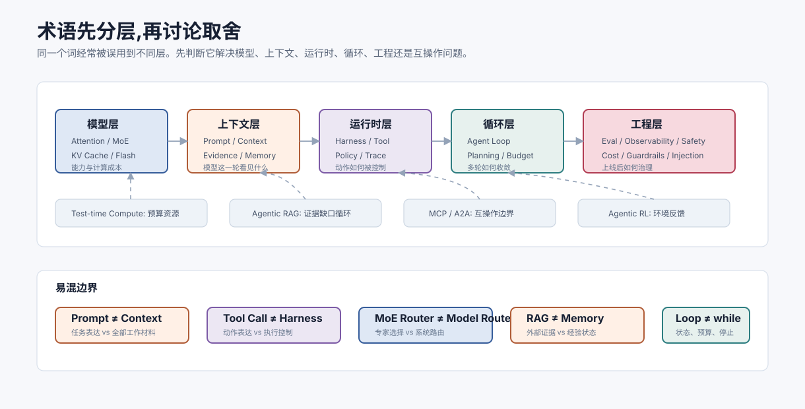

# 术语表 `[参考]`

本术语表用于快速查阅本书常见概念。它不是严格学术定义,而是面向工程理解的解释。

## 如何使用术语表

Agent 领域的很多争论来自“同一个词指代不同层”。遇到陌生概念时,先判断它属于哪一层:

| 层 | 典型词 | 关键问题 |
| --- | --- | --- |
| 模型层 | Attention、SFT、RLHF、KV Cache、MoE | 模型能力和推理成本从哪里来 |
| 上下文层 | Prompt、Context、Evidence Pack、Memory | 模型这一轮能看见什么 |
| 运行时层 | Tool Call、Harness、Guardrails、Trace | 模型建议如何变成可控动作 |
| 循环层 | Agent Loop、Planning、Loop Engineering | 多轮任务如何推进并停止 |
| 工程层 | Evaluation、Observability、Cost、Security | 系统如何上线、监控和迭代 |

不要把不同层的词互相替代。例如 Prompt 不能替代 Harness,长上下文不能替代 Memory 治理,Function Calling 不能替代权限控制。

## A

### Agent

能围绕目标进行状态管理、推理、工具调用、观察反馈和迭代的系统。Agent 不只是一次 LLM 调用。

### Agent Loop

Agent 的基本循环:观察状态、思考下一步、执行动作、接收反馈、更新状态。

### Agentic RAG

围绕证据缺口进行多轮检索、验证、对比和停止的 RAG 形态。重点不是多搜几次,而是每轮检索都能说明补了什么证据、还缺什么。

### Agentic RL

从 Agent 在任务环境中的状态、动作、观察、奖励和轨迹中学习策略的方法。可靠实现依赖可重置环境、可验证奖励、轨迹治理和安全门控。

### A2A

Agent2Agent Protocol,用于不同 Agent 之间发现能力、提交任务、交换状态和协作的互操作协议方向。它与 MCP 互补,更偏 Agent 间协作而不是工具接入。

### ACI

Agent-Computer Interface,面向 Agent 的工具和计算机接口设计。强调工具名称、参数、返回、错误和权限要适合模型使用。

### Alignment

让模型或系统行为符合人类意图、规范和安全要求的过程。

### ANN

Approximate Nearest Neighbor,近似最近邻搜索。向量数据库常用它提高检索速度。

## B

### BM25

经典关键词检索算法,常用于 hybrid search 中补足向量检索对精确词的不足。

## C

### Chunk

RAG 中的检索单元。通常由文档切分而来,应保留语义完整性、来源和元数据。

### Chat Template

把 system、user、assistant、tool 等多轮消息转换成模型实际输入序列的模板。不同模型和推理框架的 Chat Template 可能不同,会影响角色边界、工具调用和输出格式。

### Constrained Decoding

约束解码。在模型逐 token 生成时,根据 grammar、JSON Schema 或状态机屏蔽当前不合法的 token。它能提升语法和格式稳定性,但不能保证事实、权限或业务语义正确。

### Context Engineering

上下文工程。选择、压缩、排序、标注和注入模型调用所需信息的工程能力。

### Critic

评审角色或评审节点,根据 rubric 检查输出、计划或工具行为。

### Coding Agent

编码 Agent。能在代码仓库、终端和测试环境中调查问题、修改文件并验证结果的工具型 Agent。可靠闭环应包含复现、定位、最小修改、测试和 diff 审查。

## D

### Deep Research Agent

深度研究 Agent。围绕开放问题规划检索、评估来源、建立主张—证据关系并生成可回源报告的 Agent。搜索次数多不等于研究深入,关键是来源质量、覆盖、冲突处理和引用绑定。

### DPO

Direct Preference Optimization,一种偏好对齐方法,可直接利用偏好数据优化模型。

## E

### Embedding

把文本、图像或其他对象映射为向量表示,用于检索、聚类或相似度计算。

### Eval Set

评估样本集,用于比较 Agent 或模型版本质量。

### Evidence Pack

证据包。RAG 系统中提供给模型的一组带编号、来源、版本和内容的证据。

### Expert

MoE 模型中的专家子网络,通常是 FFN 形态。每个 token 只会被 router 分配到少数几个 expert,但 expert 不一定对应人类可解释的业务领域。

## F

### Function Calling

模型以结构化方式表达工具调用的能力或接口形式。

### Flash Attention

标准 Attention 的 IO-aware 高效实现。通过分块计算和在线 Softmax 减少显存读写,不改变 Attention 数学结果,常用于长序列训练和 prefill 优化。

### Fine-tuning

微调。用特定数据继续训练模型,改变模型行为倾向或能力。

## G

### Guardrails

护栏。在输入、上下文、工具、输出等阶段检查和控制风险的机制。

### GraphRAG

用实体、关系、社区或证据图谱辅助检索和归纳的 RAG 方法。适合多跳关系和全局主题问题,但图谱节点和边必须可回源、可更新、可评估。

## H

### Hard Negative

看起来相关但不能支持正确答案的负样本。常用于检索评估。

### Hybrid Search

混合检索,通常结合关键词检索和向量检索。

### Harness

Agent Harness,模型和真实工具/环境之间的运行时外骨架。负责动作 schema 校验、权限、策略、sandbox、执行、错误协议、trace 和回滚。

### Harness Engineering

围绕 Harness 的工程设计方法。重点是把模型动作建议变成可验证、可授权、可执行、可记录、可恢复的系统事件,而不是只包装 API 调用。

## J

### Judge

评估器。LLM-as-a-Judge 指用大模型根据 rubric 对输出质量进行评估。

## K

### Knowledge Ingestion

知识入库。把文档、代码、网页、工单等资料解析、清洗、切块、加元数据、继承权限、生成索引并进入 RAG 生命周期的过程。重点是来源、版本、权限、更新和删除传播。

### KV Cache

自回归推理中缓存历史 token 的 Key/Value,避免重复计算注意力。

### Kill Switch

运行时紧急开关。用于快速禁用某个模型路由、工具组、写能力、外部检索、长期记忆写入或高风险自动化能力,先缩小事故半径再排查根因。

## L

### Loop Engineering

围绕 Agent 多轮任务收敛的工程设计。重点不是写 while 循环,而是状态摘要、进展不变量、预算、停止条件、重规划、检查点和过程评估。

### Long-term Memory

长期记忆。跨任务保存的偏好、项目约定或确认经验。需要来源、scope 和删除机制。

### LoRA

Low-Rank Adaptation,一种参数高效微调方法。

## M

### MCP

Model Context Protocol,模型上下文协议。用于模型应用连接外部工具、资源和提示能力。

### MoE

Mixture of Experts,混合专家模型。通过 router 为 token 选择少数 expert,让模型拥有较大的总参数容量,同时控制每 token 激活计算。工程上要同时关注总参数、激活参数、负载均衡和 All-to-All 通信。

### Multi-Agent

多 Agent 系统。多个职责不同的 Agent 通过编排、消息和共享状态协作。

## O

### OpenClaw

一个开源、自托管的个人 AI 助手和多渠道 Agent Gateway。它把 WhatsApp、Telegram、Slack、Discord、Signal、iMessage、WebChat 等消息入口连接到本地或自托管的 Agent runtime、workspace、skills、tools、nodes 和控制界面。

## P

### PEFT

Parameter-Efficient Fine-Tuning,参数高效微调方法集合。

### PagedAttention

面向 LLM serving 的 KV Cache 分页管理机制。它把连续缓存管理变成类似页表的块管理,提高多请求并发下的显存利用率和调度灵活性。

### Positional Encoding

位置编码。向模型注入 token 顺序或相对距离信息的机制,包括绝对位置、正弦位置、RoPE、ALiBi 等。它影响长上下文、代码顺序和跨段引用能力。

### Prompt / Context / Harness / Loop

Agent 工程的四层边界:Prompt 管任务表达,Context 管信息供应,Harness 管运行时边界,Loop 管多轮收敛。

### Prompt Injection

提示注入。不可信内容试图覆盖系统规则、改变模型行为或诱导工具调用。

## R

### RAG

Retrieval-Augmented Generation,检索增强生成。通过检索外部证据增强模型回答。

### ReAct

Reasoning + Acting,让模型交替进行推理和行动的 Agent 模式。

### Realtime Multimodal Agent

实时多模态 Agent。持续处理语音、图像、视频、屏幕或设备事件,支持流式输出、插话、取消和工具调用的事件驱动 Agent。通常需要交互快环与任务慢环分离。

### Reranker

重排器。对初召回候选进行更精细排序的模型或算法。

### Release Bundle

Agent 发布单元。记录一次发布涉及的模型版本、Prompt 版本、工具 schema、RAG 索引、策略、评估集、回滚点和 owner,用于灰度、观测、回滚和事故复盘。

### RLHF

Reinforcement Learning from Human Feedback,基于人类反馈的强化学习对齐方法。

### Router

MoE 中的路由器或 gate,负责根据 token hidden state 选择 top-k experts。不要把模型内部 router 和 Agent 系统里的任务路由器混为一谈。

## S

### SFT

Supervised Fine-Tuning,监督微调。使用输入输出样本训练模型遵循任务格式和指令。

### Short-term Memory

短期记忆。当前任务内的目标、计划、观察、约束和状态。

### Speculative Decoding

投机解码。用较小草稿模型先生成候选 token,再由大目标模型批量验证,以减少自回归 decode 的等待时间。收益取决于草稿速度、接受率和实现开销。

### Structured Output

结构化输出。让模型输出 JSON、工具调用参数、状态差分、证据包等可解析对象。它需要 schema、校验、修复和策略门配合,不能单独替代 Harness。

## T

### Tokenizer

把文本转换为 token ID 的组件。Tokenizer、词表和特殊 token 会影响上下文成本、多语言表现、RAG 切块、结构化输出和 Chat Template 兼容性。

### Tool Call

工具调用。模型请求外部工具执行动作或查询数据。

### Trace

一次任务的完整过程记录,包含模型调用、工具调用、状态更新、成本和错误。

### Test-time Compute

测试时计算或推理时计算。模型在回答阶段投入额外计算,用于多候选、搜索、验证、工具校验和修正。它是复杂任务的预算资源,需要路由和停止条件。

## 易混概念对照

| 概念 A | 概念 B | 核心区别 |
| --- | --- | --- |
| Prompt | Context | Prompt 是任务表达;Context 是模型实际可见的全部工作材料 |
| Function Calling | Harness | Function Calling 让模型结构化表达动作;Harness 决定动作能否执行以及如何执行 |
| JSON Mode | Constrained Decoding | JSON Mode 通常保证输出更像 JSON;约束解码在生成阶段用 grammar/schema 屏蔽非法 token |
| Memory | RAG | Memory 保存用户/任务经验;RAG 检索外部知识证据 |
| RAG | Agentic RAG | RAG 可以是一轮检索生成;Agentic RAG 管理多轮证据缺口和停止条件 |
| MoE Router | Model Router | MoE Router 在模型内部选择 expert;Model Router 在系统层选择模型、工具或链路 |
| MCP | A2A | MCP 连接工具和资源;A2A 连接远程 Agent 协作对象 |
| Workflow | Agent | Workflow 路径由系统预定义;Agent 可根据观察动态选择下一步 |
| Guardrails | Alignment | Guardrails 是系统运行时控制;Alignment 是模型或系统行为对齐过程 |
| Trace | Explanation | Trace 是可观察事实记录;解释是基于事实对行为的说明 |
| Loop | Loop Engineering | Loop 是循环形态;Loop Engineering 是让循环收敛、可恢复、可评估的工程设计 |

## V

### Vector Database

向量数据库。存储 embedding 并支持近似相似搜索的系统。
