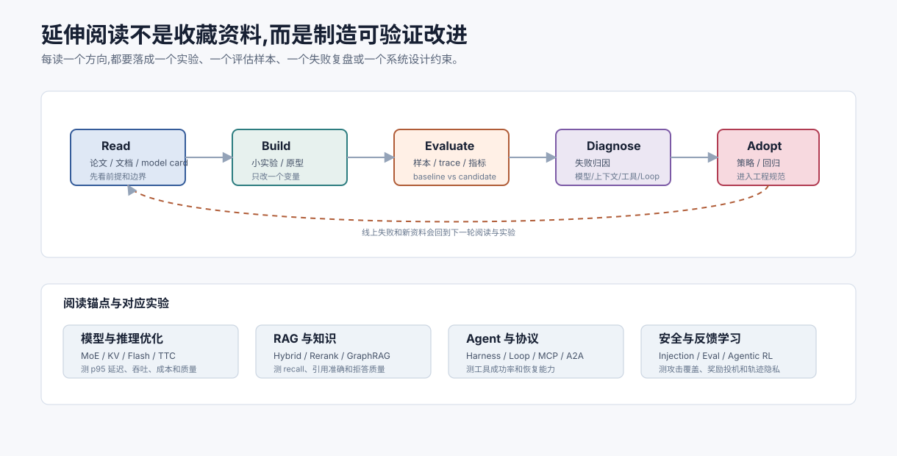

# 延伸阅读 `[参考]`

本附录提供继续学习方向。建议优先读官方文档、经典论文和高质量工程博客,并把阅读和自己的项目评估结合起来。

## 按目标选择阅读材料

不要把延伸阅读变成收藏夹。先明确你要解决什么问题。

| 目标 | 优先读什么 | 读完要做什么 |
| --- | --- | --- |
| 理解模型能力边界 | Transformer、训练对齐、推理优化 | 用原理解释一个真实失败样本 |
| 做知识问答 | RAG、chunking、reranker、引用校验 | 建一个 20 条样本 eval set |
| 做工具 Agent | ReAct、Function Calling、ACI、Harness | 给一个工具链补 schema、错误协议和 trace |
| 做生产系统 | Observability、Evaluation、Safety、Cost | 写 baseline/candidate 对比报告 |
| 做多渠道个人助理 | OpenClaw docs、Gateway security、session routing | 画出入口、身份、会话、工具权限边界 |
| 跟进前沿 | GUI Agent、长时程任务、标准化、Agentic RL | 判断它处于 demo、eval 还是生产层级 |

## 大模型基础

- Transformer 原论文:理解 self-attention 的起点。
- GPT 系列论文:理解 decoder-only 和 scaling。
- InstructGPT/RLHF 相关论文:理解指令对齐。
- DPO 论文:理解偏好优化的另一条路线。
- MoE、Switch Transformer、GShard、Mixtral、DeepSeekMoE、Qwen-MoE、Llama MoE 相关论文和技术报告:重点看 router、expert capacity、load balancing 和 serving 复杂度。
- DeepSeek-V3/R1、Qwen3、Llama 3/4 等官方 model card、技术报告和部署文档:重点看模型家族形态、上下文长度、许可证、工具调用、推理模式和部署框架支持。

## 推理优化

- KV Cache 相关资料。
- FlashAttention 论文和工程解释。
- PagedAttention/vLLM 资料。
- Speculative Decoding 论文和实践。
- Test-time compute、self-consistency、verifier、process reward model 和推理型模型相关论文与工程文章。
- 可验证任务强化学习资料,例如数学、代码和工具环境中的 next-state feedback。
- MoE serving、expert parallelism、FP8、continuous batching、KV Cache 管理和 All-to-All 通信优化资料。

## Agent 框架和模式

- ReAct 论文。
- Toolformer 相关工作。
- Reflexion 相关工作。
- 工作流模式与 evaluator-optimizer 模式的工程文章。
- Agent Harness、tool runtime、sandbox、trace 和 state machine 相关工程文章。
- Harness Engineering 相关公开讨论:重点看“模型之外的运行时边界”如何设计,不要只记热词。
- Loop Engineering 相关公开讨论:重点看循环如何提示、调度、验证和停止 Agent,不要把它简化成 while 循环。

## RAG 与检索

- RAG 原始论文和后续综述。
- Dense Passage Retrieval。
- ColBERT 和多向量检索。
- BM25、hybrid search、reranker 相关资料。
- 向量数据库官方文档。
- GraphRAG、knowledge graph RAG、entity linking、community summary 和 evidence graph 相关资料。
- Agentic RAG、多轮检索、query planning、evidence sufficiency 和 citation verification 相关工程文章。

## 评估

- LLM-as-a-Judge 相关论文。
- RAGAS、TruLens、DeepEval 等评估工具文档。
- OpenAI、Anthropic、Google 等公开评估实践文章。

## 安全

- Prompt Injection 攻击与防御资料。
- OWASP Top 10 for LLM Applications。
- 数据泄露、权限和 DLP 相关安全实践。
- AI 红队测试资料。

## MCP、A2A 和工具协议

- MCP 官方文档。
- A2A 官方规范和 SDK 示例:重点看 Agent Card、任务生命周期、streaming、push notification 和认证边界。
- Function Calling / Tool Calling 官方文档。
- JSON Schema 和 API 设计最佳实践。
- Agent 互操作资料:比较工具协议、资源协议、消息协议和跨 Agent 任务协议的边界。

## 可解释性

- Mechanistic Interpretability 入门材料。
- Transformer Circuits 系列文章。
- Sparse Autoencoder 相关研究。

## OpenClaw 与个人 Agent Gateway

- OpenClaw 官方文档:重点阅读 Getting Started、Gateway、Architecture、Security、Channels、Tools、Skills。
- OpenClaw GitHub README:了解 personal AI assistant、self-hosted Gateway、多渠道、workspace、skills、nodes 和安全默认值。
- Gateway security / exposure runbook:理解 DM pairing、allowlist、session scope、tool policy、sandbox、远程访问和日志脱敏。
- 多渠道 bot 与个人 Agent 的安全实践:身份、触发授权、上下文隔离、幂等、审计、事件响应。

阅读 OpenClaw 时建议画一张自己的系统图:消息从哪个渠道进入,在哪里做 pairing/allowlist,如何路由到 session,Agent 能看到哪些 context,哪些工具默认关闭,高风险动作如何确认。只看安装命令会漏掉它真正有价值的 Gateway 抽象。

## Agentic RL 和真实环境反馈

- Terminal、GUI、SWE、tool-call Agent 的环境反馈与 next-state signal 相关资料。
- Process reward model、trajectory evaluation、online/offline RLHF 的基础资料。
- 从 trace、state-action-observation 和失败轨迹构建评估集的工程文章。
- 可重置任务环境、沙箱、reward hacking、防止测试投机和轨迹隐私治理相关资料。

## 学习建议

不要只读资料。每读一个方向,最好做一个小实验:

- 换一种 chunking 策略并跑 eval。
- 改一个工具 schema 看参数错误率。
- 给一个工具调用链补 Harness trace,看能否复现失败。
- 加一个 guardrail 看误报和漏报。
- 用 Judge 校准 20 个样本。
- 对一个失败 trace 做归因。

Agent 工程的理解来自“读 + 做 + 评估”的循环。

## 读资料时的校验问题

每读一篇资料,都问六个问题:

1. 它解决的是模型层、上下文层、Harness 层、Loop 层还是产品层问题?
2. 它依赖哪些前提,例如工具可控、数据可信、用户同一信任边界?
3. 它展示的是 demo、离线评估、线上试点还是生产经验?
4. 它的失败样本是什么?
5. 它是否讨论了成本、安全、权限和回滚?
6. 它能否转化为你项目里的一个可测改动?

如果一篇文章只展示成功案例、不展示边界和失败,就把它当灵感,不要直接当生产方案。
