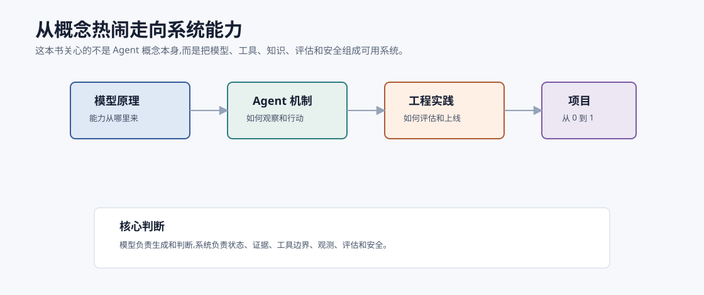

# 前言:为什么写这本书 `[主线]`

AI Agent 不是又一个包装精美的聊天机器人概念。它更像一种新的软件形态:以大语言模型为推理与决策核心,连接工具、记忆、知识库、工作流与外部环境,在给定目标下持续观察、思考、行动和修正。

过去的软件通常由人把流程写死:输入是什么、分支怎么走、异常怎么处理、输出是什么,都被明确编码在系统里。Agent 则把一部分原本由人完成的判断、规划、信息整合和操作交给模型完成。它不会替代所有传统工程,但会改变许多软件的边界:软件不再只是等待用户点击按钮,也可以主动拆解任务、调用工具、查询资料、生成中间结果,并在反馈中迭代。

这正是本书想认真讨论的东西。

## 为什么是 AI Agent

大语言模型已经让很多人第一次感受到“自然语言即界面”的力量。只要提出问题,模型就能解释概念、生成代码、总结文档、改写文本、分析数据。但如果停留在一次问答,模型的价值仍然被限制在“回答者”这个角色里。

真实工作很少只是一次问答。一个研究任务可能需要检索资料、筛选来源、提取观点、对比证据、写成报告;一个运维任务可能需要读取日志、定位异常、查询指标、执行修复、回看结果;一个编程任务可能需要理解代码库、修改文件、运行测试、修复失败、提交变更。

这些任务都有共同特点:

- 目标不一定能一步完成。
- 中间过程需要根据观察结果动态调整。
- 需要调用外部工具,而不只是生成文本。
- 需要管理上下文、记忆、约束、成本和风险。
- 结果需要被评估,失败需要被修正。

Agent 关心的正是这些问题。它把 LLM 从“会说话的模型”推进到“能参与完成任务的系统”。

## 为什么需要一本从 0 到 1 的中文教程

AI Agent 的资料并不少,但很多资料会落在两个极端。

一类资料偏概念:介绍 Agent 很强、会调用工具、能自主完成任务,但讲不清楚底层机制和工程边界。读完之后容易兴奋,却不知道从哪里开始设计一个可用系统。

另一类资料偏框架:直接带你使用某个库搭一个 Demo,比如几行代码创建工具、加上向量数据库、跑一个多轮循环。这样的方式能快速看到效果,但如果不了解模型为什么会这样输出、工具调用为什么会失败、检索为什么会污染上下文、评估为什么不稳定,很快就会在真实项目里碰壁。

本书试图补上中间那块地带:既讲清楚原理,也落到工程判断;既能让零基础读者建立完整地图,也能让有经验的开发者把零散经验串成体系。

## 本书想解决的三个断层

### 概念断层

在 Agent 语境里,常见概念非常密集:Prompt、Token、上下文窗口、Function Calling、RAG、Memory、Planning、Workflow、Multi-Agent、MCP、Evaluation、Guardrails。每个词单独看似乎都能理解,但真正难的是知道它们之间的关系。

比如,RAG 不是“给模型接一个向量数据库”这么简单。它牵涉文档切块、召回、重排、上下文压缩、引用溯源、答案评估和失败回退。再比如,工具调用也不是“让模型输出一个函数名”这么简单。工具描述、参数 schema、错误消息、权限边界、重试策略都会影响 Agent 的可靠性。

本书会把这些概念放回同一张系统地图里解释。

### 原理断层

很多 Agent 问题表面发生在应用层,根子却在模型层。

模型为什么会胡编?为什么长上下文不等于无限记忆?为什么温度、采样、上下文顺序会影响输出?为什么推理延迟和成本会突然变高?为什么同一个 Prompt 在不同模型上表现不同?

这些问题无法只靠“多试几个提示词”解决。你不需要成为训练大模型的研究员,但需要理解 Transformer、Self-Attention、训练与对齐、KV Cache、推理优化这些基础机制。理解它们之后,你会更清楚哪些问题应该靠 Prompt,哪些应该靠检索,哪些应该靠工具,哪些应该靠评估与系统约束。

### 工程断层

Demo 到生产之间有一段很长的路。

一个 Demo 可以接受偶尔失败,生产系统不能。一个 Demo 可以把所有上下文塞进 Prompt,生产系统要考虑成本、延迟、隐私和可维护性。一个 Demo 可以让模型自由调用工具,生产系统必须处理权限、安全、审计和回滚。

本书会持续追问一个问题:这个机制在真实系统里怎么落地?因此我们会讨论可观测性、评估、成本优化、安全护栏、Prompt Injection 防御,也会在最后用一个“个人研究助手”项目把前面的知识连起来。

## 本书如何取舍

本书以 Markdown 撰写,概念为主、代码为辅。示例会尽量使用伪代码或最小片段,避免绑定某个具体框架。原因很简单:框架会变,API 会变,但判断问题的方式、拆解系统的方式、评估取舍的方式更耐用。

这并不意味着本书停留在科普。相反,关键算法和核心机制会讲得比较深。比如 Self-Attention、RLHF、KV Cache、Flash Attention、RAG、Function Calling、ReAct 等章节,都会尽量解释“它为什么这样设计”“它解决了什么问题”“它引入了什么代价”“工程上应该如何使用”。

本书的目标不是让你背概念,而是让你形成可迁移的判断力。

## 本书不是什么

本书不是某个 Agent 框架的使用手册。你会看到框架无关的设计思路,但不会把学习路径绑定到某一个库。

本书也不是大模型训练论文的完整综述。我们会讲必要原理,但重点是帮助读者理解和构建 Agent,不是覆盖所有研究细节。

本书更不是“万能自动化”的宣传册。Agent 有能力边界,会出错,会受上下文限制,会被错误工具描述误导,会受到成本和延迟约束。真正有价值的 Agent 工程,不是假设模型永远聪明,而是在模型不稳定时依然设计出可观察、可评估、可恢复的系统。

## 写给读者

如果你是零基础读者,请不要被目录里的算法名吓住。你可以先沿着 `[主线]` 阅读,先建立直觉和全局地图。很多复杂概念会在后文反复出现,第一次读不透没有关系。

如果你是开发者,建议你把本书当作一套系统设计训练。每读完一个机制,都问自己三个问题:它解决什么问题?它依赖什么假设?它失败时如何被发现和修正?

如果你已经熟悉机器学习或大模型,可以把应用篇作为重点。Agent 工程最有意思的地方,往往不在某个单点算法,而在模型、工具、数据、权限、评估和用户体验之间的协作方式。

## 本章小结

AI Agent 的核心不是“让模型多说几句话”,而是把模型放进一个能够观察、行动、记忆、调用工具并持续修正的系统里。本书会沿着两条线展开:一条线打开 LLM 的内部世界,理解模型能力从何而来;另一条线从 0 搭建 Agent,理解真实工程中的取舍与边界。

下一章会说明本书适合哪些读者,以及不同背景的读者应该如何选择阅读路径。
