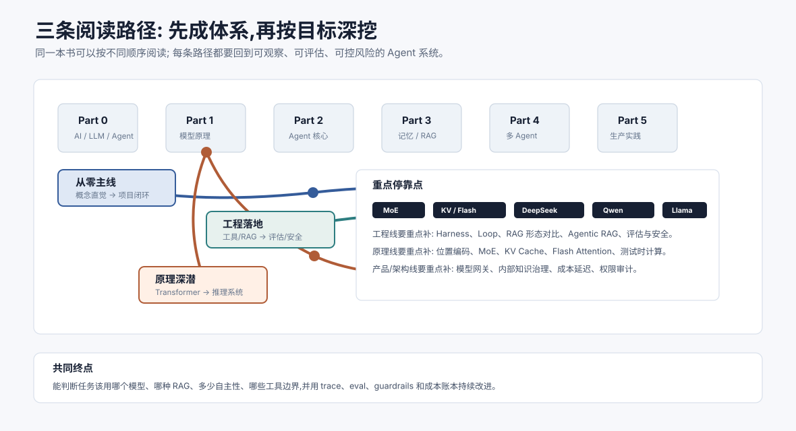

# 读者对象与分层路径 `[主线]`

本书面向所有想系统理解 AI Agent 的中文读者。你不需要已经掌握机器学习,也不需要有训练模型的经验;但最好具备基本编程常识,知道函数、接口、数据结构、HTTP API 这些概念。这样在进入工具调用、RAG、评估和工程实践时,会更容易把抽象机制落到真实系统里。

一句话概括:如果你希望从“听说过 Agent”走到“能判断、能设计、能实现一个可用 Agent”,这本书就是为你准备的。

## 适合谁读

### 零基础但懂基本编程的学习者

你可能刚开始接触 AI,知道 ChatGPT、Claude、Gemini、通义千问/Qwen、DeepSeek、Llama 等模型,也尝试过让模型写代码、总结文档或回答问题。但你还不清楚 LLM 和 Agent 的关系,不知道 Prompt、Token、上下文窗口、RAG、工具调用这些词到底如何拼在一起。

对你来说,本书的目标是建立一张完整地图。你不需要一开始就读懂所有算法细节,但应该逐步知道每个概念在系统中负责什么,以及它们为什么重要。

### 有经验的开发者

你可能已经写过后端服务、数据平台、自动化脚本或业务系统,也许已经接入过 LLM API。你最关心的通常不是“模型能不能回答”,而是“如何把它变成可靠产品能力”。

对你来说,本书会提供一套工程化视角:如何设计工具、如何管理上下文、如何接入知识库、如何选择工作流或自主 Agent、如何评估效果、如何控制成本和延迟、如何处理安全风险。

### 想深究原理的读者

你可能不满足于“调 Prompt 就行”,想知道文本如何先被 Tokenizer 变成 token,Self-Attention 到底在做什么,位置编码为什么影响长上下文,RLHF 和 DPO 为什么影响模型行为,MoE 为什么能扩大总参数但只激活部分专家,KV Cache 为什么能加速推理,Flash Attention 和测试时计算为什么重要。

对你来说,Part 1 是重点。它会从数学直觉讲到 Transformer、主流模型家族、MoE、训练、对齐和推理优化。目标不是把你训练成大模型研究员,而是让你能用原理解释工程现象。

### 产品、架构师与技术管理者

你可能不亲自写每一行代码,但需要判断 Agent 能不能用于某个业务场景,应该投入多少资源,哪些风险必须提前管理,团队应该先做 Demo、内部工具还是生产系统。

对你来说,本书能帮助你建立边界感。Agent 不是魔法,也不是噱头。它适合处理开放、动态、需要语言理解和工具协作的任务,但不适合替代所有确定性流程。

## 需要具备什么基础

阅读本书前,建议你至少具备以下基础:

- 能看懂简单代码或伪代码。
- 理解函数、参数、返回值、异常和 API 调用。
- 知道基本的数据结构,如数组、字典、列表。
- 对 HTTP 请求、JSON、数据库或命令行有一点使用经验。
- 愿意接受少量数学符号,即使一开始不完全熟悉。

数学部分不要求你提前掌握线性代数、概率论或深度学习。Part 1 会先从 Tokenizer、词表和 Chat Template 讲起,再进入向量、矩阵、概率直觉。遇到公式时,重点不是背推导,而是理解符号背后的作用。

例如看到 Softmax:

$$
\mathrm{softmax}(x_i)=\frac{e^{x_i}}{\sum_j e^{x_j}}
$$

你需要关心的是:它如何把一组分数变成概率分布,为什么会放大高分项,以及这会如何影响模型下一个 token 的选择。

## 三条阅读路径

不同读者可以按不同路径阅读。本书每篇都会标注 `[主线]`、`[进阶]`、`[参考]`,你可以先走主线,再回头补进阶内容。

| 路径 | 适合读者 | 推荐方式 | 读完目标 |
| --- | --- | --- | --- |
| 从零主线 | 初学者、转方向开发者 | 按 `[主线]` 顺序读,遇到难点先跳过 | 能理解 Agent 全貌并实现最小可用系统 |
| 工程落地 | 后端、全栈、平台工程师 | 重点读 Part 2 到 Part 6 | 能设计可观测、可评估、可控成本的 Agent 应用 |
| 原理深潜 | 算法、研究、基础设施方向读者 | 精读 Part 1 的 `[进阶]` 与 `★` 章节 | 能用模型原理、模型家族差异和推理系统约束解释应用层现象 |

路径不是章节删减表,而是学习顺序。无论选择哪条路径,都建议保留四个共同检查点:

1. 能否说清任务成功标准,而不只是“效果不错”。
2. 能否画出数据、权限和控制流,并指出模型不能越过的边界。
3. 能否用 trace 和评估样本复现一次失败。
4. 能否说明变更的收益、成本、风险和回滚条件。

## 路径一:从零主线

如果你刚开始学习,建议按下面顺序读:

1. `frontmatter`:理解本书结构和阅读方法。
2. `part0`:认识 AI、LLM 与 Agent 的基本概念。
3. `part1`:只读 `[主线]` 章节,先建立 LLM 内部直觉。
4. `part2`:掌握 Agent 循环、工具调用、Harness、Loop 和工作流选择。
5. `part3`:理解记忆、RAG、知识生命周期和上下文工程。
6. `part4`:先读多 Agent 与 MCP,再按需补 A2A 和编排模式。
7. `part5`:学习可观测、评估、成本、安全、护栏和发布治理。
8. `part6`:跟随项目把知识串起来。
9. `part7`:了解前沿趋势与开放问题。

这条路径的原则是“先成体系,再补细节”。你不必在 Part 1 的每个算法上停太久。只要知道模型大致如何处理 token、如何使用上下文、为什么会出现幻觉和延迟,就可以进入应用篇。

## 路径二:工程落地

如果你已经会调用 LLM API,并且想尽快做出实际系统,可以这样读:

1. 快速浏览 `part0`,补齐术语。
2. 阅读 `part2`,理解 Agent 的基本运行方式,尤其是 Prompt、Context、Harness、Loop 四层边界。
3. 精读 `part3`,尤其是 RAG 形态对比、Agentic RAG、工具使用和上下文工程。
4. 阅读 `part5`,把评估、观测、成本和安全纳入设计。
5. 完整跟读 `part6`,用项目检验理解。
6. 回到 `part1`,按遇到的问题补模型原理。

工程路线不以“接入最多框架”为目标。每增加一个模型、工具、Agent 或协议,都应能回答:它消除了哪个可观测瓶颈?新增了什么故障面?如果没有明确答案,保持较简单的架构通常更可靠。

这条路径的重点是工程闭环。每当你看到一个机制,都可以追问:如何记录日志?如何复现失败?如何评估收益?如何限制模型权限?如何在成本超标时降级?

## 路径三:原理深潜

如果你想理解 LLM 的内部世界,建议按 Part 1 的顺序精读,尤其关注带 `★` 的章节。

这条路径可以帮助你回答许多工程中的深层问题:为什么上下文越长不一定效果越好?为什么检索结果排序会显著影响回答?为什么同一个工具 schema 改几个词就可能改变调用成功率?为什么推理优化会影响产品体验?

原理深潜不是为了炫技,而是为了减少盲试。懂一点模型内部机制,就更容易判断问题来自 Prompt、上下文、检索、工具、模型能力还是系统设计。

## 读完本书后你应该能做到什么

读完主线后,你应该能够:

- 解释 AI Agent 与普通 LLM 应用的区别。
- 画出一个 Agent 的核心循环和关键模块。
- 设计基本工具调用接口,并理解工具描述的重要性。
- 判断什么时候用 Workflow,什么时候用更自主的 Agent。
- 为一个知识型任务设计 RAG 流程。
- 识别上下文窗口、记忆、检索和工具之间的取舍。
- 为 Agent 应用设计基本评估指标和调试方法。
- 理解成本、延迟、安全和权限边界对系统设计的影响。
- 从 0 实现一个个人研究助手级别的 Agent 项目。

如果你继续精读进阶章节,还应该能够:

- 用直觉解释 Transformer 的基本数据流。
- 理解 Self-Attention、QKV、多头注意力和位置编码的作用。
- 理解 SFT、RLHF、DPO、LoRA 等训练与对齐方法的用途。
- 理解位置编码、MoE、KV Cache、Flash Attention、PagedAttention、投机解码、测试时计算等机制的意义。
- 对 DeepSeek、Qwen、Llama 等主流模型家族的架构特点、部署取舍和企业内部应用方式形成基本判断。
- 理解结构化输出、约束解码、知识入库和发布运行治理这些生产系统里的硬边界。
- 在模型能力、工程约束和产品需求之间做更稳健的技术判断。

## 用产物而不是阅读时长验收

读完多少页很难代表掌握程度。更可靠的验收方式是交付一组最小产物:

| 产物 | 最低要求 | 证明的能力 |
| --- | --- | --- |
| 系统图 | 标出模型、工具、数据源、状态和信任边界 | 架构理解 |
| 工具契约 | 有输入约束、权限、幂等性和错误语义 | 工具工程 |
| 评估集 | 同时含正常、边界、对抗和历史回归样本 | 质量工程 |
| 失败 trace | 能定位检索、决策、执行或状态更新环节 | 调试能力 |
| 发布说明 | 有指标门槛、灰度范围、停止条件和回滚方案 | 生产治理 |

如果五项产物都能被另一位开发者复核,才说明知识已经从“看懂”转化为“可交付”。

## 本章小结

本书并不要求所有读者用同一种方式阅读。初学者可以先走主线,开发者可以优先进入工程实践,原理向读者可以深挖算法篇。真正重要的是把 Agent 看成一个系统:模型只是核心之一,工具、数据、上下文、评估、安全和用户目标同样重要。

下一章会介绍本书的标注体系和具体阅读方法,帮助你在不同深度之间自由切换。
