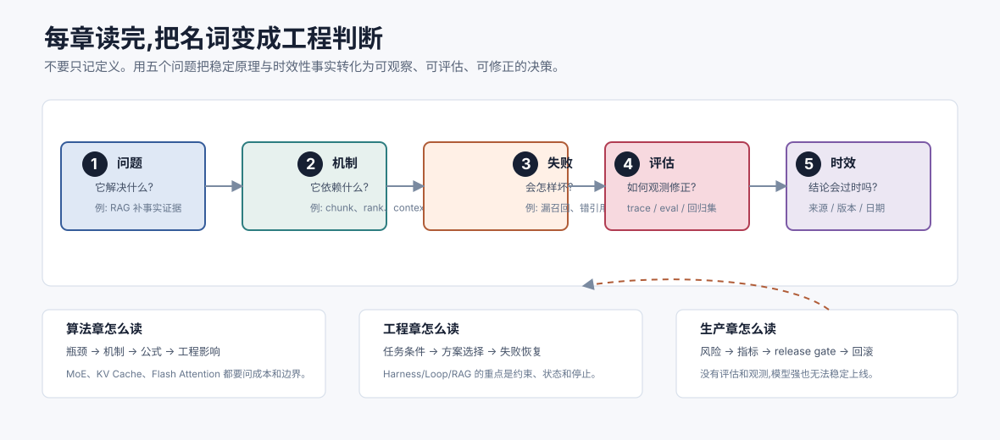

# 如何使用本书与标注体系 `[主线]`

本书既是一份连续教程,也是一张可反复查阅的 Agent 知识地图。你可以从头读到尾,也可以围绕某个问题跳读。为了降低阅读成本,所有章节都按阅读层级标注,并尽量保持“概念解释 → 机制拆解 → 工程取舍 → 常见误解”的结构。

本章说明这些标注的含义,也给出更具体的阅读建议。



## 标注体系

### `[主线]`

`[主线]` 是推荐所有读者优先阅读的内容。它们构成本书的骨架:AI Agent 是什么、LLM 如何工作、Agent 如何循环、如何调用工具、如何接入记忆和 RAG、如何评估与上线。

如果你的目标是尽快建立完整体系,可以先只读 `[主线]`。读完之后,你应该能理解一个 Agent 系统的基本结构,并能跟随实战篇做出一个可用项目。

### `[进阶]`

`[进阶]` 面向希望深入理解机制和工程细节的读者。这类章节通常会回答“为什么”和“如何取舍”的问题,例如注意力变体、MoE、测试时计算、长上下文技术、Agentic RAG、多 Agent 编排、LLM-as-a-Judge、安全对齐等。

如果你第一次阅读时觉得吃力,可以先跳过。等你在项目中遇到相关问题,再回来读,往往更容易理解。

### `[参考]`

`[参考]` 更像速查资料或延伸阅读,不一定需要连续精读。比如术语表、主流模型全景、Prompt 速查等内容,适合在需要时回来查。

### `★`

`★` 表示核心算法点或关键机制。本书会对这些章节给出更充分的篇幅,包括直觉解释、公式、图示、伪代码、常见误解和工程影响。

带 `★` 的章节不一定都适合初读时深挖。你可以先读每章开头和小结,知道它解决什么问题;等主线读完后,再挑重点回看。

## 本书的两条线

本书有两条并行线索。

第一条是原理线:从 Tokenizer、数学直觉、神经网络、Transformer、主流模型家族、MoE、训练对齐到推理优化,解释 LLM 能力从哪里来,限制又在哪里。

第二条是应用线:从 Agent 循环、ReAct、工具调用、结构化输出、RAG、记忆、上下文工程、Harness、Loop、多 Agent 到生产实践,解释如何把模型放进真实系统。

这两条线会互相照亮。比如理解 Self-Attention 后,你会更清楚上下文顺序为什么重要;理解 MoE 后,你会更清楚为什么总参数和实际推理成本不能混为一谈;理解 KV Cache 后,你会更清楚为什么长对话成本会上升;理解 RLHF 后,你会更清楚模型为什么倾向于给出“看起来有帮助”的回答,即使事实并不可靠。

## 推荐阅读方法

### 先建立地图,再追求细节

学习 Agent 最容易遇到的问题是概念太多。不要试图一开始就把每个词都吃透。更好的方式是先建立地图:知道每个模块解决什么问题,位于系统哪一层,和其他模块如何连接。

例如第一次读 RAG 时,先记住它的核心目标:让模型在回答前获得外部知识。至于向量嵌入、切块策略、重排、召回率、引用溯源,可以后面逐步补齐。

### 不要在数学处卡死

本书会使用必要公式,但公式不是门槛。看到公式时,优先问三个问题:

- 输入是什么?
- 输出是什么?
- 这个变换解决了什么问题?

比如注意力分数常写作:

$$
\mathrm{Attention}(Q,K,V)=\mathrm{softmax}\left(\frac{QK^T}{\sqrt{d_k}}\right)V
$$

第一次阅读时,你不必立刻掌握所有矩阵维度。先理解它在做一件事:用 Query 和 Key 计算“当前 token 应该关注谁”,再用这些权重汇总 Value 中的信息。

### 把代码当作设计语言

本书的代码以伪代码或最小片段为主。它们不是为了展示某个框架的最佳实践,而是为了说明系统结构。

例如一个 Agent 循环可能写成这样:

```python
while not done:
    observation = observe(state)
    action = model.decide(goal, observation, tools)
    result = execute(action)
    state = update(state, action, result)
```

这段代码真正重要的不是语法,而是循环中的四个动作:观察、决策、执行、更新。无论你用 Python、TypeScript,还是某个 Agent 框架,都绕不开这些环节。

### 每读一章都问五个问题

为了把知识转化为工程判断,建议每章读完后问自己:

1. 这个机制解决什么问题?
2. 它依赖哪些前提?
3. 它失败时会表现成什么样?
4. 在真实系统里如何观测、评估和修正?
5. 哪些结论是稳定原理,哪些只是随模型、版本或供应商变化的实现事实?

第五个问题用于抵抗内容过时。稳定原理可以沉淀为设计规则;时效性事实则应记录来源、日期、版本与复核条件。如果能回答这五个问题,说明你已经不只是“知道一个名词”,而是在形成可用的技术直觉。

## 如何阅读算法章节

算法章节通常会按以下顺序组织:

1. 先给问题背景:旧方法遇到了什么瓶颈。
2. 再给直觉解释:新机制用什么思路解决问题。
3. 然后给关键公式或数据流。
4. 接着讨论工程影响。
5. 最后列出常见误解。

如果你只想走主线,可以重点读前两部分和小结。如果你想深潜,再仔细看公式、图示和推导。

算法不是孤立知识。比如 Self-Attention 会影响上下文建模,KV Cache 会影响推理成本,Flash Attention 会影响长上下文吞吐,LoRA 会影响微调成本。读算法时,请始终把它们和 Agent 系统连接起来。

## 如何阅读工程章节

工程章节更强调取舍。Agent 系统很少只有一个“正确答案”,更多时候是在可靠性、成本、延迟、灵活性和安全性之间做平衡。

例如同一个任务,你可能有三种实现方式:

- 固定 Workflow:流程稳定、可控性强,但灵活性较低。
- ReAct Agent:能动态选择工具,但输出更难预测。
- 多 Agent 系统:职责清晰、可扩展,但编排和调试复杂。

阅读这类章节时,不要只记结论。更重要的是理解选择背后的条件:任务是否开放?工具是否危险?失败成本多高?是否需要审计?用户是否能接受等待?是否有足够评估数据?

## 建议准备一份学习笔记

读本书时,建议你维护一份自己的 Agent 设计笔记。每遇到一个关键概念,记录四类内容:

- 一句话定义。
- 它解决的问题。
- 它常见的失败方式。
- 你可能在哪个项目里使用它。

这份笔记会在 Part 6 实战篇变得很有用。你会发现,构建 Agent 的过程不是把所有技术堆上去,而是根据任务目标选择最少但足够的机制。

建议再维护一张“事实账本”,专门记录容易过时的内容:

| 字段 | 示例 |
| --- | --- |
| 结论 | 某协议版本支持某项能力 |
| 来源 | 官方规范、论文或发布说明 |
| 适用版本 | 协议日期、模型版本、框架版本 |
| 置信度 | 已验证、仅文档声明、仍有争议 |
| 复核触发器 | 升级依赖、切换模型、准备上线 |

不要把厂商演示、排行榜单次成绩或模型自述当作稳定事实。前沿内容尤其需要区分“已经标准化”“官方已宣布”“论文中展示”和“生产中已验证”。

## 常见阅读误区

### 误区一:把 Agent 等同于 LLM API

调用 LLM API 只是起点。Agent 还需要目标、状态、工具、记忆、反馈和控制边界。没有这些结构,系统只是一次或多次模型调用。

### 误区二:把 RAG 当成万能知识库

RAG 能缓解模型知识过时和事实缺失问题,但它也会引入检索噪声、上下文污染、切块失真和引用错误。RAG 的质量取决于整个检索链路,不是只取决于向量数据库。

### 误区三:把自主性当成越高越好

Agent 越自主,越需要评估、权限控制和失败恢复。很多生产场景更适合半自主 Workflow,让模型在局部做判断,而不是把整条流程完全交给模型自由探索。

### 误区四:只看成功 Demo

Agent 工程真正需要研究的是失败。模型为什么选错工具?为什么检索到无关内容?为什么答案没有引用来源?为什么一次成功、一次失败?只有把失败变得可观察,系统才有迭代空间。

## 本章小结

本书使用 `[主线]`、`[进阶]`、`[参考]` 和 `★` 帮助你控制阅读深度。建议先建立全局地图,再根据目标补细节。读算法时关注它如何影响系统行为;读工程时关注取舍、失败模式和评估方法。

下一章会给出全书地图,把各篇内容放到一条从 0 到 1 的学习旅程中。
