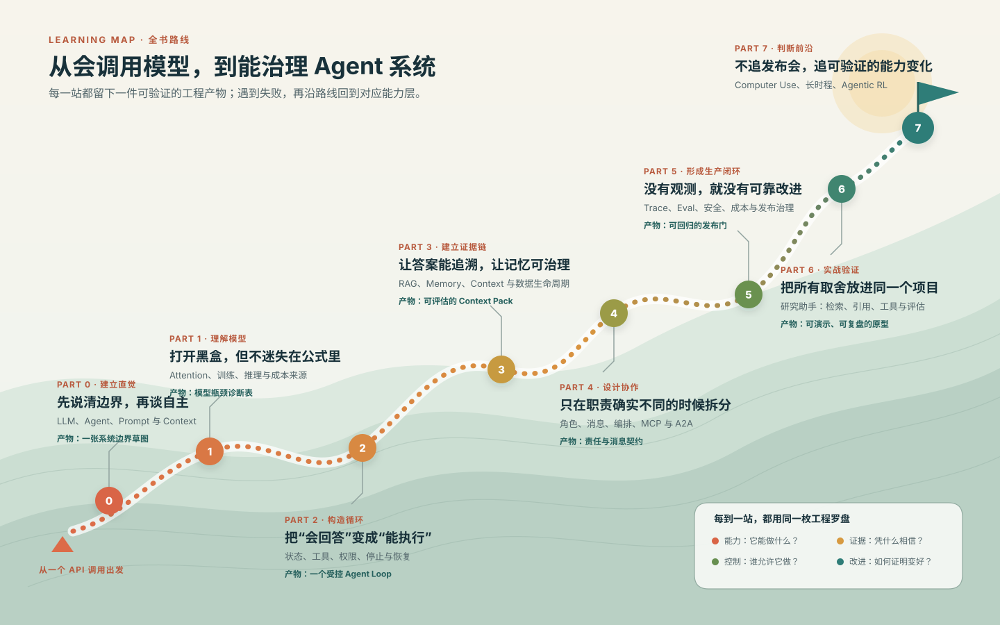

# 全书地图:从 0 到 1 的旅程 `[主线]`

本书的路线不是“先学完所有理论,再开始实践”,也不是“直接堆框架做 Demo”。更合适的方式是交替前进:先建立概念直觉,再理解必要原理,随后进入 Agent 核心机制,最后把工程实践和项目串起来。

从 0 到 1 的关键,不是一次性掌握所有技术,而是逐步回答四个问题:

- Agent 是什么,为什么需要它?
- LLM 的能力和限制从哪里来?
- 如何把模型、工具、记忆和知识组织成系统?
- 如何让这个系统可评估、可调试、可上线?



## 全书结构总览

图里的山路表示**建议学习顺序**,不是只能前进的流水线。真正的学习更像带着故障单在各层之间折返:在 Part 6 做项目时遇到检索质量问题,就回到 Part 3 检查切块、召回和重排;遇到首 token 延迟或显存压力,就回到 Part 1 检查 Prefill、KV Cache 与批处理;遇到越权动作,则应同时回看 Part 2 的运行时边界和 Part 5 的策略门。

路线上的“产物”也不是课后作业名称,而是掌握程度的证据。能复述概念只能说明读过;能画清系统边界、写出状态契约、保存一条可回放 trace,才说明知识已经进入工程判断。

## 前言与导读:建立阅读坐标

前言与导读回答三个问题:为什么写这本书,谁适合读,应该怎么读。

这一部分不会进入复杂技术细节,但会建立本书的基本立场:AI Agent 是一个系统工程问题,LLM 是核心能力来源,但不是全部。真正可用的 Agent 还需要工具、记忆、上下文管理、评估、安全和工程约束。

读完这一部分,你应该知道自己适合走哪条路径:从零主线、工程落地,还是原理深潜。

## Part 0 入门篇:认识 AI Agent 与它的来路

Part 0 不涉复杂数学,目标是建立直觉。

这一篇会先回顾人工智能和大语言模型的发展脉络,再解释什么是 AI Agent,为什么普通 LLM 应用还不够,以及如何理解 Prompt、Token、上下文窗口和 API 参数。

读完 Part 0,你应该能够回答:

- AI、机器学习、深度学习、LLM 和 Agent 的关系是什么?
- Agent 相比普通聊天机器人多了什么?
- 为什么上下文窗口会限制模型表现?
- 调用 LLM API 时常见参数分别影响什么?

这一篇的成果是“能看懂后面的讨论”。你不一定已经能设计复杂系统,但应该不再被基础术语挡住。

## Part 1 模型与算法原理篇:打开 LLM 黑盒

Part 1 是本书最偏原理的一篇。它从 Tokenizer、向量、矩阵、概率直觉讲起,逐步进入神经网络、Transformer、训练对齐和推理优化。

这一篇的核心目标不是让你手写训练框架,而是理解 LLM 的能力边界。Agent 的许多工程问题,都能在模型原理里找到解释。

比如:

- Tokenizer 和 Chat Template 解释了文本为什么不是直接进入模型,以及对话格式为什么会影响输出。
- Self-Attention 解释了模型如何在上下文中聚合信息。
- 位置编码解释了模型为什么需要理解 token 顺序。
- SFT、RLHF、DPO 解释了模型行为为什么会受对齐方式影响。
- KV Cache 解释了多轮生成为什么可以复用历史计算。
- Flash Attention、PagedAttention、投机解码和测试时计算解释了推理系统如何在成本、延迟和复杂任务成功率之间取舍。
- MoE 解释了为什么一些主流模型会有很大的总参数量,但每个 token 只激活部分专家,以及这种设计如何改变部署和服务成本。

读完 Part 1 的主线,你应该能用直觉解释 LLM 如何处理输入、生成输出,以及为什么它会受上下文、采样、训练数据、模型架构和推理机制影响。读完进阶章节后,你会更容易判断复杂 Agent 问题到底是模型问题、上下文问题、检索问题,还是系统设计问题。

## Part 2 Agent 核心原理篇:从模型调用到任务循环

Part 2 开始进入 Agent 的核心。

普通 LLM 应用通常是“用户输入 → 模型输出”。Agent 则更像一个循环:

```python
while task_not_done:
    observe()
    reason()
    act()
    update_state()
```

这一篇会解释 Agent 循环、ReAct、Function Calling、结构化输出、工具设计、任务规划、工作流模式、Workflow 和自主 Agent 的选择,并进一步拆开 Prompt、Context、Harness、Loop 四层工程边界。

读完 Part 2,你应该能够回答:

- Agent 的最小闭环是什么?
- ReAct 为什么把推理和行动交织在一起?
- Function Calling 如何让模型稳定调用外部工具?
- 结构化输出和约束解码能解决什么,又不能替代什么?
- 工具 schema、工具描述和错误反馈为什么重要?
- 什么场景适合固定 Workflow,什么场景适合更自主的 Agent?
- Prompt、Context、Harness、Loop 分别负责什么?
- 为什么工具执行和多轮收敛不能只靠 Prompt?

这一篇的成果是“能设计一个最小但边界清楚的 Agent”。它可能还没有长期记忆和复杂知识库,但已经具备目标、状态、工具、运行时边界和收敛意识。

## Part 3 能力构建篇:记忆、知识与上下文

Part 3 讨论如何让 Agent 从“能跑”变成“好用”。

Agent 面对真实任务时,往往需要处理大量外部知识和历史状态。只依赖模型参数是不够的,只依赖上下文窗口也不够。因此需要短期记忆、长期记忆、RAG、向量检索、知识入库治理、Agentic RAG、工具使用进阶、反思和上下文工程。

这一篇会持续强调一个原则:上下文是 Agent 的工作台。放进上下文的内容会影响模型判断,遗漏重要信息会导致失败,塞入太多无关内容也会导致失败。

读完 Part 3,你应该能够回答:

- 短期记忆和长期记忆分别解决什么问题?
- RAG 的完整链路包括哪些环节?
- 文档从进入知识库到被删除传播,需要哪些治理机制?
- Agentic RAG 什么时候需要多轮检索和证据缺口管理?
- 文档切块、召回、重排和上下文压缩如何影响答案质量?
- 工具结果应该如何写回上下文?
- 反思和自我修正什么时候有用,什么时候只是增加成本?

这一篇的成果是“能给 Agent 装上知识和记忆”。

## Part 4 架构进阶篇:从单 Agent 到多 Agent

Part 4 讨论更复杂的系统形态。

当任务变大,单个 Agent 可能承担太多职责:既要规划,又要检索,又要写代码,又要审查结果,还要和外部系统通信。多 Agent 系统试图通过角色分工降低单点复杂度,但也会引入编排、通信、状态同步和调试成本。

这一篇会介绍为什么需要多 Agent、如何设计角色职责、常见编排模式、通信协议与消息传递,以及 MCP、A2A 这样的互操作协议。

读完 Part 4,你应该能够回答:

- 什么问题真的需要多 Agent?
- 角色拆分应该按能力、流程还是责任边界进行?
- 编排器、协作者、评审者等模式各自适合什么场景?
- Agent 之间传递消息时应该保留哪些上下文?
- MCP 解决了什么互操作问题?
- A2A 这类协议和 MCP 的边界有什么不同?

这一篇的成果是“能看懂和设计更大的 Agent 架构”。

## Part 5 工程实践篇:走向生产

Part 5 关注生产系统必须面对的问题:可观测性、评估、成本、延迟、安全、护栏、Prompt Injection 防御和发布运行治理。

这是许多 Agent 项目从 Demo 走向真实应用时最容易低估的一篇。模型输出不稳定,工具调用可能失败,检索结果可能错误,用户输入可能包含攻击内容,成本可能随上下文长度快速上升。如果没有观测和评估,系统就无法持续改进。

读完 Part 5,你应该能够回答:

- Agent 日志应该记录哪些信息?
- 如何构建测试集和评估指标?
- LLM-as-a-Judge 适合评估什么,又有什么风险?
- 如何降低 token 成本和推理延迟?
- Guardrails 应该放在输入、输出、工具调用还是流程层?
- Prompt Injection 为什么难防,有哪些基本防御策略?
- 模型、Prompt、工具和索引变更如何灰度、回滚和复盘?

这一篇的成果是“能把 Agent 当成生产系统设计”。

## Part 6 实战篇:个人研究助手项目

Part 6 会把前面的知识汇总到一个具体项目:个人研究助手。

这个项目不是为了展示炫技,而是为了覆盖 Agent 的核心链路:需求分析、架构设计、工具实现、核心循环、记忆与 RAG、评估迭代、复盘扩展。

选择“研究助手”作为项目,是因为它足够典型:需要理解用户目标,检索和整理资料,引用来源,生成结构化输出,处理多轮上下文,并对结果质量进行评估。它不像完全开放的通用 Agent 那样难以控制,也不只是一次普通问答。

读完 Part 6,你应该能从 0 实现一个具备基本生产意识的 Agent 原型,并知道下一步该从哪些方向增强它。

## Part 7 前沿展望篇:从 0 到 1 之后

Part 7 把视角放到快速变化的能力前沿,但不把产品发布列表当作技术路线。

Agent 领域仍在快速变化。Computer Use、GUI Agent、长时程自主任务、深度研究与编码 Agent、实时多模态交互、标准化与互操作、可解释性、安全边界、个人 Agent Gateway,以及从真实交互中学习的 Agentic RL,都还在发展中。许多问题没有最终答案,但已经影响今天的系统设计。

读完 Part 7,你应该能够回答:

- GUI Agent 和传统 API Agent 有什么不同?
- 长时程任务为什么困难?
- 标准化协议会如何影响 Agent 生态?
- 当前 Agent 仍有哪些开放问题和局限?
- 可解释性为什么对高风险 Agent 重要?
- OpenClaw 这类个人 Agent Gateway 为什么重视渠道、会话、工具和安全边界?
- Agentic RL 为什么强调可重置环境、可验证奖励和安全门控?
- 推理时计算、搜索和工具反馈如何共同决定 Agent 的有效能力?
- 深度研究、编码与实时多模态 Agent 为什么需要不同的环境、评估和人机交接方式?

这一篇的成果是“知道从 0 到 1 之后还能往哪里走”。

## 附录:速查与延伸

附录包括术语表、延伸阅读和 Prompt 速查。它们不一定需要按顺序读,更适合在写项目、复习概念或查找资料时使用。

建议你在阅读过程中频繁回到术语表。Agent 领域的很多争论,其实来自对同一个词的不同理解。先把词用准,后面的技术讨论会清楚很多。

## 五个阶段里程碑

你可以把本书的学习过程分成五个阶段。新增“受控执行”阶段,是为了避免从“理解模型”直接跳到“堆叠能力”。

| 阶段 | 覆盖内容 | 里程碑 |
| --- | --- | --- |
| 建立直觉 | 前言、Part 0 | 能解释 Agent 是什么,能调用 LLM 完成简单任务 |
| 理解原理 | Part 1 | 能解释 LLM 的基本能力与限制 |
| 受控执行 | Part 2 | 能设计有状态、可停止、有权限边界的 Agent Loop |
| 构建能力 | Part 3 到 Part 4 | 能设计带记忆、RAG 或多角色协作的 Agent |
| 走向生产 | Part 5 到 Part 7 | 能评估、调试、治理并审慎采用前沿能力 |

这五个阶段不是考试关卡。你可以边学边做,边做边回看。真正的掌握,往往发生在你发现系统失败、定位原因、做出改进,并证明改进没有破坏既有能力的过程中。

## 全书的四条贯穿线

目录按主题分 Part,真实系统却需要同时追踪四条线:

| 贯穿线 | 核心问题 | 主要落点 |
| --- | --- | --- |
| 能力线 | 模型和工具能做什么 | Part 1、Part 2、Part 7 |
| 证据线 | 结论依据从哪里来 | Part 3、Part 6 |
| 控制线 | 谁能在什么条件下执行什么动作 | Part 2、Part 4、Part 5 |
| 改进线 | 如何发现退化并安全迭代 | Part 5、Part 6、Part 7 |

阅读任一前沿概念时,都应把它放回这四条线检查。只增强能力线、却没有证据、控制和改进闭环的系统,通常仍停留在演示阶段。

## 本章小结

本书从入门概念开始,经过 LLM 原理、Agent 核心机制、能力构建、架构进阶和工程实践,最后落到一个完整项目与前沿展望。它的主线目标很明确:帮助你从零开始,逐步具备设计和实现 AI Agent 的能力。

接下来可以进入 Part 0,从人工智能与大语言模型的发展脉络开始,为 Agent 的出现建立背景。
