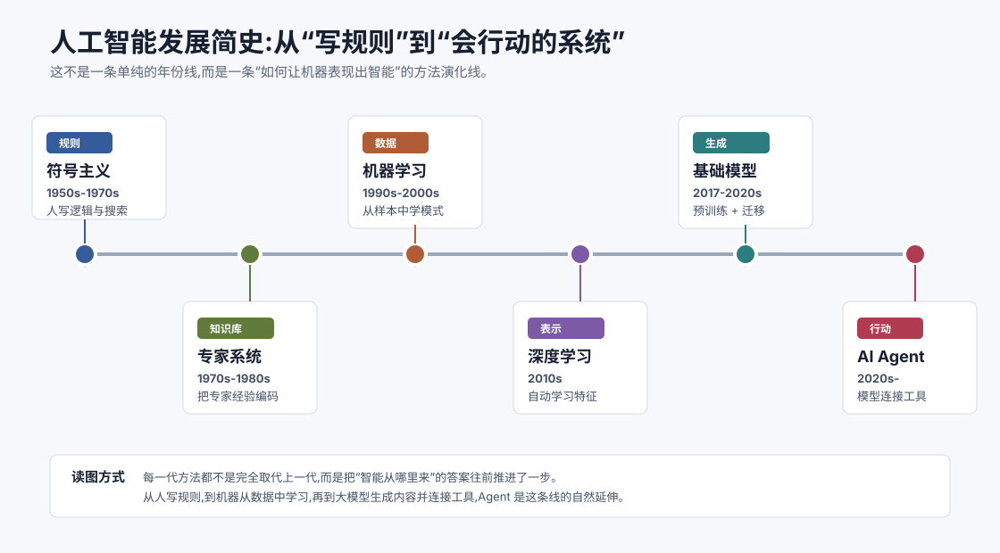
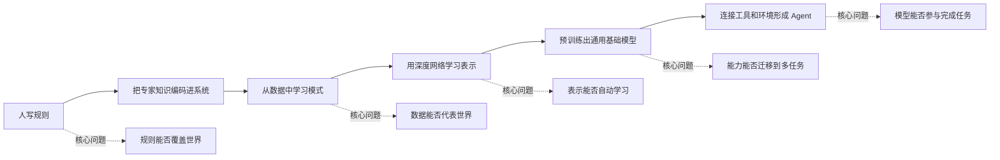
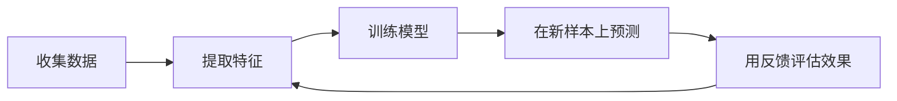
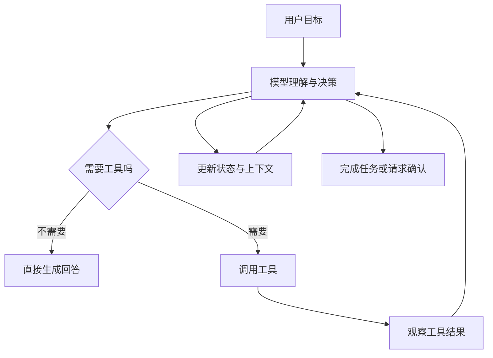
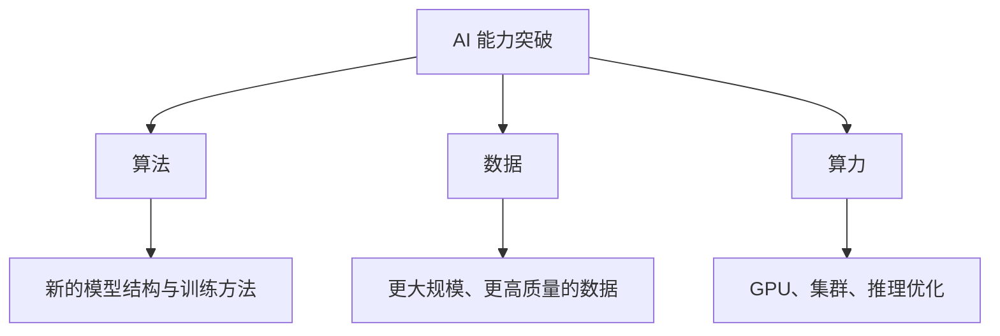

# 人工智能发展简史 `[主线]`

如果把人工智能的发展史写成一张年表,它会很长,也很容易让人疲惫:某一年提出某个算法,某一年出现某个系统,某一年又迎来一次热潮。这样的读法对考试也许有用,但对理解 AI Agent 帮助不大。

本章换一种读法:不先记年份,而是追问一个更关键的问题。

**人类到底曾经用哪些方式,试图让机器表现出智能?**

沿着这个问题看,人工智能的发展就不再是一串孤立事件,而是一条清晰的范式演化线:

1. 早期 AI 主要依赖人写规则。
2. 后来机器开始从数据中学习规律。
3. 深度学习让模型自己学习复杂表示。
4. 大模型把“理解与生成”做成通用能力。
5. Agent 则进一步把模型接入工具、记忆和外部环境。

这条线并不是简单的新技术淘汰旧技术。更准确地说,每个阶段都在回答同一个问题:智能从哪里来?

读这段历史时,建议抓住三条暗线:

- **表示**:机器如何描述世界?是符号、特征、向量,还是上下文里的 token?
- **泛化**:机器如何面对没见过的新情况?靠规则覆盖,还是靠数据中学到的模式迁移?
- **行动**:机器只是给出判断,还是能调用工具、改变环境、推进任务?

这三条暗线会贯穿整本书。后面讲 Transformer 时,我们会继续讨论表示;讲 RAG 和评估时,会继续讨论泛化和事实性;讲 Agent 循环和工具调用时,会进入行动问题。

## 先建立一张地图

在进入历史之前,先看一张更抽象的关系图。它展示的不是年份,而是人工智能几次关键转向。

这张图可以作为本章的阅读导航。

早期 AI 相信,只要我们能把人类的知识写成清晰规则,机器就可以推理。机器学习时代则转向另一个思路:与其让人把所有规则写出来,不如让机器从样本中归纳。深度学习进一步放大了这个思路:不仅规则可以学,特征和表示也可以学。大模型时代则把大量知识、语言模式和推理痕迹压缩进一个通用模型里。Agent 时代的问题又变了:模型已经会理解和生成,能不能让它在真实任务中观察、调用工具、更新状态并完成目标?

这就是从 AI 到 Agent 的底层脉络。

## 几个历史坐标点

下面这张表不是考试年表,而是帮助你把范式变化落到具体事件上。第一次阅读时不用背年份,只要记住每个节点背后的问题意识。

| 时间 | 坐标点 | 为什么重要 |
| --- | --- | --- |
| 1950 | 图灵提出“机器能否思考”的经典问题 | 把智能从哲学问题推进到可测试的行为问题 |
| 1956 | 达特茅斯会议使用 Artificial Intelligence 这个名称 | AI 作为研究领域正式成形 |
| 1960s-1970s | 搜索、逻辑推理、早期自然语言程序发展 | 符号主义相信智能可由规则和推理构成 |
| 1970s-1980s | 专家系统兴起 | 让 AI 从实验室走向特定行业应用 |
| 1990s-2000s | 统计机器学习成为主流 | 从“人写规则”转向“机器从数据中学规律” |
| 2012 | AlexNet 在 ImageNet 上取得突破性结果 | 深度学习证明端到端表示学习的威力 |
| 2017 | Transformer 架构提出 | 为大语言模型和后来的多模态模型打下关键基础 |
| 2020s | 大模型、工具调用与 Agent 应用快速发展 | AI 从生成内容走向参与复杂任务流程 |

这些坐标点背后有一个共同趋势:人类直接写进机器的东西越来越少,机器从数据和反馈中学到的东西越来越多。但这不意味着人类不重要了。相反,人类的工作从“写所有规则”转向“设计目标、数据、工具、边界和评估方式”。这也是 Agent 工程真正复杂的地方。

## 第一阶段:符号主义,把智能写成规则

人工智能早期的主流思想常被称为符号主义。它的基本信念是:智能可以通过符号、逻辑、规则和搜索来实现。

这个思路非常自然。人类做数学题会使用符号,下棋会推演局面,证明定理会按照逻辑步骤前进。如果机器也能操作符号、遵循逻辑规则、在可能答案中搜索,似乎就能表现出智能。

在这个阶段,研究者做了许多很有影响力的尝试:

- 用搜索算法在巨大的状态空间里寻找解法。
- 用逻辑规则表示事实和推理关系。
- 用规划系统把目标拆成一串动作。
- 用早期程序解决数学、定理证明、棋类等结构清晰的问题。

符号主义有一个优点:可解释性很强。系统为什么得出某个结论,通常可以追溯到某条规则或某个推理步骤。这一点在今天仍然重要。许多生产系统里的权限规则、风控规则、业务流程,本质上仍然是符号化的。

但它也有一个致命难题:真实世界太难被完整写成规则。

比如,你可以写规则描述“如果用户余额不足,拒绝支付”。但很难写出规则描述“这段话有没有讽刺意味”“这张图片里的人是否正在过马路”“这篇文章的核心观点是否可信”“用户真正想完成的任务是什么”。语言、视觉、常识、意图和开放环境,都充满模糊性。

于是早期 AI 遇到了一个边界:在规则清晰、状态可枚举的问题上表现不错;一旦进入开放世界,规则就爆炸了。

## 第二阶段:专家系统,把专业知识装进机器

符号主义的一个重要延伸是专家系统。它的目标很直接:把某个领域专家的经验和判断规则写进系统,让机器像专家一样给出建议。

一个典型专家系统通常包含三部分:

- 知识库:保存领域事实和规则。
- 推理机:根据规则进行推断。
- 解释模块:告诉用户为什么得出这个结论。

听起来很像今天某些“行业 AI”的早期版本。比如医疗诊断、设备故障排查、金融规则审核,都可以想象成“如果满足某些症状或条件,就触发某些判断”。

专家系统曾经带来过很高期待,原因也很好理解:它比通用智能更务实。只要聚焦一个领域,把专家经验整理成规则,系统就可能产生实际价值。

但它后来也暴露出维护难题。

第一,知识获取很难。专家知道怎么判断,不代表能轻松把判断过程说成规则。很多经验是隐性的,来自长期实践中的直觉。

第二,规则会互相冲突。一个真实领域里有大量例外情况,规则越写越多,系统越难维护。

第三,系统很脆弱。只要遇到知识库没有覆盖的新情况,它往往不知道如何泛化。

专家系统留下的教训非常重要:**智能系统不能只看“能回答什么”,还要看知识如何更新、规则如何维护、失败如何处理。** 这些问题会在今天的 Agent 工程中重新出现,只是形式变了。以前维护的是规则库,今天维护的可能是 Prompt、工具 schema、知识库、评估集和工作流。

## 第三阶段:机器学习,让机器从数据里学

机器学习改变了问题的问法。

符号主义问的是:人能不能把规则写出来?

机器学习问的是:机器能不能从样本中学出规律?

这是一场很大的转向。我们不再试图手写所有判断规则,而是提供大量样本,让算法在数据中寻找模式。比如给系统很多邮件和“垃圾邮件/正常邮件”的标签,它就可以学习哪些词、哪些结构、哪些发送特征更像垃圾邮件。给系统很多用户行为和购买结果,它就可以学习哪些行为更可能转化。

机器学习的基本流程可以简化为:

这里有两个词很关键:数据和特征。

数据决定模型能看到什么。特征决定模型如何看待数据。传统机器学习里,特征往往需要人工设计。做房价预测时,人会设计面积、地段、楼层、房龄等特征;做风控时,人会设计交易频率、账户年龄、设备指纹等特征;做文本分类时,人会设计词频、关键词、句子长度等特征。

这比纯手写规则灵活得多,但也把问题转移到了另一个地方:特征工程。

如果特征设计得好,简单模型也可能表现不错。如果特征设计得差,再复杂的算法也很难补救。换句话说,机器学习虽然减少了手写规则,但仍然高度依赖人类告诉模型“应该看什么”。

这个阶段的价值在今天仍然很大。很多业务问题并不需要大模型,传统机器学习就足够稳定、便宜、可解释。比如信用评分、需求预测、推荐排序、异常检测,在很多场景里仍然是传统 ML 和深度学习模型的主场。

理解这一点很重要:AI Agent 不是要替代所有 AI 方法。它更适合处理语言密集、流程开放、需要工具协作的任务。对于结构化、稳定、高频、强约束的问题,传统模型或规则系统可能仍然更合适。

## 第四阶段:深度学习,让模型自己学习表示

深度学习继续推进机器学习的思路。它最重要的变化是:特征不再完全依赖人工设计,模型可以从原始数据中逐层学习表示。

“表示”这个词很抽象,但可以用一个例子理解。

如果要识别图片里的猫,传统方法可能需要人设计边缘、纹理、颜色、形状等特征。深度学习模型则可以从大量图片中自动学习:底层神经网络识别边缘和局部纹理,中间层组合出耳朵、眼睛、轮廓,高层再组合成“猫”这个概念。

这种逐层表示学习,让模型在视觉、语音、自然语言处理等领域取得了巨大进展。

深度学习真正改变 AI 发展的原因,不只是模型更大,而是它把“人设计特征”的工作大幅交给了数据和计算。只要有足够数据、算力和合适的训练方法,模型可以学到人很难手写出来的复杂模式。

当然,深度学习也带来了新的问题。

- 它通常需要大量数据和计算资源。
- 它的内部表示不容易解释。
- 它可能学到数据里的偏见和噪声。
- 它在训练分布外的泛化能力仍然有限。
- 它的错误有时不像规则系统那样容易定位。

这些问题并没有消失。今天的大模型和 Agent 系统,仍然继承了其中许多挑战。比如模型为什么会生成看似合理但实际错误的内容?为什么在某些边界案例上行为不稳定?为什么很难解释它到底“知道”什么?这些都和深度学习的黑盒性有关。

## 第五阶段:生成式 AI 与基础模型,从识别到生成

在深度学习早期,很多 AI 系统主要做“识别”和“预测”。给一张图,判断是什么;给一段文本,判断情感;给一个用户,预测是否会点击。这些任务当然有价值,但它们的输出通常比较窄。

生成式 AI 让模型开始大规模地产生内容:写文字、生成图片、补全代码、总结文档、回答问题、生成音频或视频。

这里的关键变化是基础模型的出现。

基础模型通常先在海量数据上进行预训练,学到通用的语言、视觉或多模态表示,再通过提示、微调、对齐等方式适配具体任务。它不再是为某一个小任务从零训练的模型,而更像一个通用能力底座。

以大语言模型为例,它在预训练中学习一个看似简单的目标:根据上下文预测下一个 token。这个目标简单到有点令人意外,但当数据、参数和计算规模足够大时,模型会在过程中学到大量语言结构、事实关联、代码模式、推理模板和世界知识的统计痕迹。

这就是为什么一个 LLM 可以同时做很多事情:

- 回答问题。
- 总结资料。
- 翻译和改写。
- 生成代码。
- 解释概念。
- 模拟不同写作风格。
- 根据上下文完成新的任务。

这里要小心一个常见误解:大模型不是数据库。它并不是像查表一样精确保存所有事实。更准确地说,它学到的是大量模式和关联。它可以生成非常有用的回答,也可能在不确定时生成看起来很像真的内容。这就是后面我们会反复讨论的幻觉、检索、引用和评估问题。

## 第六阶段:从大模型到 Agent,让模型参与行动

大模型让通用语言能力第一次以普通开发者也能调用的产品和 API 形式出现。你可以用自然语言描述目标,模型可以理解、拆解、生成方案。但仅有语言能力还不够。

真实任务通常需要访问外部世界。

比如你让模型“帮我分析这个项目的测试失败原因”,它需要读取代码、运行测试、查看日志、修改文件。你让模型“帮我写一份行业研究报告”,它需要检索资料、判断来源、整理引用、生成结构化结论。你让模型“帮我处理客户工单”,它需要查订单、看历史记录、调用业务系统、给出处理动作。

这时,模型必须从“回答者”变成“任务参与者”。Agent 就出现在这里。

一个最小 Agent 可以理解为:

这张图背后的关键是循环。Agent 不是只调用一次模型,而是在目标、观察、行动和反馈之间反复移动。模型负责理解和决策,工具负责连接外部能力,记忆负责保留状态,评估负责判断结果是否足够好,护栏负责限制风险。

这也是为什么 Agent 不是简单的“更长 Prompt”。Prompt 很重要,但 Agent 的核心是系统结构。它需要把模型放到一个可观察、可控制、可恢复的环境里。

## 一条主线:智能来源的变化

回顾这段历史,可以把每个阶段对“智能从哪里来”的回答放在一张表里。

| 阶段 | 智能主要来自 | 优点 | 主要瓶颈 |
| --- | --- | --- | --- |
| 符号主义 | 人写的逻辑与搜索规则 | 可解释、适合结构清晰问题 | 难覆盖开放世界 |
| 专家系统 | 人整理的领域知识库 | 能沉淀专家经验 | 知识获取和维护困难 |
| 传统机器学习 | 数据中的统计模式 | 能从样本泛化 | 依赖特征工程和数据质量 |
| 深度学习 | 多层网络学到的表示 | 能处理复杂感知和语言模式 | 需要大量数据算力,解释困难 |
| 基础模型 | 海量预训练形成的通用能力 | 多任务迁移能力强 | 可能幻觉,事实性和可控性不足 |
| AI Agent | 模型 + 工具 + 记忆 + 环境反馈 | 能参与复杂任务流程 | 工程复杂,需要评估、安全和权限控制 |

这张表对后续学习很重要。它提醒我们,Agent 不是凭空出现的。它是在大模型具备通用理解和生成能力之后,自然产生的系统工程形态。

## 为什么历史会反复“冷”与“热”

AI 发展中有过多次热潮,也有过低谷。原因不是某一代研究者突然变聪明或突然变笨,而是三个条件经常不同步。

第一是算法。研究者需要找到合适的建模方法,让机器有可能解决某类问题。

第二是数据。没有足够多、足够好的数据,很多学习方法无法发挥作用。

第三是算力。即使算法和数据存在,如果计算成本过高,系统也很难训练和部署。

可以把这三个条件看成 AI 发展的三角支撑:

当某个时代的想法超过了当时的数据和算力条件,热潮就容易退去。当算法、数据和算力重新对齐,能力又会突然跃迁。深度学习和大模型的兴起,正是这三个条件长期积累后共同作用的结果。

这对 Agent 也有启发。很多 Agent 想法并不新。规划、工具使用、记忆、环境交互,早在早期 AI 中就存在。但直到大语言模型提供了强大的自然语言理解和生成能力,这些想法才突然变得更实用。

## 对学习 Agent 的启发

了解这段历史,不是为了记住谁在什么时候提出了什么名词,而是为了建立几个判断。

### 1. 不要把 AI 理解成单一技术

AI 不是只有大模型。规则系统、传统机器学习、深度学习、检索系统、优化算法、知识图谱,都仍然有价值。Agent 工程常常需要把这些能力组合起来。

一个可靠系统可能同时包含:

- 规则:限制权限和关键流程。
- 检索:提供外部事实。
- LLM:理解意图和生成语言。
- 工具:执行真实操作。
- 评估:判断结果质量。
- 日志:帮助复盘失败。

如果把所有问题都交给大模型,系统往往会变得昂贵、不稳定、难调试。

### 2. 不要只看模型能力,还要看系统边界

大模型很强,但它不知道自己不知道什么。它也不会天然理解业务权限、数据时效性、工具副作用和用户真实意图。Agent 系统必须通过上下文、工具设计、评估和护栏来补上这些边界。

这也是本书后面会反复强调的观点:模型能力决定上限,系统设计决定可用性。

### 3. 不要把自主性当作唯一目标

很多人第一次听到 Agent,会自然想到“完全自主完成任务”。但真实生产系统里,自主性越高,风险也越高。

有些场景适合固定工作流,让模型只在局部做判断。有些场景适合人在关键节点确认。有些场景可以允许 Agent 自主探索,但必须限制权限和成本。一个成熟的 Agent 设计,不是盲目追求更自主,而是根据任务风险选择合适的控制程度。

### 4. 把失败当作系统的一部分

从专家系统到机器学习,再到大模型,每一代 AI 都会失败,只是失败方式不同。

规则系统会因为规则缺失而失败。机器学习会因为数据分布变化而失败。深度学习会因为不可解释的边界样本而失败。大模型会因为幻觉、上下文污染或工具误用而失败。Agent 则可能因为循环失控、工具选择错误、记忆污染、权限过大而失败。

因此,学习 Agent 不能只学习“如何让它成功一次”,还要学习“如何发现它失败了,如何定位失败原因,如何让下一次更稳”。

## 常见误解

### 误解一:AI Agent 是全新的东西,和传统 AI 没关系

Agent 这个词并不新,早期 AI 就讨论过智能体、规划和环境交互。今天的变化在于,大语言模型提供了更强的通用语言能力,让过去许多难以落地的 Agent 设想有了新的实现条件。

### 误解二:大模型出现后,传统方法都过时了

并不是。规则、数据库、搜索、传统 ML、工作流引擎仍然是可靠系统的重要组成部分。大模型擅长处理模糊语言和开放任务,但确定性约束仍然应该交给更稳定的机制。

### 误解三:AI 发展只是模型越来越大

规模很重要,但不是全部。数据质量、训练目标、模型架构、推理优化、工具生态、评估方法、安全机制,都会决定 AI 系统能否真正可用。

### 误解四:会聊天就等于有智能

语言能力非常重要,但完成任务还需要状态、工具、反馈、权限和目标管理。Agent 的重点不是让模型更会聊天,而是让模型在系统中承担合适的决策与协作角色。

## 本章小结

人工智能的发展可以看成一条“智能来源”不断迁移的路线:从人写规则,到专家知识库,到从数据中学习,到深度网络学习表示,再到基础模型获得通用生成能力。AI Agent 则是在这个基础上,把模型接入工具、记忆和外部环境,让它从回答问题走向参与完成任务。

这段历史给我们的最大启发是:不要把 Agent 看成孤立的新名词。它继承了早期 AI 对规划、工具和环境交互的追求,也继承了机器学习和深度学习对数据、模型和泛化的依赖。理解这条线,后面学习 LLM 和 Agent 时就不容易迷失。

下一章会继续沿着这条线往前走,专门看大语言模型的发展:为什么语言模型会成为今天 Agent 的核心能力底座。
