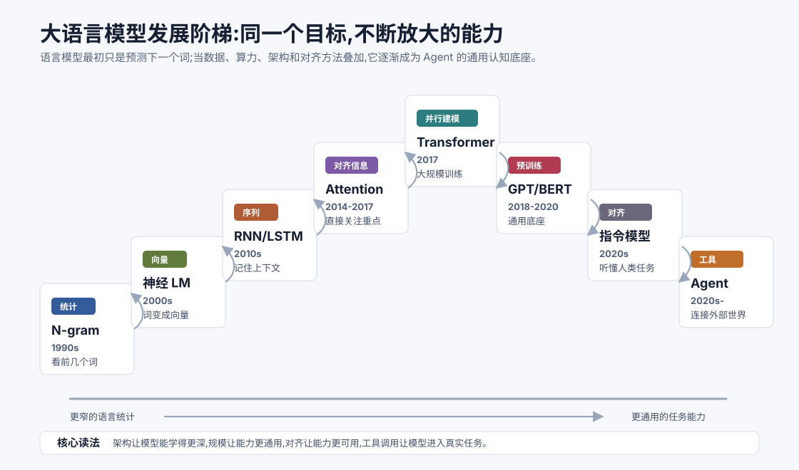
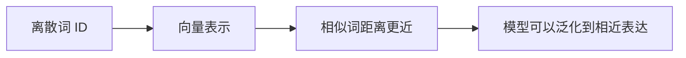
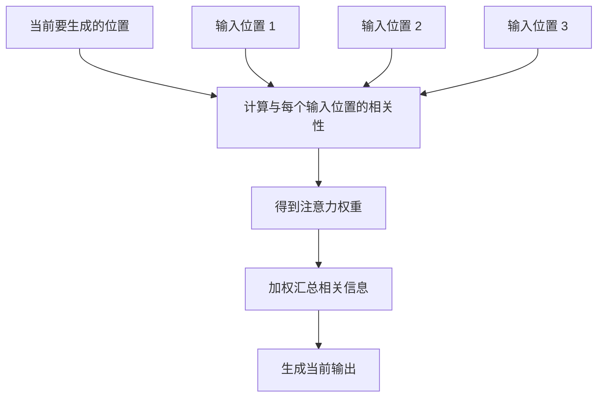
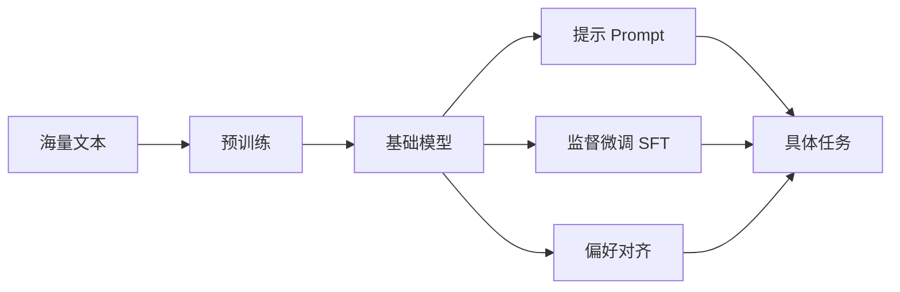
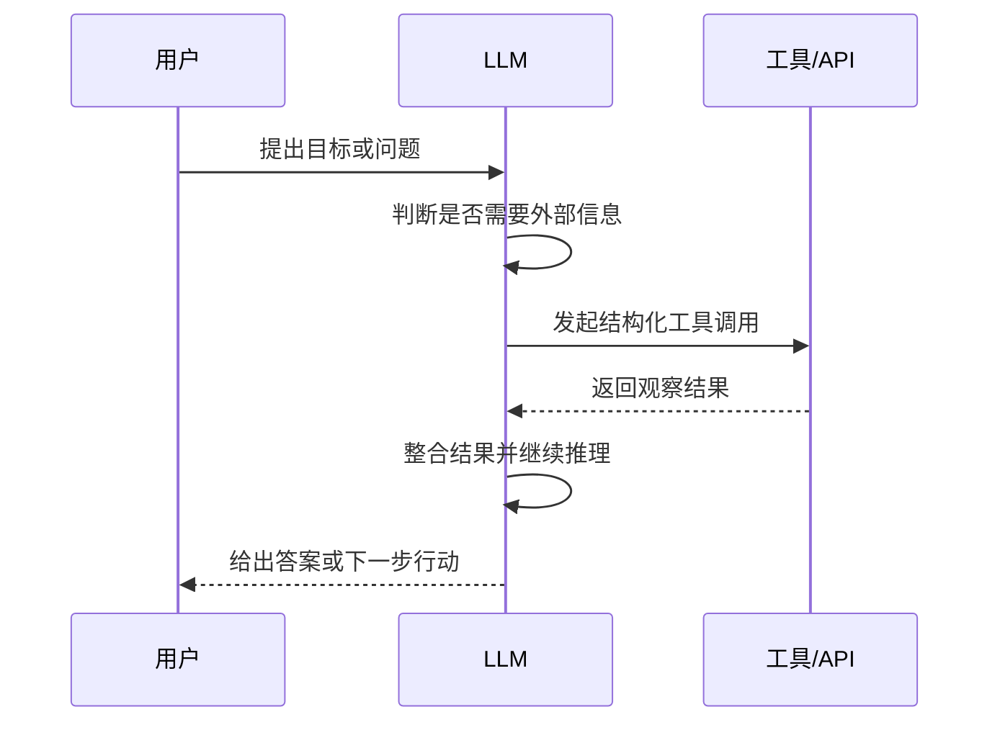

# 大语言模型发展简史 `[主线]`

上一章讲的是人工智能的大历史:机器如何从“人写规则”走到“从数据中学习”,再走到今天能够生成内容、调用工具、参与任务的 Agent。

本章把镜头拉近,专门看大语言模型的发展。

如果只看表面,大语言模型像是突然出现的:一夜之间,模型会写文章、写代码、总结论文、解释概念,还能像助手一样和人对话。但从技术脉络看,它并不是凭空冒出来的。它是自然语言处理、神经网络、Attention、Transformer、预训练、指令对齐和工程化推理长期叠加的结果。

这一章仍然不要求你记住所有年份。你只需要抓住一个核心问题:

**为什么“预测下一个词”这样朴素的目标,最后会长成今天的通用智能接口?**

## 先给结论:语言模型的发展不是模型名单

很多 LLM 发展史会写成模型清单:Word2Vec、Seq2Seq、Attention、Transformer、BERT、GPT、T5、ChatGPT、Claude、Gemini、Llama、DeepSeek……这些名字当然重要,但如果只背名字,很快就会乱。

更好的读法是抓住三次转折。

| 转折 | 之前的核心问题 | 之后发生了什么 |
| --- | --- | --- |
| 从符号到统计 | 语言能否靠规则解析 | 模型开始从大量文本中学习概率模式 |
| 从人工特征到表示学习 | 人如何设计语言特征 | 神经网络把词、句子和上下文变成向量表示 |
| 从单任务到基础模型 | 每个任务是否都要单独训练 | 预训练模型成为可迁移的通用能力底座 |

这三次转折解释了为什么 LLM 不是“更大的聊天机器人”,而是一类新的软件基础设施。它把语言理解、生成、推理、代码、检索、工具调用等能力统一到同一个接口里:上下文输入,文本或结构化动作输出。

## 语言模型到底在做什么

在最朴素的形式里,语言模型做的是一件事:根据前面的上下文,预测接下来最可能出现的 token。

可以写成这样:

$$
P(x_t \mid x_1, x_2, \ldots, x_{t-1})
$$

这里的 $x_t$ 表示当前位置要预测的 token,前面的 $x_1, x_2, \ldots, x_{t-1}$ 表示已经看到的上下文。模型的任务就是估计:在这些上下文之后,下一个 token 是什么的概率最大。

这听起来很窄,甚至有点无聊。但它有一个很深的含义:如果要预测下一个 token,模型必须不断学习语言里的结构。

比如看到“法国的首都是”,模型更应该预测“巴黎”。这需要事实知识。看到“如果下雨,地面通常会”,模型更应该预测“变湿”。这需要常识。看到一段代码的函数签名,模型要补全函数体,就需要代码模式和局部推理。

换句话说,预测下一个 token 本身不是最终目标,它是一个训练入口。为了做好这个目标,模型被迫吸收语法、语义、事实、风格、推理模板和任务模式。

## 第一阶段:统计语言模型,从规则转向概率

早期自然语言处理很大程度上依赖人工规则。比如分词规则、语法规则、句法分析规则、模板匹配规则。规则在某些结构清晰的任务上有用,但语言太灵活了。

同一句话可以有多种表达。同一个词在不同上下文中含义不同。真实文本里还有错别字、省略、俚语、语境和隐含意图。靠人把所有规则写出来,几乎不可能。

统计语言模型带来了一个务实转向:不再试图完整理解语言,而是先统计语言里什么接着什么更常见。

最典型的是 N-gram 模型。它用前 $n-1$ 个词预测下一个词。比如 bigram 看前一个词,trigram 看前两个词。

一个 trigram 语言模型可以近似写成:

$$
P(w_t \mid w_1,\ldots,w_{t-1}) \approx P(w_t \mid w_{t-2}, w_{t-1})
$$

这个近似很粗糙,但很实用。它把“不可能完整建模整段历史”的问题,变成“只看最近几个词”的问题。

N-gram 的优点是简单、可解释、容易训练。缺点也很明显:

- 上下文很短,很难理解长距离依赖。
- 没见过的词组概率很难估计。
- 只会统计表面共现,难以表达深层语义。
- 数据一稀疏,效果就会迅速下降。

它像是语言模型的幼年形态:已经知道语言有概率规律,但还没有真正学会“表示意义”。

## 第二阶段:词向量,让词拥有位置

传统统计方法把词当作离散符号。猫是一个 ID,狗是另一个 ID,汽车又是另一个 ID。问题是,这些 ID 之间没有天然关系。模型不知道“猫”和“狗”都和动物有关,也不知道“国王”和“女王”之间有某种性别和身份关系。

词向量改变了这一点。

它把词映射到连续向量空间里。语义相近的词,向量也更接近。这样模型不再只是记住“某个词出现过”,而是开始拥有一种粗略的语义几何。

可以把词向量想成一张语言地图:

这一步非常关键。因为后来的大语言模型,本质上也离不开表示学习。token 会先变成向量,模型在向量空间中不断变换这些表示,最后再映射回 token 概率。

词向量让模型第一次比较自然地获得了“相似性”。但它仍然有一个问题:同一个词在不同上下文里可能意思不同。

比如“苹果发布了新产品”和“桌上有一个苹果”,前者更可能指公司,后者更可能指水果。静态词向量通常给“苹果”一个固定向量,很难根据上下文动态变化。

这就引出了后来的上下文建模。

## 第三阶段:RNN 与 Seq2Seq,让模型读完整句子

语言不是词袋。一个词的意义,常常取决于它前后出现了什么。

循环神经网络 RNN、LSTM、GRU 等模型试图按顺序读取文本,把历史信息压缩到一个隐藏状态里。它们的直觉很符合人类阅读:从左到右读一句话,每读一个词,就更新一次对当前语境的理解。

简化来看:

Seq2Seq 模型则进一步把一个序列转换成另一个序列。机器翻译是典型任务:输入一句中文,输出一句英文。问答、摘要、对话也可以被看成序列到序列。

这个阶段非常重要,因为它让许多自然语言任务开始共享一种形式:输入文本,输出文本。

但 RNN 系列也有明显瓶颈。

第一,长距离依赖难。很长的句子被压缩进一个状态,前面的信息容易丢失。

第二,训练不够并行。模型必须按顺序处理 token,很难充分利用现代硬件的大规模并行能力。

第三,信息瓶颈明显。Seq2Seq 早期做法常常把整句输入压成一个固定向量,再解码输出。句子越长,压缩越困难。

这些问题后来被 Attention 大幅缓解。

## 第四阶段:Attention,不再把所有信息挤进一个瓶子

Attention 的直觉很简单:生成某个位置的输出时,模型不应该只依赖一个被压缩过的整体状态,而应该能直接查看输入序列中最相关的位置。

比如翻译句子时,生成英文单词“bank”时,模型应该能关注中文里的“银行”或“河岸”,而不是只依赖一个固定向量。做摘要时,生成某个结论时,模型应该能回看原文中相关段落。

可以把 Attention 理解为一种“动态查阅机制”:

Attention 的意义不只是效果提升。它更深的影响是改变了模型处理上下文的方式:模型可以在不同 token 之间建立直接连接。

后面我们会专门讲 Self-Attention。现在只需要先记住一句话:Attention 让模型不再只能顺序地“记住”上下文,而是可以按需“查阅”上下文。

## 第五阶段:Transformer,为大规模语言模型铺路

2017 年提出的 Transformer 是大语言模型发展的关键拐点。它的标题 “Attention Is All You Need” 很有名,核心思路是用 Attention 作为主要结构来处理序列。

Transformer 的重要性至少体现在三点。

第一,它更容易并行训练。相比 RNN 必须按顺序处理 token,Transformer 可以更高效地利用 GPU/TPU 等硬件。

第二,它更擅长建立长距离依赖。Self-Attention 让任意两个 token 之间可以直接计算关系。

第三,它天然适合堆叠和扩展。层数、参数量、数据量和计算量可以一起放大,形成后来大模型的规模化路线。

Transformer 之后,语言模型发展逐渐进入“预训练 + 迁移”的时代。不同模型路线开始出现:BERT 更强调双向理解,GPT 更强调自回归生成,T5 则把多种任务统一成 text-to-text。它们的共同点是:先在大规模文本上学通用能力,再迁移到具体任务。

这一步非常关键。因为过去很多 NLP 任务都要单独建模:分类一个模型,翻译一个模型,摘要一个模型,问答一个模型。预训练模型出现后,同一个底座可以适配很多任务。

## 第六阶段:预训练语言模型,从任务模型到能力底座

预训练语言模型的核心思想是:先用大规模通用数据训练一个基础模型,再通过微调、提示或对齐让它完成具体任务。

这个流程可以简化为:

这里的关键变化是“先学通用能力”。模型在预训练中并不知道未来会被用来写代码、做客服、总结论文、生成 SQL、解释法律条款,但它通过海量文本学到了足够多的语言模式和知识结构。后续只需要用相对少量的任务数据或提示方式,就能把能力引导出来。

这也是为什么大模型常被称为基础模型。它不只是一个完成单一任务的模型,而是许多应用的共同底座。

但预训练模型并不天然好用。一个只经过预训练的模型更像“文本续写器”。你问它问题,它未必知道应该以助手身份回答;你让它遵守格式,它也未必稳定;你希望它拒绝危险请求,它更没有天然边界。

于是下一步是指令对齐。

## 第七阶段:指令微调与对齐,让模型更像助手

指令微调的目标是让模型理解人类任务。它会使用大量“指令-回答”样本训练模型,让模型学会看到问题后给出符合期待的回答。

偏好对齐则进一步让模型更符合人类偏好。比如答案应该有帮助、真实、清晰、不过度自信,在风险场景下应该拒绝或谨慎回答。常见方法包括 RLHF、DPO 等,后面 Part 1 会深入讲。

可以这样理解几层训练的区别:

| 阶段 | 模型主要学什么 | 更像什么 |
| --- | --- | --- |
| 预训练 | 语言和世界知识的统计结构 | 会续写的读书人 |
| 指令微调 | 如何按人类要求完成任务 | 能听懂任务的助手 |
| 偏好对齐 | 哪些回答更有帮助、更安全 | 更稳妥的协作者 |

这一阶段解释了为什么 ChatGPT 式产品给人的体验和早期语言模型不同。真正改变体验的,不只是模型规模,还有对话格式、指令数据、偏好反馈、安全策略和产品工程。

对 Agent 来说,指令对齐尤其重要。因为 Agent 需要模型理解目标、遵守约束、按格式输出工具调用参数、在不确定时请求澄清,而不是随意续写文本。

## 第八阶段:工具调用与 Agent,语言模型走出文本框

指令模型让 LLM 更像助手,但它仍然主要在文本里工作。Agent 需要更进一步:让模型连接外部工具。

工具调用解决的是一个关键问题:模型不应该只靠参数里的记忆回答所有问题。它应该能在需要时查询数据库、调用搜索、运行代码、读取文件、访问业务系统,再根据结果继续推理。

一个简化的工具调用流程是:

从这里开始,LLM 不再只是生成答案,而是成为系统里的决策核心之一。它负责理解上下文、选择工具、解释结果、规划下一步。工具、记忆、检索、评估和权限系统则共同决定这个 Agent 是否可靠。

这就是为什么本书会把 LLM 原理和 Agent 工程放在一起讲。不了解 LLM,很难理解 Agent 为什么会犯错;不了解 Agent 工程,也很难把 LLM 的能力变成稳定产品。

## 为什么 LLM 会成为 Agent 的核心

Agent 并不一定非要用大语言模型。早期 AI 也有智能体、规划器和自动化系统。但现代 AI Agent 大多围绕 LLM 构建,原因在于 LLM 同时提供了几种过去很难统一的能力。

### 1. 自然语言理解

用户可以直接用自然语言描述目标,而不是学习复杂指令或固定表单。模型能从模糊表达中提取意图、约束和上下文。

### 2. 任务分解

很多任务不是一步完成的。LLM 可以把“写一份竞品分析”拆成检索、筛选、对比、总结、生成报告等步骤。虽然它拆得不一定总是对,但已经足够成为规划起点。

### 3. 上下文整合

Agent 运行中会产生大量中间信息:用户要求、工具结果、历史对话、检索片段、错误日志。LLM 擅长把这些非结构化信息放在同一个上下文里综合判断。

### 4. 代码和工具接口理解

现代 LLM 在代码、JSON、API 文档、配置文件等文本上训练充分,因此能理解工具描述,生成结构化参数,解释报错信息。这是工具调用成为现实的重要条件。

### 5. 生成可读输出

许多 Agent 最终仍要把结果交给人。LLM 能把复杂过程组织成自然语言、表格、代码、报告或行动建议,降低系统和用户之间的沟通成本。

这些能力叠在一起,让 LLM 成为 Agent 的“认知接口”。但它不是整个系统。一个成熟 Agent 还需要工具执行层、状态管理、权限控制、评估体系和失败恢复机制。

## 常见误解

### 误解一:LLM 只是更大的搜索引擎

搜索引擎主要返回已有网页或文档,LLM 则根据上下文生成新内容。它可以总结、改写、推理和组合信息。但这也意味着它可能生成不存在的事实。因此需要 RAG、引用、评估和工具校验来补足事实性。

### 误解二:LLM 学会语言,就等于真正理解世界

LLM 的能力来自语言和多模态数据中的模式学习。它可以表现出强大的理解能力,但它没有人类那样的身体经验、长期记忆和现实反馈。把它放进 Agent 系统时,必须用工具和环境反馈补上这部分缺口。

### 误解三:模型越大就一定越适合所有任务

更大的模型通常能力更强,但也更贵、更慢、更难部署。很多任务可以用小模型、检索、规则或传统 ML 解决。Agent 工程要考虑成本、延迟、可靠性和权限,不是只追求最大模型。

### 误解四:指令对齐能解决所有安全问题

对齐能显著改善模型行为,但不能替代系统安全。Prompt Injection、越权工具调用、敏感数据泄露、错误执行等问题,需要在工具权限、上下文隔离、审计日志和护栏层面一起解决。

## 本章小结

大语言模型的发展可以看成一条能力阶梯:统计语言模型发现语言有概率规律,词向量让词拥有语义位置,RNN 和 Seq2Seq 开始建模序列,Attention 让模型能直接查阅相关上下文,Transformer 让大规模并行训练成为可能,预训练模型成为通用能力底座,指令对齐让模型更像助手,工具调用则让模型走向 Agent。

这条历史主线告诉我们:LLM 的强大不只来自“模型变大”,而来自目标、数据、表示、架构、规模、对齐和工程系统的共同演化。理解这一点,后面学习 Prompt、Token、上下文窗口、工具调用和 Agent 循环时,就能更清楚每个机制为什么重要。

下一章会正式回答一个问题:什么是 AI Agent? 我们会把普通 LLM 应用、Workflow 和 Agent 放在一起比较,看清它们的边界。
