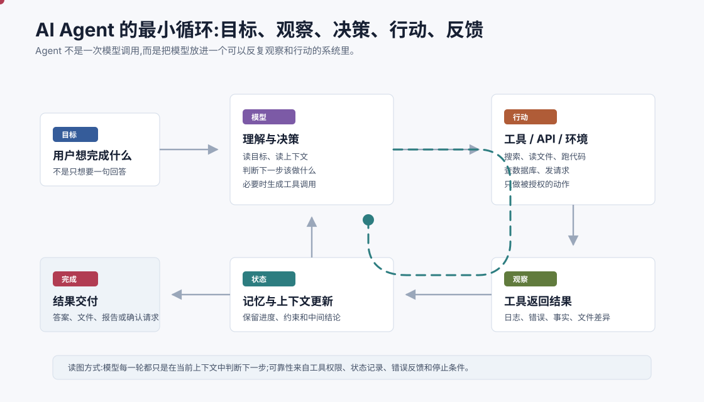
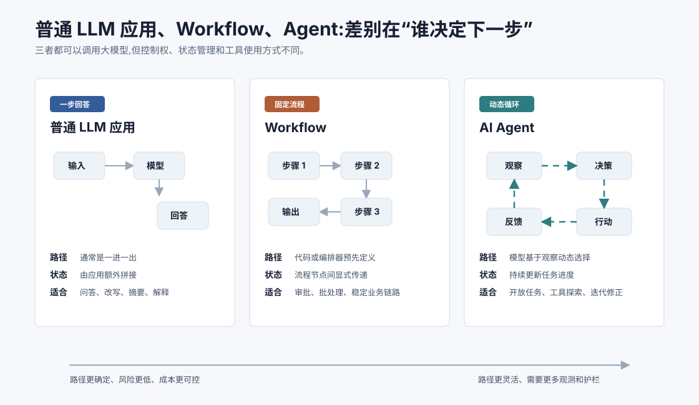
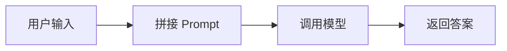
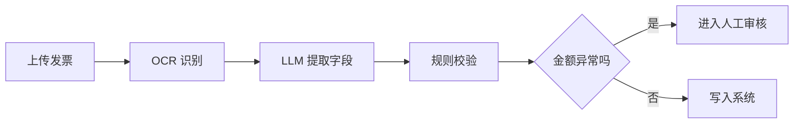

# 什么是 AI Agent `[主线]`

前两章分别看了人工智能和大语言模型的发展脉络。到这里,我们终于可以正式回答一个问题:

**什么是 AI Agent?**

这个词很容易被用得很宽。有时它指一个能聊天的助手,有时指一个能调用工具的程序,有时又指一组自动执行任务的工作流。为了后面不混乱,本章先给出一个清晰但不过度神秘的定义。

**AI Agent 是一个以目标为导向的系统:它使用模型理解当前状态并决定下一步,可以调用工具影响外部世界,再根据反馈更新状态,持续推进任务直到完成、失败或需要人类确认。**

注意这句话里最重要的词不是“AI”,而是“系统”。Agent 通常会用到大语言模型,但它不等于大语言模型本身。模型是 Agent 的决策核心之一,工具、状态、记忆、权限、评估和停止条件同样重要。



这张图里的循环,就是理解 Agent 的第一把钥匙。普通模型调用通常是“输入一次,输出一次”。Agent 则会反复经历几件事:

1. 观察当前目标、上下文和外部反馈。
2. 判断下一步应该直接回答、调用工具、继续检索,还是请求确认。
3. 执行动作,例如查资料、读文件、运行代码、调用业务 API。
4. 读取动作结果,把它写回状态。
5. 判断任务是否已经完成,没有完成就进入下一轮。

如果你只记一句话,可以记这个版本: **Agent = 模型 + 工具 + 状态 + 反馈循环。**

## Agent 不是“更会聊天的模型”

很多人第一次接触 Agent,会把它理解成“更聪明的聊天机器人”。这个理解有一半是对的:现代 Agent 的确常常通过聊天界面和用户互动,也依赖 LLM 的语言理解能力。但如果只看聊天能力,会错过 Agent 真正重要的地方。

一个普通聊天机器人可以回答“我应该怎么排查测试失败”。一个 Agent 则可能继续做这些事:

- 读取项目里的测试日志。
- 查找失败用例对应的源码。
- 运行某个最小复现命令。
- 根据报错修改文件。
- 再次运行测试确认是否修复。
- 把修改内容和验证结果总结给用户。

这里的差别不是回答更长,而是系统开始参与任务过程。它不只是生成建议,而是在有权限的边界内观察、行动和修正。

## Agent 的几个核心组成

一个最小 Agent 不一定复杂,但通常会有以下组成部分。

| 组成 | 作用 | 例子 |
| --- | --- | --- |
| 目标 | 告诉系统要完成什么 | “帮我找出测试失败原因” |
| 模型 | 理解上下文并决定下一步 | LLM 读取日志后判断要看哪个文件 |
| 工具 | 连接外部能力 | 搜索、数据库、文件系统、代码执行器、业务 API |
| 状态 | 保存任务进度 | 已尝试的命令、已发现的问题、用户约束 |
| 反馈 | 告诉系统动作结果 | 工具返回值、错误信息、评估分数、用户确认 |
| 停止条件 | 防止无限循环 | 达到目标、预算耗尽、风险过高、需要人类确认 |

这些组成并不要求一次性做得很重。一个入门 Agent 可以只有一个模型、两个工具和一段短期状态。随着任务变复杂,你才需要加入长期记忆、RAG、权限系统、评估集和更复杂的编排。

## 从 LLM 应用到 Workflow 再到 Agent

现实项目里,很多系统都“用了 LLM”,但它们不一定都是 Agent。更准确的做法是把它们放在一条谱系上看。



### 普通 LLM 应用

普通 LLM 应用的典型形态是:



它适合问答、总结、改写、翻译、分类、解释概念等任务。路径比较短,成本和风险也相对容易控制。

### Workflow

Workflow 是固定流程。它可能在某些节点调用 LLM,但下一步通常由代码或流程引擎决定。

比如一个发票处理流程:



这里 LLM 很有用,但整个路径是预先设计好的。Workflow 的优点是可控、可审计、稳定,特别适合业务规则清晰的场景。

### Agent

Agent 的区别在于,它会根据观察结果动态决定下一步。不是每一步都由开发者写死,而是由模型在约束内选择工具和行动顺序。

一个简化版循环可以写成:

```python
state = create_task_state(user_goal)

while not state.done:
    context = build_context(state)
    decision = llm_decide(context, tools=available_tools)

    if decision.type == "final_answer":
        state.done = True
        state.result = decision.content
    elif decision.type == "tool_call":
        observation = run_tool(decision.tool_name, decision.arguments)
        state.add_observation(observation)
    elif decision.type == "ask_user":
        state.waiting_for_user = True
        break
```

这段伪代码里有三个关键点。第一,模型不是直接控制世界,它只是生成决策。第二,工具调用由系统执行,系统可以检查权限和参数。第三,每次工具结果都会回到状态里,影响下一轮判断。

## “自主性”不是越高越好

Agent 常常和“自主”这个词绑在一起,但自主性不是越高越好。更实用的理解是:不同任务需要不同程度的自主性。

| 自主性 | 系统行为 | 适合场景 | 主要风险 |
| --- | --- | --- | --- |
| 低 | 模型只生成内容,人决定是否采用 | 写作、总结、解释 | 输出可能不准 |
| 中 | 模型在固定流程里做局部判断 | 信息抽取、审批辅助、客服分流 | 节点判断错误 |
| 高 | 模型能选择工具并多轮探索 | 研究助手、代码排查、复杂检索 | 成本、权限、循环失控 |
| 很高 | 长时间自主执行开放目标 | 长时程任务、实验性自动化 | 难审计、难恢复、风险扩大 |

生产系统里常见的成熟设计,并不是让 Agent 无限制地自主运行,而是在关键节点加边界:哪些工具能用、最多调用多少次、能不能写数据、什么时候必须请求用户确认、失败后怎么回滚。

## Agent 的“思考”不一定要展示给用户

许多 Agent 教程会把步骤写成“思考 → 行动 → 观察”。这个结构有助于理解,但在真实产品里,你不一定需要把模型的内部推理过程完整展示出来。

对用户和工程系统来说,更重要的是可审计的外部记录:

- Agent 接收了什么目标和约束。
- 它调用了哪些工具。
- 每次工具调用的参数是什么。
- 工具返回了什么结果。
- 它为什么需要用户确认。
- 最终答案依据哪些事实。

换句话说,我们关心的是可验证的行动链路,而不是把所有中间语言都当成真理。后面讲 ReAct 和可观测性时,会继续区分“模型内部推理”和“系统可审计轨迹”。

## 三个直观例子

### 研究助手

用户说:“帮我比较三款向量数据库,给出选型建议。”

普通 LLM 可能直接基于已有知识给一段回答。Agent 则可以检索最新资料、读取官方文档、整理指标表、标注来源,再根据用户约束给出建议。

### 代码助手

用户说:“这个项目测试挂了,帮我修一下。”

普通 LLM 只能根据粘贴的报错猜原因。Agent 可以运行测试、定位失败文件、阅读相关代码、修改实现、再次验证,最后给出变更说明。

### 客服处理助手

用户说:“这个订单一直没发货,帮我处理。”

普通 LLM 可以安抚用户。Agent 需要查订单状态、看物流接口、判断是否超时、调用补发或退款流程,并在高风险动作前请求人工确认。

这三个例子共同说明:Agent 的价值在于把语言理解接入任务执行链路。

## 判断一个系统是不是 Agent

你可以用下面几个问题快速判断:

1. 它是否有明确目标,而不只是回答单个问题?
2. 它是否会根据中间结果改变下一步?
3. 它是否能调用工具或影响外部状态?
4. 它是否维护任务状态,而不是每轮都从零开始?
5. 它是否有停止条件、错误处理和权限边界?

如果答案大多是“是”,它就更像 Agent。如果只是“用户输入 → 模型输出”,那更像普通 LLM 应用。如果路径由代码完全固定,模型只在某些节点做判断,那更像 Workflow。

## 常见误解

### 误解一:用了工具调用就是 Agent

不一定。一次性调用一个工具,可能只是增强版问答。Agent 的关键在于循环和状态:它能根据工具结果继续判断下一步。

### 误解二:Agent 必须完全自主

不需要。很多有价值的 Agent 都是半自主的:它能收集信息、提出方案、准备动作,但在写数据库、发邮件、转账、删除文件等高风险动作前必须请求确认。

### 误解三:Agent 可以替代业务系统

Agent 更像业务系统上的智能协作层。权限、事务、审计、数据一致性和关键规则仍然应该由稳定的系统机制保障。

### 误解四:Agent 越复杂越高级

复杂不等于可靠。很多任务用普通 LLM 调用或固定 Workflow 更好。只有当任务需要多步观察、动态决策和工具反馈时,Agent 才真正值得引入。

## 本章小结

AI Agent 不是一个单独的模型,而是一种系统形态。它以目标为中心,用模型理解上下文并做决策,通过工具连接外部世界,用状态和反馈推动任务向前。和普通 LLM 应用相比,Agent 的关键是循环;和固定 Workflow 相比,Agent 的关键是根据观察结果动态选择下一步。

下一章会继续追问:既然普通 LLM 应用和 Workflow 已经能解决很多问题,为什么我们还需要 Agent?答案会落到一个很朴素的地方:真实任务和一句回答之间,往往隔着一整条执行链路。
