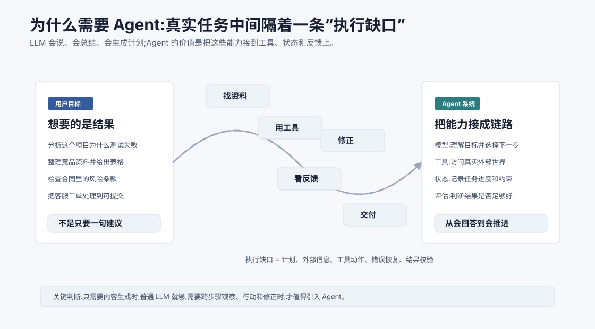
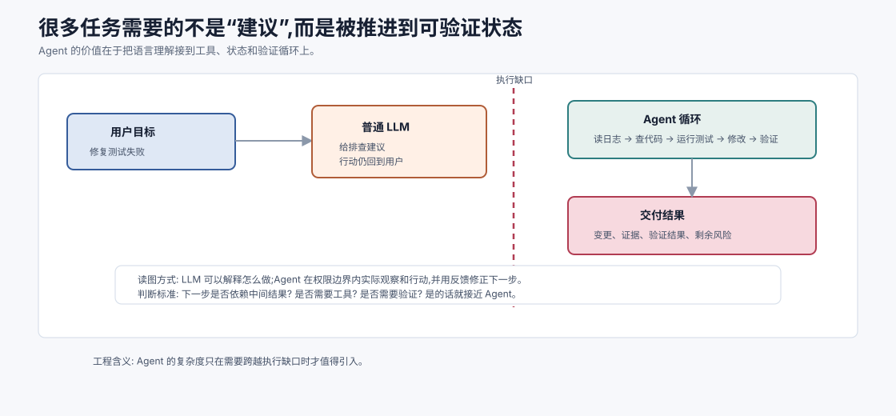
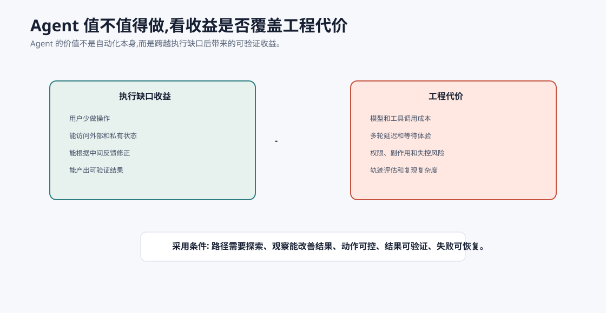
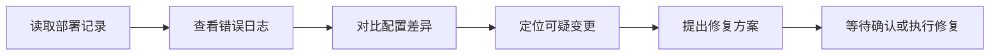
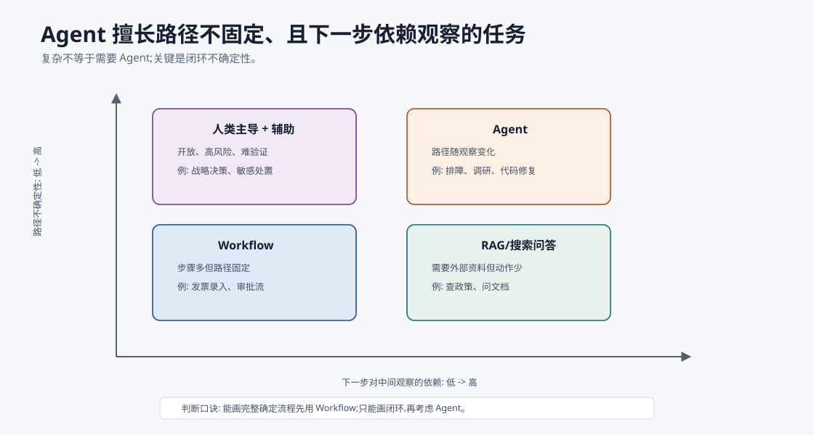
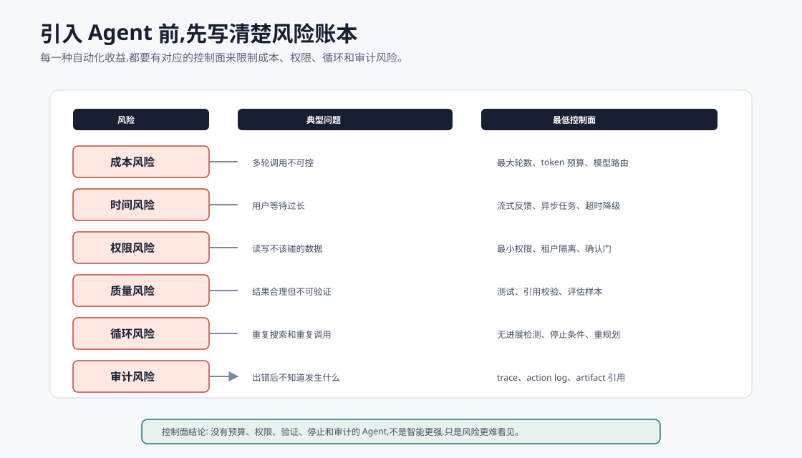
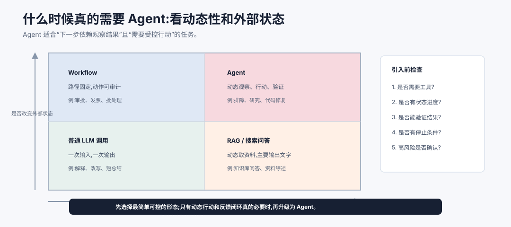

# 为什么需要 Agent `[主线]`

上一章定义了 AI Agent:它不是单个模型,而是一个带目标、工具、状态和反馈循环的系统。

这一章继续问一个更务实的问题:

**既然大语言模型已经能回答问题、写代码、总结资料,为什么还需要 Agent?**

答案不复杂:因为很多真实任务要的不是一句回答,而是一段可以被推进、验证和交付的过程。LLM 擅长语言理解和生成,但真实任务往往还需要查资料、调用系统、处理失败、保持状态、遵守权限、验证结果。Agent 的价值,就在于把模型能力接到这条执行链路上。



可以把普通 LLM 和真实任务之间的差距称为“执行缺口”。用户说“帮我分析测试失败原因”,真正需要发生的事情可能包括:

- 找到测试命令和失败日志。
- 判断是环境问题、依赖问题还是代码问题。
- 阅读相关源码。
- 运行更小的复现用例。
- 修改代码或配置。
- 再次验证。
- 向用户解释原因、改动和剩余风险。

如果只给用户一段“你可以检查依赖版本、查看日志、尝试重新运行测试”的建议,当然也有帮助。但它没有真正跨过执行缺口。Agent 的目标就是在可控边界内跨过去。



执行缺口通常由三段距离组成。

第一段是信息距离。模型不知道你的仓库、日志、订单、网页和内部文档的最新状态,必须通过工具观察。

第二段是行动距离。知道“应该运行测试”不等于测试已经运行;知道“可能要改配置”不等于配置已经被安全修改。Agent 需要把语言决策转成受控工具调用。

第三段是验证距离。真实任务不是“模型觉得好了”就结束,而是要用测试、查询、引用、用户确认或业务规则证明结果足够好。没有验证闭环,Agent 很容易停在看似合理的答案上。

所以 Agent 的价值不是把回答变长,而是把“理解 -> 行动 -> 观察 -> 修正 -> 验证”连成闭环。这个闭环越靠近真实环境,越需要权限、日志和停止条件。

## Agent 的价值方程

Agent 不是“更高级的 LLM 应用”这个标签,而是一笔工程取舍。可以用一个粗略价值方程判断是否值得引入:



```text
Agent 价值 = 执行缺口收益 - (成本 + 延迟 + 失控风险 + 评估复杂度)
```

其中“执行缺口收益”来自三件事:

- 用户少做了多少操作。
- 系统能否获取用户拿不到或不方便拿的信息。
- 中间反馈能否显著改善最终结果。

代价也是真实的:

- 每一轮模型和工具调用都会增加成本和延迟。
- 动作空间越大,权限和安全边界越难做。
- 多轮轨迹比一次回答更难评估和复现。
- 失败不再只是“答错”,还可能是“做错”。

因此,Agent 最适合那些收益能覆盖代价的任务:用户目标清晰,但路径需要探索;外部信息重要,但可以被工具观察;结果可以验证,失败可以恢复;高风险动作可以被确认或隔离。反过来,如果任务路径固定、规则明确、结果必须强一致,Workflow 或传统业务系统往往更可靠。

## 从“给建议”到“推进任务”

LLM 的输出通常是语言。真实任务的状态却存在于外部世界里:代码仓库、数据库、浏览器、日历、CRM、工单系统、文件夹、搜索结果、运行日志。

普通 LLM 可以说:

> 你可以先查看最近一次部署日志,再确认配置是否变化。

Agent 可以做:



这就是从“建议”到“推进”的差别。前者把行动交还给用户;后者在系统授权范围内替用户完成部分行动。

当然,这不是说 Agent 总比建议更好。很多时候,用户只需要解释和思路。Agent 适合的是那些“有多个步骤,并且步骤之间依赖中间结果”的任务。

## 真实任务为什么难

真实任务难,不是因为每一步都高深,而是因为它们有几个共同特征。

### 1. 信息分散在外部系统

模型参数里可能有通用知识,但不知道你的私有项目、今天的数据库状态、刚刚生成的日志、客户订单的最新进度。要完成任务,系统必须访问外部信息。

这就需要工具,比如搜索、文件读取、数据库查询、网页访问、代码执行器、业务 API。

### 2. 下一步取决于中间结果

很多任务不是预先写好步骤就能完成的。你运行测试以后,如果是依赖缺失,下一步要看环境;如果是断言失败,下一步要看业务逻辑;如果是超时,下一步要看性能和网络。

这种分支不是靠一个长 Prompt 就能完全解决的。Agent 需要观察结果,再决定下一步。

### 3. 状态会变化

真实任务有进度。已经查过哪些资料、排除了哪些原因、用户强调过哪些约束、工具返回过哪些错误,这些都应该影响后续决策。

如果系统不维护状态,模型每轮都像从雾里醒来一次,容易重复尝试、忘记约束或把失败步骤当成没发生。

### 4. 错误是常态

工具会失败,网页会变,API 会限流,代码会报错,检索结果会不相关,模型也会误判。Agent 设计不能假设每一步都会成功。

成熟的 Agent 应该把错误当作输入:读取错误、解释错误、换一种策略,或在无法继续时明确告诉用户需要什么。

### 5. 有些动作有副作用

读取文件通常风险较低,删除文件、写数据库、发送邮件、退款、下单、改权限就不一样了。Agent 一旦能行动,就必须考虑权限、确认、审计和回滚。

这也是为什么 Agent 工程不是“让模型自由发挥”。它需要系统边界。

## Agent 解决的不是一个问题,而是一组连接问题

可以把 Agent 的价值拆成五类连接。

| 连接 | 解决的问题 | 例子 |
| --- | --- | --- |
| 连接外部信息 | 模型不知道最新或私有事实 | 搜索文档、查询订单、读取日志 |
| 连接外部工具 | 模型不能只靠语言完成动作 | 运行测试、调用 API、生成文件 |
| 连接任务状态 | 多轮任务需要记住进度 | 已尝试方案、用户约束、失败原因 |
| 连接反馈循环 | 中间结果会改变下一步 | 根据报错继续排查 |
| 连接人类确认 | 高风险动作需要边界 | 发送邮件前让用户确认 |

这五类连接让 LLM 从“生成答案的组件”变成“任务系统里的决策组件”。

## Agent 真正擅长的是“闭环不确定性”

很多任务看起来复杂,其实只是步骤多。如果步骤固定,Workflow 就很好。Agent 的优势出现在另一类任务:每一步的结果会改变下一步,而且你无法在开发时枚举所有路径。



可以从两个维度看:

| 任务特征 | 更适合的系统 |
| --- | --- |
| 路径固定,规则明确 | Workflow、规则引擎、传统应用 |
| 信息外部但只需一次查询 | RAG、搜索增强问答 |
| 路径依赖中间观察,结果可验证 | Agent |
| 路径开放且高风险、难验证 | 人类主导 + Agent 辅助 |

比如“把 100 张发票录入系统”步骤很多,但路径固定,更像 Workflow。“帮我定位为什么这个用户登录失败”路径不固定:可能是密码、风控、权限、网络、后端错误、数据异常。每一步观察都会改变下一步,这才是 Agent 的舒适区。

一个很短的判断是:如果你能把流程图完整画出来,并且分支条件都来自确定规则,先用 Workflow;如果你只能画出“观察 -> 判断 -> 行动 -> 再观察”的循环,才考虑 Agent。

## 哪些场景特别需要 Agent

不是所有 LLM 应用都需要 Agent。下面几类场景更适合引入 Agent。

### 1. 多步信息搜集和整理

比如研究助手、竞品分析、政策解读、论文综述。它们需要检索多个来源,比较信息质量,整理引用,最后生成结构化结论。

如果只让模型凭记忆回答,很容易过时或幻觉。Agent 可以把搜索、筛选、阅读、总结和引用放进循环里。

### 2. 代码排查和自动化开发

代码任务天然有反馈:测试通过或失败、编译成功或报错、lint 是否通过、文件差异是否符合预期。Agent 可以把这些反馈用于迭代。

这也是为什么代码 Agent 发展很快。代码世界相对可观察,工具链成熟,许多动作可以验证。

### 3. 业务操作助手

客服、运营、财务、人事、销售等场景中,用户往往不是要一段解释,而是要完成一个流程:查信息、判断规则、填写字段、提交审批、生成回复。

Agent 可以作为业务系统上的协作层,但必须遵守权限和审计要求。

### 4. 个人自动化

比如整理资料、管理任务、生成周报、筛选邮件、安排日程。它们通常跨多个工具,并且需要保持个人偏好和历史上下文。

这类场景的关键不是模型有多大,而是工具连接和状态管理是否顺手。

### 5. 需要持续监控和响应的任务

比如监控告警、舆情跟踪、数据质量检查。系统需要定期观察外部状态,发现异常后分析、通知或执行预案。

这类任务通常更接近“Workflow + Agent 局部决策”的混合形态。

## 哪些场景不一定需要 Agent

Agent 很有用,但不要把它当作默认答案。下面这些场景通常不需要复杂 Agent。

| 场景 | 更合适的方式 | 原因 |
| --- | --- | --- |
| 一次性改写、翻译、总结 | 普通 LLM 调用 | 不需要外部行动和多轮状态 |
| 路径固定的审批流程 | Workflow | 规则清晰,可控性更重要 |
| 高频稳定预测 | 传统 ML 或规则 | 成本低、延迟低、可解释 |
| 强一致性交易 | 业务系统 + 明确规则 | 不能让模型决定关键事务 |
| 简单数据库查询 | SQL / 报表工具 | 不需要语言模型参与每一步 |

引入 Agent 的代价是真实存在的:更多 token 成本、更多延迟、更复杂的日志、更难复现的行为、更高的安全要求。一个成熟工程师会先问:这个任务是否真的需要动态决策和反馈循环?

## 引入 Agent 前的风险账本

很多 Agent 项目失败,不是因为没有用上最新模型,而是上线前没有把风险账本写清楚。



| 风险 | 典型问题 | 上线前最低要求 |
| --- | --- | --- |
| 成本风险 | 多轮调用不可控 | 最大轮数、token 预算、模型路由 |
| 时间风险 | 用户等待过长 | 流式反馈、异步任务、超时降级 |
| 权限风险 | 读到或写到不该碰的数据 | 最小权限、租户隔离、确认门 |
| 质量风险 | 最终结果看似合理但不可验证 | 测试、引用校验、评估样本 |
| 循环风险 | 重复搜索、重复工具调用 | 无进展检测、停止条件、重规划 |
| 审计风险 | 出错后不知道发生了什么 | trace、action log、artifact 引用 |

这张账本的作用不是阻止使用 Agent,而是把“酷炫自动化”翻译成可管理的工程事项。每一个风险都应该有对应的控制面。如果一个 Agent 既能写生产数据,又没有确认、幂等、trace 和回滚,那它不是先进,只是没有刹车。

## Agent 常见收益

如果场景适合,Agent 能带来几类明显收益。

### 降低用户操作负担

用户不用知道每个系统入口、每条命令、每个字段。Agent 可以把自然语言目标转成一系列具体操作。

### 处理非结构化输入

用户的需求、文档、日志、邮件和网页往往是非结构化的。LLM 擅长理解这些材料,Agent 则负责把理解结果接到工具和流程上。

### 让任务可迭代

一次回答错了,普通问答就结束了。Agent 可以根据反馈继续修正:测试失败就看报错,搜索结果不够就换查询,用户补充约束就调整方案。

### 复用工具生态

Agent 不需要把所有能力都“训练进模型”。它可以调用已有系统:搜索引擎、数据库、代码执行器、内部 API、浏览器、文件系统。这样更现实,也更可维护。

### 把过程留下来

好的 Agent 会记录工具调用、观察结果和关键决策。这些轨迹可以用于调试、评估、审计和改进。

## Agent 带来的新问题

引入 Agent 也会带来新的工程问题。后面几篇会逐步展开,这里先建立直觉。

### 1. 循环可能失控

Agent 如果没有预算和停止条件,可能一直搜索、一直重试、一直调用工具。解决方式包括最大轮数、最大成本、超时、明确的完成标准和失败退出策略。

### 2. 工具可能被误用

模型可能选择了错误工具,也可能给出错误参数。工具层需要 schema、参数校验、权限控制和错误反馈。

### 3. 上下文可能被污染

检索到的网页、用户输入或工具返回内容可能包含误导信息。后面讲 Prompt Injection 时会看到,Agent 一旦能调用工具,上下文安全会变得更重要。

### 4. 结果质量更难评估

普通问答只评估最终答案。Agent 还要评估过程:是否用了正确工具,是否浪费成本,是否遗漏关键步骤,是否在高风险动作前确认。

### 5. 用户信任需要建立

Agent 不能只说“我完成了”。它应该说明做了什么、依据是什么、哪些地方不确定、哪些动作需要用户确认。

## 一个实用判断框架

决定是否使用 Agent 时,可以问五个问题。

1. 这个任务是否需要访问模型参数外的信息?
2. 这个任务是否需要调用外部工具或改变外部状态?
3. 下一步是否依赖上一步的观察结果?
4. 任务是否需要跨多轮维护状态?
5. 失败后是否需要自动恢复、重试或换策略?

如果多数答案是“是”,Agent 可能值得引入。如果只有第一个是“是”,RAG 或搜索增强问答可能就够了。如果都不是,普通 LLM 调用可能更简单。

也可以用一句更短的判断:

> 当用户要的是“帮我把事情推进到某个状态”,而不是“告诉我一段文字”,Agent 才真正开始有价值。



上图用两个维度判断系统形态:下一步是否依赖观察结果,以及是否需要改变外部状态。如果两者都弱,普通 LLM 调用足够;如果主要是动态获取资料但不改变外部状态,RAG 或搜索问答通常更合适;如果路径固定但会写入系统,Workflow 更可靠;只有当任务既依赖中间观察、又需要受控行动时,Agent 才真正体现价值。

这张矩阵也能帮助你避免“为了 Agent 而 Agent”。许多失败项目并不是模型不够强,而是把本来可以用规则、SQL、报表、RAG 或固定流程解决的问题,硬升级成了开放循环。引入 Agent 前,先确认工具、状态、验证、停止条件和高风险确认都能落地,否则系统只是在增加不确定性。

## 小例子:同一个需求的三种实现

需求:用户说“帮我整理这份会议录音的行动项”。

### 普通 LLM 应用

用户上传转写文本,模型直接总结行动项。适合短文本、一次性整理。

### Workflow

系统固定执行:上传音频 → 转写 → 分段 → LLM 提取行动项 → 合并去重 → 生成表格。适合稳定批处理。

### Agent

系统先检查转写质量;如果缺少说话人,调用说话人分离;如果出现不确定任务,回看上下文;如果行动项缺负责人,向用户询问;最后写入任务系统。适合质量要求更高、情况变化更多的场景。

这个例子说明,Agent 不是“高级版”标签,而是当流程需要动态判断时的一种结构选择。

## 成熟 Agent 往往先从局部节点开始

真正落地时,不要急着把一整条业务链路都改成 Agent。更稳妥的路线是从局部高价值节点开始:

1. 找到执行缺口最大的一段:用户最耗时、最容易遗漏、最依赖外部资料的步骤。
2. 保持外层流程稳定:入口、权限、审批、提交和审计仍由 Workflow 或业务系统控制。
3. 让 Agent 只负责动态探索:检索、诊断、草稿、方案比较、证据整理。
4. 把写操作拆成 preview 和 commit:Agent 准备动作,用户或策略门决定是否执行。
5. 用轨迹评估迭代:不只看最终答案,还看工具选择、轮数、失败恢复和确认点。

这种路线看起来不如“全自动 Agent”震撼,但更接近生产现实。Agent 的价值不是替代所有系统,而是在传统系统最僵硬、最需要判断的地方补上一段可控的智能循环。

## 本章小结

我们需要 Agent,不是因为普通 LLM 不够聪明,而是因为真实任务往往不止需要语言生成。它们需要外部信息、工具动作、状态更新、错误恢复、权限边界和结果验证。Agent 的价值在于把 LLM 的理解与生成能力接入这些环节,把“给建议”推进到“做事情”。

下一章会落到更基础的操作层:如何调用 LLM API,以及模型、messages、temperature、top_p、max_tokens、tools 这些参数到底在影响什么。
