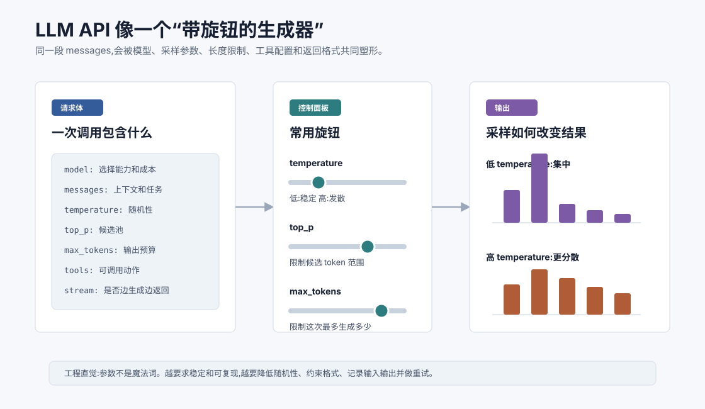
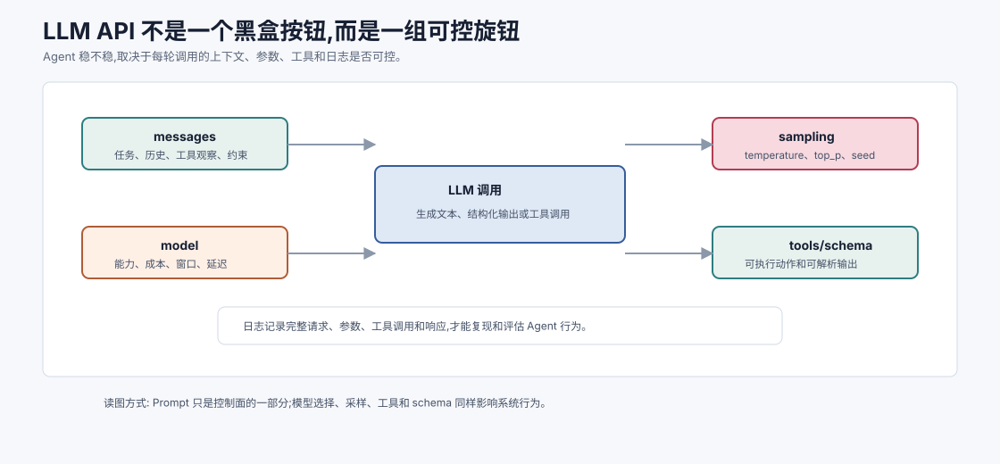
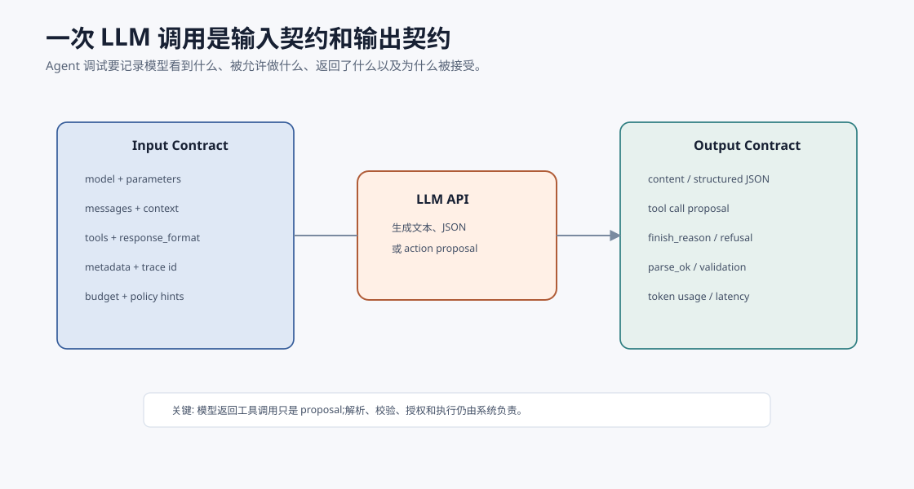
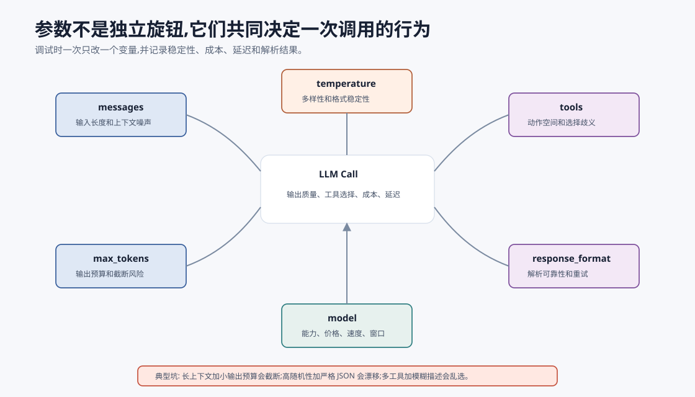
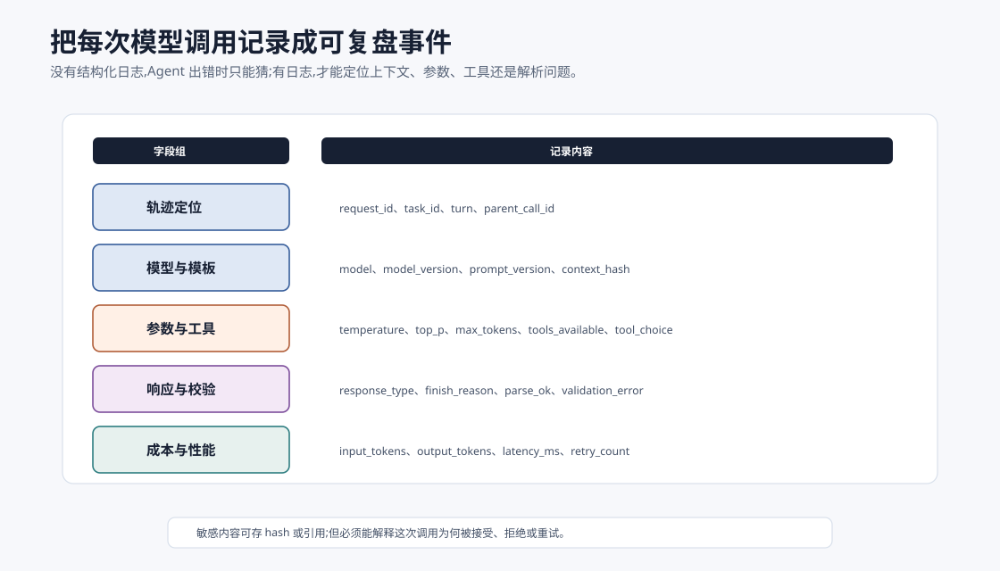
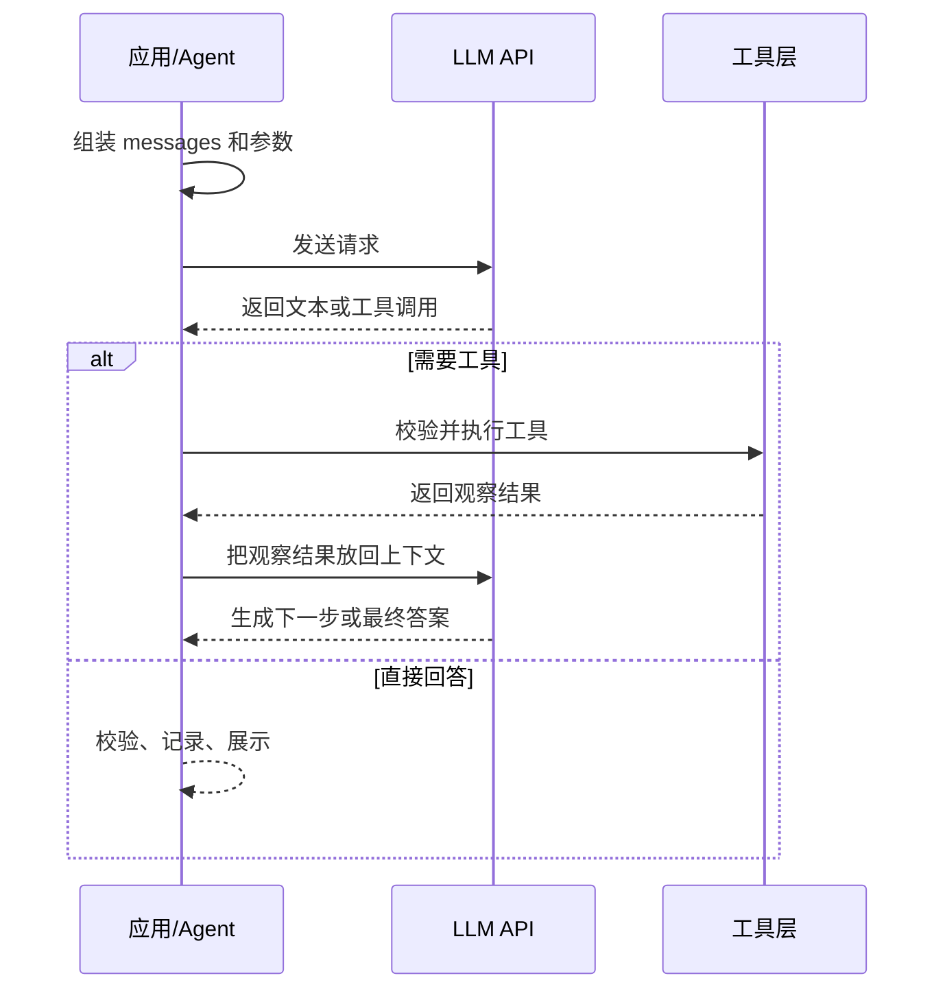
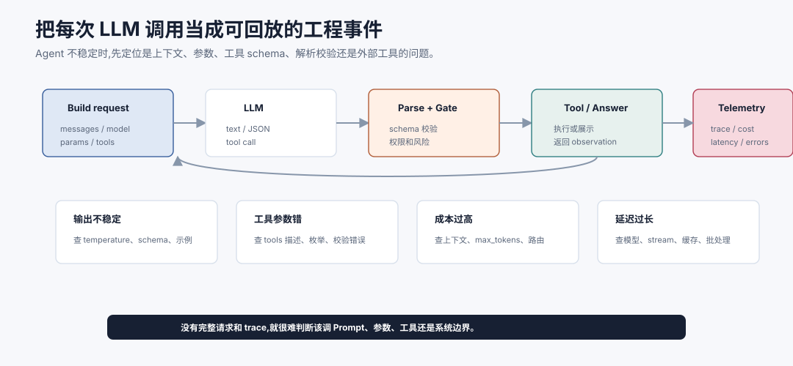

# LLM 使用基础:API 与参数 `[主线]`

到这里,我们已经知道 LLM 是 Agent 的核心能力底座,也知道 Agent 会在循环中反复调用模型。但在真正进入 Agent 架构之前,还需要先掌握一个更基础的问题:

**一次 LLM API 调用到底发生了什么?**

本章不绑定任何具体厂商或 SDK,只讲通用概念。不同平台的字段名可能略有差异,但底层思想非常接近:你把上下文、任务和控制参数发给模型,模型根据这些输入生成文本、结构化输出或工具调用。



可以先把 LLM API 想成一个“带旋钮的生成器”。输入不只是用户问题,还包括模型选择、消息列表、采样参数、输出长度、工具列表和返回格式。输出也不一定只是自然语言,它可能是 JSON、函数调用参数、流式 token,或者带引用的结构化结果。



对普通问答来说,一次 API 调用像是“把问题发给模型”。对 Agent 来说,一次 API 调用更像系统控制面的一次决策事件。你传入什么 `messages`,决定模型看到什么状态;选择什么 `model`,决定能力、成本和延迟;设置什么采样参数,影响稳定性;暴露哪些 `tools`,决定模型能提出什么动作;使用什么 `response_format`,决定下游程序能否可靠解析。

这就是为什么 Agent 调试不能只看最终回答。你需要记录完整请求、模型版本、参数、工具 schema、工具结果和解析错误。否则一旦系统行为不稳定,你很难知道是上下文漏了约束,还是模型选错工具,还是 temperature 太高,还是工具错误没有被正确反馈回模型。

把每次模型调用当成可观测事件,是 Agent 工程的基本功。

## 一次最小调用长什么样

用伪代码表示,一次最小调用大概是这样:

```python
response = llm.generate(
    model="some-model",
    messages=[
        {"role": "system", "content": "你是一个严谨的技术助手。"},
        {"role": "user", "content": "用三句话解释什么是 AI Agent。"}
    ],
    temperature=0.2,
    max_tokens=300
)

print(response.content)
```

这段代码里有几个关键部分:

- `model`:选择使用哪个模型。
- `messages`:告诉模型当前对话和任务是什么。
- `temperature`:控制输出的随机性。
- `max_tokens`:限制最多生成多少 token。
- `response`:模型返回的内容。

真实 API 还可能包含 `top_p`、`tools`、`stream`、`response_format`、`stop`、`seed`、`metadata` 等字段。别被字段数量吓到,先理解它们各自控制的是哪一层。

## 请求和响应要看成契约

一次 LLM 调用不是“发一段话,收一段话”,而是一个输入契约和输出契约。



输入契约至少包括:

- 模型和参数:能力、成本、采样、输出预算。
- 消息和上下文:系统边界、用户目标、状态摘要、工具观察。
- 工具和格式:工具 schema、结构化输出、是否允许工具调用。
- 运行元数据:调用来源、任务 ID、实验版本、追踪 ID。

输出契约也不只是 `content`:

- 可能是最终文本。
- 可能是结构化 JSON。
- 可能是工具调用 proposal。
- 可能包含拒答、截断、解析错误或安全拦截。
- 还应记录 token 用量、耗时、模型版本和 finish reason。

对 Agent 来说,最重要的是 `finish_reason` 和解析状态。输出被长度截断,和模型完整回答但答案错误,是两种完全不同的问题。模型返回了工具调用,也不等于工具已经执行。结构化输出解析失败,也不应该被当作有效动作继续传给 Harness。

## messages:模型真正看到的上下文

现代对话模型通常不是只接收一个字符串,而是接收一组消息。每条消息有角色和内容。

常见角色包括:

| 角色 | 作用 | 例子 |
| --- | --- | --- |
| `system` | 设置模型行为边界和全局要求 | “你是一个谨慎的技术助手” |
| `user` | 用户输入的目标、问题或补充信息 | “帮我总结这篇文章” |
| `assistant` | 之前模型说过的话 | “下面是摘要...” |
| `tool` | 工具返回的观察结果 | “搜索结果:...” |

可以把 `messages` 理解成模型的工作台。模型不会直接记得你系统数据库里的内容,也不会自动知道上一轮工具做了什么;除非这些信息被放进当前上下文。

一个多轮调用可能长这样:

```python
messages = [
    {"role": "system", "content": "回答要简洁,不确定时说明不确定。"},
    {"role": "user", "content": "帮我比较 RAG 和微调。"},
    {"role": "assistant", "content": "RAG 更适合引入外部知识..."},
    {"role": "user", "content": "如果是企业内部知识库呢?"}
]

response = llm.generate(model="some-model", messages=messages)
```

注意,所谓“多轮对话”不是模型天然拥有无限记忆,而是应用把历史消息重新发给模型。历史越长,占用的上下文窗口越多。第 6 章会专门讲 Prompt、Token 和上下文窗口。

## model:能力、成本和延迟的选择

`model` 决定使用哪个模型。模型选择会影响几个方面:

- 能力:是否擅长推理、代码、长上下文、多模态、工具调用。
- 成本:输入和输出 token 的价格。
- 延迟:生成速度和排队时间。
- 上下文窗口:一次能处理多少 token。
- 稳定性:格式遵守、工具调用、拒答边界是否可靠。

工程上不要默认“最大模型就是最好”。更常见的做法是按任务分层:

| 任务 | 可能选择 |
| --- | --- |
| 简单分类、路由、标签 | 小模型或规则 |
| 普通总结、改写、问答 | 中等模型 |
| 复杂推理、代码排查、规划 | 更强模型 |
| 高风险决策 | 强模型 + 工具校验 + 人类确认 |

Agent 系统尤其需要考虑模型分工。比如用小模型做意图识别,用强模型做复杂规划,用确定性代码执行工具做验证。这样比所有步骤都用最强模型更经济。

模型选择还应该看失败代价。一个低风险分类器偶尔错了,可以让后续流程纠正;一个高风险动作规划器错了,可能触发错误工具调用。越靠近副作用动作,越应该使用更强模型、更低随机性、更严格结构化输出和更多系统校验。

## temperature:随机性旋钮

`temperature` 控制采样时的随机性。直觉上:

- 低 temperature:更稳定、更保守、更容易复现。
- 高 temperature:更多样、更发散、更可能出现意外表达。

如果你让模型写诗、 brainstorm 创意,可以适当提高 temperature。如果你让模型生成 JSON、做分类、调用工具、输出表格,通常应该降低 temperature。

更技术一点说,模型每一步都会给候选 token 一个概率分布。temperature 会调整这个分布的尖锐程度。低 temperature 会让高概率 token 更突出;高 temperature 会让低概率 token 也更有机会被选中。

这就是为什么同一个问题多次调用可能得到不同答案。不是模型“心情变了”,而是采样过程本来就可能带随机性。

## top_p:候选池旋钮

`top_p` 也叫 nucleus sampling。它不是直接控制随机性强弱,而是限制模型从多大的候选 token 池里采样。

比如 `top_p=0.9` 可以理解为:只从累计概率达到 90% 的候选 token 中采样,概率更低的长尾 token 暂时排除。

`temperature` 和 `top_p` 都会影响输出多样性。入门时不要同时大幅调整两个参数,否则很难判断变化来自哪里。常见做法是:

- 需要稳定:低 `temperature`,默认或较高 `top_p`。
- 需要创意:适当提高 `temperature`,保留合理 `top_p`。
- 需要严格格式:低 `temperature`,配合结构化输出和校验。

## 参数不是独立旋钮

很多调参失败来自一个误区:把每个参数当成互不相关的旋钮。真实系统里,参数会互相影响。



| 组合 | 常见后果 | 调试建议 |
| --- | --- | --- |
| 长 `messages` + 小 `max_tokens` | 回答被截断,工具参数不完整 | 压缩输入或增加输出预算 |
| 高 `temperature` + 严格 JSON | 格式更容易漂移 | 降低随机性,使用 schema 校验 |
| 多工具 + 模糊描述 | 工具选择不稳定 | 精简工具集,增强工具描述和反例 |
| 大模型 + 长上下文 | 能力强但成本和延迟高 | 路由简单步骤到小模型 |
| `stream=true` + 工具调用 | 用户可能看到未校验中间内容 | 只流式展示用户可见内容 |
| `response_format` + 弱错误处理 | 解析失败后链路中断 | 把解析错误作为可恢复 Observation |

所以调试时一次只改一个变量,并记录输入、参数、输出和错误类型。否则你很难判断改进来自模型升级、上下文整理、采样降低,还是工具 schema 变清楚了。

## max_tokens:输出预算

`max_tokens` 限制模型这次最多生成多少 token。它不是控制输入长度,而是控制输出长度预算。

如果设置太小,模型可能说到一半被截断。如果设置太大,成本和延迟会上升,而且模型可能输出过多无关内容。

工程上经常需要根据任务设置合理预算:

| 任务 | 输出预算直觉 |
| --- | --- |
| 分类、路由 | 很小 |
| 摘要、解释 | 中等 |
| 长报告、代码生成 | 较大 |
| Agent 中间决策 | 尽量小而结构化 |

上下文窗口里通常还存在“输入 token + 输出 token”的总限制。输入塞得太满,留给输出的空间就会变少。

## stop:让生成在某些位置停止

有些 API 支持 `stop` 字段,表示模型生成到某些字符串时停止。

例如你希望模型只生成某个字段,遇到 `\nEND` 就停止。这在早期文本补全式接口中很常见。现在结构化输出和工具调用能力更成熟后,`stop` 的使用频率可能下降,但它仍然是控制输出边界的一种方式。

要注意,`stop` 是文本层面的停止符,不是语义层面的完成判断。Agent 是否完成任务,通常还需要系统状态和评估逻辑判断。

## stream:流式返回

`stream` 表示是否边生成边返回。不开启流式时,用户要等模型完整生成后才看到结果;开启后,可以像打字一样逐步显示。

流式返回的好处:

- 改善用户体感延迟。
- 适合长回答、报告、解释型输出。
- 可以更早展示进度。

但对 Agent 来说,流式输出要谨慎区分两类内容:

- 面向用户的最终回答,可以流式展示。
- 内部工具调用和中间状态,通常应该先由系统处理和校验。

否则用户可能看到半成品、错误中间判断或不该暴露的内部细节。

## tools:让模型提出可执行动作

工具调用是 Agent 的基础。你可以把工具描述给模型,模型在需要时返回结构化参数,系统再真正执行工具。

一个简化工具定义可能像这样:

```python
tools = [
    {
        "name": "search_docs",
        "description": "搜索内部文档,返回最相关的片段。",
        "parameters": {
            "query": "string",
            "limit": "integer"
        }
    }
]

response = llm.generate(
    model="some-model",
    messages=messages,
    tools=tools
)
```

模型不会亲自搜索文档。它只是可能返回类似这样的意图:

```json
{
  "tool_name": "search_docs",
  "arguments": {
    "query": "Agent 循环 工具调用 状态",
    "limit": 5
  }
}
```

然后由你的程序执行 `search_docs`,拿到结果后再作为 `tool` 消息放回上下文,让模型继续回答。

这个分工非常重要:

- 模型负责选择工具和生成参数。
- 系统负责校验参数、检查权限、执行工具。
- 工具负责返回可观察结果。
- 模型再基于结果继续推理或生成答案。

## response_format:约束输出形状

很多应用不希望模型随意输出自然语言,而是希望它返回 JSON、表格字段、分类标签或固定 schema。此时可以使用结构化输出能力,或者在 Prompt 中明确格式并做校验。

例如:

```json
{
  "summary": "一句话摘要",
  "action_items": [
    {
      "owner": "负责人",
      "task": "任务",
      "deadline": "截止时间或 null"
    }
  ]
}
```

结构化输出对 Agent 很关键,因为中间决策最好能被程序读取。自然语言适合给人看,结构化数据适合给系统执行。

即使使用结构化输出,也应该做解析和校验。模型输出不是数据库事务,不要默认永远合法。

## seed:尝试提升复现性

有些 API 支持 `seed`,用于让采样更可复现。但复现性通常仍受模型版本、系统后端、并行实现和参数变化影响。

工程上想要稳定,不能只靠 `seed`。更可靠的方式包括:

- 降低随机性。
- 使用结构化输出。
- 固定 Prompt 模板。
- 记录完整请求和响应。
- 对关键任务做自动评估和回归测试。

## metadata:给调用留下线索

`metadata` 通常不直接影响模型输出,但可以帮助你记录调用来源、用户、任务类型、实验版本等信息。

这对后续分析很有用。比如你想知道哪个 Agent 步骤最耗 token,哪个工具调用失败最多,哪个 Prompt 版本效果变差,就需要完整日志。

Agent 系统一定要重视日志。否则你只会看到“它答错了”,但不知道是哪一步错了。

## 参数如何影响 Agent

在普通问答里,参数调得不好,最多是回答风格不稳。在 Agent 里,参数会影响系统行为。

| 参数 | 对 Agent 的影响 |
| --- | --- |
| `model` | 决定规划、工具选择和复杂上下文处理能力 |
| `messages` | 决定模型能看到哪些状态、约束和工具结果 |
| `temperature` | 影响工具选择和结构化输出稳定性 |
| `max_tokens` | 影响中间决策是否被截断,也影响成本 |
| `tools` | 决定 Agent 能提出哪些外部动作 |
| `response_format` | 决定输出能否被程序可靠解析 |
| `stream` | 影响用户体验和中间状态展示方式 |

所以 Agent 不是只写一个很长的 Prompt。它需要把每轮调用当成一个可观测、可调试的工程事件。

## 每次调用应该记录什么

如果没有调用日志,LLM 应用很难调试;如果没有结构化调用日志,Agent 几乎无法生产化。



一条最小调用日志可以包括:

| 字段 | 作用 |
| --- | --- |
| `request_id`、`task_id`、`turn` | 把一次调用放回任务轨迹 |
| `model`、`model_version` | 排查模型升级或路由差异 |
| `prompt_version`、`context_hash` | 复现输入和模板变化 |
| `temperature`、`top_p`、`max_tokens` | 分析稳定性和截断 |
| `tools_available`、`tool_choice` | 分析工具选择空间 |
| `response_type`、`finish_reason` | 区分文本、工具调用、截断、拒答 |
| `parse_ok`、`validation_error` | 判断结构化输出是否可用 |
| `input_tokens`、`output_tokens`、`latency_ms` | 分析成本和延迟 |

日志不一定要保存完整敏感内容,可以保存 hash、摘要或加密引用。但至少要能回答:这次调用看到了什么版本的上下文,暴露了哪些工具,为什么输出被接受或拒绝,下一轮状态如何被它影响。

## 一个调用生命周期

一次模型调用可以拆成下面几个阶段:



这个生命周期会在 Agent 里反复出现。理解它,后面讲 ReAct、Function Calling、工具设计、可观测性时就不会觉得抽象。



上图把一次 LLM API 调用看成可回放的闭环:应用先组装 `messages`、模型、参数和工具 schema;模型返回文本、JSON 或工具调用;系统再做解析、schema 校验、权限判断和风险门禁;如果需要工具,执行后把 observation 写回上下文;同时记录 trace、成本、延迟和错误。这样一来,每次调用都能被复盘,而不是只留下“模型答错了”这个模糊结论。

当 Agent 行为不稳定时,调试顺序也应该沿着这条闭环走。输出不稳定,先查采样参数、格式约束和上下文噪声;工具参数错误,先查 schema、工具描述和校验反馈;成本过高,看输入 token、输出预算和模型路由;延迟过长,看模型选择、流式返回、缓存和批处理。把调用当工程事件,参数才不只是旋钮,而是可观测系统的一部分。

## 常见参数调试建议

### 输出不稳定

先降低 `temperature`,固定 Prompt 模板,减少无关上下文。如果是结构化输出不稳定,使用 schema 约束和解析校验。

### 答案太短或被截断

检查 `max_tokens` 是否太小,也检查输入是否占满上下文窗口。

### 答案跑题

检查 `messages` 里任务是否明确,是否混入了无关历史,系统约束是否和用户要求冲突。

### 工具调用参数错误

改进工具描述和参数 schema,增加示例,在工具层返回清晰错误,让模型有机会修正。

### 成本太高

减少历史消息,压缩工具结果,用小模型处理简单步骤,限制最大轮数和输出长度。

## 常见误解

### 误解一:Prompt 写好了,参数不重要

参数会影响稳定性、成本、延迟和格式。尤其在 Agent 中,一次不稳定的工具调用可能带来后续连锁问题。

### 误解二:temperature 越高模型越聪明

temperature 不提升能力,只是改变采样随机性。复杂推理需要更合适的模型、上下文、工具和验证,不是单纯调高随机性。

### 误解三:max_tokens 越大越好

更大的输出预算意味着更高成本和更长延迟。很多 Agent 中间步骤应该短而结构化。

### 误解四:模型返回工具调用就应该立即执行

工具调用必须经过系统校验。高风险工具需要权限控制和人类确认。模型提出动作,不代表动作一定安全或正确。

## 本章小结

LLM API 调用的核心是:把 `messages` 和控制参数交给模型,让模型生成文本、结构化输出或工具调用。`model` 决定能力与成本,`messages` 决定模型看到什么,`temperature` 和 `top_p` 影响采样,`max_tokens` 控制输出预算,`tools` 让模型提出可执行动作,`response_format` 帮助系统解析结果。

下一章会继续深入 `messages` 背后的基础概念:Prompt、Token 和上下文窗口。Agent 能否稳定工作,很大程度上取决于你能否把正确的信息放进有限的上下文里。
