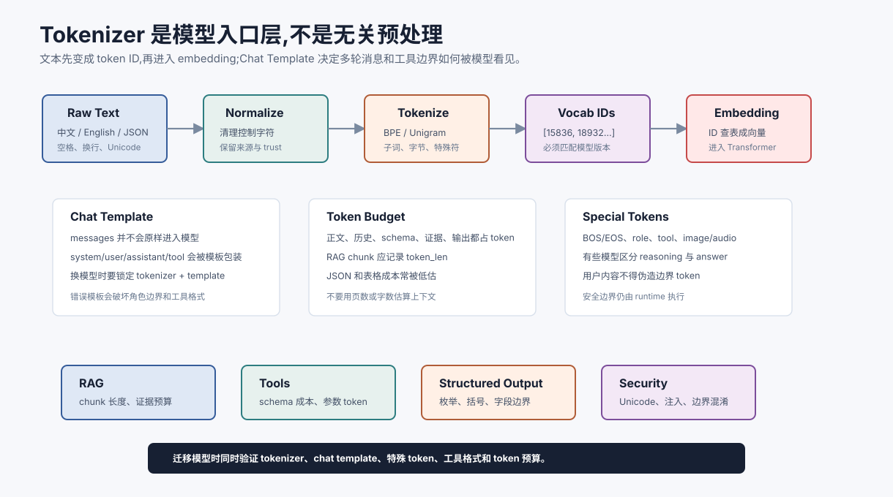

# Tokenizer、词表与 Chat Template `[主线]` ★

很多人理解 LLM 时会直接从 Transformer 开始。这个路径没有错,但会漏掉一个非常实际的入口问题:

**模型并不直接读取汉字、英文单词或 Markdown,它读取的是 token ID。**

Tokenizer 决定文本如何被切成 token,词表决定 token ID 对应什么片段,Chat Template 决定多轮对话如何被拼成模型实际看到的序列。它们看起来像预处理细节,但会影响成本、上下文长度、结构化输出、工具调用、跨语言表现和安全边界。



本章先补上这块地基。读完后,你会更清楚为什么“同样 1000 字”在不同语言里 token 数不同,为什么换模型时 prompt 可能突然变差,为什么工具调用的 JSON 格式不能只靠自然语言要求。

## 文本为什么要变成 token

神经网络处理的是数字向量。输入文本必须先变成一串整数 ID:

```text
用户文本 -> tokenizer -> token IDs -> embedding lookup -> hidden states
```

例如一句话可能被切成:

```text
"AI Agent 是什么?"
-> ["AI", " Agent", " 是", "什么", "?"]
-> [15836, 18932, 21043, 99213, 30]
```

这个例子只是示意。不同模型的 tokenizer 会得到不同结果。模型训练时使用了某个 tokenizer 和词表,推理时也必须使用同一个或兼容的 tokenizer。否则同一段文字会被映射成不同 ID,模型看到的输入分布就变了。

## 词、字符和子词

早期 NLP 常用词级切分,例如把英文句子切成单词。大模型更常用子词或字节级方案,因为真实语言里有大量未登录词、拼写变化、代码、URL、表情、中文、日文、韩文、混合语言和特殊符号。

| 粒度 | 优点 | 问题 |
| --- | --- | --- |
| 字符级 | 不容易遇到未知词 | 序列很长,语义片段太碎 |
| 词级 | 语义直观 | 词表巨大,新词和拼写变化难处理 |
| 子词级 | 在长度和泛化之间折中 | token 边界不总符合人的直觉 |
| 字节级 | 几乎所有文本都能表示 | 某些语言或符号可能 token 数偏高 |

主流 LLM 通常选择子词或字节级 BPE 变体。它的直觉是:高频片段用一个 token 表示,低频词拆成更小片段。

## BPE 的直觉

BPE,Byte Pair Encoding,可以简单理解为“反复合并最常见的相邻片段”。

一开始可以把文本拆成字符或字节:

```text
l o w
l o w e r
n e w e s t
```

如果 `l` 和 `o` 经常相邻,就合并成 `lo`;如果 `lo` 和 `w` 经常相邻,再合并成 `low`。反复合并后,常见片段会变成词表里的 token。

这带来两个结果。

第一,常见文本更省 token。训练语料中经常出现的英文片段、代码模式、标点组合会被压缩得更好。

第二,低频文本仍然可表示。新词、罕见名字、拼写错误可以拆成多个子词或字节 token。

## 中文和多语言的 token 成本

不要用“字数”估算上下文成本。不同语言、符号和格式的 token 密度可能差别很大。

同样一段内容,英文、中文、代码、JSON、表格和 URL 的 token 数都可能不同。对 Agent 工程来说,这会影响:

- 上下文窗口能装多少证据。
- RAG chunk 应该切多大。
- 工具 schema 和 JSON 输出的成本。
- 长对话摘要何时触发。
- 多语言产品的成本模型是否公平。

工程上应使用目标模型的 tokenizer 统计 token,而不是用字符数或页数估算。

## 特殊 token

Tokenizer 不只处理普通文本。很多模型还会有特殊 token,例如:

- BOS / EOS:序列开始和结束。
- role token:区分 system、user、assistant、tool。
- tool call token:标记工具调用区域。
- image/audio token:多模态输入占位。
- reasoning 或 answer 分隔标记:区分内部推理和最终答案。

这些 token 通常和模型训练格式绑定。随意修改、漏掉或错放,会导致模型行为不稳定。

## Chat Template 是什么

Chat API 表面上接收的是消息数组:

```json
[
  {"role": "system", "content": "你是一个严谨助手。"},
  {"role": "user", "content": "解释 KV Cache。"}
]
```

但模型底层通常看到的是按某种模板拼接后的文本或 token 序列。不同模型的模板可能不同:

```text
<|im_start|>system
你是一个严谨助手。<|im_end|>
<|im_start|>user
解释 KV Cache。<|im_end|>
<|im_start|>assistant
```

模板差异会影响模型是否理解角色边界、是否按工具格式输出、是否把 tool observation 当成可信事实。换模型时只换 `model_name`,不检查 chat template,是很多迁移事故的来源。

## Tokenizer 对 RAG 的影响

RAG 里常见一个隐藏问题:切块按字符切,预算按 token 算。

如果 chunker 用字符数切文档,而模型上下文按 token 限制,就可能出现:

- 某些 chunk 远超预算。
- 中文、代码、表格的 token 数分布差异很大。
- evidence pack 压缩后仍然超长。
- 引用 ID、元数据和 JSON 包装消耗被低估。

可靠做法是让 chunker、context builder 和评估工具都能调用目标 tokenizer,至少记录每个 chunk 的 token 长度。

## Tokenizer 对结构化输出的影响

JSON、XML、Markdown 表格和代码块都是 token 序列。模型生成结构化输出时,并不是一次生成完整对象,而是一个 token 一个 token 地采样。

这解释了为什么结构化输出会出现:

- 漏右括号。
- 字符串没闭合。
- enum 值拼错。
- 多输出一段解释文字。
- 在长字段中途偏离 schema。

约束解码能在生成阶段屏蔽非法 token,但它也依赖 tokenizer。比如某个枚举值可能是一个 token,也可能被拆成多个 token;某个中文字段名可能被切成多个片段。

## Tokenizer 对安全的影响

安全规则不能只按字符串理解。攻击者可能通过 Unicode 变体、零宽字符、混合编码、分隔符错位、Markdown 嵌套或工具字段注入来绕过简单检查。

因此输入治理至少要考虑:

- 规范化 Unicode。
- 清理不可见控制字符。
- 标注外部不可信文本。
- 对工具参数做结构化校验。
- 不把 tokenizer 边界当作安全边界。

Tokenizer 能告诉你模型看到什么 token,但不能替代安全策略。

## 工程检查清单

上线一个模型前,建议确认这些问题:

| 问题 | 为什么重要 |
| --- | --- |
| tokenizer 是否和模型版本匹配? | 不匹配会让输入分布偏离训练格式 |
| chat template 是否由官方或框架正确加载? | 影响角色、工具和多轮对话边界 |
| RAG chunk 是否记录 token 长度? | 避免上下文预算失控 |
| 工具 schema 的 token 成本是否计入预算? | schema 很长时会挤压证据空间 |
| 多语言 token 密度是否评估过? | 成本、延迟和上下文容量会变化 |
| 特殊 token 是否被用户内容伪造? | 防止角色边界和工具边界混淆 |

## 常见误解

### 误解一:token 大致等于英文单词

不对。token 可能是单词、子词、空格加词、字符、字节或特殊标记。中文、代码和 JSON 的 token 密度不能用英文单词估算。

### 误解二:Chat API 让模板问题消失了

没有。API 或框架只是帮你套模板。换模型、换框架、换本地推理服务时,模板仍可能变化。

### 误解三:上下文窗口只看文档正文长度

不够。系统提示、工具 schema、消息包装、引用编号、证据元数据、历史对话和输出预算都占 token。

### 误解四:Tokenizer 是纯工程细节

不是。它影响模型输入分布、成本、长上下文、结构化输出和安全边界。

## 本章小结

Tokenizer 把文本变成 token ID,词表定义 token 的含义,Chat Template 定义多轮消息如何进入模型。它们是 LLM 的入口层,会影响上下文预算、RAG 切块、工具调用、结构化输出、多语言成本和安全治理。理解这一层后,再读 embedding、attention 和上下文工程会更稳。

下一章会从向量、矩阵和概率直觉开始,解释 token ID 进入模型后如何变成可计算的表示。
