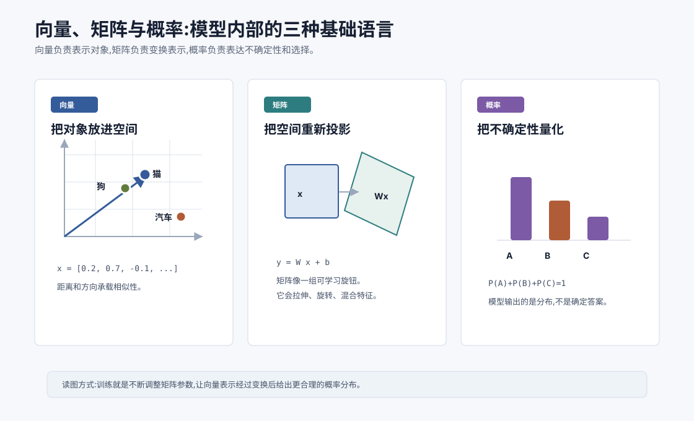
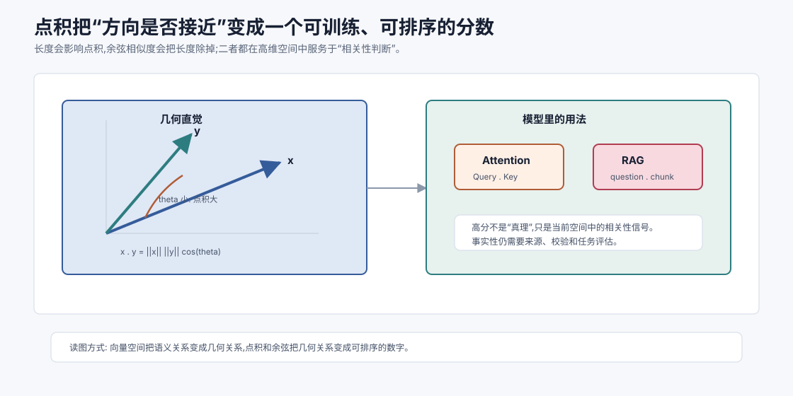
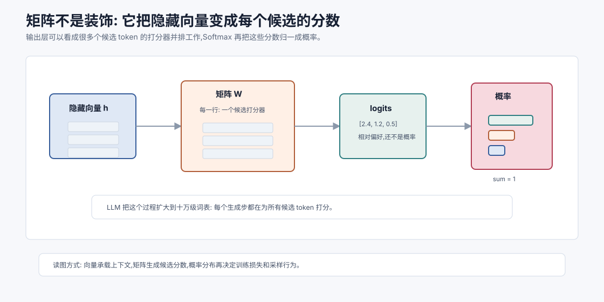
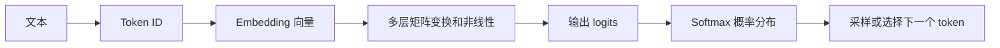

# 向量、矩阵与概率直觉 `[主线]`

Part 1 会开始打开 LLM 的黑盒。后面我们会讲神经网络、Self-Attention、Transformer、训练、对齐、KV Cache 和推理优化。它们看起来名词很多,但底层会反复出现三种基础语言:

1. **向量**:把词、句子、图片、用户意图、工具结果表示成一串数字。
2. **矩阵**:把一种表示变换成另一种表示。
3. **概率**:表达模型对下一个 token、类别、动作或答案的不确定性。

如果你能抓住这三件事,后面的很多概念会突然变得不那么神秘。Transformer 不是魔法盒子,它本质上是在不断把 token 向量变换、混合、归一化,最后得到一个概率分布,再从中生成下一个 token。



本章的目标不是把你训练成线性代数专家,而是让你获得一套足够稳的直觉。读完以后,你应该能解释:

- 为什么模型内部到处都是向量。
- 为什么“相似”可以变成距离、角度或点积。
- 矩阵为什么可以看成可学习的变换器。
- 概率为什么是模型输出的自然形式。
- 这些东西如何连接到 LLM 的 token 预测。

## 为什么 AI 喜欢数字

人类使用自然语言、图像、声音、动作来理解世界。机器学习模型最终处理的却是数字。原因很朴素:数字可以计算、比较、求导和优化。

你可以对两个数字相加,对一组数字求平均,对一个函数求梯度。你很难直接对“猫”“合同风险”“用户很着急”这样的概念做这些操作。于是第一步就是把对象变成数字表示。

比如:

| 对象 | 机器里的表示 |
| --- | --- |
| 一个词 | token ID 或词向量 |
| 一句话 | 多个 token 向量的序列 |
| 一张图片 | 像素矩阵或视觉特征向量 |
| 一个用户问题 | embedding 向量 |
| 一个工具结果 | 文本 token + 结构化字段 |
| 一个类别预测 | 概率分布 |

这里的关键不只是“变成数字”,而是变成一种能保留有用关系的数字。好的表示应该让模型更容易看出:哪些对象相似,哪些对象相关,哪些特征重要,哪些变化会影响输出。

## 标量、向量、矩阵和张量

先从几个基本词开始。

### 标量

标量就是一个数字,比如 $3.14$、$-2$、$0.87$。

在模型里,一个损失值、一个概率、一个温度参数、一个学习率都可以是标量。

### 向量

向量是一串数字,比如:

$$
x = [0.2, 0.7, -0.1, 1.3]
$$

你可以把它想成一个点的位置,也可以想成一个对象的特征清单。

在 LLM 中,每个 token 会被映射成一个向量。这个向量不是人手写的“词性、情感、长度”等特征,而是模型从数据中学出来的表示。

### 矩阵

矩阵是二维数字表,比如:

$$
W =
\begin{bmatrix}
0.1 & 0.3 \\
-0.2 & 0.5 \\
0.8 & -0.4
\end{bmatrix}
$$

矩阵最重要的作用之一是变换向量。一个向量 $x$ 经过矩阵 $W$ 后,会变成另一个向量 $Wx$。

神经网络里到处都是矩阵。Linear 层、Attention 里的 $W_Q$、$W_K$、$W_V$、输出投影矩阵,本质上都是可学习的矩阵。

### 张量

张量可以理解成更高维的数字数组。标量是 0 维张量,向量是 1 维张量,矩阵是 2 维张量。一个批次的 token 表示通常是 3 维张量:

$$
\text{batch} \times \text{sequence length} \times \text{hidden size}
$$

比如一次输入 8 个样本,每个样本 1024 个 token,每个 token 用 4096 维向量表示,张量形状就是:

$$
8 \times 1024 \times 4096
$$

在代码里你经常会看到 `shape`、`dim`、`hidden_size`、`batch_size` 这些词,它们就是在描述张量的结构。

## 向量是“位置”,也是“意义”

向量最直观的理解是空间里的点。

二维向量 $[2, 3]$ 可以表示平面上横坐标为 2、纵坐标为 3 的点。三维向量 $[2, 3, 5]$ 可以表示三维空间里的点。LLM 的 token 向量可能有几千维,我们画不出来,但数学上仍然可以把它看成高维空间里的点。

真正有趣的是:如果向量是模型学出来的,那么空间位置就可能承载语义。

比如在一个训练得不错的向量空间里:

- “猫”和“狗”可能距离较近。
- “猫”和“汽车”可能距离较远。
- “北京”和“中国”的关系,可能和“巴黎”和“法国”的关系有某种相似结构。
- “函数”“变量”“编译器”这些代码相关词,可能形成自己的区域。

这不是因为人提前把这些规则写进去,而是因为模型在大量数据中学到:哪些词经常出现在相似上下文里,哪些概念经常承担相似角色。

这就是表示学习的核心: **让模型自己学出一个空间,在这个空间里,有用的关系更容易被计算出来。**

## 维度不一定对应人类可命名特征

初学者容易把向量里的每一维想成一个明确特征:第一维表示“是不是动物”,第二维表示“是不是地点”,第三维表示“情感强度”。这种想象有助于入门,但不能太当真。

在真实神经网络里,单个维度往往不对应一个人类可命名概念。一个概念可能分布在很多维度中,一个维度也可能参与很多概念。这叫分布式表示。

举个比喻:不是一个开关控制“猫”这个概念,而是很多旋钮共同形成“猫”的表示。模型内部的语义更像调音台,不是标签表。

这也解释了为什么大模型可解释性很难。我们可以看到向量数字,但很难直接说第 1372 维到底代表什么。

## 向量的长度:大小感

向量有长度,也叫范数。最常见的是 L2 范数:

$$
\|x\| = \sqrt{x_1^2 + x_2^2 + \cdots + x_n^2}
$$

如果 $x=[3,4]$,那么:

$$
\|x\| = \sqrt{3^2 + 4^2} = 5
$$

长度可以理解为向量的“大小”。在模型里,向量长度可能影响激活强度、注意力分数、数值稳定性。很多归一化方法,比如 LayerNorm、RMSNorm,都和控制向量尺度有关。

不过在语义相似性里,我们经常更关心方向,而不只是长度。

## 点积:相似性的粗糙计算器

两个向量可以做点积:

$$
x \cdot y = x_1y_1 + x_2y_2 + \cdots + x_ny_n
$$

比如:

$$
[1,2,3] \cdot [4,5,6] = 1\times4 + 2\times5 + 3\times6 = 32
$$

点积有一个非常重要的几何含义:

$$
x \cdot y = \|x\|\|y\|\cos\theta
$$

其中 $\theta$ 是两个向量之间的夹角。如果两个向量方向接近,点积通常较大;方向相反,点积可能为负;接近垂直,点积接近 0。

这就是为什么点积在 LLM 里如此重要。Self-Attention 中,Query 和 Key 的相关性就是用点积计算的:

$$
\text{score}(q,k) = q \cdot k
$$

如果某个 token 的 Query 和另一个 token 的 Key 点积很大,模型就会认为它们在当前语境下更相关。



这张图要强调一个很容易被忽略的点:点积不是在判断“两个词本体是否相同”,而是在判断“两个向量在当前表示空间里是否朝向相近”。在 Attention 中,Query 和 Key 都是由当前层的隐藏向量经过不同矩阵投影得到的,所以它们不是固定词典里的静态含义,而是带着上下文角色的临时表示。

这也是为什么同一个词在不同句子里可以关注不同对象。比如“它”这个 token 的原始字面形式没有变,但经过前面层的上下文加工后,它的 Query 可能更靠近某个名词的 Key,从而把注意力权重分配过去。点积只是最后一步打分,真正的语义来自前面层学出来的表示空间。

点积还会受到向量长度影响。如果某个向量范数很大,即使方向只是中等接近,点积也可能偏大。因此很多系统会在检索时使用归一化后的 embedding,也就是余弦相似度;Transformer 的 Attention 则会使用缩放点积:

$$
\text{score}(q,k)=\frac{q\cdot k}{\sqrt{d_k}}
$$

这里除以 $\sqrt{d_k}$ 是为了避免维度变大后点积数值过大,导致 Softmax 过早变得极尖,梯度变小。换句话说,这个缩放不是数学洁癖,而是训练稳定性设计。

## 余弦相似度:只看方向

点积会受向量长度影响。为了更专注于方向,常用余弦相似度:

$$
\cos(x,y) = \frac{x \cdot y}{\|x\|\|y\|}
$$

它的值通常在 $[-1,1]$ 之间。越接近 1,方向越相似。

在 RAG 和向量检索中,常见做法是把文档片段和用户问题都变成 embedding 向量,再用余弦相似度或近似方法找最相关的片段。

这背后的直觉很简单:如果两个文本向量方向接近,说明它们可能语义相关。

当然,这只是近似。向量相似不等于事实正确,也不等于一定能回答问题。后面讲 RAG 时会继续讨论召回噪声和重排。

## 矩阵:把一种表示变成另一种表示

向量负责表示对象,矩阵负责改变表示。

一个线性变换可以写成:

$$
y = Wx
$$

如果加上偏置,就是:

$$
y = Wx + b
$$

这里:

- $x$ 是输入向量。
- $W$ 是矩阵。
- $b$ 是偏置向量。
- $y$ 是输出向量。

矩阵可以做很多事:拉伸、压缩、旋转、投影、混合不同维度的信息。神经网络中的线性层,本质上就是让模型学习一个合适的矩阵和偏置。

## 一个小矩阵例子

假设输入向量是:

$$
x =
\begin{bmatrix}
2 \\
1
\end{bmatrix}
$$

矩阵是:

$$
W =
\begin{bmatrix}
1 & 2 \\
3 & 4
\end{bmatrix}
$$

那么:

$$
Wx =
\begin{bmatrix}
1 \times 2 + 2 \times 1 \\
3 \times 2 + 4 \times 1
\end{bmatrix}
=
\begin{bmatrix}
4 \\
10
\end{bmatrix}
$$

这只是一个小例子。在 LLM 中,矩阵可能是几千乘几千的规模。计算量巨大,但思想一样:把输入表示映射到输出表示。



把这个矩阵例子放到 LLM 的最后输出层来看,输出矩阵 $W_o$ 的每一行都可以理解成一个候选 token 的打分器。当前位置隐藏向量 $h_t$ 和某一行做点积,就得到这个候选 token 的 logit。所有行一起计算,就得到整个词表的 logits。

这会带来三个关键直觉。

第一,logit 是相对分数,不是绝对知识。模型不是先查出一个“正确答案”,而是让隐藏向量和许多候选 token 的输出方向逐一匹配,再比较这些匹配分数。

第二,输出概率来自竞争。Softmax 会把所有 logits 放在同一个分母里归一化,所以提高一个 token 的概率通常意味着其他 token 的概率质量被挤压。语言模型每一步生成都像一次大规模候选竞争。

第三,上下文改变隐藏向量,隐藏向量改变 logits。系统提示、用户问题、检索片段、工具返回都会改变当前 token 的表示,进而改变输出层对每个候选的打分。这就是为什么上下文工程会显著影响模型行为:你不是在给模型贴提示便签,而是在改变后续每一步概率分布的形成条件。

## 为什么需要非线性

如果神经网络只有矩阵乘法,无论堆多少层,本质上仍然是一个大的线性变换。因为线性变换的复合仍然是线性变换:

$$
W_2(W_1x) = (W_2W_1)x
$$

这会限制模型表达复杂关系。为了让模型能表示更复杂的模式,需要加入非线性函数,也就是激活函数。

一个简单神经网络层可以写成:

$$
h = \sigma(Wx + b)
$$

其中 $\sigma$ 是非线性函数。后面讲神经元和 FFN 时,我们会详细看激活函数如何让网络表达复杂决策边界。

先记住一句话:矩阵提供可学习变换,非线性让多层变换真正变强。

## 概率:模型不是直接给答案,而是给分布

现在看第三种语言:概率。

LLM 在生成时,不是直接“写出下一个词”,而是先给所有候选 token 一个分数,再把这些分数变成概率分布。

比如上下文是:

```text
法国的首都是
```

模型可能给出类似直觉上的分布:

| token | 概率 |
| --- | --- |
| 巴黎 | 0.82 |
| 法国 | 0.03 |
| 欧洲 | 0.02 |
| 伦敦 | 0.01 |
| 其他 | 0.12 |

最终输出哪个 token,还会受到采样策略影响。低 temperature 时,模型更倾向于选择最高概率 token;高 temperature 时,低概率 token 也更可能被采到。

这就是第 5 章 API 参数里 `temperature` 和 `top_p` 的底层直觉。

## 概率分布的基本要求

一个概率分布需要满足两个条件:

1. 每个概率都不小于 0。
2. 所有候选的概率加起来等于 1。

写成公式就是:

$$
0 \leq P(x_i) \leq 1
$$

$$
\sum_i P(x_i) = 1
$$

模型的原始输出分数不满足这个条件,所以需要 Softmax 把它们转换成概率。下一章会专门讲 Softmax。

## 条件概率:语言模型的核心形式

语言模型最核心的形式是条件概率:

$$
P(x_t \mid x_1, x_2, \ldots, x_{t-1})
$$

它表示:在已经看到前面 token 的条件下,当前位置是 $x_t$ 的概率是多少。

如果一句话是:

```text
我 今天 想 喝 咖啡
```

语言模型可以把整句话的概率拆成一串条件概率:

$$
P(我,今天,想,喝,咖啡)
$$

$$
= P(我)P(今天 \mid 我)P(想 \mid 我,今天)P(喝 \mid 我,今天,想)P(咖啡 \mid 我,今天,想,喝)
$$

这就是自回归语言模型的基本思想:一个 token 一个 token 地生成,每一步都基于前文预测下一个 token。

## 概率不是确定知识

概率分布很有用,但也带来一个重要提醒:模型不是数据库。

当模型说某件事时,它是在当前上下文下生成高概率文本。这个文本可能真实、合理、有帮助,也可能只是看起来像真实答案。尤其当上下文缺少事实来源时,模型可能会生成“统计上像答案”的内容。

这就是幻觉问题的一部分根源。它不是简单的“模型故意说谎”,而是生成式模型的输出机制决定了它会在不确定时继续生成最像答案的文本。

工程上要处理这个问题,需要 RAG、工具校验、引用、评估和不确定性表达。

## 期望值:概率加权的平均

概率论里还有一个常用概念:期望值。它表示在概率分布下的平均结果。

如果一个随机变量 $X$ 可能取值 $x_i$,对应概率是 $P(x_i)$,那么期望是:

$$
E[X] = \sum_i P(x_i)x_i
$$

比如一个模型有三种输出质量分数:

| 分数 | 概率 |
| --- | --- |
| 1 | 0.2 |
| 2 | 0.5 |
| 3 | 0.3 |

期望分数是:

$$
E[X] = 0.2\times1 + 0.5\times2 + 0.3\times3 = 2.1
$$

期望在训练和评估中很常见。损失函数常常可以理解为“在数据分布上的平均错误”。

## 最大似然:让真实数据变得更可能

训练语言模型时,一个核心目标是让训练数据中的正确 token 概率更高。

如果真实下一个 token 是“巴黎”,模型给它 0.82 的概率,就比给 0.05 更好。

最大似然的直觉就是:调整模型参数,让真实出现的数据在模型看来更可能。

形式上,如果数据是 $D$,模型参数是 $\theta$,我们希望最大化:

$$
P(D \mid \theta)
$$

实际训练中通常会最大化对数似然,或者等价地最小化负对数似然。交叉熵损失就是这个思想在分类和语言模型训练中的常见形式。

下一章会讲:为什么正确 token 概率越低,交叉熵损失越大。

## 从本章到 LLM 数据流

现在可以把 LLM 的基本数据流串起来:



这条链路会在后面反复展开。

Embedding 层把 token ID 变成向量。Transformer 层不断用矩阵、Attention 和非线性更新向量。最后输出层把隐藏向量映射成词表大小的 logits。Softmax 把 logits 变成概率分布。采样策略再决定实际输出哪个 token。

## 一个迷你分类器例子

为了把三种语言放在一起,看一个迷你分类器。

假设我们要判断一句话情绪是“正面”还是“负面”。模型可以这样做:

1. 把句子变成向量 $x$。
2. 用矩阵 $W$ 和偏置 $b$ 得到两个类别分数:

$$
z = Wx + b
$$

3. 用 Softmax 得到概率:

$$
p = \text{softmax}(z)
$$

4. 如果真实标签是“正面”,就希望 $p(正面)$ 越高越好。

这就是向量、矩阵和概率的组合:

- 向量 $x$:表示输入。
- 矩阵 $W$:把输入表示映射到类别分数。
- 概率 $p$:表达模型对类别的信心。

LLM 只是把这个过程放大到了巨大的词表、深层网络和长上下文上。

## 和 Agent 有什么关系

这章看起来很底层,但它和 Agent 关系很近。

第一,Agent 的工具选择本质上也常常是概率决策。模型会在“直接回答”“调用搜索”“读取文件”“请求确认”等可能动作之间给出倾向。

第二,RAG 中的向量检索直接依赖 embedding 空间。用户问题和文档片段的相似度,就是向量相似度。

第三,上下文里的每个 token 都会变成向量。你放进上下文的资料、工具结果和系统指令,都会影响这些向量的更新路径。

第四,模型的错误很多时候是概率性错误。它不是完全不知道,而是在多个可能输出之间选错了,或者在缺少事实时生成了高概率但错误的文本。

理解这些,你在设计 Agent 时会更自然地想到:需要给模型什么上下文、怎样校验概率性输出、什么时候该用工具替代模型猜测。

## 常见误解

### 误解一:向量里的每一维都有明确含义

通常不是。神经网络使用的是分布式表示,一个概念可能分散在许多维度中。

### 误解二:向量相似就等于答案正确

不等于。向量相似只说明语义或上下文模式接近。RAG 还需要事实校验、重排、引用和答案评估。

### 误解三:矩阵只是数学符号

矩阵是模型中可学习参数的主要形态。训练模型,很大程度上就是不断调整这些矩阵。

### 误解四:概率最高的输出一定最好

不一定。概率最高只是模型当前认为最可能。它可能保守、重复,也可能因为上下文错误而高置信地产生错误答案。

### 误解五:数学和工程无关

这些数学直觉会直接影响工程判断。比如为什么长上下文会贵,为什么 RAG 要用 embedding,为什么 temperature 会影响输出,为什么归一化能稳定训练。

## 本章小结

向量、矩阵和概率是理解 LLM 的基础。向量把对象放进可计算空间,矩阵把表示变换成新的表示,概率把不确定性变成可优化、可采样的分布。LLM 的核心流程可以看成:文本变 token,token 变向量,向量经过多层变换,最后产生下一个 token 的概率分布。

下一章会专门讲 Softmax 与交叉熵。它们是连接“模型输出分数”和“训练损失”的关键桥梁:Softmax 把分数变成概率,交叉熵告诉模型哪里错了、错得有多严重。
