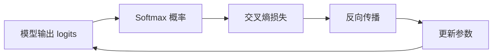
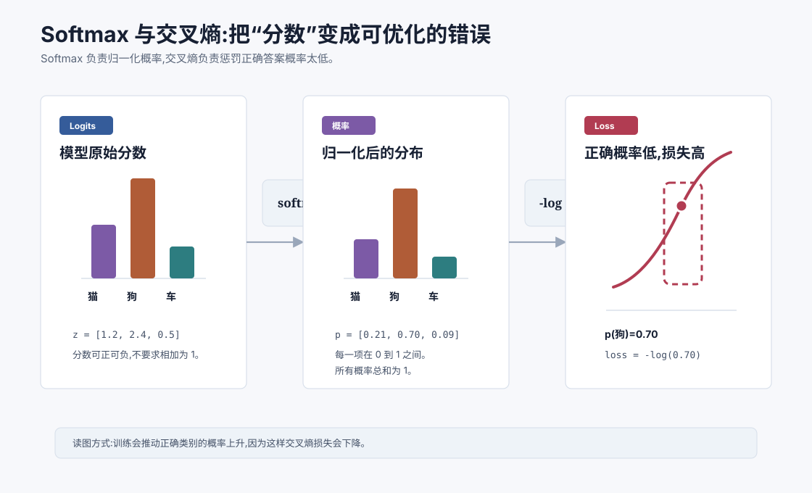
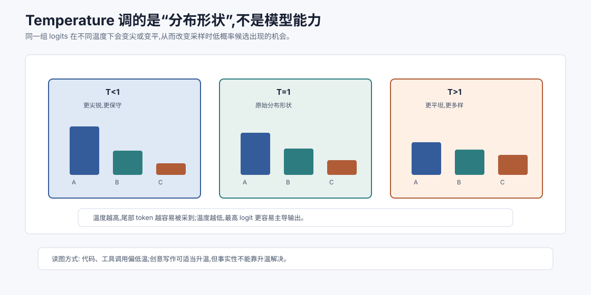
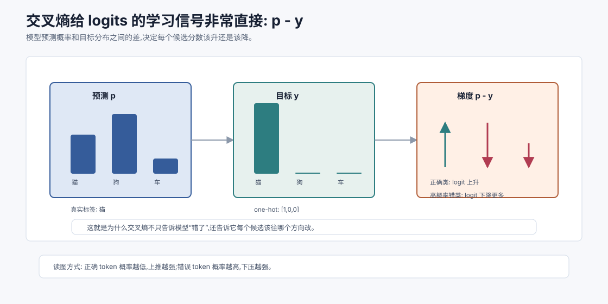

# Softmax 与交叉熵损失 `[进阶]`

上一章讲到,模型最后通常会输出一组分数,再把分数变成概率分布。对语言模型来说,这个分布表示“下一个 token 是词表中每个 token 的概率”。

这一章讲两个非常重要的机制:

1. **Softmax**:把任意实数分数变成概率分布。
2. **交叉熵损失**:衡量模型给正确答案的概率有多糟。

它们看起来只是两个公式,但实际上连接了模型训练的核心闭环:



如果说上一章是“模型如何表示世界”,这一章就是“模型如何知道自己错了”。



## 从一个分类问题开始

先用一个简单分类任务来建立直觉。

假设模型要判断一张图片是“猫”“狗”还是“汽车”。模型最后输出三个原始分数:

| 类别 | logit |
| --- | --- |
| 猫 | 1.2 |
| 狗 | 2.4 |
| 汽车 | 0.5 |

这些分数叫 **logits**。它们有几个特点:

- 可以是任意实数。
- 不需要在 0 到 1 之间。
- 加起来不等于 1。
- 只能表示相对偏好,还不是概率。

我们希望把它们变成概率,比如:

| 类别 | 概率 |
| --- | --- |
| 猫 | 0.21 |
| 狗 | 0.70 |
| 汽车 | 0.09 |

这时就需要 Softmax。

## Softmax 公式

给定一组 logits:

$$
z = [z_1, z_2, \ldots, z_n]
$$

Softmax 会把第 $i$ 项转换成:

$$
\text{softmax}(z_i) = \frac{e^{z_i}}{\sum_{j=1}^{n} e^{z_j}}
$$

这里有两个关键步骤。

第一,对每个分数取指数:

$$
e^{z_i}
$$

指数会把任何实数变成正数。无论 $z_i$ 是负数、零还是正数,$e^{z_i}$ 都大于 0。

第二,除以所有指数值的总和:

$$
\sum_{j=1}^{n} e^{z_j}
$$

这样所有输出加起来就会等于 1。

所以 Softmax 结果满足概率分布的两个要求:

$$
0 < \text{softmax}(z_i) < 1
$$

$$
\sum_i \text{softmax}(z_i)=1
$$

## 手算一个 Softmax

还是用刚才的 logits:

$$
z = [1.2, 2.4, 0.5]
$$

先取指数:

$$
e^{1.2} \approx 3.32
$$

$$
e^{2.4} \approx 11.02
$$

$$
e^{0.5} \approx 1.65
$$

总和是:

$$
3.32 + 11.02 + 1.65 = 15.99
$$

于是概率是:

$$
P(猫)=\frac{3.32}{15.99}\approx0.21
$$

$$
P(狗)=\frac{11.02}{15.99}\approx0.69
$$

$$
P(汽车)=\frac{1.65}{15.99}\approx0.10
$$

这和直觉一致:狗的 logit 最大,概率也最大。

## 为什么不用简单除以总和

你可能会问:为什么不直接用 $z_i / \sum z_j$?

原因有几个。

第一,logits 可能有负数。如果直接除以总和,结果可能为负,不符合概率要求。

第二,logits 总和可能是 0。除以 0 会出问题。

第三,指数函数会放大差异。logit 高一点,指数后会明显更大,这有助于把模型偏好的类别凸显出来。

比如 $2.4$ 和 $1.2$ 只差 $1.2$,但:

$$
e^{2.4} \approx 11.02
$$

$$
e^{1.2} \approx 3.32
$$

二者差距被放大了。

## Softmax 保留相对大小

Softmax 不会改变 logits 的排序。如果 $z_a > z_b$,那么:

$$
\text{softmax}(z_a) > \text{softmax}(z_b)
$$

也就是说,原始分数最高的类别,Softmax 后概率仍然最高。

但 Softmax 会改变差距的表现方式。分数之间的差距越大,概率分布越尖锐;分数越接近,概率分布越平坦。

这和 temperature 有直接关系。

## Temperature 与 Softmax

采样参数 `temperature` 本质上是在 Softmax 前缩放 logits:

$$
P_i = \frac{e^{z_i / T}}{\sum_j e^{z_j / T}}
$$

这里 $T$ 是 temperature。

- $T < 1$:分布更尖锐,高分 token 更突出。
- $T > 1$:分布更平坦,低分 token 更有机会。
- $T \to 0$:越来越接近总选最高分。

举个直觉例子。假设两个 token 的 logits 是 $[2,1]$。

当 $T=1$ 时,二者差距正常。当 $T=0.5$ 时,实际进入 Softmax 的是 $[4,2]$,差距变大。当 $T=2$ 时,实际进入 Softmax 的是 $[1,0.5]$,差距变小。

所以 temperature 不是让模型“更聪明”或“更笨”,而是改变从概率分布中采样的多样性。



从工程角度看,temperature 控制的是“在已有模型判断下,我们愿意接受多少分布尾部的可能性”。它不会补充事实,不会修复推理链,也不会让模型突然掌握训练中没有学到的能力。它只是改变 logits 进入 Softmax 前的尺度。

这件事有几个直接后果。

第一,代码生成、结构化输出、工具调用通常更适合低温。因为这些任务的成功标准比较窄,一个字段名、JSON 结构或函数参数错了,整体就可能失败。低温让模型更贴近最高概率路径,可重复性更强。

第二,创意写作、头脑风暴、命名、文案草稿可以适当升温。因为这类任务允许多个合理答案,探索低概率候选有时能带来新鲜表达。

第三,事实问答不能靠升温解决。高温只会让低概率 token 更容易出现,如果上下文缺少可靠证据,它可能增加幻觉的表现形式。事实性更应该通过检索、引用、工具校验和评估来解决。

还要注意,temperature 通常和 `top_p`、`top_k`、重复惩罚等采样策略共同作用。它们都发生在“模型已经给出 logits 之后”。所以采样参数属于推理时控制,不是训练时学习。

## LLM 中 Softmax 的规模

在三分类任务里,Softmax 只处理 3 个类别。语言模型里,类别数是词表大小。

如果词表有 100,000 个 token,模型每生成一个 token,就要为这 100,000 个候选 token 计算 logits,再得到概率分布。

简化看,某一步生成时模型做的是:

$$
P(x_t \mid x_{<t}) = \text{softmax}(W_o h_t)
$$

这里:

- $h_t$ 是当前位置的隐藏向量。
- $W_o$ 是输出投影矩阵。
- $W_o h_t$ 得到词表大小的 logits。
- Softmax 把 logits 变成下一个 token 的概率分布。

这也解释了为什么词表大小、输出长度和推理成本有关。每一步都要在词表维度上计算分布,只是工程实现会做很多优化。

## 有了概率,怎么衡量错了多少

现在进入交叉熵。

假设真实类别是“狗”。模型给出的概率是:

| 类别 | 概率 |
| --- | --- |
| 猫 | 0.21 |
| 狗 | 0.70 |
| 汽车 | 0.09 |

因为正确类别“狗”的概率是 0.70,这个预测还不错。但如果模型给“狗”的概率只有 0.05,就很糟。

交叉熵损失的核心就是惩罚正确类别概率太低。

对于 one-hot 标签,交叉熵可以写成:

$$
L = -\log p_y
$$

其中 $p_y$ 是正确类别的预测概率。

## 为什么是负对数

我们看几个数。

| 正确类别概率 $p_y$ | $-\log(p_y)$ |
| --- | --- |
| 1.00 | 0.00 |
| 0.90 | 0.105 |
| 0.70 | 0.357 |
| 0.50 | 0.693 |
| 0.10 | 2.303 |
| 0.01 | 4.605 |

可以看到:

- 正确概率越接近 1,损失越接近 0。
- 正确概率越低,损失增长越快。
- 如果模型对正确答案非常不自信,惩罚会很大。

这很符合训练目标。我们希望模型不仅“猜对类别”,还要把更多概率质量放到正确类别上。

## 交叉熵完整形式

如果标签不是只写正确类别,而是一个目标分布 $y$,预测分布是 $p$,交叉熵写作:

$$
H(y,p) = -\sum_i y_i \log p_i
$$

对于普通分类任务,真实标签通常是 one-hot。

比如真实类别是“狗”:

$$
y = [0, 1, 0]
$$

预测是:

$$
p = [0.21, 0.70, 0.09]
$$

代入公式:

$$
H(y,p) = -(0\log0.21 + 1\log0.70 + 0\log0.09)
$$

$$
= -\log0.70
$$

所以 one-hot 情况下,交叉熵就是取正确类别概率的负对数。

## 语言模型训练中的交叉熵

语言模型训练时,每个位置都有一个“正确下一个 token”。

比如训练文本是:

```text
我 喜欢 喝 咖啡
```

训练时可以形成多个预测任务:

| 上下文 | 正确下一个 token |
| --- | --- |
| 我 | 喜欢 |
| 我 喜欢 | 喝 |
| 我 喜欢 喝 | 咖啡 |

模型在每个位置输出一个词表概率分布。交叉熵会取正确 token 的概率,计算损失。

如果模型在“我 喜欢 喝”之后给“咖啡”很高概率,损失低。如果它给“飞机”很高概率、给“咖啡”很低概率,损失高。

整段文本的训练损失通常是所有位置损失的平均。

## 交叉熵和最大似然的关系

交叉熵并不是随便选出来的损失。它和最大似然直接相关。

训练数据中的真实 token 序列是:

$$
x_1, x_2, \ldots, x_T
$$

自回归模型给整段序列的概率是:

$$
P(x_1,\ldots,x_T)=\prod_{t=1}^{T}P(x_t \mid x_{<t})
$$

我们希望最大化这个概率。为了计算方便,通常取对数:

$$
\log P(x_1,\ldots,x_T)=\sum_{t=1}^{T}\log P(x_t \mid x_{<t})
$$

最大化对数似然,等价于最小化负对数似然:

$$
-\sum_{t=1}^{T}\log P(x_t \mid x_{<t})
$$

这就是语言模型交叉熵训练目标的来源。

换句话说,训练 LLM 的一个核心目标是:让真实文本里的下一个 token 在模型看来越来越可能。

## 为什么不是只看是否预测对

如果只看“最高概率类别是否正确”,会丢掉很多信息。

看两个模型:

| 模型 | 猫 | 狗 | 汽车 | 真实类别 |
| --- | --- | --- | --- | --- |
| A | 0.49 | 0.50 | 0.01 | 狗 |
| B | 0.01 | 0.98 | 0.01 | 狗 |

两个模型都预测“狗”,准确率都算对。但 B 明显更自信,也更好。交叉熵会给 B 更低损失。

再看两个预测错的模型:

| 模型 | 猫 | 狗 | 汽车 | 真实类别 |
| --- | --- | --- | --- | --- |
| C | 0.51 | 0.48 | 0.01 | 狗 |
| D | 0.99 | 0.005 | 0.005 | 狗 |

C 只是差一点,D 是高置信度地错。交叉熵会对 D 惩罚更大。

这很重要,因为训练不只是告诉模型“对或错”,还要告诉它错得多严重。

## Softmax + 交叉熵的梯度直觉

完整推导可以很长,但结论非常优雅。

当 Softmax 和交叉熵一起使用时,对 logits 的梯度大致是:

$$
\frac{\partial L}{\partial z_i} = p_i - y_i
$$

这里:

- $p_i$ 是模型预测概率。
- $y_i$ 是真实标签分布。

对于正确类别,如果 $y_i=1$,梯度是:

$$
p_i - 1
$$

如果正确类别概率太低,比如 $p_i=0.1$,梯度是 $-0.9$,会强烈推动这个 logit 上升。

对于错误类别,如果 $y_i=0$,梯度是:

$$
p_i
$$

错误类别概率越高,梯度越大,会推动对应 logit 下降。

这就是 Softmax + 交叉熵好用的原因之一:它给出了非常直接的学习信号。



这个 $p-y$ 结论值得多停留一下。它让训练信号变得极其清楚:预测概率比目标高的候选,在梯度下降更新后 logit 会被压下去;预测概率比目标低的候选,logit 会被推上来。对于 one-hot 标签,正确类别的目标是 1,错误类别的目标是 0,于是正确 token 概率越低,负梯度越大;错误 token 概率越高,正梯度越大。

这也解释了为什么交叉熵比“答对/答错”更适合训练。假设真实 token 是“巴黎”,模型 A 给它 0.49,模型 B 给它 0.01。二者如果最高概率都不是“巴黎”,准确率都算错,但训练信号应该完全不同:模型 A 只需要轻轻调整边界,模型 B 则需要大幅纠正。交叉熵能表达这种差异。

在语言模型里,这个信号会发生在每一个 token 位置。一个长序列不是只产生一个损失,而是很多位置共同给出梯度。模型因此能从海量文本中积累细小的概率修正:哪个词更适合接在这个上下文后,哪个格式更常出现在这种指令后,哪个代码 token 更符合前面的语法结构。

不过,$p-y$ 也提醒我们:训练目标本身仍然是匹配数据分布。如果数据里有错误事实、坏格式、偏见表达或低质量轨迹,梯度也会认真学习这些模式。损失函数不会自动判断价值,它只忠实放大训练数据给出的信号。

## 数值稳定性:为什么实现时会减去最大值

Softmax 里有指数函数。指数很容易爆。

比如:

$$
e^{1000}
$$

这个数大到普通浮点数装不下。实际实现 Softmax 时,通常会先减去 logits 的最大值:

$$
\text{softmax}(z_i) = \frac{e^{z_i - m}}{\sum_j e^{z_j - m}}
$$

其中:

$$
m = \max_j z_j
$$

这样不会改变 Softmax 结果。原因是所有项都乘上了同一个常数因子,分子分母会抵消。

证明直觉:

$$
\frac{e^{z_i-m}}{\sum_j e^{z_j-m}}
=
\frac{e^{z_i}/e^m}{\sum_j e^{z_j}/e^m}
=
\frac{e^{z_i}}{\sum_j e^{z_j}}
$$

但数值上会稳定很多。

这也是深度学习里常见的主题:数学公式看起来简单,工程实现必须考虑浮点数范围、精度和稳定性。

## 为什么交叉熵会推动校准,但不保证校准

交叉熵鼓励模型给正确答案更高概率,也惩罚高置信度错误。这会让概率具有一定意义。

但模型概率不一定天然校准。所谓校准,是指模型说 80% 有把握的样本中,真的大约有 80% 是对的。

大模型在很多场景下会出现不校准:

- 对错误事实过度自信。
- 对罕见问题给出看似确定的回答。
- 在上下文误导下生成高置信度错误。
- 对不同任务的概率尺度不一致。

所以工程上不能把模型生成的文本自信程度直接当成真实概率。需要评估、校验和不确定性表达。

## 交叉熵和困惑度

语言模型评估里常见一个指标:困惑度,英文是 perplexity。

如果平均交叉熵是 $H$,困惑度是:

$$
\text{PPL} = e^H
$$

困惑度可以理解为:模型平均在多少个候选之间感到困惑。困惑度越低,说明模型对真实文本预测得越好。

不过困惑度不是万能指标。它适合衡量语言建模能力,但不一定能直接反映对话质量、事实性、指令遵守、安全性或 Agent 工具使用能力。

一个模型困惑度低,可能语言续写很好,但不一定能稳定调用工具或遵守复杂业务规则。

## 多标签、标签平滑和软标签

前面讲的是 one-hot 标签。但真实训练中还会出现一些变体。

### 标签平滑

标签平滑会把绝对的 one-hot 变软一点。

比如原来真实标签是:

$$
y = [0,1,0]
$$

平滑后可能变成:

$$
y = [0.05,0.90,0.05]
$$

它的作用是避免模型过度自信,有时能改善泛化。

### 软标签

在蒸馏中,学生模型可能学习教师模型输出的概率分布。这个分布不是 one-hot,而是包含教师对不同候选的相对判断。

比如教师认为:

$$
[猫:0.55, 狗:0.40, 汽车:0.05]
$$

这比单纯告诉学生“猫是正确答案”包含更多信息:教师觉得“狗”也有些接近,汽车明显不接近。

后面讲蒸馏时会再回到这个思想。

## Softmax 在 Attention 里也会出现

Softmax 不只用于最终输出层。Attention 里也会用 Softmax。

Self-Attention 会先计算 Query 和 Key 的相关性分数:

$$
\text{score}_{ij} = q_i \cdot k_j
$$

然后用 Softmax 把一行分数变成注意力权重:

$$
\alpha_{ij} = \text{softmax}(\text{score}_{ij})
$$

这些权重表示:当前位置应该从其他位置读取多少信息。

所以 Softmax 在 Transformer 中有两个典型角色:

- 输出层:把 token logits 变成词表概率。
- Attention 层:把相关性分数变成注意力权重。

这也是为什么理解 Softmax 非常关键。它是“分数 → 分布”的通用转换器。

## Softmax 的局限

Softmax 很常用,但它也有一些局限。

### 1. 它会给所有候选分配非零概率

即使某些候选很不合理,Softmax 也会给它们一个很小但非零的概率。采样时如果随机性较高,长尾 token 仍可能被选中。

### 2. 它对 logit 差距敏感

logits 差距稍大时,分布可能变得很尖。训练和推理中需要注意温度、数值范围和归一化。

### 3. 大词表计算成本高

语言模型词表很大,输出层 Softmax 是重要计算部分之一。训练超大模型时,会有各种优化或近似方法。

### 4. 概率不等于事实可信度

模型给某个 token 高概率,只是表示它在当前上下文和参数下很可能出现。它不保证事实正确。

## 一个 Agent 视角的例子

假设 Agent 在某一轮需要决定下一步动作:

| 动作 | logit | Softmax 概率 |
| --- | --- | --- |
| 直接回答 | 0.8 | 0.22 |
| 搜索资料 | 2.1 | 0.61 |
| 请求用户确认 | -0.2 | 0.08 |
| 调用写入工具 | -0.1 | 0.09 |

模型倾向于“搜索资料”。这并不意味着系统就应该无条件执行任何动作。动作如果是低风险搜索,可以自动执行;如果是写入、删除、发送等高风险动作,系统还要做权限检查和用户确认。

这里可以看到概率决策和工程控制的边界:模型给出倾向,系统负责安全执行。

## 常见误解

### 误解一:Softmax 会让模型变聪明

Softmax 不增加知识或推理能力。它只是把分数变成概率分布。能力来自模型结构、参数、数据和训练。

### 误解二:概率最高就一定应该输出

不一定。生成时可以采样,也可以贪心选择。实际选择取决于任务:代码和工具调用常需要稳定,创作任务可能需要多样性。

### 误解三:交叉熵只关心对错

交叉熵关心正确类别概率。它能区分“差一点错”和“非常自信地错”。

### 误解四:损失低就代表应用效果好

训练损失或困惑度低,不等于对话体验、事实性、安全性、工具使用都好。应用效果需要任务级评估。

### 误解五:模型概率就是现实概率

模型概率是模型内部的预测分布,不等于现实世界事件的真实概率。尤其在事实问答和高风险决策中要谨慎。

## 本章小结

Softmax 把模型输出的 logits 变成概率分布,交叉熵衡量模型给正确答案的概率有多低。二者共同构成训练中的核心学习信号:正确类别概率低,损失就高;训练会通过反向传播调整参数,让正确答案概率上升、错误答案概率下降。

下一章会讲梯度下降与泛化。交叉熵告诉模型“错了多少”,梯度下降则回答“参数应该往哪里改”。泛化则提醒我们:训练集上变好还不够,模型必须在没见过的数据上仍然表现稳定。
