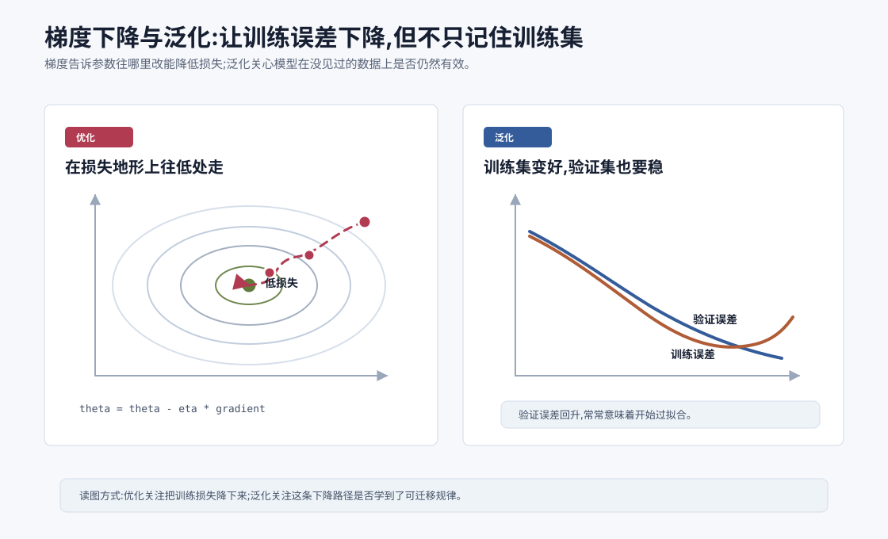
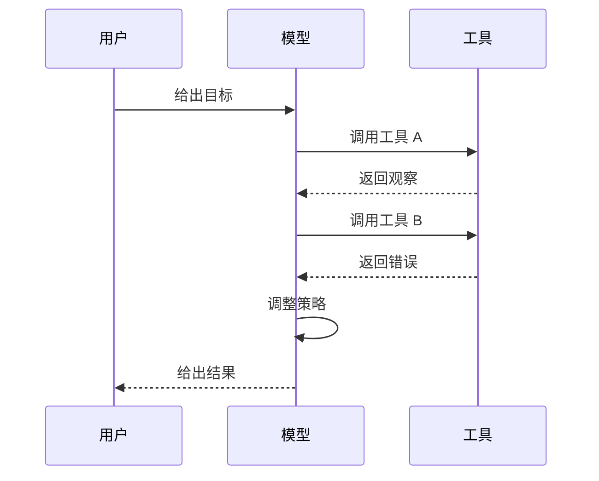

# 梯度下降与泛化 `[进阶]`

上一章讲了交叉熵损失。损失函数告诉模型:这次预测错了多少。

但仅仅知道错了还不够。模型还需要知道:

**哪些参数应该改?往哪个方向改?改多少?**

这就是梯度下降要解决的问题。

如果把训练想象成寻找一片山谷的最低点,损失就是海拔,参数就是你的位置,梯度告诉你坡度最陡的上升方向。梯度下降做的事情很朴素:往梯度的反方向走一点,让损失下降。

本章会讲两条线。

第一条是优化:模型如何通过梯度下降降低训练损失。

第二条是泛化:为什么训练损失低不等于模型真的学会了规律。

这两条线对 Agent 工程也很重要。你看到模型在某类任务上表现好,要问它是真的学到了可迁移能力,还是只在训练分布和评测套路上表现好。你做微调或评估时,也要区分“训练集变好”和“真实用户场景变好”。

## 参数是什么

神经网络里有大量可学习数字,这些数字叫参数。

最常见的是矩阵和偏置:

$$
y = Wx + b
$$

这里 $W$ 和 $b$ 就是参数。

在 LLM 中,参数包括:

- Embedding 矩阵。
- Attention 中的 $W_Q$、$W_K$、$W_V$、$W_O$。
- FFN 中的多组线性层矩阵。
- LayerNorm 或 RMSNorm 的缩放参数。
- 输出投影矩阵。

一个几十亿参数的模型,就是有几十亿个需要训练出的数字。训练的核心,就是找到一组参数,让模型在大量样本上产生较低损失。

## 损失函数像一个地形

假设模型只有两个参数 $w_1$ 和 $w_2$。损失函数可以写成:

$$
L(w_1,w_2)
$$

你可以把它想象成一张地形图。横轴是 $w_1$,纵轴是 $w_2$,高度是损失 $L$。训练就是在这张地形图上找更低的位置。

真实神经网络有数十亿参数,我们无法画出这样的地形,但直觉仍然成立:每一组参数都对应一个损失值。

训练开始时,参数通常是随机初始化或从已有模型继承而来。模型输出很差,损失很高。训练不断更新参数,希望损失下降。

## 梯度是什么

梯度可以理解为“损失对参数的敏感程度”。

如果只有一个参数 $w$,损失是 $L(w)$,导数是:

$$
\frac{dL}{dw}
$$

它表示:当 $w$ 稍微变大一点,损失会怎么变化。

如果导数为正,说明 $w$ 增大时损失上升;要降低损失,应该让 $w$ 变小。

如果导数为负,说明 $w$ 增大时损失下降;要降低损失,应该让 $w$ 变大。

多个参数时,梯度是一组偏导数组成的向量:

$$
\nabla L(\theta) =
\left[
\frac{\partial L}{\partial \theta_1},
\frac{\partial L}{\partial \theta_2},
\ldots,
\frac{\partial L}{\partial \theta_n}
\right]
$$

这里 $\theta$ 表示所有参数的集合。

梯度指向损失上升最快的方向。梯度下降要往反方向走。

## 梯度下降公式

最基本的参数更新公式是:

$$
\theta \leftarrow \theta - \eta \nabla L(\theta)
$$

这里:

- $\theta$ 是参数。
- $L(\theta)$ 是损失。
- $\nabla L(\theta)$ 是梯度。
- $\eta$ 是学习率,英文是 learning rate。

这个公式可以直译成一句话:

> 参数往损失下降的方向移动一点。

学习率 $\eta$ 决定这“一点”有多大。

## 一个一维例子

假设损失函数是:

$$
L(w) = (w - 3)^2
$$

这个函数在 $w=3$ 时最小,损失为 0。

它的导数是:

$$
\frac{dL}{dw} = 2(w-3)
$$

如果当前 $w=0$,导数是:

$$
2(0-3) = -6
$$

设学习率 $\eta=0.1$,更新为:

$$
w \leftarrow 0 - 0.1\times(-6)=0.6
$$

参数从 0 走到 0.6,离最优点 3 更近。

下一步导数变成:

$$
2(0.6-3)=-4.8
$$

更新:

$$
w \leftarrow 0.6 - 0.1\times(-4.8)=1.08
$$

它会一步步靠近 3。

这就是梯度下降最朴素的样子。

## 学习率为什么重要

学习率太小,训练会非常慢。每一步都很谨慎,很久才走到低损失区域。

学习率太大,训练可能震荡甚至发散。你本来想往山谷走,结果一步跨过山谷,跳到另一边高坡上。

可以把学习率想成下山时的步幅:

- 步子太小,走得慢。
- 步子适中,稳定下降。
- 步子太大,可能摔出去。

实际训练大模型时,学习率调度非常重要。常见策略包括 warmup、cosine decay、linear decay 等。直觉是:训练初期先慢慢升高学习率,避免不稳定;中后期逐渐降低学习率,让模型细致收敛。

## Batch、Mini-batch 与随机梯度下降

如果每次更新都用全部训练数据计算梯度,那叫 batch gradient descent。大模型训练数据极大,每次看完整数据再更新一次不现实。

实际训练通常使用 mini-batch。

也就是每次取一小批样本,计算这批样本的平均损失和梯度,更新一次参数。

如果 batch size 是 1024,表示每次更新用 1024 个样本估计梯度。

这种做法叫随机梯度下降或其变体。它的梯度不是完整数据上的精确梯度,而是一个带噪声的估计。

这个噪声不一定是坏事。它有时能帮助模型跳出糟糕区域,也能带来一定正则化效果。但噪声太大也会让训练不稳定。

## Epoch、Step 和 Token

训练里经常看到几个词。

### Step

一次参数更新叫一个 step。

### Batch

一个 step 使用的一批样本叫 batch。

### Epoch

完整遍历训练集一次叫一个 epoch。

在大语言模型预训练中,由于数据量极大,有时更常按 token 数和 step 数描述训练,而不是按 epoch。

比如“训练了 2T tokens”,意思是模型在训练中处理了约 2 万亿个 token。

## 反向传播:高效计算梯度

梯度下降需要知道每个参数对损失的影响。一个大模型有几十亿参数,手算不可能。

反向传播就是高效计算梯度的算法。它基于链式法则,从损失函数开始,沿着计算图反向传播梯度。

一个简化前向过程是:

$$
x \rightarrow h_1 \rightarrow h_2 \rightarrow y \rightarrow L
$$

反向传播则从 $L$ 开始,依次计算:

$$
\frac{\partial L}{\partial y},
\frac{\partial L}{\partial h_2},
\frac{\partial L}{\partial h_1},
\frac{\partial L}{\partial x}
$$

并进一步得到每个参数的梯度。

你不需要现在掌握完整推导,但要知道:神经网络能训练起来,靠的就是损失函数可微、计算图可追踪、梯度能高效反传。

## 优化器:不只是最朴素的梯度下降

基础公式是:

$$
\theta \leftarrow \theta - \eta \nabla L(\theta)
$$

但真实训练常用更复杂的优化器,比如 SGD with momentum、Adam、AdamW。

### Momentum

Momentum 会积累过去梯度的方向,让更新像有惯性一样。它可以减少震荡,加快沿稳定方向的前进。

### Adam

Adam 会为每个参数维护梯度的一阶矩和二阶矩估计。直觉上,它会根据历史梯度自动调整不同参数的步幅。

### AdamW

AdamW 是训练大模型常见选择之一,它把 weight decay 的处理从 Adam 更新中解耦出来,通常更稳定。

本章不深入优化器细节,先记住:优化器决定模型如何使用梯度更新参数。梯度告诉方向,优化器决定走法。

## 局部最小值、鞍点和平坦区域

深度学习损失地形非常复杂。它不是一个简单碗形曲面。

可能出现:

- 局部最小值:附近都更高,但不一定是全局最低。
- 鞍点:某些方向像低点,另一些方向像高点。
- 平坦区域:梯度很小,训练进展缓慢。
- 陡峭峡谷:某些方向变化剧烈,容易震荡。

在超大模型中,单纯纠结“会不会卡在局部最小值”通常不是最核心的问题。更重要的是优化稳定性、学习率调度、数据质量、模型规模、归一化、初始化和分布式训练细节。

但地形直觉仍然有用:训练不是一次性算出答案,而是在复杂地形上逐步寻找更好的参数区域。

## 训练误差和验证误差

现在进入泛化。

训练误差是模型在训练数据上的错误。验证误差是模型在没参与训练的数据上的错误。

我们真正关心的是验证误差,甚至是未来真实用户数据上的误差。

如果训练误差下降,验证误差也下降,说明模型学到了一些可迁移规律。

如果训练误差持续下降,验证误差却开始上升,就可能发生了过拟合。

过拟合的意思是:模型把训练数据里的细节、噪声或偶然模式记得太死,没有学到真正可推广的规律。

## 一个过拟合例子

假设你训练一个垃圾邮件分类器。训练集中有很多垃圾邮件都包含某个奇怪短语“优惠火箭”。模型可能学到:出现这个短语就是垃圾邮件。

如果真实世界中垃圾邮件换了说法,模型就会失败。它不是学到了“垃圾邮件的本质”,而是记住了训练集里的偶然线索。

在 LLM 中,过拟合也可能表现为:

- 记住训练样本中的具体文本。
- 对某些评测模板特别熟悉。
- 在训练分布内表现好,换表达就变差。
- 对常见模式很强,对边界案例脆弱。

## 欠拟合和过拟合

欠拟合是模型连训练集都学不好。原因可能是模型太小、训练不足、特征不够、学习率不合适、数据噪声太大。

过拟合是模型训练集表现很好,但验证集表现差。原因可能是模型容量太大、数据太少、训练太久、正则化不足、数据分布单一。

可以用一张表区分:

| 状态 | 训练误差 | 验证误差 | 直觉 |
| --- | --- | --- | --- |
| 欠拟合 | 高 | 高 | 规律没学会 |
| 合适 | 低 | 低 | 学到可迁移规律 |
| 过拟合 | 很低 | 高 | 记住训练细节 |

## 模型容量:能记住多少,能表达多少

模型容量指模型表达复杂函数的能力。参数越多、结构越强,容量通常越大。

容量太小,模型学不会复杂模式。容量很大,模型既可能学到丰富规律,也可能记住大量细节。

大模型有一个有趣现象:在足够数据和合适训练下,更大的模型不一定更容易过拟合,反而可能泛化更好。这和数据规模、优化过程、隐式正则化、模型结构都有关系。

但这不意味着“大就万能”。如果数据质量差、任务分布偏、评估集泄漏或对齐目标不合理,大模型也会学到错误模式。

## 正则化:防止模型太任性

正则化是一类减少过拟合的方法。它不只是让训练损失最低,还希望模型学到更简单、更稳健的规律。

常见正则化方法包括:

### Weight decay

Weight decay 会惩罚过大的参数,鼓励模型使用较小权重。

直觉是:不要让某些参数变得过于极端,避免模型用很尖锐的方式记住训练集。

### Dropout

Dropout 在训练时随机丢掉一部分神经元输出,迫使模型不要过度依赖某几个路径。

现代大模型预训练中 dropout 使用方式会因架构和规模不同而变化,但它是理解正则化的经典例子。

### Data augmentation

数据增强通过变换训练样本增加多样性。在视觉任务中很常见,比如裁剪、翻转、颜色扰动。语言任务中也可以通过改写、噪声、不同模板等方式增强。

### Early stopping

当验证误差不再下降时停止训练,避免继续过拟合训练集。

## 数据质量比很多人想象得更重要

模型学到什么,取决于数据中有什么。

如果数据充满重复、错误、偏见、低质量样本,模型会吸收这些模式。如果训练数据和真实应用场景差距很大,模型部署后表现会不稳定。

对 LLM 来说,数据质量影响非常深:

- 事实知识来自训练语料和后续检索。
- 语言风格来自文本分布。
- 代码能力来自代码语料质量。
- 指令遵守来自 SFT 数据。
- 安全边界来自对齐和安全训练数据。
- Agent 工具调用能力来自工具调用轨迹和格式样本。

很多时候,模型问题不是“梯度下降没学会”,而是数据给了错误信号。

## 泛化不是只看一个测试集

验证集和测试集也只是有限样本。一个模型在某个 benchmark 上表现好,不代表真实场景一定好。

原因包括:

- 测试集可能和训练数据相似。
- 评测题可能泄漏到训练语料。
- 指标可能不能覆盖真实需求。
- 用户输入比评测题更混乱。
- 工具环境和业务约束在评测中不存在。

Agent 系统尤其如此。一个 Agent 在演示任务中表现惊艳,不代表它能稳定处理真实长尾情况。真实用户会给出模糊目标、错误文件、冲突约束、过期资料和高风险动作。

泛化评估必须尽量接近实际任务分布。

## 分布内和分布外

训练数据来自某个分布。模型在类似分布上的表现,叫分布内表现。遇到明显不同的数据,叫分布外。

比如一个模型主要在英文客服数据上训练,拿去处理中文法律合同,就是分布外。

一个代码 Agent 主要在小型 Python 项目上评估,拿去改大型多语言仓库,也可能是分布外。

分布外问题常常导致模型自信但错误。它看起来仍然能生成流畅答案,但内部规律已经不适配当前场景。

工程应对方式包括:

- 检测不确定性。
- 引入检索和工具校验。
- 构造更贴近真实场景的评估集。
- 对关键领域做微调或适配。
- 在高风险动作前加入人类确认。

## 训练、验证、测试的基本划分

通常会把数据分成三部分:

| 数据集 | 用途 |
| --- | --- |
| 训练集 | 用来更新参数 |
| 验证集 | 用来调参、选择模型、观察过拟合 |
| 测试集 | 最后评估泛化表现 |

关键原则是:测试集不能参与训练和调参。否则测试结果会过于乐观。

在 LLM 应用中,也可以类似划分:

- Prompt 开发集:用来调 Prompt。
- 回归评估集:用来防止改坏。
- 保留测试集:只在关键版本评估。
- 线上日志样本:用来发现真实长尾问题。

这就是把机器学习的泛化思想迁移到 Agent 工程。

## 微调中的泛化风险

很多人会想:模型表现不好,是不是微调一下就行?

微调确实能让模型适应特定任务,但也有泛化风险。

如果微调数据太少、太窄或质量不高,模型可能学到表面格式,甚至损害原有能力。

比如你用少量客服样本微调模型,它可能学会固定话术,但遇到复杂问题反而不如原模型。你用错误格式的工具调用样本微调 Agent,它可能在真实工具 schema 上更容易出错。

微调时要关注:

- 数据是否覆盖真实任务分布。
- 是否有独立验证集。
- 是否损害通用能力。
- 是否只是让模型记住答案。
- 是否有足够的失败案例和边界案例。

## 为什么大模型会有涌现式体验

从优化角度看,训练只是不断预测下一个 token,降低交叉熵。为什么最后会出现翻译、代码、推理、总结、工具调用等能力?

一个重要原因是:为了在海量文本上降低损失,模型必须学习很多潜在结构。

要预测代码,它需要学语法、变量作用域、API 模式。要预测数学推导,它需要学符号关系。要预测问答文本,它需要学问题和答案之间的对应。要预测教程,它需要学解释结构。

随着数据、模型容量和训练计算扩大,这些能力会以可迁移的形式出现在模型中。

但注意,这不是神秘魔法。它仍然来自训练目标、数据分布、模型结构和优化过程的共同作用。

## 梯度下降和“理解”的关系

模型没有像人一样的主观理解。它通过梯度下降调整参数,让自己更擅长预测数据中的模式。

但这不意味着模型只是机械记忆。一个足够大的模型在足够多样的数据上训练,可能学到非常抽象的表示和规律。它能在新任务上组合这些规律,表现出我们称为“理解”的行为。

工程上更实用的说法是:不要争论模型是否“真正理解”,而要评估它在目标分布上的可靠性、可控性和失败模式。

## LLM 训练里的三个层次

大语言模型通常经历多个训练或适配阶段。

### 预训练

目标主要是下一个 token 预测。模型学习语言、知识、代码和世界模式。

### 监督微调 SFT

用指令-回答数据训练模型,让它更像助手,更会按人类任务格式回答。

### 偏好对齐

用人类偏好或偏好模型引导输出更有帮助、更安全、更符合期望。常见方法包括 RLHF、DPO。

每个阶段都有自己的损失或优化目标。模型最终行为是这些训练信号叠加后的结果。

所以当模型表现不理想时,可能是预训练知识不足,也可能是 SFT 格式问题,也可能是对齐策略过强或过弱,还可能是应用上下文设计有问题。

## Agent 训练和评估的特殊性

Agent 不只是生成一句答案,它要做多步决策。训练和评估会更复杂。

一个 Agent 轨迹可能包含:

这类任务的好坏不只取决于最终答案,还取决于:

- 工具是否选对。
- 参数是否正确。
- 是否浪费调用。
- 是否处理错误。
- 是否遵守权限。
- 是否在关键节点请求确认。
- 最终结果是否可验证。

所以 Agent 的泛化不只是“回答文本泛化”,还包括“行动策略泛化”。

## 过拟合到评测套路

大模型和 Agent 都可能过拟合到评测。

如果一个 benchmark 很流行,类似题目可能出现在训练数据中。模型可能不是真正解决问题,而是见过类似模式。

Agent 评测也可能有套路。比如固定的网页环境、固定的文件结构、固定的错误类型。系统在这些任务上表现好,换到真实项目就不稳。

因此评估要不断更新,并包含真实失败样本。好的评估集不是一次写完,而是随着系统暴露问题持续迭代。

## 泛化和安全

安全也是泛化问题的一部分。

模型可能在常见安全测试中表现良好,但面对新型 prompt injection、组合式攻击、跨工具数据泄露时失败。

一个 Agent 如果只在干净输入上测试过,不代表它能处理恶意网页、污染文档或带诱导的工具返回。

所以安全评估需要覆盖分布外和对抗样本。后面讲 Prompt Injection 时,我们会把这个问题展开。

## 实用工程判断

当你训练、微调或评估一个模型/Agent 时,可以问这些问题:

1. 训练损失下降了吗?
2. 验证集也变好了吗?
3. 验证集是否接近真实任务分布?
4. 是否存在数据泄漏?
5. 是否覆盖失败样本和边界案例?
6. 模型是否只是学会了格式,而不是能力?
7. 高风险场景是否单独评估?
8. 线上反馈是否能回流到评估集?

这些问题比单看一个分数更有用。

## 常见误解

### 误解一:训练损失越低越好

训练损失低是必要信号,但不是最终目标。如果验证误差上升,可能已经过拟合。

### 误解二:梯度下降一定能找到全局最优

深度网络损失地形复杂,通常不能保证全局最优。实践中更关心是否找到泛化好的参数区域。

### 误解三:模型越大越不会过拟合

大模型在大数据上可能泛化很好,但如果数据差、任务窄或微调不当,仍然会过拟合或学到坏模式。

### 误解四:测试集分数高就能上线

测试集只是有限样本。上线还需要观测、回归测试、失败处理、权限控制和安全评估。

### 误解五:微调一定能修好问题

微调可能改善特定行为,也可能引入退化。很多问题更适合用 Prompt、RAG、工具校验或工作流约束解决。

## 本章小结

梯度下降用损失函数的梯度指导参数更新,让模型在训练数据上逐步降低错误。学习率、batch、优化器、反向传播和训练稳定性共同决定优化过程是否顺利。但训练误差下降不代表模型真正学会了可迁移规律。泛化要求模型在没见过的数据上仍然表现好,这依赖数据质量、模型容量、正则化、评估设计和真实任务分布。

下一章会进入神经网络基础,从神经元、激活函数和前馈网络开始。理解了向量、矩阵、概率、损失和梯度之后,神经网络就不再是黑盒,而是一组可学习变换通过损失信号不断调整的系统。
