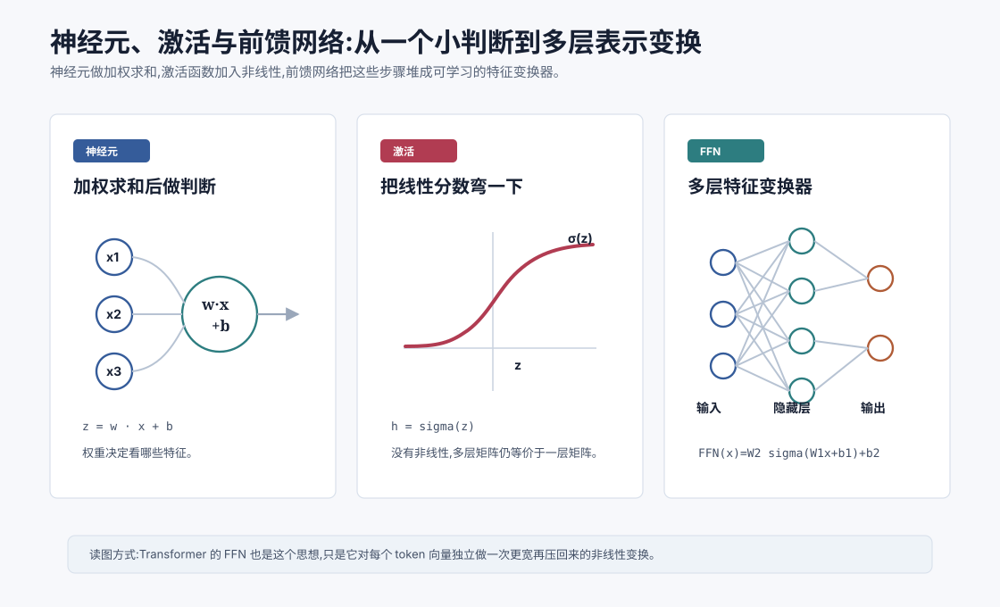
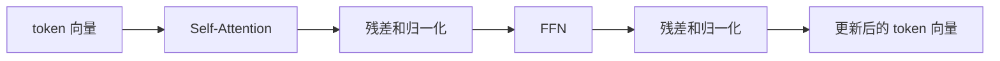

# 神经元、激活与前馈网络 `[主线]`

前面三章已经把几块地基铺好:向量表示对象,矩阵变换表示,概率表达模型的不确定性,损失函数衡量预测错误,梯度下降告诉参数应该往哪里改。

这一章开始把这些东西组装成神经网络。

如果只看名字,“神经元”“神经网络”容易让人联想到大脑。但在工程上,你可以先把它看成一种可学习函数:输入一串数字,经过一层层变换,输出另一串数字。

LLM 当然比本章里的小网络复杂得多,但核心零件并不神秘:

1. **神经元**:对输入做加权求和,再加一个偏置。
2. **激活函数**:给线性结果加入非线性。
3. **前馈网络**:把多组线性变换和激活函数串起来。



读完本章,你应该能解释:

- 单个神经元到底在算什么。
- 权重和偏置分别起什么作用。
- 为什么只有矩阵乘法还不够。
- 激活函数如何让网络表达复杂模式。
- 前馈网络为什么是 Transformer 的重要组成部分。
- FFN 和 Attention 在 LLM 里大致如何分工。

## 从一个小判断开始

假设我们要做一个非常小的判断:一条消息是不是垃圾邮件。

我们可以先把消息转成几个数字特征:

| 特征 | 含义 | 示例值 |
| --- | --- | --- |
| $x_1$ | 是否包含促销词 | 1 |
| $x_2$ | 是否包含可疑链接 | 1 |
| $x_3$ | 发件人是否可信 | 0 |
| $x_4$ | 文本是否像正常对话 | 0.3 |

这些特征组成一个向量:

$$
x = [x_1, x_2, x_3, x_4]
$$

模型要做的第一件事,就是判断这些特征各有多重要。

如果“可疑链接”特别重要,对应权重就应该大一些。如果“是否包含促销词”有用但不绝对,权重可以适中。如果“发件人可信”会降低垃圾邮件概率,它的权重甚至可以是负数。

这就是神经元的直觉:它不是平等看待所有输入,而是给不同输入不同权重。

## 单个神经元在算什么

一个最基本的神经元可以写成:

$$
z = w_1x_1 + w_2x_2 + \\cdots + w_nx_n + b
$$

也可以用向量点积写成:

$$
z = w \cdot x + b
$$

这里:

- $x$ 是输入向量。
- $w$ 是权重向量。
- $b$ 是偏置。
- $z$ 是神经元的原始输出,也常叫 pre-activation。

权重 $w_i$ 表示第 $i$ 个输入特征对结果的影响方向和强度。

- $w_i > 0$:这个特征越大,$z$ 越大。
- $w_i < 0$:这个特征越大,$z$ 越小。
- $w_i \approx 0$:这个特征影响很弱。

偏置 $b$ 则像一个基础倾向。即使输入都是 0,神经元也可以有一个默认输出。

## 一个手算例子

假设输入是:

$$
x = [1, 1, 0, 0.3]
$$

权重是:

$$
w = [0.8, 1.5, -1.0, -0.4]
$$

偏置是:

$$
b = -0.6
$$

那么:

$$
z = 0.8 \times 1 + 1.5 \times 1 + (-1.0) \times 0 + (-0.4) \times 0.3 - 0.6
$$

$$
z = 0.8 + 1.5 + 0 - 0.12 - 0.6 = 1.58
$$

这个 $z$ 可以理解为“垃圾邮件倾向分数”。分数越高,越像垃圾邮件。

如果只是二分类,我们可以再用 Sigmoid 把它变成 0 到 1 之间的概率。多分类时,可以用 Softmax。上一章已经讲过这类“分数变概率”的机制。

## 神经元本质上是线性分类器

单个神经元做的是线性计算:

$$
z = w \cdot x + b
$$

它会在输入空间里画出一个分界面。

二维时,这个分界面是一条线。三维时,是一张平面。更高维时,叫超平面。

如果数据刚好可以被一条线分开,单个神经元就够了。但真实任务通常复杂得多。

比如下面这种情况:

- 有些垃圾邮件包含促销词,有些不包含。
- 有些正常邮件也包含链接。
- 某些词只有和某个发件人、某种时间、某种上下文组合在一起才可疑。
- 同一个短语在不同语言、领域、用户意图下含义不同。

这类关系不是一条简单直线能稳定表达的。神经网络之所以需要多层和非线性,就是为了表达这种复杂组合。

## 从一个神经元到一层神经元

一个神经元只能输出一个数字。如果我们想同时提取多个特征,可以并排放多个神经元。

比如第一层有 3 个神经元:

$$
h_1 = w_1 \cdot x + b_1
$$

$$
h_2 = w_2 \cdot x + b_2
$$

$$
h_3 = w_3 \cdot x + b_3
$$

它们可以写成矩阵形式:

$$
h = Wx + b
$$

这里 $W$ 的每一行可以看成一个神经元的权重。矩阵乘法一次性算出多个神经元输出。

这就是为什么神经网络里到处都是矩阵。矩阵不是抽象装饰,而是一整层神经元的紧凑写法。

## 只有线性层会发生什么

假设我们堆两层线性层:

$$
h = W_1x + b_1
$$

$$
y = W_2h + b_2
$$

把第一式代入第二式:

$$
y = W_2(W_1x + b_1) + b_2
$$

$$
y = (W_2W_1)x + (W_2b_1 + b_2)
$$

这仍然是一个线性变换加偏置。

也就是说,如果没有激活函数,你堆再多线性层,最终仍然等价于一层线性层。层数没有真正增加表达能力。

这就是非线性的意义:它让多层网络不再能被压缩成一个矩阵。

## 激活函数:把直线弯起来

激活函数会作用在神经元的线性输出上:

$$
h = \sigma(Wx + b)
$$

这里 $\sigma$ 是激活函数。

它的作用可以粗略理解为:把原本只能画直线的模型,变成能组合出弯曲边界的模型。

如果线性层像“加权打分”,激活函数就像“根据分数做非线性响应”。有些输入被压低,有些输入被放大,有些输入通过,有些输入被截断。

这种弯折很关键。复杂函数往往可以看成许多简单弯折的组合。神经网络通过大量神经元和激活函数,学出适合任务的组合方式。

## 常见激活函数

历史上常见的激活函数有 Sigmoid、Tanh、ReLU、GELU、SwiGLU 等。

### Sigmoid

Sigmoid 会把任意实数压到 0 到 1 之间:

$$
\sigma(z)=\frac{1}{1+e^{-z}}
$$

它适合表示概率或开关式响应。但在深层网络中,Sigmoid 容易出现梯度变小的问题,训练会变慢。

### Tanh

Tanh 会把输出压到 -1 到 1 之间:

$$
\tanh(z)=\frac{e^z-e^{-z}}{e^z+e^{-z}}
$$

它比 Sigmoid 更居中,早期循环神经网络中很常见。

### ReLU

ReLU 非常简单:

$$
\text{ReLU}(z)=\max(0,z)
$$

如果输入小于 0,输出 0;如果输入大于 0,原样通过。

ReLU 的优点是计算简单、梯度传播较好,曾经是深度学习里非常主流的激活函数。

### GELU

GELU 常见于 Transformer 类模型。它不像 ReLU 那样硬截断,而是更平滑地决定哪些值通过。

直觉上,GELU 会让较大的正值更容易通过,较小或负的值被压低,但过渡更柔和。

### SwiGLU

很多现代 LLM 使用 SwiGLU 或类似门控激活。它不仅做非线性,还引入一种“门控”机制:一部分向量决定另一部分向量该通过多少。

后面讲 Transformer 架构演进时,会专门讲 RMSNorm、SwiGLU 等改良。这里先记住:激活函数不是细枝末节,它会影响模型表达能力、训练稳定性和推理效率。

## 前馈网络是什么

前馈网络,英文是 Feedforward Neural Network,常缩写为 FFN 或 MLP。

“前馈”的意思是信息从输入层流向输出层,中间没有循环。最常见结构是:

$$
h = \sigma(W_1x + b_1)
$$

$$
y = W_2h + b_2
$$

合在一起就是:

$$
\text{FFN}(x)=W_2\sigma(W_1x+b_1)+b_2
$$

这看起来只是两层矩阵加一个激活函数,但它已经能表达很多非线性关系。

如果隐藏层更宽,网络可以同时学习更多中间特征。如果层数更深,网络可以逐层组合更抽象的特征。

## 隐藏层在学什么

隐藏层不是人手写的规则表。它学到的是对任务有用的中间表示。

在垃圾邮件任务里,某些隐藏神经元可能对“促销词 + 可疑链接”组合敏感。另一些可能对“可信发件人 + 正常语气”敏感。

在图像任务里,浅层可能学边缘和颜色,中层可能学纹理和局部形状,深层可能学物体部件。

在语言模型里,隐藏表示更复杂。某些方向可能和语法角色、实体类型、代码结构、指代关系、语气、格式位置有关。

不过要小心:我们不能轻易说“第 2048 个神经元就是负责判断讽刺的”。真实模型多使用分布式表示,一个概念往往分散在很多维度和层中。

## 多层网络为什么能表达复杂函数

可以把多层网络想成一系列“重表示”。

第一层把原始输入变成初级特征。第二层再把初级特征组合成更复杂特征。后面的层继续组合。

形式上:

$$
h_1 = \sigma(W_1x+b_1)
$$

$$
h_2 = \sigma(W_2h_1+b_2)
$$

$$
h_3 = \sigma(W_3h_2+b_3)
$$

每一层都不是简单“多算一次”,而是在新的表示空间里重新组织信息。

这和人类做判断有点像:你不会只看一个词就判断整段话意图,而是把词组合成短语,短语组合成句义,句义再结合上下文。神经网络虽然机制不同,但也通过层级组合从低级模式走向高级模式。

## 训练时参数如何学出来

前馈网络里的 $W_1$、$b_1$、$W_2$、$b_2$ 都是参数。

训练时流程大致是:


前向计算得到预测。损失函数衡量预测和真实目标的差距。反向传播计算每个参数对损失的影响。优化器根据梯度更新参数。

这正好接上上一章:

$$
\theta \leftarrow \theta - \eta \nabla L(\theta)
$$

神经网络不是靠人手设置规则,而是靠大量样本和损失信号把这些权重调出来。

## FFN 在 Transformer 中的位置

Transformer 的每一层通常包含两个重要子模块:

1. Self-Attention。
2. Feedforward Network。

简化看,一层 Transformer 可以写成:



Attention 负责让不同 token 之间交换信息。比如“它”应该指代前面的哪个名词,某个函数调用应该参考哪个参数,一句话里的主谓宾如何相关。

FFN 则对每个 token 位置独立做非线性变换。它不直接混合不同位置的信息,而是在每个位置内部处理已经聚合来的信息。

一个粗略分工是:

- Attention:在 token 之间搬运和混合信息。
- FFN:在每个 token 的向量内部加工和提炼特征。

这个分工不是绝对的,但很有助于建立直觉。

## Transformer 里的 FFN 长什么样

经典 Transformer 的 FFN 通常是两层线性变换加激活函数:

$$
\text{FFN}(x)=W_2\sigma(W_1x+b_1)+b_2
$$

它有一个常见特点:中间维度会先变宽,再压回原来的 hidden size。

比如 token 向量维度是 4096,FFN 的中间层可能扩展到 11008 或 16384,然后再投影回 4096。

直觉上,这像是先把信息展开到更大的工作空间,做一次非线性加工,再压回模型主干的表示维度。

这也是为什么 FFN 在 Transformer 参数量和计算量中占很大比例。很多人初学时会把注意力全放在 Attention 上,但实际上 FFN 也是大模型能力的重要来源。

## 为什么 FFN 对每个位置独立

假设输入是一串 token 向量:

$$
X \in \mathbb{R}^{T \times d}
$$

其中 $T$ 是序列长度,$d$ 是 hidden size。

FFN 会对每个位置的向量应用同一组参数:

$$
\text{FFN}(X_t), \quad t=1,2,\ldots,T
$$

也就是说,第 1 个 token、第 2 个 token、第 100 个 token 都用同一个 FFN 处理,但输入向量不同,输出也不同。

这种设计有两个好处。

第一,参数共享。模型不需要为每个位置都学一套独立参数。

第二,位置无关的特征加工。无论某个语法结构出现在句首还是句尾,FFN 都可以用相同机制处理。

至于不同位置之间的信息交换,则主要交给 Attention。

## FFN 和“知识”有什么关系

一个常见说法是:Transformer 的 FFN 里存了很多知识。

这句话有一定道理,但要谨慎理解。

FFN 的参数量很大,它确实可能承载大量模式:事实关联、语法变换、代码习惯、格式模板、概念组合等。某些研究也发现,FFN 中的特定方向或神经元可能和某些知识或模式有关。

但知识不是像数据库记录那样一条条存在某个固定位置。它更多是分布在大量参数和激活模式中。模型回答“巴黎是法国首都”,不是从某个表里查到一行,而是上下文向量经过许多层 Attention 和 FFN 变换后,让“巴黎”的输出概率变高。

这也解释了为什么编辑模型知识很难。你不是改一行配置,而是在影响一个巨大函数的局部行为。

## 宽度、深度和参数量

前馈网络有几个重要规模概念。

### 宽度

宽度通常指一层有多少隐藏单元,或者 hidden size 有多大。更宽的层可以同时表达更多特征。

### 深度

深度指有多少层。更深的网络可以做更多轮组合和抽象。

### 参数量

线性层的参数量大致是输入维度乘输出维度。

如果输入维度是 $d_{in}$,输出维度是 $d_{out}$,权重矩阵参数量就是:

$$
d_{out} \times d_{in}
$$

再加上偏置:

$$
d_{out}
$$

在大模型里,这些矩阵非常大。参数量、显存、计算量和延迟都和它们密切相关。

## 为什么神经网络需要归一化和残差

本章重点是神经元和 FFN,但提前提一下后面会反复出现的两个结构:归一化和残差连接。

深层网络很强,但也难训练。层数一多,激活值尺度可能不稳定,梯度也可能变得不好传播。

归一化方法,比如 LayerNorm 和 RMSNorm,会帮助控制向量尺度,让训练更稳定。

残差连接会让一层的输入可以绕过子模块直接加到输出上。直觉上,它给网络一条“保留原信息”的通道,让深层模型更容易优化。

后面讲 Transformer 完整结构时,会详细展开这两者。现在先记住:现代大模型不是简单地把 FFN 堆很多层,还需要一整套稳定训练的结构设计。

## 一个最小伪代码

下面是一个两层 FFN 的伪代码。它不绑定具体框架,只是表达数据流。

```text
function FFN(x):
    h = linear(x, W1, b1)
    h = gelu(h)
    y = linear(h, W2, b2)
    return y
```

如果输入 `x` 是一个 token 向量,输出 `y` 就是加工后的 token 向量。

如果输入是一整段 token 序列,FFN 会对每个 token 位置应用同样的操作。

## 和 Agent 有什么关系

Agent 工程看起来主要是工具、记忆、规划和工作流,为什么还要理解神经元和 FFN?

第一,它帮助你理解模型能力来自哪里。模型不是查表,而是通过层层向量变换产生输出概率。很多“会推理”“会写代码”“会调用工具”的表现,都来自这些参数化变换学到的模式。

第二,它帮助你理解模型错误。模型可能在某些输入分布上激活了错误模式,导致看似合理但事实错误的输出。这不是简单的 if-else bug,而是高维函数在某个区域的泛化失败。

第三,它帮助你理解微调。微调就是继续调整这些权重,让模型在特定数据上改变行为。数据太窄或信号错误,就可能把某些能力调坏。

第四,它帮助你理解推理成本。FFN 大矩阵计算占据大量算力。模型越宽、层数越深,每生成一个 token 需要做的矩阵乘法越多。

所以,即使你不亲自训练模型,这些直觉也会影响你如何选择模型、设计评估、控制成本和判断失败原因。

## 常见误解

### 误解一:神经元真的像生物神经元

只是名字借用了生物直觉。人工神经元本质上是加权求和、偏置和激活函数组成的数学模块。

### 误解二:层数越多一定越好

更深的网络可能更强,但也更难训练、更贵,并且需要足够数据和合适结构。盲目加深不一定改善效果。

### 误解三:激活函数只是小细节

激活函数决定网络如何引入非线性,会影响表达能力、梯度传播和训练稳定性。现代 LLM 对激活函数选择非常讲究。

### 误解四:Attention 才是 Transformer 的全部

Attention 很关键,但 FFN 也占据大量参数和计算,并承担重要的特征加工职责。忽略 FFN 会误解 Transformer 的能力来源。

### 误解五:神经网络学到的是清晰规则表

通常不是。它学到的是分布在参数和向量空间中的模式。某些模式可以被解释,但整体不是人类可直接阅读的规则集合。

## 本章小结

神经元用权重和偏置对输入做加权求和,激活函数为这个线性结果加入非线性,前馈网络则把多组线性变换和激活函数串起来,形成可学习的特征变换器。在 Transformer 中,FFN 与 Attention 共同构成核心层:Attention 负责 token 之间的信息交互,FFN 负责每个 token 向量内部的非线性加工。

下一章会讲表示学习与嵌入。现在我们已经知道神经网络如何处理向量,接下来要看一个更关键的问题:这些向量最开始是怎么学出“意义”的,为什么 token、句子和文档可以被放进一个可计算的语义空间。
