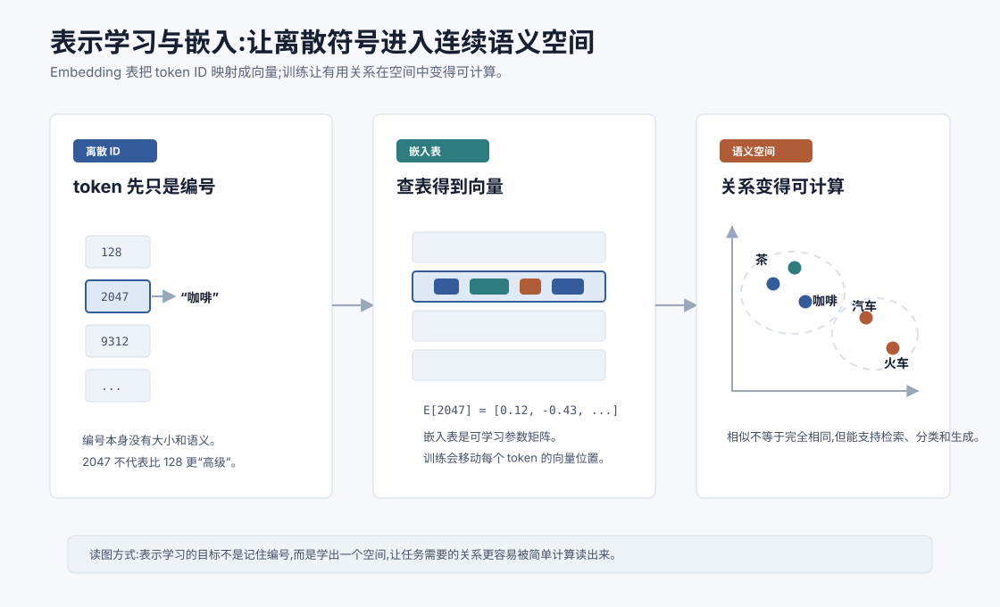
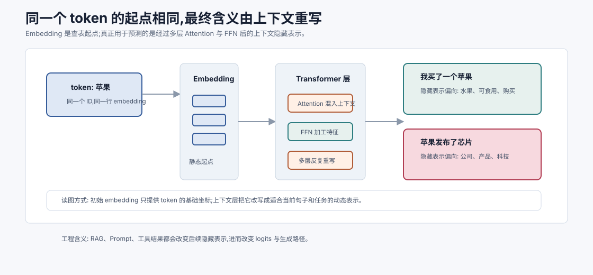
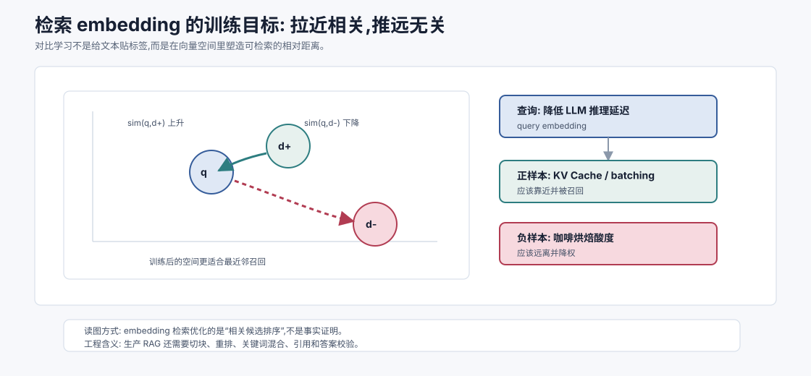
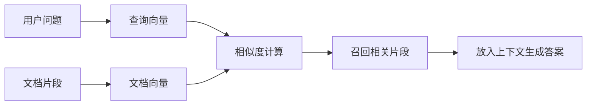

# 表示学习与嵌入 `[进阶]`

上一章讲了神经网络如何处理向量:线性层变换向量,激活函数引入非线性,FFN 在每个 token 的向量内部加工特征。

但还有一个更基础的问题没有回答:

**这些向量最开始从哪里来?**

文本里的“猫”“函数”“巴黎”“用户要退款”本来不是数字。它们如何变成模型可以计算的向量?为什么这些向量还能承载意义?

这就是表示学习与嵌入要解决的问题。



本章会讲:

- 为什么 token ID 本身没有语义。
- embedding 表如何把离散符号映射成连续向量。
- 表示学习为什么能让“相似”变得可计算。
- 上下文表示和静态 embedding 有什么区别。
- 表示如何服务分类、检索、生成和 Agent 决策。

## 表示是什么

表示,英文是 representation。它指的是模型内部用来描述一个对象的数字形式。

对象可以是:

- 一个 token。
- 一句话。
- 一段文档。
- 一张图片。
- 一个用户画像。
- 一个工具调用结果。
- 一个 Agent 当前任务状态。

这些对象在原始形态上差异很大,但模型最终需要把它们变成可计算的数字。这个数字表示应该保留对任务有用的信息。

比如一个好的文本表示,应该让模型更容易判断:

- 两段话是否语义相近。
- 一个问题和哪段文档相关。
- 一句话表达的是投诉、咨询还是购买意图。
- 当前 token 更可能接什么下一个 token。

表示学习的核心目标就是: **让模型自己学出适合任务的表示。**

## 为什么不能直接用 token ID

文本进入模型前会先被 tokenizer 切成 token,每个 token 对应一个 ID。

比如:

| token | ID |
| --- | --- |
| 猫 | 128 |
| 狗 | 391 |
| 咖啡 | 2047 |
| 汽车 | 9312 |

这些 ID 只是编号。编号本身没有语义。

ID 为 2047 的“咖啡”并不比 ID 为 128 的“猫”大 1919 倍。ID 之间的差值也没有意义。“狗”的 ID 比“猫”大,不代表狗比猫更复杂。

如果直接把 ID 当数字输入模型,模型会误以为这些编号之间存在大小、距离和顺序关系。这会引入错误假设。

所以需要一个映射:把离散 ID 变成连续向量。

这个映射就是 embedding。

## Embedding 表:一个可学习查表

最基本的 token embedding 可以理解成一张大表。

如果词表大小是 $V$,向量维度是 $d$,那么 embedding 表是一个矩阵:

$$
E \in \mathbb{R}^{V \times d}
$$

每一行对应一个 token 的向量。

如果 token ID 是 $i$,它的 embedding 就是:

$$
x_i = E[i]
$$

比如:

```text
token_id = 2047
x = embedding_table[2047]
```

这里的 `x` 可能是一个 4096 维向量。它会作为这个 token 在模型内部的初始表示。

关键点是:embedding 表不是人工设计的词典,而是可学习参数。训练开始时,这些向量可能是随机初始化的。随着模型不断预测下一个 token、计算损失、反向传播,embedding 表里的向量会被更新。

## One-hot 到 embedding

另一种理解 embedding 的方式是从 one-hot 向量开始。

如果词表有 5 个 token,“咖啡”的 ID 是 2,它可以表示成:

$$
[0,0,1,0,0]
$$

这个向量很长、很稀疏,只有一个位置是 1。真实词表可能有几十万 token,one-hot 向量会非常大。

embedding 矩阵可以把 one-hot 向量映射成稠密向量:

$$
x = E^T o
$$

其中 $o$ 是 one-hot 向量。由于 $o$ 只有一个位置是 1,这个乘法本质上就是取出 embedding 表中对应的一行。

所以工程实现通常直接查表,不真的构造巨大的 one-hot 向量。

## 为什么叫“嵌入”

“嵌入”这个词的直觉是:把离散对象放进一个连续空间。

原本 token 只是一个个孤立编号。经过 embedding 后,每个 token 都变成高维空间里的一个点。

一旦变成空间里的点,就可以计算:

- 距离。
- 角度。
- 点积。
- 相似度。
- 聚类。
- 最近邻。

这非常重要。机器学习最擅长处理连续空间里的模式。embedding 就像给离散符号建立了一个可计算的地理坐标系。

## 语义相似如何出现

embedding 不是天生知道“猫”和“狗”相似。它们之所以可能靠近,来自训练信号。

语言里有一个经典直觉:

> 经常出现在相似上下文中的词,往往有相似意义。

比如“猫”和“狗”都可能出现在这些上下文里:

```text
我养了一只 ___
___ 喜欢睡觉
带 ___ 去看兽医
```

而“汽车”会出现在另一类上下文里:

```text
发动 ___
___ 需要加油
这辆 ___ 很省电
```

训练语言模型时,如果两个 token 在许多上下文中承担相似角色,模型会得到相似的更新信号。久而久之,它们的向量可能在某些方向上变得接近。

这就是语义空间的来源之一:不是人把语义规则写进去,而是模型通过预测任务从数据分布中学出来。

## 表示学习不是只学“词义”

embedding 学到的不只是词典意义。

一个 token 向量可能同时编码很多信息:

- 语义类别:动物、地点、动作、数字。
- 语法角色:名词、动词、标点、连接词。
- 使用场景:代码、口语、法律、医学。
- 情感倾向:积极、消极、中性。
- 格式功能:换行、缩进、列表符号。
- 统计习惯:常见搭配、上下文位置。

这些信息通常不是分布在某个单独维度里,而是分散在整个向量中。

这也是为什么 embedding 很难用人类语言完整解释。它是为模型计算服务的表示,不是为人类阅读设计的标签。

## 静态 embedding 和上下文表示

早期的词向量方法,比如 Word2Vec、GloVe,通常给每个词一个相对固定的向量。

这种表示很有用,但有一个明显问题:同一个词在不同上下文中可能含义不同。

比如“苹果”可以指水果,也可以指公司。

静态 embedding 只有一个“苹果”向量,很难同时表达这两种含义。

Transformer 的关键变化是:token 初始 embedding 进入模型后,会经过多层 Attention 和 FFN,变成上下文相关表示。

同一个 token 在不同句子里,最终表示会不同。

```text
我买了一个苹果。
苹果发布了新的芯片。
```

这两句里的“苹果”初始 token embedding 可能相同,但经过上下文混合后,隐藏向量会逐渐偏向不同含义。

所以在 LLM 中,我们要区分:

- **初始 token embedding**:查表得到的起点。
- **上下文隐藏表示**:经过 Transformer 层加工后的动态表示。

后者才是模型生成下一个 token 时真正使用的丰富语境表示。



这张图展示了一个关键分层:embedding 表只负责把离散 token 放到连续空间的起点,它不是模型最终“理解”的全部。真正决定当前语义的是后续层如何根据上下文改写这个起点。

以“苹果”为例,初始 embedding 可以携带水果、公司、常见搭配等混合先验。进入句子后,Attention 会把它和“买了”“发布”“芯片”等上下文 token 交互,FFN 会在当前位置内部加工这些线索。经过多层后,隐藏表示才会逐渐偏向“水果”或“公司”。

这解释了两个常见现象。

第一,上下文越明确,模型越容易消歧。你给出“苹果发布了 M 系列芯片”,模型更容易激活公司含义;你给出“削皮、切块、榨汁”,模型更容易激活水果含义。

第二,上下文噪声会污染表示。如果一段检索内容表面相关但事实错误,它同样会参与 Attention 和 FFN 的表示更新。模型不会天然知道哪段内容可信,除非系统通过来源、引用、权限边界和验证步骤把信号标清楚。

## 表示是逐层变化的

可以把 Transformer 看成不断更新 token 表示的机器。

初始时:

$$
x_t^{(0)} = \text{embedding}(token_t)
$$

经过第 1 层:

$$
x_t^{(1)} = \text{TransformerLayer}_1(x_t^{(0)})
$$

经过第 $L$ 层:

$$
x_t^{(L)} = \text{TransformerLayer}_L(x_t^{(L-1)})
$$

每一层都会让 token 表示吸收更多上下文信息。

浅层可能更关注局部词形、短语和语法。中层可能形成实体、关系和结构。深层可能更贴近当前任务和生成目标。

这不是严格分工,但作为直觉很有用:表示不是一次生成就固定,而是在层层计算中不断被重写。

## 句子和文档如何变成向量

token 有 embedding,那一句话或一段文档怎么变成一个向量?

常见方式包括:

### 取特殊 token 表示

某些模型会在文本前加入特殊 token,比如 `[CLS]`,训练它聚合整句信息。最后取这个 token 的隐藏向量作为句向量。

### 平均池化

把多个 token 的隐藏向量取平均:

$$
s = \frac{1}{T}\sum_{t=1}^{T}x_t
$$

这很简单,但在很多 embedding 模型里有效。

### 任务专用投影

模型可以通过额外的线性层或池化层,把 token 序列映射成固定维度向量。

### 直接训练文本 embedding 模型

很多检索用 embedding 模型会专门训练“文本到向量”的能力。它们的目标不是生成下一个 token,而是让语义相关的文本向量更接近。

这就是 RAG 中常用的文档向量和查询向量。

## 表示学习的训练信号

不同任务会塑造不同表示。

### 语言模型目标

下一个 token 预测会让模型学到有助于生成文本的表示。

如果某个表示能帮助预测后续 token,它就会被强化。

### 分类目标

情感分类、意图识别、垃圾邮件检测等任务会让表示更适合区分类别。

### 对比学习

对比学习会拉近相似样本,推远不相似样本。

比如在文本检索中,用户问题和正确文档片段应该靠近,和无关片段应该远离。

### 多模态对齐

图文模型会把图片和文本放到相关空间里。比如一张猫的图片和“猫坐在沙发上”这句话应该更接近。

同一个输入,在不同训练目标下可能学出不同表示。没有一种表示天然适合所有任务。

## 对比学习的直觉

对比学习特别适合理解 embedding 检索。

假设有一个查询:

```text
如何降低 LLM 推理延迟?
```

一个相关文档片段是:

```text
KV Cache、批处理和投机解码可以减少生成延迟。
```

一个无关片段是:

```text
咖啡豆烘焙程度会影响酸度和香气。
```

训练目标会推动:

$$
\text{sim}(q, d^+) > \text{sim}(q, d^-)
$$

其中 $d^+$ 是相关文档,$d^-$ 是无关文档。

长期训练后,模型会学到一个空间:问题和答案相关时靠近,不相关时远离。

这就是向量检索可以工作的原因。



对比学习的重点不是让模型记住“某个问题对应某个文档 ID”,而是让它学出一种可迁移的相似性度量。训练集中出现过“如何降低推理延迟”和“KV Cache 可以减少重复计算”的关联,模型就可能在新问题“怎么让生成更快”上也把相关优化文档拉近。

不过,这个空间学到的是“相关性”,不是“充分性”。一个片段可能和问题很相关,但只回答了其中一部分;另一个片段可能字面很像,但讲的是旧版本 API;还有些答案需要多个片段组合才能完整成立。

因此生产 RAG 通常不会只依赖一次最近邻搜索。更稳的流程会包括:

1. 用 embedding 召回语义相关候选。
2. 用关键词或结构化过滤保留精确实体、版本号、函数名。
3. 用 reranker 重新排序候选片段。
4. 把证据压缩成清晰上下文,保留引用。
5. 让生成结果回到证据中校验。

embedding 是检索系统的入口,不是事实系统的终点。

## Embedding 空间中的方向

很多时候,向量空间里的方向比单个坐标更重要。

一个方向可能和“更正式”、 “更像代码”、 “更接近金融领域”、 “更像地点实体”有关。

早期词向量里有一个著名直觉:

$$
\text{king} - \text{man} + \text{woman} \approx \text{queen}
$$

这个例子不应被过度神化,真实模型也不总是这么干净。但它表达了一个重要思想:向量空间可能把某些关系编码成方向和偏移。

在大模型里,这些关系更复杂、更高维,也更依赖上下文。

## 表示学习和泛化

好的表示能让下游任务更容易。

如果一个模型已经学到“合同违约条款”“付款期限”“保密义务”这些概念的表示,那么用少量样本做合同分类会更容易。

如果模型已经学到代码语法、函数调用、错误栈和测试断言的表示,那么它更容易帮助排查程序问题。

这就是预训练的价值:先在大规模数据上学通用表示,再通过 SFT、微调、RAG 或 Prompt 把这些表示用于具体任务。

从这个角度看,大模型不是每次从零学习任务。它是在已有表示空间里组合、激活和适配已有能力。

## 表示也会带来偏差

表示学习依赖数据。数据里的偏差、噪声和缺失也会进入表示。

如果训练语料中某些职业、地区、性别、文化被刻板描述,模型可能把这些关联学进向量空间。

如果某个领域数据很少,相关表示可能稀疏或不稳定。

如果数据里错误事实反复出现,模型可能把错误关联学得很牢。

所以 embedding 空间不是纯净的语义地图。它是训练数据、模型结构和目标函数共同塑造出的结果。工程上需要评估、校验和必要的安全约束。

## RAG 中的 embedding

RAG 会把用户问题和文档片段都变成向量,再做相似度搜索。

简化流程是:



这里的核心假设是:语义相关的问题和文档片段在向量空间中更接近。

但要记住几个限制:

- 向量相似不等于事实正确。
- 召回片段可能相关但不完整。
- 相似度高的片段可能只是表面词汇接近。
- 文档切块方式会影响表示质量。
- embedding 模型是否适合领域非常重要。

所以 RAG 不是“有 embedding 就万事大吉”。它还需要切块、召回、重排、上下文组织、引用和评估。

## Agent 中的表示

Agent 系统中也到处都是表示。

用户目标可以变成表示。工具描述可以变成表示。历史记忆可以变成表示。任务状态也可以被压缩成表示。

这些表示会影响 Agent 的决策:

- 当前问题和哪段记忆最相关?
- 应该调用哪个工具?
- 工具返回是否和目标相关?
- 当前状态是否接近完成?
- 用户新请求是否和历史偏好冲突?

很多系统会用 embedding 做记忆检索。例如用户之前说过“我偏好 TypeScript 示例”,之后提出代码问题时,系统可以通过向量检索找回这条偏好。

但这里也有风险。相似记忆不一定该使用,过期记忆可能误导当前任务,隐私敏感记忆也不能随意注入上下文。

表示让检索成为可能,但策略决定如何安全使用检索结果。

## 表示和可解释性

表示学习越强,模型内部也越难解释。

我们可以计算某两个向量的相似度,可以可视化少量样本的聚类,可以找某些方向和概念的相关性。但这不等于完全理解模型。

原因包括:

- 维度很高,人无法直接观察。
- 概念是分布式编码的。
- 同一维度可能参与多个概念。
- 上下文会动态改变表示。
- 多层网络会不断重写表示。

后面讲大模型可解释性时会再展开。这里先记住:embedding 空间有结构,但它不是一本透明词典。

## 一个小例子:意图分类

假设我们要做客服意图分类:

| 用户输入 | 意图 |
| --- | --- |
| 发票抬头能改吗 | billing |
| 登录一直失败 | technical |
| 我想换手机号 | account |

一个简单系统可以这样做:

1. 把用户输入变成句向量。
2. 用一个线性分类器读取这个向量。
3. 输出各意图概率。

公式可以写成:

$$
p = \text{softmax}(Wh + b)
$$

其中 $h$ 是句子表示。

如果表示学得好,billing 类问题会在向量空间中形成相对稳定区域。分类器只需要学会在这些区域之间画边界。

这也是为什么好的预训练表示能显著降低下游任务难度。

## 一个小例子:语义检索

再看语义检索。

用户问:

```text
怎么让 Agent 不要忘记用户偏好?
```

系统可能检索到一段文档:

```text
长期记忆系统会把稳定偏好写入外部存储,并在相关任务中检索回上下文。
```

这两段文字没有完全相同的词。“不要忘记用户偏好”和“长期记忆系统”在字面上不同,但语义相关。

关键词检索可能漏掉这种关系。embedding 检索则有机会通过语义空间把它们拉近。

这就是向量检索相对关键词检索的优势之一:它可以跨越部分表面表达差异。

当然,关键词检索也有优势,尤其是精确术语、编号、错误码、函数名。很多生产系统会混合使用关键词检索和向量检索。

## 表示学习的常见评估

表示好不好,要看任务。

常见评估包括:

- 分类准确率:表示是否能支持类别区分。
- 检索召回率:相关文档是否能被找回。
- 排序指标:相关结果是否排在前面。
- 聚类质量:相似样本是否聚在一起。
- 下游任务表现:使用该表示后真实任务是否变好。
- 鲁棒性:改写、噪声、跨领域输入下是否稳定。

不要只看向量空间图是否漂亮。二维可视化常常会丢失大量信息。真正重要的是表示在目标任务上是否可靠。

## 常见误解

### 误解一:embedding 是人工写好的语义表

不是。embedding 通常是通过训练学出来的参数。它承载什么,取决于数据、目标和模型结构。

### 误解二:向量距离近就代表事实正确

不代表。距离近只说明在模型表示空间中相似或相关。事实性仍需要来源、校验和上下文。

### 误解三:一个词只有一个固定意义

在 LLM 中,初始 token embedding 只是起点。经过上下文层后,同一个 token 可以形成不同上下文表示。

### 误解四:embedding 维度越大一定越好

更高维可能表达更多信息,但也更贵,并且需要合适训练。实际效果要看任务和评估。

### 误解五:语义检索可以完全替代关键词检索

不能。语义检索擅长相似表达,关键词检索擅长精确匹配。很多系统会做混合检索。

## 本章小结

表示学习让模型把离散符号、文本、图像和任务状态变成可计算的向量。Embedding 表把 token ID 映射到连续空间,训练过程会调整这些向量,让对任务有用的关系变得更容易计算。LLM 中的表示不是静态词典,而是会随着上下文和层数不断变化的隐藏状态。

理解表示学习,就能更自然地理解后面的 Transformer、RAG、记忆系统和 Agent 决策。下一章会讲 RNN 与 LSTM。它们是 Transformer 之前处理序列的重要方法,也能帮助我们看清 Attention 为什么后来成为主流。
