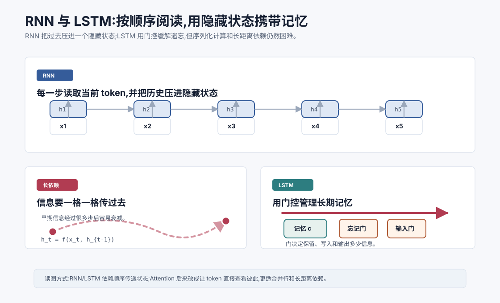
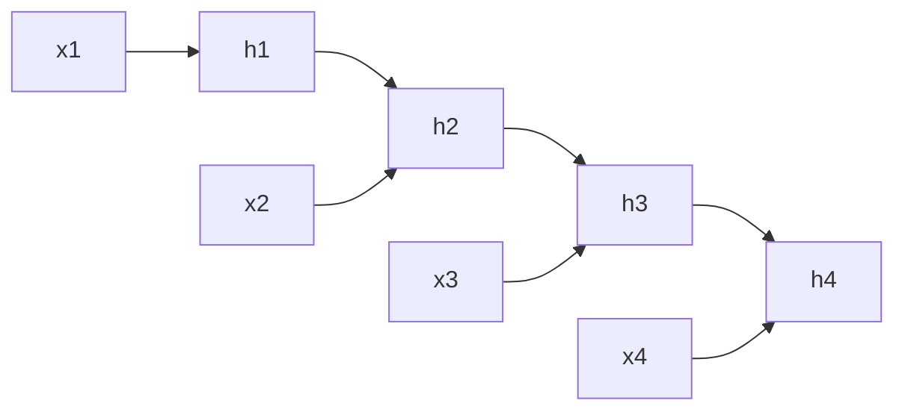
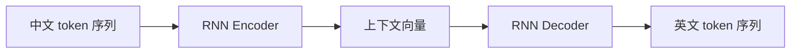

# RNN 与 LSTM `[进阶]`

前面几章已经建立了神经网络的基本部件:token 变成 embedding,向量经过线性层和激活函数加工,训练通过梯度下降调整参数。

但自然语言还有一个明显特点:它是序列。

一句话不是一袋互不相关的词。词的顺序会改变含义:

```text
狗 咬 人
人 咬 狗
```

同样的词,顺序一变,意思就变了。模型如果要理解语言,就必须处理顺序、历史和上下文。

在 Transformer 成为主流之前,RNN 和 LSTM 是处理序列数据的核心方法。理解它们,能帮助我们看清一个关键问题:为什么后来需要 Attention。



本章会讲:

- RNN 如何用隐藏状态逐步读取序列。
- 为什么 RNN 适合变长输入。
- 梯度消失为什么让长距离依赖变难。
- LSTM 如何用门控机制缓解遗忘。
- RNN/LSTM 在 Seq2Seq 中如何用于翻译等任务。
- 它们为什么最终让位给 Attention 和 Transformer。

## 序列问题为什么特殊

普通前馈网络通常把输入看成一个固定长度向量:

$$
y = f(x)
$$

但文本是一串 token:

$$
x_1, x_2, \ldots, x_T
$$

这里 $T$ 可以变化。一句话可能 5 个 token,一篇文章可能几千个 token。

序列任务需要回答几个问题:

- 如何处理不同长度的输入?
- 如何让后面的 token 受到前文影响?
- 如何保留早期重要信息?
- 如何在每个位置输出结果?
- 如何生成一个变长序列?

RNN 的基本想法非常自然:按顺序读,边读边更新一个“记忆状态”。

## RNN 的核心直觉

RNN 是 Recurrent Neural Network,循环神经网络。

它在每个时间步读取一个输入 token 向量 $x_t$,同时接收上一步的隐藏状态 $h_{t-1}$,然后产生新的隐藏状态 $h_t$。

公式可以写成:

$$
h_t = f(W_xx_t + W_hh_{t-1} + b)
$$

这里:

- $x_t$ 是当前位置的输入向量。
- $h_{t-1}$ 是上一步隐藏状态。
- $h_t$ 是当前隐藏状态。
- $W_x$、$W_h$、$b$ 是可学习参数。
- $f$ 通常是 Tanh 或其他非线性函数。

隐藏状态 $h_t$ 可以理解为:模型读到第 $t$ 个 token 后,对当前前缀的压缩表示。

比如读到:

```text
我 今天 想 喝
```

此时的隐藏状态应该包含“主语是我”“时间是今天”“动作意图是喝”这类信息,方便预测下一个 token 可能是“咖啡”“水”“茶”。

## 同一套参数反复使用

RNN 的一个关键特点是参数共享。

无论序列有多长,每一步都使用同一组参数 $W_x$、$W_h$ 和 $b$。

这有两个好处。

第一,它可以处理变长序列。长度为 5 和长度为 500 的输入,都可以一步一步读完。

第二,它把“如何更新状态”学成一个通用规则。模型不需要为第 1 个位置、第 2 个位置、第 100 个位置分别学不同参数。

这和卷积网络在图像里共享卷积核有一点类似:同一套局部处理规则可以应用到不同位置。

## 展开后的 RNN

RNN 叫“循环”,是因为隐藏状态会从上一步流向下一步。

如果把循环按时间展开,可以看成一条链:



每个 $h_t$ 都依赖 $x_t$ 和 $h_{t-1}$,而 $h_{t-1}$ 又依赖更早的输入。

所以理论上,$h_t$ 可以包含从 $x_1$ 到 $x_t$ 的全部历史。

但“理论上可以”不等于“实践中容易”。这正是后面的问题。

## RNN 可以做哪些任务

RNN 很灵活,因为它可以在不同时间步读取和输出。

### 多对一

输入是一段序列,输出一个标签。

比如情感分类:

```text
这家店服务很好 -> 正面
```

模型可以读完整句后,用最后一个隐藏状态做分类。

### 一对多

输入一个向量,输出一段序列。

比如图像描述:输入图片特征,逐词生成一句描述。

### 多对多

输入序列,输出序列。

比如机器翻译、语音识别、序列标注。

RNN 的这种灵活性,让它在很长一段时间里成为 NLP 的主力架构。

## 语言模型中的 RNN

RNN 可以做自回归语言模型。

给定前文 token,模型每一步预测下一个 token:

$$
P(x_t \mid x_{<t}) = \text{softmax}(W_oh_t + b_o)
$$

其中 $h_t$ 是读到当前位置后的隐藏状态,$W_o$ 把隐藏状态映射到词表 logits。

训练时,它和前面讲过的语言模型目标一样:让真实下一个 token 的概率更高。

RNN 的优势是结构直观:读一个 token,更新一次记忆,预测下一个 token。

但它也有明显限制:生成和训练都强依赖顺序,很难并行。

## 长距离依赖问题

语言里经常有长距离依赖。

比如:

```text
那本我昨天在图书馆借到、封面是蓝色、作者来自法国的书,今天终于读完了。
```

当模型读到“读完了”时,需要知道主语是“那本书”。中间隔了很多修饰信息。

再比如代码:

```text
function processOrder(order) {
  ...
  ...
  return order.status;
}
```

后面的 `order.status` 依赖前面函数参数 `order`。

RNN 必须把早期信息压进隐藏状态,再一步一步传到后面。序列越长,这个过程越困难。

## 梯度消失和梯度爆炸

RNN 的训练需要反向传播。因为序列按时间展开,反向传播也要沿时间方向传回去。这叫 BPTT,Backpropagation Through Time。

问题是:梯度在很多时间步之间反复相乘,可能越来越小,也可能越来越大。

如果梯度越来越小,叫梯度消失。早期 token 对后面损失的影响传不回去,模型就很难学到长距离依赖。

如果梯度越来越大,叫梯度爆炸。训练会变得不稳定,参数更新可能失控。

直觉上,这像一句消息要经过很多人转述。每转一次,信号可能丢一点,也可能被夸张一点。传得越远,越难保持原样。

## 为什么隐藏状态是瓶颈

RNN 把历史都压进一个固定大小的隐藏状态 $h_t$。

如果句子很短,这可能够用。如果文本很长,这个状态就像一个容量有限的背包。

模型读到后面时,必须决定保留什么、覆盖什么、忘掉什么。

这带来两个问题。

第一,早期细节容易被后来的信息覆盖。

第二,所有历史信息都要通过一条窄通道传递,没有办法让后面的 token 直接查看前面的 token。

这正是 Attention 后来要解决的问题之一:不要把所有历史都压成一个状态,而是让当前位置可以直接访问过去的表示。

## LSTM 的动机

LSTM 是 Long Short-Term Memory,长短期记忆网络。

它的目标是缓解普通 RNN 难以保留长期信息的问题。

LSTM 的核心思想是:不要只用一个隐藏状态粗暴传递信息,而是增加一个更稳定的记忆通道,并用门控机制控制信息流。

它有两个重要状态:

- $h_t$:隐藏状态,用于当前输出。
- $c_t$:细胞状态,可以理解为长期记忆通道。

LSTM 通过几个门决定:

- 旧记忆保留多少。
- 新信息写入多少。
- 当前输出暴露多少记忆。

## 门控是什么意思

门控可以理解成一个值在 0 到 1 之间的开关。

如果门的值接近 0,信息基本不通过。如果接近 1,信息大部分通过。

在神经网络里,门通常由 Sigmoid 产生:

$$
g = \sigma(Wx + Uh + b)
$$

因为 Sigmoid 输出在 0 到 1 之间,很适合做“通过比例”。

比如某个记忆值是 10,门值是 0.8,通过后就是:

$$
0.8 \times 10 = 8
$$

门控让模型可以学习何时记住、何时遗忘、何时输出。

## LSTM 的三个门

经典 LSTM 有三个主要门。

### 遗忘门

遗忘门决定旧记忆 $c_{t-1}$ 保留多少:

$$
f_t = \sigma(W_f x_t + U_f h_{t-1} + b_f)
$$

如果 $f_t$ 接近 1,旧记忆大部分保留。如果接近 0,旧记忆被大量清除。

### 输入门

输入门决定新信息写入多少:

$$
i_t = \sigma(W_i x_t + U_i h_{t-1} + b_i)
$$

同时会生成候选记忆:

$$
\tilde{c}_t = \tanh(W_c x_t + U_c h_{t-1} + b_c)
$$

新细胞状态大致是:

$$
c_t = f_t \odot c_{t-1} + i_t \odot \tilde{c}_t
$$

这里 $\odot$ 表示逐元素相乘。

### 输出门

输出门决定当前隐藏状态暴露多少记忆:

$$
o_t = \sigma(W_o x_t + U_o h_{t-1} + b_o)
$$

$$
h_t = o_t \odot \tanh(c_t)
$$

这些公式看起来多,但直觉很统一:门控制信息流。

## LSTM 如何缓解遗忘

普通 RNN 每一步都会用非线性函数重写隐藏状态。旧信息很容易被覆盖。

LSTM 的细胞状态 $c_t$ 提供了一条相对直接的记忆通道。遗忘门可以让重要信息在多个时间步中保持较稳定,输入门可以控制无关信息不要乱写进去。

比如一句话开头出现主语“那本书”,中间有很多修饰语。LSTM 可以学习把“主语是书”这类信息保留在细胞状态里,等到后面谓语出现时再使用。

当然,LSTM 不是魔法。它只是比普通 RNN 更善于处理长依赖,并不能完全解决所有长上下文问题。

## GRU:更简化的门控 RNN

除了 LSTM,还有一种常见变体叫 GRU,全称 Gated Recurrent Unit。

GRU 把门控结构做得更简洁,通常包含更新门和重置门。它没有单独的细胞状态,而是直接在隐藏状态上做门控更新。

GRU 参数更少,计算更轻,在一些任务上效果接近 LSTM。

本书不展开 GRU 细节。你只需要知道:它和 LSTM 属于同一类思想,都是通过门控机制改善普通 RNN 的记忆能力。

## Seq2Seq:编码器和解码器

RNN/LSTM 曾经在机器翻译中非常重要。典型结构叫 Seq2Seq,也就是 sequence-to-sequence。

它包含两部分:

- Encoder:读取源语言句子,把它压缩成一个上下文向量。
- Decoder:基于这个上下文向量,逐步生成目标语言句子。

比如把中文翻译成英文:



这个结构很优雅。输入和输出都可以是变长序列。

但它也暴露了一个严重瓶颈:整个源句子要被压进一个固定大小的上下文向量。

句子越长,压缩越困难。

## Attention 最初解决了什么

在 Transformer 之前,Attention 就已经被引入到 RNN Seq2Seq 中。

动机很直接:Decoder 生成每个目标词时,不应该只依赖一个固定上下文向量,而应该能查看 Encoder 每个位置的隐藏状态。

比如翻译某个英文词时,Decoder 可以对源句子的不同中文词分配不同权重。

这相当于让模型在生成时动态“对齐”源语言位置。

这一步非常关键。它打破了固定向量瓶颈,也为后来的 Transformer 铺平了路。

后面第 7 章会专门讲为什么需要 Attention。你现在只要抓住一句话:

**Attention 让当前位置不必只依赖一个压缩后的隐藏状态,而是可以直接读取其他位置的信息。**

## RNN/LSTM 的优势

虽然 Transformer 成了主流,RNN/LSTM 仍然有值得理解的优点。

### 适合流式处理

RNN 天然按时间步处理输入。对实时语音、传感器数据、在线日志等场景,这种流式结构很自然。

### 状态更新成本固定

每来一个新 token,只需要更新当前状态,不一定重新处理全部历史。

### 结构直观

读一个 token,更新一次状态。这非常符合人对序列处理的朴素想象。

### 小模型场景仍可用

在资源受限、序列较短或特定时序任务中,RNN/GRU/LSTM 仍可能是合理选择。

## RNN/LSTM 的限制

现在看它们为什么没有成为大语言模型主流。

### 难以并行

RNN 的 $h_t$ 依赖 $h_{t-1}$。第 100 步必须等第 99 步算完。这让训练很难像 Transformer 那样对序列位置大规模并行。

大模型训练极度依赖 GPU/TPU 并行能力,顺序依赖会成为硬瓶颈。

### 长距离依赖仍然困难

LSTM 缓解了长依赖问题,但没有完全解决。非常长的文本、复杂引用、多跳关系仍然难处理。

### 历史被压缩成状态

RNN/LSTM 仍然倾向于把历史压进隐藏状态。即使 LSTM 有细胞状态,也无法像 Attention 那样让当前位置直接访问所有相关位置。

### 表示交互不够直接

在 Transformer 中,任意两个 token 可以通过注意力直接交互。RNN 中远距离 token 的交互需要经过很多中间步传递。

这些限制共同推动了 Attention 和 Transformer 的兴起。

## RNN 和 Transformer 的核心差别

可以用一张表概括:

| 维度 | RNN/LSTM | Transformer |
| --- | --- | --- |
| 处理方式 | 按顺序逐步读 | 一次处理整段序列 |
| 历史信息 | 压进隐藏状态 | 通过 Attention 直接访问 |
| 并行能力 | 弱 | 强 |
| 长距离依赖 | 较难 | 更直接 |
| 计算特点 | 时间步递归 | 矩阵批量计算 |
| 典型用途 | 流式、小型时序模型 | 大规模语言模型 |

这不是说 Transformer 在所有方面都无条件更好。比如标准 Self-Attention 的计算会随序列长度平方增长,长上下文也有自己的成本问题。

但对大规模预训练语言模型来说,Transformer 的并行训练能力和直接建模 token 关系的能力太关键了。

## 和 Agent 有什么关系

Agent 应用通常直接使用现代 LLM,而不是自己写 RNN。那为什么还要学 RNN/LSTM?

第一,它帮助你理解模型架构演进。Transformer 不是凭空出现的,它解决的是序列建模中的具体痛点:长依赖、固定状态瓶颈和并行训练。

第二,它帮助你理解上下文窗口的价值。RNN 的历史被压缩进状态,而 Transformer 能在窗口内直接查看许多 token。窗口里放什么,会直接影响模型能利用什么信息。

第三,它帮助你理解记忆系统的类比。Agent 的短期状态摘要有点像把历史压进隐藏状态。摘要太粗,就会丢信息;上下文检索和引用则更像 Attention,让模型在需要时直接看原始片段。

第四,它提醒我们:压缩有代价。无论是 RNN 隐藏状态、对话摘要,还是长期记忆条目,只要把丰富历史压成短表示,就一定会有取舍。

这些直觉会在后面的上下文工程、记忆系统和 RAG 中反复出现。

## 一个极简伪代码

下面是普通 RNN 的数据流伪代码:

```text
h = initial_state()

for x in sequence:
    h = tanh(Wx * x + Wh * h + b)
    y = output_layer(h)
```

LSTM 的细节更多,但大致结构仍然是逐步更新状态:

```text
h = initial_hidden_state()
c = initial_cell_state()

for x in sequence:
    forget = sigmoid(Wf * x + Uf * h + bf)
    input = sigmoid(Wi * x + Ui * h + bi)
    candidate = tanh(Wc * x + Uc * h + bc)
    c = forget * c + input * candidate
    output = sigmoid(Wo * x + Uo * h + bo)
    h = output * tanh(c)
```

读这段伪代码时,不用纠结每个矩阵维度。抓住主线即可:普通 RNN 更新一个隐藏状态,LSTM 额外维护细胞状态并用门控制信息流。

## 常见误解

### 误解一:RNN 已经过时,所以不用理解

RNN 不是现代 LLM 主流,但它揭示了序列建模的基本问题。理解它能更清楚地理解 Attention 为什么重要。

### 误解二:LSTM 完全解决了长距离依赖

LSTM 缓解了梯度消失和遗忘问题,但非常长、复杂的依赖仍然困难,并且训练并行性仍受限制。

### 误解三:隐藏状态就是完整记忆

隐藏状态是压缩表示,不是完整历史。压缩一定会丢信息,尤其在长序列中。

### 误解四:Transformer 只是更大的 RNN

不是。Transformer 不按时间递归更新状态,而是通过 Attention 让序列位置之间直接交互,并更适合并行计算。

### 误解五:Attention 出现后 RNN 完全没有价值

RNN、GRU、LSTM 在一些流式、小模型、时序数据任务中仍有价值。架构选择取决于任务、数据和资源。

## 本章小结

RNN 用隐藏状态按顺序读取序列,把历史信息一步步传向未来。它结构直观,适合变长和流式数据,但长距离依赖、梯度传播和并行训练都存在困难。LSTM 通过细胞状态和门控机制缓解普通 RNN 的遗忘问题,曾经是 NLP 的关键架构。但它仍然依赖顺序计算,并且需要把历史压缩进状态。

下一章会进入 Transformer 架构的第一块核心:为什么需要 Attention。理解了 RNN/LSTM 的瓶颈后,Attention 的动机会非常自然:与其把所有历史压成一个状态,不如让当前位置直接查看相关位置。
