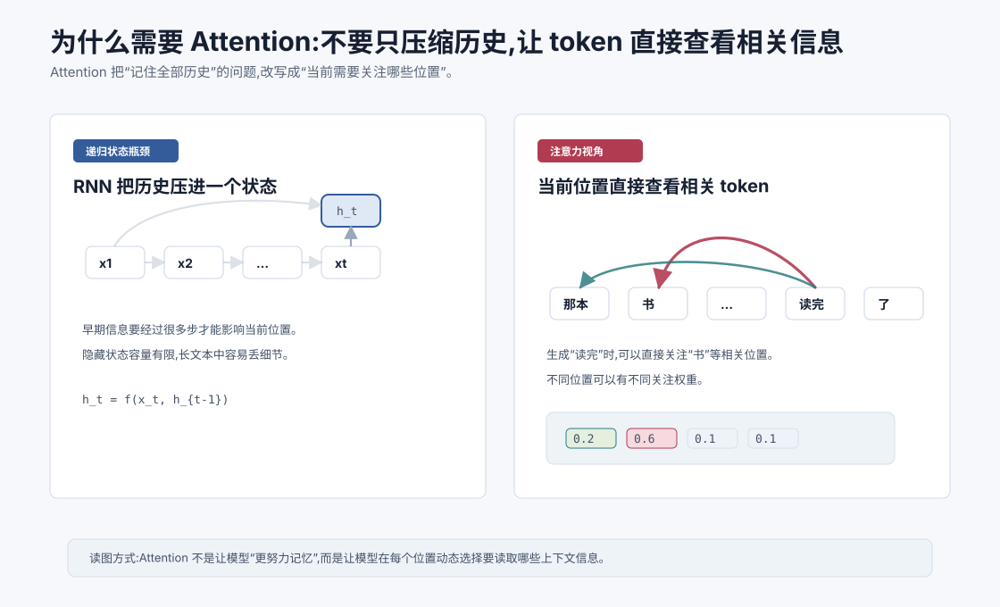
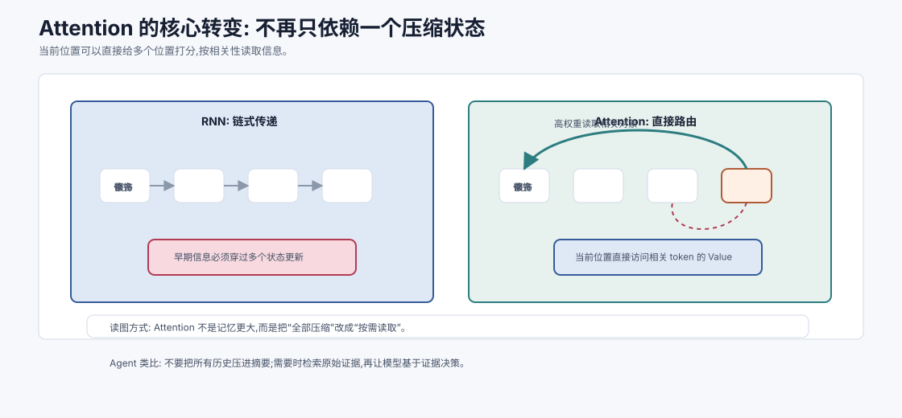
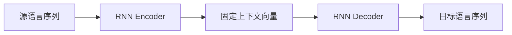
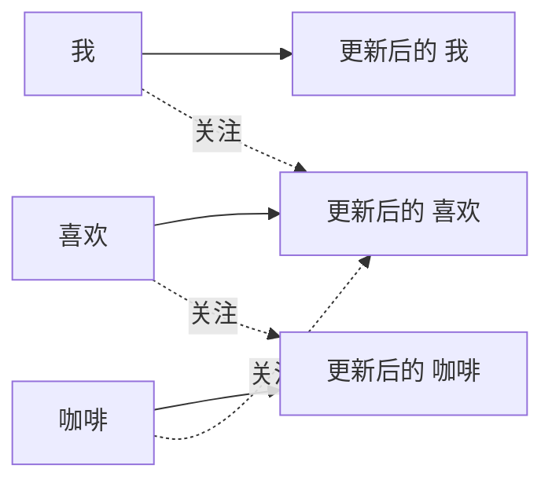
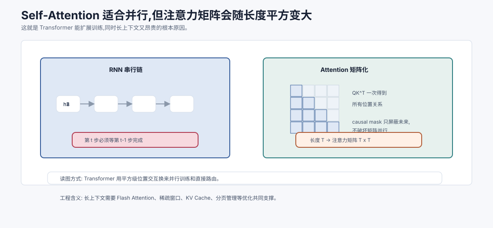
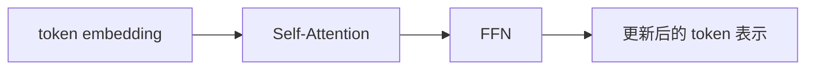

# 为什么需要 Attention `[主线]` ★

上一章讲了 RNN 与 LSTM。它们处理序列的方式很直观:按顺序读 token,把历史压进隐藏状态,再把这个状态传给下一步。

这种方式曾经非常重要,但它有一个根本限制:

**当前位置想使用很早之前的信息,必须依赖一条逐步传递的状态链。**

序列越长,信息越容易被压缩、覆盖或衰减。模型也很难并行训练,因为第 $t$ 步必须等第 $t-1$ 步算完。

Attention 的出现,改变了序列建模的思路。

它不再问:

> 如何把全部历史塞进一个状态?

而是问:

> 当前这个位置需要从哪些位置读取信息?每个位置读多少?



这一章先不深入 QKV 细节。我们先把 Attention 的动机讲透。读完以后,你应该能解释:

- RNN/LSTM 的固定状态瓶颈是什么。
- 长距离依赖为什么难。
- Seq2Seq 中的对齐问题为什么推动 Attention 出现。
- Attention 如何把“压缩记忆”变成“按需读取”。
- 为什么 Attention 更适合并行训练和大模型扩展。
- Attention 和 Agent 上下文工程有什么直觉联系。

## 从一句话里的指代说起

看这句话:

```text
那本我昨天在图书馆借到、封面是蓝色、作者来自法国的书,今天终于读完了。
```

当模型读到“读完了”时,它需要知道被读完的是“书”。但“书”和“读完了”之间隔着很多修饰内容。

如果用 RNN,信息必须这样传:

```text
那本 -> 我 -> 昨天 -> 在 -> 图书馆 -> ... -> 书 -> 今天 -> 终于 -> 读完
```

早期信息一路传到后面,每一步都会被新的输入和状态更新影响。

Attention 的想法更直接:

```text
当前位置“读完”可以直接看回“书”。
```

它不要求所有信息都通过一个隐藏状态慢慢流过来,而是允许当前位置对前面多个位置分配权重,重点读取相关位置。

这就是 Attention 最朴素的直觉: **按需查看上下文。**



这张图表达的是架构思想的转变。RNN 更像把读过的内容不断压进一份滚动摘要;Attention 更像在当前步骤打开索引,直接从相关位置取信息。两者都在处理历史,但信息路径完全不同。

这件事在长文本里尤其重要。假设模型需要判断“读完了”的宾语,真正相关的是前面的“书”,而不是中间每个修饰词。RNN 必须希望“书”这个信息在很多次状态更新后还没被冲淡;Attention 可以直接给“书”较高权重,把它的 Value 读入当前位置。

这也是后面 Agent 上下文工程的底层类比。把所有历史压成摘要,一定会丢细节;把所有原文都塞进上下文,又会带来噪声和成本。更好的系统往往是:保留结构化状态,再按当前任务检索和引用关键证据。

## RNN 的三个瓶颈

理解 Attention,最好先把 RNN/LSTM 的痛点说清楚。

### 1. 固定状态瓶颈

RNN 用隐藏状态 $h_t$ 表示到当前位置为止的历史:

$$
h_t = f(x_t, h_{t-1})
$$

这意味着,不管前文有 10 个 token 还是 1000 个 token,历史都要被压进一个固定大小的向量里。

这个向量当然可以很大,但仍然是压缩。压缩就会取舍。某些细节会被保留,某些细节会被覆盖。

### 2. 长距离依赖瓶颈

如果第 500 个 token 需要使用第 20 个 token 的信息,这条信息要经过几百次状态更新。

即使 LSTM 有门控机制,长距离依赖仍然比短距离依赖难学。

### 3. 并行训练瓶颈

RNN 的第 $t$ 步依赖第 $t-1$ 步。训练时不能轻易同时计算所有位置。

这对大模型尤其致命。现代大模型训练依赖海量矩阵运算和并行硬件。如果架构本身强制按时间一步步算,扩展效率会受限。

Attention 正是在这些问题上给出了不同路线。

## Seq2Seq 翻译里的对齐问题

Attention 最初在机器翻译里变得非常重要。

传统 Seq2Seq 模型会先用 Encoder 读取源语言句子,得到一个上下文向量,再让 Decoder 生成目标语言。

简化看是:



问题是:整个源句子都被压缩进一个固定向量 $C$。

短句还好,长句就难。翻译某个目标词时,模型往往只需要关注源句子的一小部分,没必要把所有信息都挤进同一个向量。

比如中文句子:

```text
我 昨天 买 了 一 本 书
```

翻译到英文时,生成 `book` 时应该重点关注“书”,生成 `yesterday` 时应该重点关注“昨天”。

这就出现了对齐问题:目标语言的每个位置,应该和源语言的哪些位置对应?

Attention 的一个早期用途,就是让 Decoder 在每一步动态查看 Encoder 的所有隐藏状态,并分配权重。

生成 `book` 时,“书”的权重大。生成 `yesterday` 时,“昨天”的权重大。

这比固定上下文向量灵活得多。

## Attention 的一句话定义

Attention 可以先这样定义:

**给定一个当前位置,计算它和其他位置的相关性,把相关性变成权重,再用这些权重加权汇总其他位置的信息。**

拆成三步就是:

1. 当前需要什么信息?
2. 哪些位置和这个需求相关?
3. 按相关程度读取并汇总信息。

这听起来很像人阅读时的行为。你读到一句话后半段,会自然回看前面的主语、指代对象、条件或定义。Attention 把这种“回看”做成可微分、可训练的计算。

## 一个不带 QKV 的最小公式

先不用 Query、Key、Value 的术语,只看一个最小形式。

假设序列里每个位置都有一个向量:

$$
x_1, x_2, \ldots, x_T
$$

当前位置是 $i$。我们想让位置 $i$ 从所有位置 $j$ 读取信息。

第一步,计算相关性分数:

$$
s_{ij} = \text{score}(x_i, x_j)
$$

最简单的 score 可以是点积:

$$
s_{ij} = x_i \cdot x_j
$$

第二步,用 Softmax 把分数变成权重:

$$
\alpha_{ij} = \frac{e^{s_{ij}}}{\sum_{k=1}^{T}e^{s_{ik}}}
$$

这些权重满足:

$$
\sum_j \alpha_{ij}=1
$$

第三步,加权汇总其他位置的向量:

$$
y_i = \sum_{j=1}^{T}\alpha_{ij}x_j
$$

这就是 Attention 的核心形状:相关性、权重、加权读取。

下一章会把这里的 $x_i$ 和 $x_j$ 拆成 Query、Key、Value,解释为什么要做三组投影。

## 权重不是人手写的

Attention 权重不是规则写死的。

模型不会被人工告知“读到动词时必须看主语”。它通过训练学会在不同任务中分配权重。

如果某种关注模式能降低损失,比如让模型更准确预测下一个 token,对应参数就会被强化。

久而久之,某些注意力头可能学会关注:

- 当前词的前一个词。
- 句子里的主语。
- 括号或引号的匹配位置。
- 代码中的变量定义。
- Markdown 列表的层级结构。
- 问题中和答案相关的实体。

注意,这里说“可能”很重要。Attention 权重有一定可解释性,但不能简单等同于完整解释。模型内部还有 FFN、残差、归一化和多层交互。

## Attention 是信息路由

可以把 Attention 理解成一种可学习的信息路由机制。

每个 token 位置都在问:

> 为了更新我的表示,我应该从哪些位置拿信息?

然后它根据相关性分配权重,把其他位置的信息汇总过来。

这和 RNN 的差别很大。

RNN 中,信息沿着时间链路传递:

```text
x1 -> h1 -> h2 -> h3 -> ... -> ht
```

Attention 中,当前位置可以直接建立连接:

```text
xt -> x3
xt -> x17
xt -> x42
```

这种直接连接让长距离依赖更容易表达。

## Self-Attention 是什么

Attention 可以用在不同序列之间,也可以用在同一个序列内部。

Self-Attention 指的是:同一个序列里的 token 彼此关注。

比如一句话中,每个 token 都可以查看这句话中的其他 token。



Self-Attention 是 Transformer 的核心。它让每个位置的表示都能融合上下文。

在 Encoder 类模型中,一个 token 通常可以看左右两边所有位置。

在自回归 Decoder-only 语言模型中,当前位置只能看过去和当前位置,不能看未来。这需要 causal mask,也就是因果掩码。后面讲 Self-Attention 时会展开。

## Attention 如何处理长距离依赖

回到长距离依赖。

RNN 中,第 1000 个 token 想使用第 10 个 token 的信息,要经过很多递归步骤。

Self-Attention 中,第 1000 个 token 可以直接给第 10 个 token 较高权重。

计算路径短了很多。

这不代表模型一定总能完美使用长距离信息。长上下文仍然有噪声、位置偏差、注意力稀释和计算成本问题。

但 Attention 至少提供了一条直接通道:相关位置可以直接交互。

这对语言、代码和复杂文档都非常关键。

## Attention 如何支持并行

Self-Attention 还有一个巨大优势:它更适合并行。

在训练时,给定一整段序列,每个位置的 Query、Key、Value 和注意力分数可以通过矩阵运算一次性算出来。

RNN 必须按时间步递归:

```text
h1 -> h2 -> h3 -> ... -> hT
```

Transformer 更像批量计算所有位置之间的关系:

```text
所有 token 向量 -> 注意力矩阵 -> 更新所有 token 向量
```

这非常适合 GPU/TPU。硬件擅长大矩阵乘法,而不是大量依赖前一步结果的小计算。

这也是 Transformer 能扩展到大规模预训练的重要原因之一。



Attention 的强大来自一次性计算所有位置之间的关系。对训练来说,这非常适合 GPU/TPU:同一层里的 $Q$、$K$、$V$ 和注意力矩阵都可以用大矩阵乘法批量完成。即使使用 causal mask,未来位置只是被屏蔽,并不要求像 RNN 那样按时间步串行运行。

但这份并行不是免费的。序列长度为 $T$ 时,注意力分数矩阵是 $T \times T$。这意味着模型不仅要处理每个 token,还要处理 token 两两之间的关系。

所以 Transformer 的扩展性有两面:

1. 训练并行性强,适合大规模预训练。
2. 长上下文成本高,需要大量系统优化。

后面讲 Flash Attention、KV Cache、PagedAttention 时,你会看到很多工程技术其实都在围绕这张矩阵做文章:如何少搬数据、如何避免重复算、如何管理长序列的 Key/Value、如何让 batch 更高效。

## Attention 的代价

Attention 解决了很多问题,但不是免费的。

标准 Self-Attention 需要计算序列中每两个位置之间的相关性。

如果序列长度是 $T$,注意力分数矩阵大小是:

$$
T \times T
$$

计算和显存成本通常随 $T^2$ 增长。

这意味着上下文长度翻倍,注意力相关成本可能接近四倍。

所以长上下文模型需要大量工程优化,比如 Flash Attention、稀疏注意力、滑动窗口、KV Cache、PagedAttention 等。

后面推理优化部分会详细讲这些技术。

现在先记住:Attention 换来了直接交互和并行训练,代价是注意力矩阵带来的长度平方成本。

## Attention 和可解释性

Attention 权重看起来很像解释:权重高的位置,似乎就是模型关注的位置。

这有一定帮助,但不能过度解读。

原因有几个。

第一,模型有多层和多头。某一层某一头的权重只是局部信号。

第二,Value 向量里包含什么信息,还取决于前面层的变换。

第三,FFN 也会大量加工信息,最终输出不只由 Attention 权重决定。

第四,残差连接会让信息绕过某些子模块继续传播。

所以 Attention 权重可以作为分析线索,但不能直接说“模型因为看了这个 token 才输出这个答案”。

## 一个类比:RAG 里的按需检索

Attention 和 RAG 有一个有趣类比。

Attention 是在模型上下文内部,让 token 按需读取其他 token。

RAG 是在外部知识库中,让系统按需检索相关文档。

二者当然不是同一个机制,但直觉相通:

- 不把所有知识都压进一个状态。
- 根据当前需求寻找相关信息。
- 给不同信息不同权重或优先级。
- 把选中的信息用于当前生成或决策。

这也是为什么理解 Attention 会帮助你理解 Agent 上下文工程。好的 Agent 不应该把所有历史、所有工具结果、所有文档都塞进上下文,而应该根据当前步骤选择相关信息。

## Agent 视角下的 Attention

在 Agent 系统中,模型每一步都要基于上下文做决策。

上下文可能包含:

- 用户目标。
- 系统约束。
- 工具列表。
- 计划。
- 历史观察。
- 检索片段。
- 当前错误信息。

Transformer 内部的 Attention 会在这些 token 之间建立关联。

如果上下文组织混乱,相关信息埋得太深,或者无关信息太多,模型的注意力就可能被稀释或误导。

所以工程上要做的,不是简单相信“模型会自己注意到重点”,而是帮助模型更容易注意到重点:

- 把关键约束放在稳定位置。
- 工具结果做摘要和提取。
- 检索片段控制数量和排序。
- 删除过期或无关历史。
- 高风险指令保持清晰边界。

这就是上下文工程和 Attention 直觉的连接点。

## 为什么 Attention 是通用组件

Attention 不只用于文本。

它可以用于任何需要“元素之间交互”的场景。

比如:

- 图像 patch 之间的关系。
- 音频片段之间的关系。
- 代码 token 之间的依赖。
- 文档段落之间的引用。
- 多模态模型中图像和文本之间的对齐。

本质上,Attention 是一种集合或序列里的信息交换机制。

只要任务需要判断“当前元素应该参考哪些其他元素”,Attention 就可能有用。

## 从 Attention 到 Transformer

Attention 最初可以作为 RNN Seq2Seq 的增强模块。但后来研究者发现:既然 Attention 可以直接建模序列位置之间的关系,是否可以不用 RNN?

Transformer 的回答是:可以。

Transformer 用 Self-Attention 处理 token 之间的信息交互,用 FFN 做每个 token 内部的非线性加工,再配合残差连接、归一化和位置编码,构成可并行训练的大规模序列模型。

它的核心数据流可以粗略看成:



当然,真实结构还有多头注意力、位置编码、残差、LayerNorm 等关键细节。后面几章会逐步拆开。

## 常见误解

### 误解一:Attention 等于人类注意力

不是。它只是借用了“关注”这个直觉。模型里的 Attention 是相关性打分、Softmax 权重和加权求和的数学机制。

### 误解二:Attention 一定能解决所有长上下文问题

不能。它提供直接交互通道,但长上下文仍然有成本、噪声、位置偏差和信息选择问题。

### 误解三:Attention 权重就是完整解释

不是。Attention 权重可以提供线索,但模型输出还受到多层、多头、FFN、残差和训练分布影响。

### 误解四:Attention 只是为了翻译对齐

翻译对齐是重要起点,但 Self-Attention 后来成为通用序列建模组件,远超翻译任务。

### 误解五:有 Attention 就不需要上下文工程

恰恰相反。Attention 在给定上下文内工作。上下文放什么、怎么组织、噪声多少,都会影响模型能否关注到正确内容。

## 本章小结

RNN/LSTM 通过隐藏状态传递历史,但固定状态瓶颈、长距离依赖和顺序计算限制了它们扩展到大规模语言模型。Attention 改变了问题:当前位置不必只依赖压缩后的历史状态,而是可以直接对其他位置打分、分配权重并读取信息。这样既缓解了长距离依赖,也更适合并行矩阵计算。

下一章会进入 Self-Attention 与 QKV。我们会把“当前需要什么”“哪些位置匹配”“实际读取什么”分别对应到 Query、Key、Value,并完整走一遍 Transformer 中最核心的计算。
