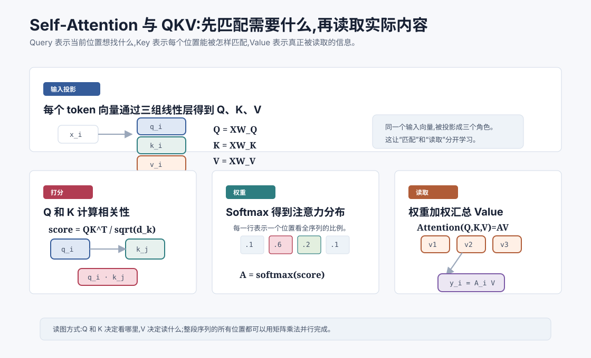
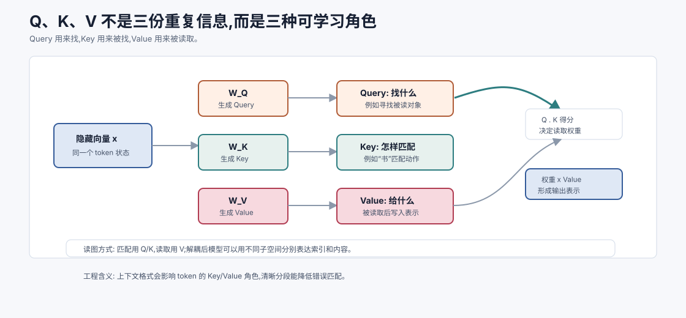
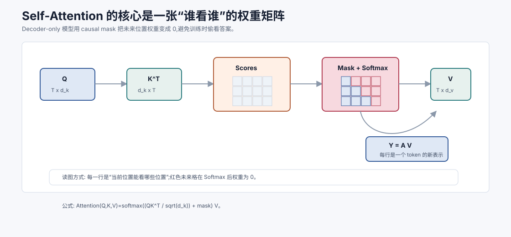

# Self-Attention 与 QKV `[主线]` ★

上一章讲了为什么需要 Attention:当前位置不必把所有历史压进一个隐藏状态,而是可以直接查看相关位置。

这一章进入 Transformer 的核心计算:Self-Attention。

Self-Attention 的一句话版本是:

**序列中的每个 token 都生成一个查询,去和所有 token 的键做匹配,得到注意力权重,再按权重读取所有 token 的值。**

这里的“查询、键、值”就是 Q、K、V:

- **Query**:当前位置想找什么。
- **Key**:每个位置能被怎样匹配。
- **Value**:每个位置实际提供什么信息。



读完本章,你应该能解释:

- 为什么同一个 token 向量要投影成 Q、K、V 三份。
- $QK^T$ 为什么能得到注意力分数矩阵。
- Softmax 如何把分数变成注意力权重。
- 为什么要除以 $\sqrt{d_k}$。
- causal mask 如何防止语言模型偷看未来。
- Self-Attention 为什么适合并行计算。

## 从“找资料”类比开始

先用一个检索类比。

假设你在资料库里找内容。你手里有一个问题:

```text
谁是这份合同里的付款方?
```

资料库里的每一段都有两类东西:

- 可匹配的索引信息:这段讲付款方、金额、期限还是违约责任。
- 实际内容:这段的具体文字和事实。

你会先用问题去匹配索引,找到相关段落,再读取这些段落的具体内容。

Self-Attention 做的事情类似:

- Query 像问题。
- Key 像索引。
- Value 像实际内容。

当前位置先用 Query 和所有 Key 匹配,得到应该看哪些位置。然后用这些权重去加权读取 Value。

这就是 Q/K/V 拆分的直觉。

## 输入是一组 token 向量

假设输入序列有 $T$ 个 token,每个 token 的隐藏维度是 $d_{model}$。

把它们堆成矩阵:

$$
X \in \mathbb{R}^{T \times d_{model}}
$$

这里:

- $T$ 是序列长度。
- $d_{model}$ 是模型主干隐藏维度。
- $X$ 的第 $i$ 行是第 $i$ 个 token 的向量 $x_i$。

Self-Attention 的目标是输出同样长度的一组新向量:

$$
Y \in \mathbb{R}^{T \times d_v}
$$

每个 $y_i$ 都是第 $i$ 个 token 读取上下文后的新表示。

在实际 Transformer 中,输出通常会再投影回 $d_{model}$ 维,方便和残差连接相加。

## 三组线性投影

Self-Attention 首先把输入 $X$ 投影成三组矩阵:

$$
Q = XW_Q
$$

$$
K = XW_K
$$

$$
V = XW_V
$$

其中:

$$
W_Q \in \mathbb{R}^{d_{model} \times d_k}
$$

$$
W_K \in \mathbb{R}^{d_{model} \times d_k}
$$

$$
W_V \in \mathbb{R}^{d_{model} \times d_v}
$$

所以:

$$
Q \in \mathbb{R}^{T \times d_k}
$$

$$
K \in \mathbb{R}^{T \times d_k}
$$

$$
V \in \mathbb{R}^{T \times d_v}
$$

这三组矩阵都是可学习参数。训练会决定什么样的 Query、Key、Value 对任务有用。

## 为什么不直接用 X

上一章的最小公式里,我们直接用 $x_i \cdot x_j$ 计算相似度,再加权汇总 $x_j$。

那为什么还要 Q/K/V?

原因是:匹配需求和读取内容不一定应该使用同一种表示。

一个 token 在当前层里可能同时承担很多角色。

比如“苹果”这个 token:

- 它可能作为实体名被别的位置引用。
- 它可能需要寻找前面的修饰词。
- 它可能提供“公司”或“水果”的语义信息。
- 它可能参与语法结构判断。

如果只用原始 $X$ 做所有事情,模型表达受限。

Q/K/V 让模型分别学习:

- 当前 token 在“寻找信息”时该用什么表示。
- 每个 token 在“被匹配”时该展示什么索引。
- 每个 token 在“被读取”时该提供什么内容。

这就是把“匹配”和“读取”解耦。



这张图要解决一个常见困惑:既然 Q、K、V 都来自同一个输入 $X$,为什么还要分三份?答案是,它们来自同一个来源,但经过不同可学习矩阵后承担不同角色。

Query 代表“当前我要找什么”,Key 代表“我可以怎样被别人找到”,Value 代表“如果别人真的关注我,我提供什么内容”。这种拆分让模型可以把索引空间和内容空间分开学习。

例如一个变量名 token 在代码里可能同时有几种用途:作为当前位置,它可能要寻找定义;作为被关注位置,它可能要暴露“我是某个变量定义”的索引;作为 Value,它需要提供类型、作用域、附近注释等内容线索。如果只用同一个向量同时做这些事,表达空间会更挤。

所以 QKV 的本质不是人为规定语义,而是给模型三个可训练的视角:寻找、被匹配、被读取。

## Q、K、V 的角色

可以把每个 token 的三个向量看成三张名片。

### Query:我想找什么

当前位置的 Query 表示它当前需要的信息类型。

读到“读完”时,Query 可能会倾向于寻找“被读的对象”。

读到右括号时,Query 可能会倾向于寻找匹配的左括号。

读到变量使用位置时,Query 可能会寻找变量定义。

### Key:我能被怎样找到

每个位置的 Key 表示它提供的匹配线索。

“书”的 Key 可能让它容易被“读完”这种动作匹配到。

左括号的 Key 可能让它容易被右括号匹配到。

变量定义的 Key 可能让它容易被后续变量使用匹配到。

### Value:我真正提供什么

Value 是被读取后参与汇总的信息。

一个位置可能因为 Key 匹配上而被关注,但真正传给当前位置的是它的 Value。

这允许模型用一种表示做索引,用另一种表示传内容。

## 计算注意力分数

有了 Q 和 K,就可以计算每个位置对每个位置的相关性。

对于位置 $i$ 和位置 $j$:

$$
s_{ij} = q_i \cdot k_j
$$

如果用矩阵一次性计算所有位置,就是:

$$
S = QK^T
$$

形状是:

$$
Q: T \times d_k
$$

$$
K^T: d_k \times T
$$

所以:

$$
S: T \times T
$$

$S$ 的第 $i$ 行表示:第 $i$ 个 token 的 Query 与所有 token 的 Key 的匹配分数。

也就是说,第 $i$ 行回答了一个问题:

> 位置 $i$ 应该关注序列中的哪些位置?

## 为什么要除以 $\sqrt{d_k}$

标准 Self-Attention 用的是 scaled dot-product attention:

$$
S = \frac{QK^T}{\sqrt{d_k}}
$$

为什么要除以 $\sqrt{d_k}$?

直觉是:点积维度越高,数值波动越大。

如果 $q$ 和 $k$ 的每个维度都有一定方差,那么 $q \cdot k$ 是很多项相加。维度 $d_k$ 越大,点积的幅度越可能变大。

点积分数太大时,Softmax 会变得非常尖锐。某个位置权重接近 1,其他位置接近 0,梯度也可能变得不稳定。

除以 $\sqrt{d_k}$ 可以把分数尺度拉回更稳定的范围。

这和前面讲 Softmax 数值稳定性是一脉相承的:数学上只是缩放,工程上会显著影响训练稳定性。

## 从分数到权重

分数矩阵 $S$ 还不是概率。每一行都要做 Softmax:

$$
A = \text{softmax}(S)
$$

更具体地说:

$$
\alpha_{ij} = \frac{e^{s_{ij}}}{\sum_{m=1}^{T} e^{s_{im}}}
$$

其中 $\alpha_{ij}$ 表示位置 $i$ 对位置 $j$ 的注意力权重。

每一行的权重加起来是 1:

$$
\sum_{j=1}^{T}\alpha_{ij}=1
$$

所以 $A$ 可以看成注意力权重矩阵。

如果 $A_{3,7}$ 很大,说明第 3 个 token 在更新自己表示时,大量读取第 7 个 token 的 Value。

## 加权汇总 Value

最后一步是读取 Value:

$$
Y = AV
$$

形状是:

$$
A: T \times T
$$

$$
V: T \times d_v
$$

所以:

$$
Y: T \times d_v
$$

第 $i$ 行是:

$$
y_i = \sum_{j=1}^{T}\alpha_{ij}v_j
$$

这表示第 $i$ 个 token 的新表示,由所有位置的 Value 加权求和得到。

注意这里是“所有位置”,但权重不同。相关位置权重大,无关位置权重小。

## 完整公式

把三步合起来,Self-Attention 的核心公式是:

$$
\text{Attention}(Q,K,V)=\text{softmax}\left(\frac{QK^T}{\sqrt{d_k}}\right)V
$$

这行公式非常重要。它包含了 Transformer 最核心的信息混合机制。

读公式时可以按顺序翻译:

1. $QK^T$:每个 Query 和每个 Key 做匹配。
2. $/\sqrt{d_k}$:缩放分数,保持训练稳定。
3. $\text{softmax}$:把匹配分数变成注意力权重。
4. $\cdot V$:按权重读取 Value,得到新表示。

## 一个极小例子

假设一句话有 3 个 token:

```text
我 喜欢 咖啡
```

某一层里,“喜欢”这个位置的 Query 可能会给三个位置分配权重:

| 被关注位置 | token | 权重 |
| --- | --- | --- |
| 1 | 我 | 0.30 |
| 2 | 喜欢 | 0.20 |
| 3 | 咖啡 | 0.50 |

那么“喜欢”的新表示大致是:

$$
y_{喜欢} = 0.30v_{我} + 0.20v_{喜欢} + 0.50v_{咖啡}
$$

这不是人手指定的规则,而是模型根据 Q/K 匹配学出来的权重。

不同层、不同注意力头中,权重可能完全不同。有的头可能关注前一个 token,有的头关注语法主干,有的头关注标点结构。

## Mask:哪些位置不能看

Attention 默认可以让每个位置看所有位置。但并不是所有任务都允许这样。

在自回归语言模型中,模型训练目标是预测下一个 token。

当模型在位置 $t$ 预测时,它只能看 $1$ 到 $t$ 的 token,不能看未来的 $t+1$、$t+2$。

否则训练就作弊了。

比如训练句子:

```text
我 喜欢 喝 咖啡
```

如果模型在“喝”这个位置预测下一个 token 时已经能看到“咖啡”,那它不是学会预测,而是偷看答案。

所以 Decoder-only 语言模型需要 causal mask。

## Causal mask 如何工作

Causal mask 会把未来位置的注意力分数设为一个极小值,通常可以理解为 $-\infty$。

假设序列长度是 4。允许关注的位置矩阵大致是:

| 当前位置 | 可看位置 1 | 可看位置 2 | 可看位置 3 | 可看位置 4 |
| --- | --- | --- | --- | --- |
| 1 | 可看 | 不可看 | 不可看 | 不可看 |
| 2 | 可看 | 可看 | 不可看 | 不可看 |
| 3 | 可看 | 可看 | 可看 | 不可看 |
| 4 | 可看 | 可看 | 可看 | 可看 |

在 Softmax 前,不可看的位置被加上 mask:

$$
S' = S + M
$$

其中未来位置的 $M_{ij}=-\infty$。

Softmax 后,这些位置的权重就会变成 0。

这保证语言模型只能基于过去生成未来。



这张图把 Self-Attention 的矩阵形状和 mask 放在一起看。$QK^T$ 得到的是一张 $T \times T$ 的分数表:第 $i$ 行表示位置 $i$ 想看每个位置的程度。Softmax 也是逐行做的,所以每一行都会变成一个“当前位置的读取分布”。

Causal mask 的作用不是让模型少算一个时间步,而是在分数进入 Softmax 前把未来位置设为极小值。这样未来格子的权重会变成 0,训练时每个位置都只能基于过去和当前位置预测后续 token。

这个细节非常关键。没有 causal mask,自回归语言模型训练会变成偷看答案:模型可以直接从未来 token 读取正确答案,损失很低但生成时无法使用同样信息。mask 保证训练条件和推理条件一致。

也正因为 mask 只是矩阵上的可见性控制,Transformer 在训练时仍然可以并行计算所有位置。它不会像 RNN 那样必须先算完第 $t-1$ 步才能算第 $t$ 步。

## Padding mask

除了 causal mask,还有 padding mask。

训练时,一个 batch 里不同样本长度可能不同。为了组成矩阵,短序列会补 padding token。

这些 padding token 不是真实内容,模型不应该关注它们。

padding mask 会把 padding 位置屏蔽掉,避免它们参与注意力计算。

所以常见 mask 有两类:

- causal mask:防止看未来。
- padding mask:防止看补齐位置。

实际实现里,这两类 mask 可能会合并使用。

## Encoder Attention 和 Decoder Attention

不同 Transformer 架构里,Attention 的可见范围不同。

### Encoder Self-Attention

Encoder 通常用于理解整段输入。每个 token 可以看左右两侧所有 token。

比如 BERT 类模型中,句子里的每个位置都能双向关注。

这适合理解任务,比如分类、抽取、句向量表示。

### Decoder Self-Attention

Decoder-only 语言模型用于自回归生成。每个位置只能看过去和当前位置。

GPT 类模型就是这种模式。

这适合生成任务,因为生成时未来 token 本来还不存在。

### Cross-Attention

Encoder-Decoder 模型里还会有 Cross-Attention。Decoder 的 Query 来自目标序列,Key 和 Value 来自 Encoder 输出。

这常用于翻译、摘要等任务。

本章重点是 Self-Attention。Cross-Attention 的公式类似,只是 Q、K、V 来源不同。

## Self-Attention 为什么能并行

RNN 要按时间步算:

```text
h1 -> h2 -> h3 -> ... -> hT
```

Self-Attention 可以把整个序列组成矩阵 $X$,一次性算:

$$
Q = XW_Q, \quad K = XW_K, \quad V = XW_V
$$

$$
A = \text{softmax}\left(\frac{QK^T}{\sqrt{d_k}}\right)
$$

$$
Y = AV
$$

这些都是矩阵运算,非常适合 GPU/TPU 并行。

训练时,即使使用 causal mask,所有位置的计算也可以在一个矩阵里完成。mask 只是让未来位置的权重为 0,并不要求像 RNN 那样一步一步算。

这就是 Transformer 能大规模训练的重要原因。

## 计算复杂度

标准 Self-Attention 的核心成本来自 $QK^T$。

如果序列长度是 $T$,Key/Query 维度是 $d_k$,计算量大致和下面成正比:

$$
T^2 d_k
$$

注意力矩阵 $A$ 的大小是:

$$
T \times T
$$

这就是为什么长上下文很贵。

当 $T$ 从 4096 增加到 8192,注意力矩阵元素数量会变成 4 倍。

当然,实际推理中还有 KV Cache、Flash Attention 等优化。后面会专门讲。

## Self-Attention 和词序

一个重要问题:Self-Attention 本身知道 token 顺序吗?

如果只看 $QK^T$ 和加权求和,Attention 对输入位置的顺序并不天然敏感。它主要看向量之间的匹配关系。

但语言顺序很重要。比如:

```text
狗 咬 人
人 咬 狗
```

所以 Transformer 需要位置编码或位置嵌入,把位置信息加入 token 表示。

后面第 10 章会专门讲位置编码。这里先记住:Self-Attention 负责 token 之间的信息交互,位置编码负责告诉模型这些 token 的顺序和距离。

## 注意力权重能不能直接解释模型

Attention 权重看起来很直观,但不能简单当作完整解释。

如果某一层某一头里,“读完”对“书”的注意力权重很高,这说明该头在这一步强烈读取“书”的 Value。

但最终输出还会受到很多东西影响:

- 其他注意力头。
- 其他层。
- FFN。
- 残差连接。
- LayerNorm 或 RMSNorm。
- 输出投影和 Softmax。

所以注意力图可以帮助分析模型行为,但不能单独作为因果解释。

## 一个伪代码版本

下面是 Self-Attention 的最小伪代码:

```text
function self_attention(X, mask):
    Q = X * W_Q
    K = X * W_K
    V = X * W_V

    scores = Q * transpose(K) / sqrt(d_k)
    scores = scores + mask

    weights = softmax(scores)
    Y = weights * V

    return Y
```

实际实现会有 batch 维度、多头维度、数值稳定优化、dropout、输出投影和 KV Cache 等细节。但核心流程就是这几步。

## 常见误解

### 误解一:Q、K、V 是人工设计的语义标签

不是。Query、Key、Value 是三组可学习线性投影。它们的名字帮助理解角色,但具体含义由训练学出来。

### 误解二:Value 就是原始 token 内容

不是。Value 是输入向量经过 $W_V$ 投影后的表示。它不是原始文本,而是模型内部可读取的信息向量。

### 误解三:注意力权重越高就一定越重要

不一定。高权重说明某个头某一层读取了该位置,但最终输出还由整个网络共同决定。

### 误解四:Self-Attention 天然知道顺序

不天然知道。Transformer 需要位置编码或相关机制提供顺序信息。

### 误解五:mask 只是工程细节

mask 会改变模型能看见的信息。对自回归语言模型来说,causal mask 是训练目标成立的必要条件。

## 和 Agent 有什么关系

Agent 的每一次模型调用,最终都会变成 token 序列上的 Self-Attention 计算。

这带来几个工程直觉。

第一,上下文里的每个片段都可能被模型读取。系统指令、用户目标、工具结果、检索文档都会进入同一个注意力空间。

第二,信息不是放进上下文就等于被正确使用。相关内容太远、噪声太多、格式混乱,都可能影响注意力分配。

第三,顺序和结构很重要。关键约束放在哪里、工具结果如何分段、引用如何标明,都会影响模型是否容易建立正确关联。

第四,安全边界不能只靠“希望模型注意到”。Prompt Injection 防御需要明确层级、隔离不可信内容、工具权限和校验机制。

理解 QKV 后,你会更清楚:模型不是把上下文当数据库精确查询,而是在高维表示里做可学习的信息匹配和读取。

## 本章小结

Self-Attention 是 Transformer 的核心信息混合机制。输入 token 向量先被投影成 Query、Key、Value。Query 和 Key 的点积得到注意力分数,分数缩放后经过 Softmax 变成权重,权重再加权汇总 Value,得到每个位置的新表示。Q/K/V 把“匹配”和“读取”解耦,mask 控制哪些位置可见,矩阵化计算让训练可以高度并行。

下一章会讲多头注意力。单个注意力机制只能在一个表示子空间里做匹配和读取,多头注意力则让模型同时从多个角度观察上下文:有的头看语法,有的头看指代,有的头看局部邻近,有的头看结构边界。
