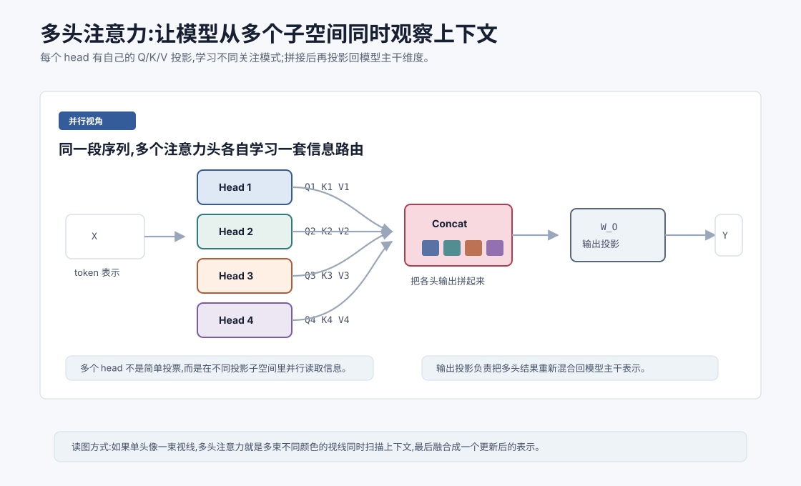
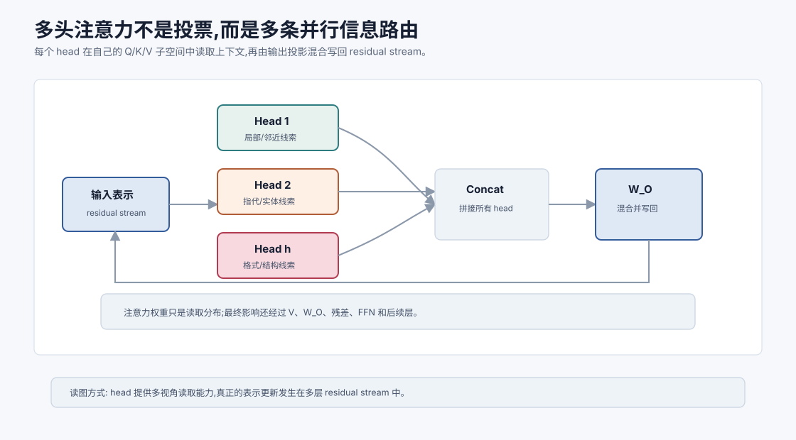
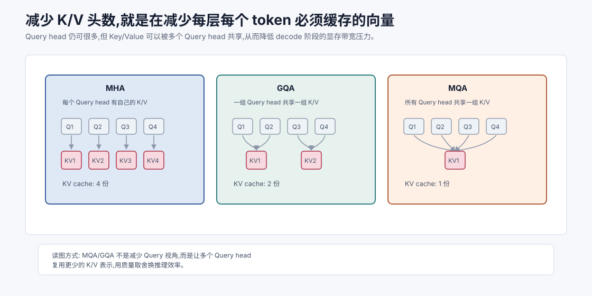

# 多头注意力 `[进阶]` ★

上一章讲了 Self-Attention 与 QKV。单个注意力机制已经能让每个 token 按相关性读取上下文。

但真实 Transformer 几乎不会只用一个注意力头,而是使用多头注意力,Multi-Head Attention。

多头注意力的直觉是:

**同一段上下文里,不同关系需要用不同视角观察。一个头可能看指代,一个头看局部相邻,一个头看语法结构,一个头看代码括号或缩进。**

如果单头注意力像一束视线,多头注意力就像多束不同颜色的视线同时扫描上下文,最后把看到的信息融合起来。



本章会讲:

- 为什么单个注意力头不够。
- 多头注意力如何并行计算。
- 每个 head 的 Q/K/V 维度怎么拆。
- concat 和输出投影 $W_O$ 起什么作用。
- 多头是否真的学到不同能力。
- 多头注意力有哪些工程取舍。

## 为什么一个头不够

一句话中可能同时存在很多关系。

比如:

```text
小明把书放进包里,因为它明天上课要用。
```

模型要处理的问题包括:

- “它”指的是书、包,还是小明?
- “明天”修饰哪个事件?
- “上课要用”的对象是什么?
- “因为”连接了哪两个语义片段?

这些关系不一定适合用同一套 Q/K/V 投影捕捉。

一个注意力头只有一套投影矩阵:

$$
W_Q, W_K, W_V
$$

它可以学出一种匹配和读取方式。但语言、代码和文档里的关系太丰富,只用一种视角会受限。

多头注意力让模型在多个子空间里同时做 Attention。

## 多头的核心思想

假设有 $h$ 个注意力头。每个头都有自己的投影矩阵:

$$
W_Q^{(r)}, W_K^{(r)}, W_V^{(r)}
$$

其中 $r$ 表示第 $r$ 个 head。

每个 head 独立计算:

$$
\text{head}_r = \text{Attention}(XW_Q^{(r)}, XW_K^{(r)}, XW_V^{(r)})
$$

然后把所有 head 的输出拼接:

$$
H = \text{Concat}(\text{head}_1, \text{head}_2, \ldots, \text{head}_h)
$$

最后通过输出投影:

$$
Y = HW_O
$$

这就是多头注意力的基本结构。

## 维度怎么拆

假设模型主干维度是:

$$
d_{model}=4096
$$

注意力头数量是:

$$
h=32
$$

那么常见做法是每个 head 的维度为:

$$
d_{head}=\frac{d_{model}}{h}=128
$$

每个 head 都在 128 维子空间里计算注意力。

多个 head 拼接后:

$$
32 \times 128 = 4096
$$

正好回到 $d_{model}$。

当然,具体模型可以有不同设计,但这个“拆成多个较小 head,拼回主干维度”的模式非常常见。

## 形状完整走一遍

输入序列矩阵是:

$$
X \in \mathbb{R}^{T \times d_{model}}
$$

第 $r$ 个 head 的投影是:

$$
Q_r = XW_Q^{(r)}
$$

$$
K_r = XW_K^{(r)}
$$

$$
V_r = XW_V^{(r)}
$$

其中:

$$
Q_r, K_r, V_r \in \mathbb{R}^{T \times d_{head}}
$$

该 head 的输出是:

$$
O_r = \text{softmax}\left(\frac{Q_rK_r^T}{\sqrt{d_{head}}}\right)V_r
$$

形状是:

$$
O_r \in \mathbb{R}^{T \times d_{head}}
$$

所有 head 拼接后:

$$
O = \text{Concat}(O_1, O_2, \ldots, O_h)
$$

$$
O \in \mathbb{R}^{T \times (h \cdot d_{head})}
$$

如果 $h \cdot d_{head} = d_{model}$,则:

$$
O \in \mathbb{R}^{T \times d_{model}}
$$

最后输出投影:

$$
Y = OW_O
$$

其中:

$$
W_O \in \mathbb{R}^{d_{model} \times d_{model}}
$$

输出仍是:

$$
Y \in \mathbb{R}^{T \times d_{model}}
$$

这保证多头注意力模块可以接在 Transformer 主干里,并和残差连接相加。

## 输出投影为什么重要

拼接只是把多个 head 的结果并排放在一起。

如果没有输出投影,每个 head 的信息仍然停留在自己的通道里,融合不充分。

$W_O$ 的作用是把这些 head 的输出重新混合。

它可以学习:

- 哪些 head 的信息更重要。
- 不同 head 的特征如何组合。
- 如何把多头结果映射回主干表示空间。

所以多头注意力不是“多个头算完就结束”,而是“多个头并行读取,再由输出投影融合”。

## 多头真的会学不同东西吗

很多可视化研究发现,不同注意力头确实可能形成不同关注模式。

有些 head 可能关注局部邻近 token。

有些 head 可能关注句法依赖。

有些 head 可能关注分隔符、换行、缩进、括号。

有些 head 在代码中可能关注变量定义和使用位置。

有些 head 在长文本中可能关注段落开头或特殊标记。

但这不是硬规则。不能说“第 7 个 head 一定负责语法”。不同模型、不同层、不同输入中,head 的行为会变化。

更准确的说法是:多头结构给了模型学习多种信息路由模式的容量。

## 多头不是简单投票

初学者容易把多头注意力想成多个模型投票。

这不准确。

每个 head 输出的是向量,不是最终答案。它们不是各自预测一个 token 再投票,而是在不同表示子空间里读取上下文信息。

这些信息会被拼接、投影、残差连接、归一化和 FFN 继续加工。

所以 head 更像多个特征提取通道,不是多个独立决策者。

## 为什么每个 head 维度更小

如果总模型维度固定,多头注意力通常把维度拆分给多个 head。

比如 $d_{model}=4096$,32 个 head,每个 head 128 维。

这样做有一个好处:总计算量不会因为 head 数量简单乘上 32 倍。

因为单头维度变小了。

粗略看,$QK^T$ 的计算量和 $h \cdot T^2 \cdot d_{head}$ 成正比。

而:

$$
h \cdot d_{head} = d_{model}
$$

所以总量大致和:

$$
T^2 \cdot d_{model}
$$

同阶。

多头不是免费,还有投影和工程开销,但它不是把完整维度的 Attention 简单复制 $h$ 次。

## 多头和表达能力

多头带来的表达能力可以从几个角度理解。



### 多种相似度空间

不同 head 有不同 $W_Q$ 和 $W_K$,所以它们计算相似度的空间不同。

同一对 token,在某个 head 里可能高度相关,在另一个 head 里可能不相关。

### 多种读取内容

不同 head 有不同 $W_V$,所以即使关注同一个位置,读取出来的信息也可以不同。

一个 head 可能读取语法角色,另一个 head 可能读取实体信息。

### 多种上下文汇总

每个 head 的 Softmax 权重不同。它们可以从不同位置汇总信息。

一个 head 看前文定义,另一个 head 看局部搭配,另一个 head 看段落结构。

这些能力叠加起来,让 Transformer 能更丰富地建模上下文。

一个更工程化的理解是:多头注意力把“从哪里读”和“读什么特征”拆成多条并行通道。每个 head 不是孤立专家,而是把一部分信息写回 residual stream,再交给后续层和 FFN 继续加工。某个 head 单独看可能很难解释,但多个 head 在多层中组合起来,会形成复杂的信息路由网络。

这也解释了为什么不能只看 attention heatmap 就断言模型“理解了什么”。注意力权重只是某个 head 在某层的读取分布,真正影响输出的还有 $V$ 投影、$W_O$ 混合、残差流、FFN 以及后续层。

## Head 数量越多越好吗

不一定。

Head 太少,模型可能缺少足够的信息路由视角。

Head 太多,每个 head 的维度可能太小,单个 head 表达能力下降,也可能带来冗余和工程开销。

实际模型会在以下因素之间权衡:

- $d_{model}$。
- head 数量。
- 每个 head 的维度。
- 训练稳定性。
- 推理效率。
- KV Cache 显存占用。
- 硬件矩阵计算效率。

现代 LLM 还会使用一些多头注意力变体,比如 Multi-Query Attention 和 Grouped-Query Attention,以降低推理时 KV Cache 的成本。后面讲推理优化和模型变体时会展开。

## 多头注意力和 KV Cache

在自回归生成时,模型一个 token 一个 token 生成。

每生成新 token,都需要让新位置关注过去所有 token。

过去 token 的 Key 和 Value 可以缓存下来,避免每一步重复计算。这就是 KV Cache。

多头注意力中,每个 head 都有自己的 K/V 缓存。

如果 head 很多、序列很长、batch 很大,KV Cache 会占用大量显存。

这也是为什么后来出现 MQA/GQA 等结构:减少 K/V 头数量,在尽量保持效果的同时降低推理成本。

现在先记住:多头注意力不仅影响模型能力,也直接影响部署成本。

可以粗略估算每层 KV Cache 元素数量:

$$
2 \times T \times n_{kv\_heads} \times d_{head}
$$

这里的 2 分别是 Key 和 Value。标准 MHA 中 $n_{kv\_heads}$ 通常等于 query head 数;MQA/GQA 会减少 K/V head 数,从而降低长上下文和高并发服务时的显存压力。

这带来一个重要取舍:训练时多 query head 能提升表达容量,推理时 K/V cache 又希望更小。现代模型的注意力设计,越来越多是在能力、显存、吞吐和硬件 kernel 之间寻找平衡。



把这个公式乘上层数、batch 和数据类型字节数,就能得到更接近部署的估算:

$$
2 \times B \times L \times T \times n_{kv\_heads} \times d_{head} \times \text{bytes}
$$

这里 $B$ 是 batch size,$L$ 是层数。这个式子解释了一个很常见的工程现象:模型参数可以被量化、可以多卡切分,但长上下文高并发时,KV Cache 会按请求数和上下文长度持续增长,很快成为服务端显存的主要压力。

MHA、GQA、MQA 的差异可以这样理解:

- MHA:每个 query head 都有自己的 K/V head,表达最充分,KV Cache 也最大。
- MQA:所有 query head 共享一组 K/V,KV Cache 最小,但 K/V 表达被压缩得最狠。
- GQA:多个 query head 共享一组 K/V,常作为质量和效率之间的折中。

所以多头注意力的“头数”不能只看 query head。部署时更要看 $n_{kv\_heads}$,因为 decode 阶段每一步都会读取历史 K/V。Query head 决定当前 token 用多少视角发问,K/V head 决定历史上下文以多少份表示被缓存下来。

## 一个伪代码版本

下面是多头注意力的概念伪代码:

```text
function multi_head_attention(X, mask):
    heads = []

    for r in range(num_heads):
        Q = X * W_Q[r]
        K = X * W_K[r]
        V = X * W_V[r]

        scores = Q * transpose(K) / sqrt(d_head)
        scores = scores + mask
        weights = softmax(scores)
        head = weights * V
        heads.append(head)

    H = concat(heads)
    Y = H * W_O
    return Y
```

真实实现通常不会用 Python 循环逐个 head 慢慢算,而是把 head 维度并入张量,用批量矩阵乘法一次完成。

概念上分开理解,实现上并行计算。

## 和 Agent 有什么关系

多头注意力给 Agent 工程带来几个直觉。

第一,模型可以同时从多个角度读取上下文。它可能一边关注用户目标,一边关注工具返回,一边关注格式约束。

第二,这不意味着模型一定会关注正确内容。多头提供能力,但上下文质量决定这项能力是否容易发挥。

第三,复杂 Agent 上下文中,不同信息之间关系很多。计划、工具结果、错误栈、用户约束、检索片段混在一起时,模型需要建立多种关联。结构化上下文能降低这种关联难度。

第四,推理成本不是抽象问题。多头注意力和 KV Cache 会影响长上下文 Agent 的显存、延迟和并发能力。

所以写 Agent 时,不要只问“模型支持多少上下文”,还要问“上下文是否组织得让模型容易建立正确注意力关系,以及部署成本是否可承受”。

## 常见误解

### 误解一:多头注意力就是多个模型投票

不是。每个 head 输出中间表示,不是最终答案。多头更像多个并行特征通道。

### 误解二:head 越多一定越强

不一定。head 数量、head 维度、模型总宽度和训练数据共同决定效果。过多 head 可能冗余或降低单头表达能力。

### 误解三:每个 head 都有固定人类可命名职责

通常没有。某些 head 可解释性较强,但大多数 head 的功能是分布式、上下文相关的。

### 误解四:多头会让计算量按 head 数线性暴涨

如果总维度固定,每个 head 维度会变小,核心注意力计算大致仍和 $T^2d_{model}$ 同阶。不过工程开销和 KV Cache 仍需考虑。

### 误解五:输出投影只是收尾细节

输出投影 $W_O$ 负责融合各 head 的结果,是多头注意力表达能力的重要组成部分。

## 本章小结

多头注意力让模型在多个投影子空间中并行执行 Self-Attention。每个 head 有自己的 Q/K/V 投影,可以学习不同的信息匹配和读取方式。多个 head 的输出会被拼接,再通过输出投影 $W_O$ 融合回模型主干维度。多头结构提高了上下文建模能力,但也带来 head 数量、维度、KV Cache 和推理成本等工程取舍。

下一章会讲位置编码。Self-Attention 能让 token 彼此交互,但它本身并不天然知道顺序。位置编码回答的是:模型如何知道谁在前、谁在后、距离多远。
