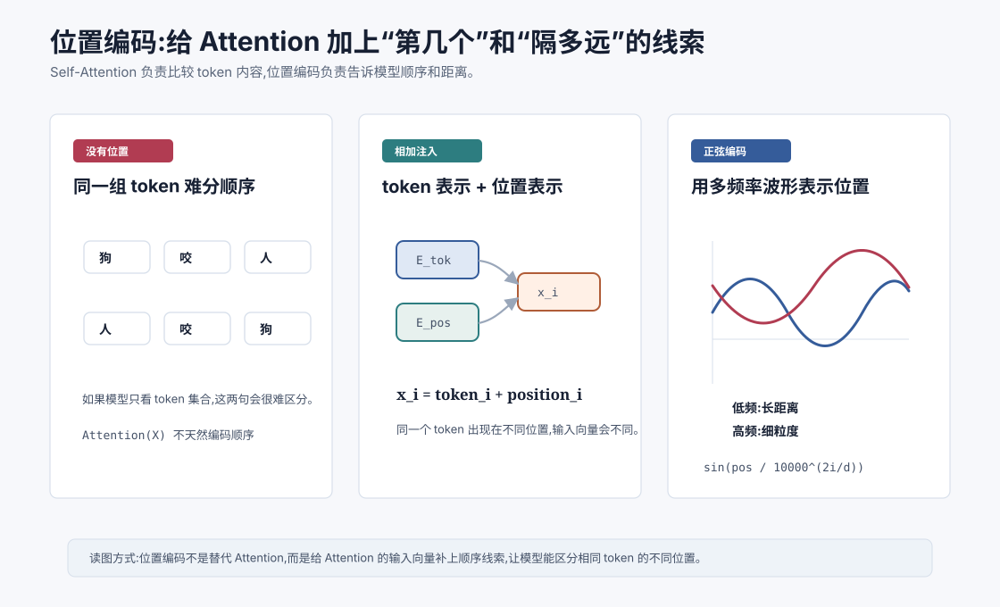
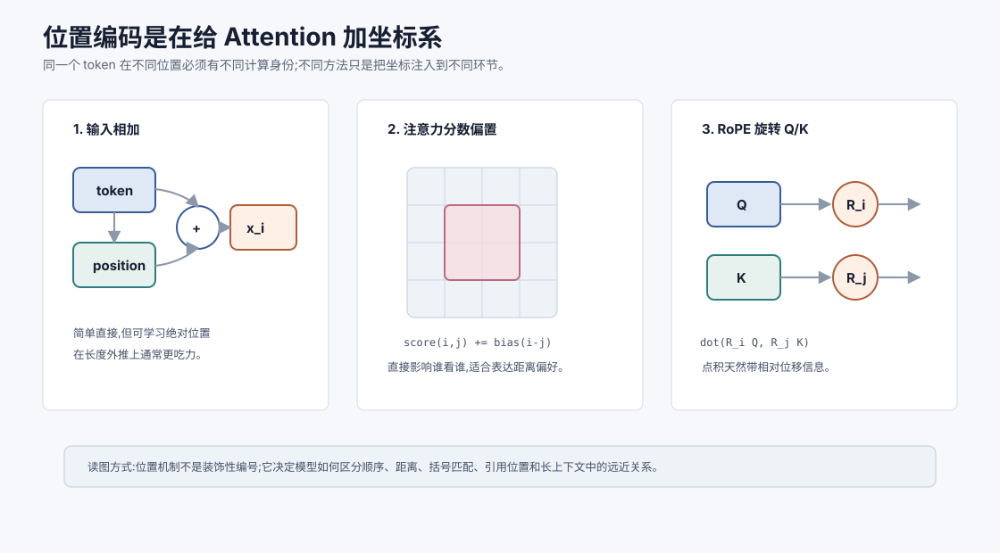

# 位置编码 `[进阶]` ★

Self-Attention 让每个 token 可以查看其他 token,但它本身有一个微妙问题:

**如果不额外提供位置信息,Attention 并不天然知道 token 的顺序。**

对自然语言来说,顺序极其重要。

```text
狗 咬 人
人 咬 狗
```

这两句话包含同样三个 token,但意思完全不同。

Transformer 要理解它们,必须知道谁在前、谁在后、相隔多远。

这就是位置编码要解决的问题。

更准确地说,位置编码不是给 token 贴一个肉眼可读的编号,而是给整个 Attention 计算提供坐标系。没有坐标系时,模型只能根据内容相似性交流;有了坐标系,模型才有机会学习“前一个词”“括号之间”“定义到使用”“用户最初约束到当前步骤”这些关系。





本章会讲:

- 为什么 Self-Attention 本身不编码顺序。
- 位置编码如何注入 token 表示。
- 绝对位置编码和可学习位置嵌入。
- 正弦位置编码的公式和直觉。
- 相对位置为什么重要。
- 位置编码和长上下文能力有什么关系。

## Attention 为什么不天然知道顺序

Self-Attention 的核心是:

$$
\text{Attention}(Q,K,V)=\text{softmax}\left(\frac{QK^T}{\sqrt{d_k}}\right)V
$$

如果输入只是 token 向量集合,这个计算主要根据向量相似性决定谁看谁。

它没有像 RNN 那样一步一步从左到右读取,也没有卷积那样固定的局部位置结构。

换句话说,Self-Attention 很擅长回答:

> 哪些 token 内容相关?

但它需要额外帮助来回答:

> 这些 token 的顺序和距离是什么?

所以 Transformer 必须把位置信息加入输入表示或注意力计算中。

这里的关键是**置换等变性**。如果没有位置编码,把输入 token 的顺序打乱,Self-Attention 的计算结构本身不会像 RNN 那样天然感知“谁先被读到”。它会重新计算相似性,但没有额外信号说明某个 token 原来在第 1 位还是第 10 位。

这对语言是致命的。语义不仅来自词本身,也来自词之间的顺序、距离和方向。

## 最简单的做法:token embedding 加 position embedding

最常见的直觉是,每个位置都有一个位置向量。

token 本身有 token embedding:

$$
e_i = \text{TokenEmbedding}(token_i)
$$

位置也有 position embedding:

$$
p_i = \text{PositionEmbedding}(i)
$$

模型输入是两者相加:

$$
x_i = e_i + p_i
$$

这样,同一个 token 出现在不同位置时,输入向量会不同。

比如“狗”出现在第 1 位和第 3 位:

$$
x_1 = e_{狗} + p_1
$$

$$
x_3 = e_{狗} + p_3
$$

虽然 token embedding 相同,但位置向量不同,最终输入表示也不同。

## 为什么是相加而不是拼接

位置向量和 token 向量常用相加,而不是拼接。

相加的好处是维度保持不变:

$$
x_i \in \mathbb{R}^{d_{model}}
$$

如果拼接,维度会变大,后续层都要适配新维度。

相加可以理解为:在原有 token 表示中叠加一组位置方向。

模型后续的线性层可以自己学习如何使用这些位置线索。

这不意味着相加是唯一方案。后来的很多位置方法会把位置信息注入注意力分数、旋转 Q/K 向量,或使用相对位置偏置。第 15 章会讲 RoPE 和 ALiBi。

相加还有一个直觉:模型后续层看到的是“词义 + 位置”混合后的表示。线性层可以学会读取其中的某些方向,例如某些维度更像局部顺序信号,某些维度更像长距离周期信号。

但这种方式也有局限。位置信息只在输入层直接注入,后面如何保留和使用它,要靠多层网络自己学。相对位置偏置和 RoPE 则把位置更直接地放进注意力打分环节,让“两个 token 相隔多远”更自然地影响谁看谁。

## 可学习位置嵌入

一种简单方案是可学习位置嵌入。

如果最大上下文长度是 $L$,模型维护一张位置表:

$$
P \in \mathbb{R}^{L \times d_{model}}
$$

第 $i$ 行就是位置 $i$ 的向量:

$$
p_i = P[i]
$$

这和 token embedding 表很像。训练过程中,模型会学习每个位置的表示。

优点是简单、灵活,模型可以自己决定不同位置该怎么编码。

缺点是外推不自然。如果训练时最大位置是 2048,那位置 4096 的向量没有被训练过。想扩展上下文长度,就会遇到位置表和泛化问题。

可学习位置嵌入还有一个实际问题:它容易把模型绑定到训练长度分布。模型可能学会“第 1 段常是标题”“前几百 token 常有任务说明”“接近末尾常是答案”这类位置习惯。一旦推理时输入结构变化很大,模型未必能稳健泛化。

这不是说可学习位置嵌入不好,而是说它的泛化方式更依赖训练覆盖。对于长上下文和变长 Agent 轨迹,相对位置方法通常更自然。

## 正弦位置编码

Transformer 原论文使用的是正弦位置编码。它不是学习出来的,而是用固定公式生成。

对位置 $pos$ 和维度 $2i$:

$$
PE(pos,2i)=\sin\left(\frac{pos}{10000^{2i/d_{model}}}\right)
$$

对维度 $2i+1$:

$$
PE(pos,2i+1)=\cos\left(\frac{pos}{10000^{2i/d_{model}}}\right)
$$

也就是说,偶数维用正弦,奇数维用余弦。

不同维度使用不同频率。有些维度变化很快,适合区分近距离位置。有些维度变化很慢,适合表达长距离趋势。

## 正弦编码的直觉

可以把正弦位置编码想成给每个位置一个多频率指纹。

低维度可能像快速波动的刻度尺,高维度可能像缓慢变化的刻度尺。

一个位置 $pos$ 会对应一组不同频率下的 sin/cos 值。

这些值组合起来,形成该位置的向量。

为什么用 sin/cos?

一个重要原因是它们可以表达相对位移关系。对于固定偏移 $k$,位置 $pos+k$ 的 sin/cos 可以由位置 $pos$ 的 sin/cos 通过线性变换表示。

这给模型学习“相隔多少位置”提供了线索。

不需要现在推完整三角恒等式。直觉上记住:正弦编码不是随便画波,它让位置和相对距离在向量空间里有规律可循。

多频率设计有一个非常漂亮的直觉:不同维度像不同刻度的尺子。

高频维度变化快,能区分相邻位置。低频维度变化慢,能覆盖更长距离。多个频率组合起来,模型既能感知局部顺序,也能获得较长范围的位置指纹。

这和用“个位、十位、百位”表示数字有一点类似:单个刻度范围有限,多个尺度组合后就能表达更大范围。

## 绝对位置和相对位置

位置可以有两种视角。

### 绝对位置

绝对位置关心 token 在第几个位置。

比如第 1 个、第 10 个、第 1024 个。

可学习位置嵌入和原始正弦位置编码都偏向绝对位置注入。

### 相对位置

相对位置关心两个 token 相隔多远、谁在谁前面。

语言中很多关系更依赖相对位置。

比如:

- 当前词的前一个词是什么。
- 右括号应该匹配前面某个左括号。
- 变量使用位置和定义位置相隔多远。
- 指代词和实体之间的距离。

相对位置对长上下文尤其重要。因为模型常常不关心某个 token 是全局第 5000 位,而更关心它距离当前位置 3 个 token、50 个 token,还是 1000 个 token。

后来的 RoPE、ALiBi 等方法,都在不同方式上强化了相对位置建模。

## 位置编码进入哪里

位置编码有多种注入方式。

### 加到输入 embedding

这是最直观的方式:

$$
x_i = e_i + p_i
$$

第一层 Self-Attention 接收到的就是带位置信息的 token 表示。

### 加到注意力分数

有些方法会在注意力分数里加入位置偏置。

比如两个位置距离越远,分数加上不同偏置。

### 改造 Q/K

RoPE 会对 Query 和 Key 做与位置相关的旋转,让点积自然带有相对位置信息。

不同方法各有取舍。本章先建立基础直觉,第 15 章再讲位置编码演进。

可以把位置注入方式整理成一张表。

| 注入位置 | 代表方法 | 直觉 | 主要取舍 |
| --- | --- | --- | --- |
| 输入 embedding | 可学习位置、正弦位置 | 给 token 表示加位置指纹 | 简单,但长外推依赖方法和训练 |
| 注意力分数 | 相对位置 bias、ALiBi 类思路 | 直接改变谁更容易看谁 | 对距离偏好表达直接 |
| Q/K 变换 | RoPE | 让点积自然包含相对位移 | 适合 Decoder-only LLM,扩长需谨慎 |

这三类不是“谁绝对最好”,而是把位置放进不同计算环节。理解这一点,第 15 章看 RoPE、ALiBi 时会轻松很多。

## 位置编码和长度外推

长度外推指模型在比训练更长的序列上仍然工作。

比如训练时最多见过 4096 token,推理时想用 32768 token。

位置编码会强烈影响长度外推。

如果使用可学习绝对位置表,超过训练最大长度的位置没有学过,外推困难。

正弦位置编码可以为任意位置生成向量,理论上更容易外推,但实际效果仍取决于训练分布和模型是否学会使用这些模式。

RoPE 等方法在长上下文扩展中很常见,但也需要缩放、插值或重新训练等技巧。

所以“支持长上下文”不是简单把位置编码长度调大。模型是否真的能利用长距离信息,还取决于训练数据、注意力机制、位置方法、推理优化和评估。

长度外推常见失败包括:

- 远处证据被忽略,模型只看最近内容。
- 中间位置的信息更容易丢失,出现“lost in the middle”。
- 位置缩放后局部顺序变模糊,代码和表格任务掉质量。
- 长上下文成本升高,系统不得不降低检索或验证次数。
- 模型标称支持长输入,但工具轨迹和多轮对话中的状态仍不稳定。

所以评估长上下文时,不要只问“最大窗口是多少”,还要问“在目标任务上,模型能不能找到并正确使用远处证据”。

## 位置编码和顺序敏感性

位置编码让模型能区分顺序,但不意味着模型一定完全理解顺序。

比如:

```text
A 在 B 之前
B 在 A 之前
```

模型要正确理解,不仅需要位置信息,还需要语义、语法和逻辑关系建模。

位置编码提供的是底层坐标系。真正的顺序推理还要靠 Attention、FFN、多层组合和训练数据。

这和地图类似:有坐标不代表你会导航,但没有坐标会更难导航。

## 位置编码在代码中的重要性

代码对位置和结构非常敏感。

比如:

```text
if (isReady) {
    run();
}
```

括号、缩进、作用域、变量定义和使用位置都依赖顺序。

模型要理解代码,必须知道:

- 某个变量在哪里定义。
- 当前语句属于哪个代码块。
- 括号和标签如何匹配。
- 函数调用参数的顺序。

位置编码提供基础顺序线索,Attention 则让远距离位置建立连接。

这也是代码模型和代码 Agent 特别依赖长上下文与位置机制的原因之一。

## 位置编码和 Agent 上下文

Agent 上下文通常是结构化文本:

```text
系统约束:
...

用户目标:
...

工具结果:
...

当前任务状态:
...
```

这些片段的顺序会影响模型行为。

如果关键约束放得太远,中间夹杂大量噪声,模型可能难以稳定使用它。

如果工具结果和解释混在一起,模型可能误把不可信文本当成高优先级指令。

位置编码告诉模型文本顺序,但不会替你设计清晰上下文。

所以 Agent 工程中仍要注意:

- 关键边界放在稳定位置。
- 不可信内容明确标记。
- 工具结果分块清晰。
- 最近状态和最终目标都要容易被模型定位。
- 长历史要摘要或检索,不要盲目堆叠。

可以把 Agent 上下文设计成“帮助位置机制工作”。

例如,关键系统约束放在稳定位置,最近用户目标放在靠近生成位置的地方,工具结果用明确边界包起来,长期记忆只检索相关片段。这样模型不需要在一团无结构文本里猜哪里重要。

位置编码只是底层坐标,上下文工程是在坐标上修路标。坐标再好,路标混乱也会迷路。

## 常见误解

### 误解一:Self-Attention 自然知道顺序

不自然知道。它需要位置编码或类似机制提供顺序信息。

### 误解二:位置编码只是在开头加一个编号

不是。位置编码是高维向量或注意力偏置,会参与后续所有层的计算。

### 误解三:可学习位置嵌入一定比固定正弦更好

不一定。可学习位置嵌入灵活,但长度外推可能更困难。具体取决于任务和模型设计。

### 误解四:能生成更长位置编码就等于支持长上下文

不等于。长上下文能力还需要训练、注意力计算、位置外推、推理显存和评估共同支持。

### 误解五:相对位置只是绝对位置的细节

相对位置非常重要。很多语言和代码关系依赖“相隔多远”和“谁在谁前面”,不只是全局第几个 token。

### 误解六:位置编码只影响长上下文

短上下文也需要位置编码。语序、括号、参数顺序、否定词位置都依赖位置机制。

### 误解七:位置编码能解决所有长上下文问题

不能。长上下文还需要训练数据覆盖、注意力计算、KV Cache 管理、上下文选择和任务评估。

### 误解八:把重要信息放进窗口就等于模型会用

不一定。信息位置、周围噪声、格式边界和任务提示都会影响模型是否真正使用它。

## 本章小结

Self-Attention 擅长让 token 彼此交互,但它本身不天然编码顺序。位置编码给 token 表示加入位置信息,让模型能区分相同 token 在不同位置的意义。可学习位置嵌入简单灵活,正弦位置编码用多频率波形提供固定位置指纹,相对位置方法则更关注 token 之间的距离和方向。位置机制会直接影响模型的顺序理解、代码能力和长上下文外推。

下一章会讲残差、LayerNorm 与 FFN。到目前为止,我们已经知道 Attention 如何混合 token 信息,位置编码如何注入顺序。接下来要看 Transformer 如何把这些模块稳定地堆成深层网络。
