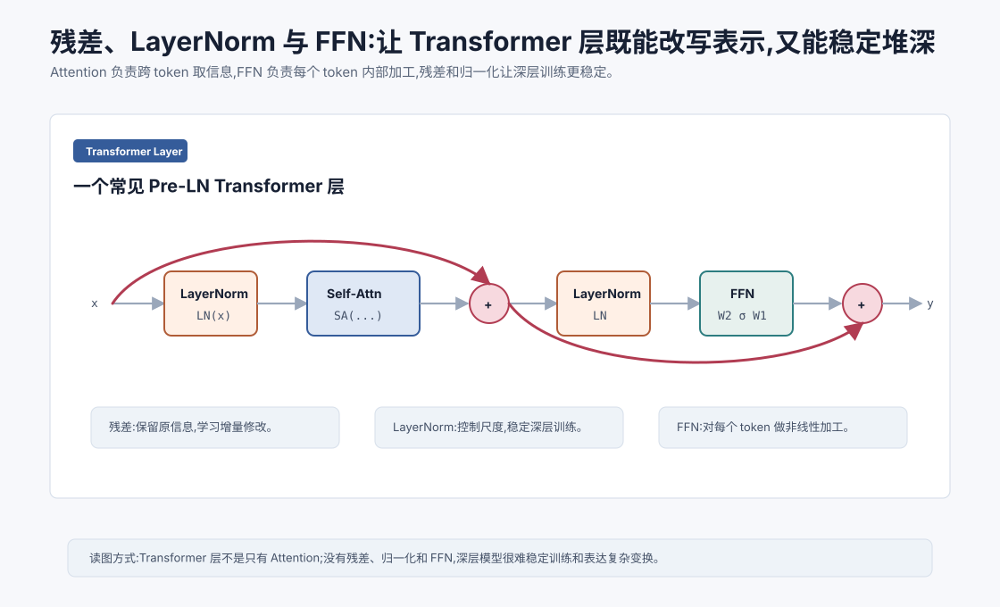
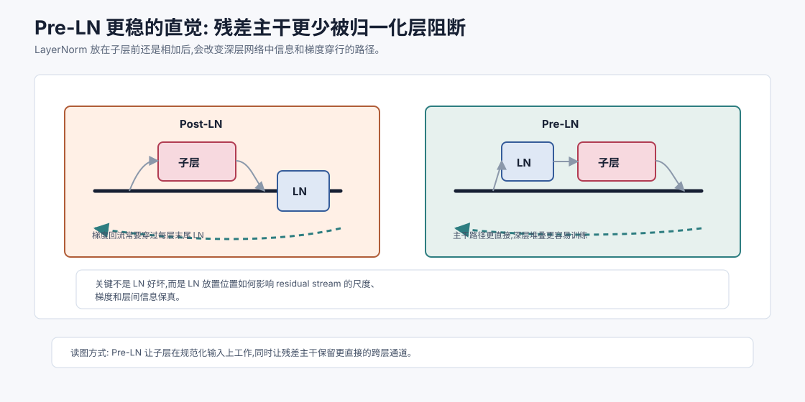
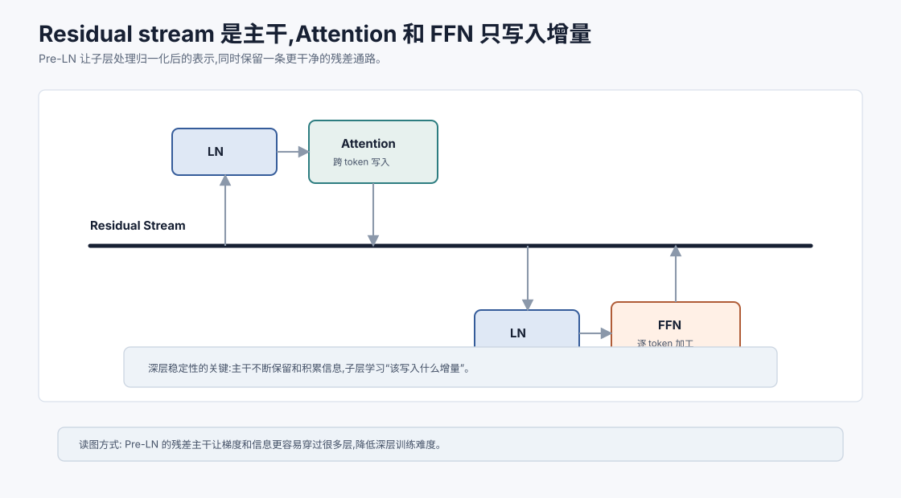

# 残差、LayerNorm 与 FFN `[进阶]`

前面几章已经讲了 Transformer 中最显眼的部分:Self-Attention、多头注意力和位置编码。

但一个真实 Transformer 层不只是 Attention。

如果只把 Attention 一层层堆起来,训练会很不稳定,表达能力也不完整。Transformer 之所以能堆到几十层甚至上百层,还依赖三个关键结构:

1. **残差连接**:让信息可以绕过子模块,保留原表示。
2. **LayerNorm**:控制向量尺度,稳定训练。
3. **FFN**:对每个 token 的表示做非线性加工。



本章会讲:

- 残差连接为什么能让深层网络更容易训练。
- LayerNorm 在归一化什么,为什么适合序列模型。
- Pre-LN 和 Post-LN Transformer 有什么区别。
- FFN 在 Transformer 层中负责什么。
- Attention 与 FFN 如何分工。
- 这些结构和大模型稳定性有什么关系。

## Transformer 层的基本结构

一个 Transformer 层通常包含两个子层:

1. Multi-Head Self-Attention。
2. Feedforward Network。

每个子层外面都有残差连接和归一化。

现代大模型常见的是 Pre-LN 结构,简化写法是:

$$
x' = x + \text{Attention}(\text{LN}(x))
$$

$$
y = x' + \text{FFN}(\text{LN}(x'))
$$

这里:

- $x$ 是输入 token 表示。
- $\text{LN}$ 是 LayerNorm。
- Attention 混合不同 token 的信息。
- FFN 加工每个 token 内部的特征。
- 残差连接把子层输出加回原输入。

这两行公式看起来简单,但背后是深层 Transformer 能训练起来的重要原因。

## 残差连接:学习增量而不是重写一切

残差连接的形式很简单:

$$
y = x + F(x)
$$

其中 $F(x)$ 是某个子模块,比如 Attention 或 FFN。

如果没有残差,子模块必须直接产生完整的新表示:

$$
y = F(x)
$$

有残差后,子模块只需要学习对原表示的“增量修改”。

可以把它理解成:

> 保留原来的信息,再补上一些新信息。

这对深层网络非常重要。每一层不必从零重写表示,只要在已有表示上做调整。

## 残差如何帮助梯度传播

深层网络训练困难的一大原因是梯度要穿过很多层。层数越深,梯度越容易变小、变大或变得不稳定。

残差连接提供了一条更直接的路径。

如果:

$$
y = x + F(x)
$$

那么 $y$ 对 $x$ 的导数包含一项直接的 1。

直觉上,梯度可以沿着跳连路径更顺畅地传回前面层。

这不是说残差解决所有优化问题,但它显著降低了深层网络训练难度。

Transformer、ResNet 等深层模型都大量依赖残差连接。

## 残差不是简单复制

残差连接不是让模型偷懒复制输入。

它给模型一个选择:

- 如果某层不需要大改,可以让 $F(x)$ 接近 0,保留原表示。
- 如果某层发现重要关系,可以通过 $F(x)$ 写入新信息。

这让每层更像“编辑器”而不是“重建器”。

对语言模型来说,某个 token 的表示会在多层中逐步被编辑:先加入局部语法信息,再加入实体关系,再加入任务目标和上下文线索。

## LayerNorm 在做什么

LayerNorm,全称 Layer Normalization,用于归一化一个 token 向量内部的维度。

给定一个向量:

$$
x = [x_1, x_2, \ldots, x_d]
$$

先计算均值:

$$
\mu = \frac{1}{d}\sum_{i=1}^{d}x_i
$$

再计算方差:

$$
\sigma^2 = \frac{1}{d}\sum_{i=1}^{d}(x_i-\mu)^2
$$

归一化:

$$
\hat{x}_i = \frac{x_i-\mu}{\sqrt{\sigma^2+\epsilon}}
$$

最后再用可学习参数缩放和平移:

$$
y_i = \gamma_i\hat{x}_i + \beta_i
$$

这里 $\gamma$ 和 $\beta$ 是可学习参数。

LayerNorm 的作用是控制每个 token 向量的尺度和分布,让后续层看到更稳定的输入。

## 为什么不用 BatchNorm

BatchNorm 在视觉模型中很常见,它通常沿 batch 维度统计均值和方差。

但 NLP 和 Transformer 中,LayerNorm 更合适。

原因包括:

- 序列长度可变。
- batch size 可能受显存限制。
- 自回归生成时一次可能只有少量 token。
- 不同样本的 token 分布差异很大。

LayerNorm 对每个样本、每个 token 自己的 hidden 维度做归一化,不依赖 batch 统计,更适合语言模型。

## Pre-LN 和 Post-LN

Transformer 原论文使用的是 Post-LN 结构。简化写法是:

$$
x' = \text{LN}(x + \text{Attention}(x))
$$

$$
y = \text{LN}(x' + \text{FFN}(x'))
$$

也就是先子层和残差相加,再 LayerNorm。

很多现代大模型使用 Pre-LN:

$$
x' = x + \text{Attention}(\text{LN}(x))
$$

$$
y = x' + \text{FFN}(\text{LN}(x'))
$$

也就是先归一化,再进入子层,最后残差相加。

Pre-LN 通常更利于深层训练稳定,因为残差路径更干净,梯度传播更顺畅。

不过不同模型会有不同变体,比如 RMSNorm、Sandwich-LN、DeepNorm 等。后面讲架构演进时会再展开。



Pre-LN 和 Post-LN 的差别不只是公式顺序不同,而是残差主干是否能更直接地跨层传递。

在 Post-LN 中,每个子层输出和残差相加后立刻经过 LayerNorm。LayerNorm 会重新调整尺度和方向,这对浅层模型没问题,但层数很深时,梯度回传和信息穿过每层末尾的归一化会更敏感。训练通常更依赖学习率 warmup、初始化和残差缩放等技巧。

在 Pre-LN 中,LayerNorm 放在子层输入前,残差相加后的主干不再立刻被同一个子层的 LN 改写。这样一来,跨很多层的路径更像一条连续的 residual stream,子层只在规范化后的输入上计算增量。这是现代深层 Decoder-only LLM 偏爱 Pre-LN 或 RMSNorm-before-block 的重要原因。

但也不要把它理解成“Pre-LN 永远更好”。Post-LN 在某些设置下也能通过改良初始化、残差缩放或 DeepNorm 等方法稳定训练。更准确的结论是:归一化位置会改变优化几何,而不是一个可以随意移动的装饰层。

## FFN 在 Transformer 中做什么

Attention 负责 token 之间的信息交互。

FFN 负责每个 token 内部的非线性加工。

标准 FFN 可以写成:

$$
\text{FFN}(x)=W_2\sigma(W_1x+b_1)+b_2
$$

它通常会先把维度扩展,再压回原维度。

比如:

$$
d_{model}=4096
$$

中间维度可能是:

$$
d_{ff}=11008 \quad \text{或} \quad 16384
$$

过程是:

$$
4096 \rightarrow 11008 \rightarrow 4096
$$

直觉上,FFN 把 token 表示展开到更宽的特征空间,做非线性变换,再压回主干维度。

## Attention 和 FFN 的分工

可以粗略理解为:

- Attention:在不同 token 之间搬运信息。
- FFN:在每个 token 内部加工信息。

比如一句话:

```text
小明把书放进包里,因为它明天上课要用。
```

Attention 可以让“它”读取“书”“包”“小明”等位置的信息。

FFN 则在“它”的向量内部加工这些读来的信息,形成更适合后续层使用的表示。

这不是绝对分工,但很有帮助。

如果只有 Attention,模型可以混合上下文,但缺少足够强的逐位置非线性变换。

如果只有 FFN,每个 token 内部能加工,但 token 之间难以交换信息。

两者合起来才构成 Transformer 层的主体能力。

## 为什么 FFN 参数很多

FFN 通常占 Transformer 参数量的大头之一。

假设 $d_{model}=4096$, $d_{ff}=16384$。

第一层矩阵参数量大约是:

$$
4096 \times 16384
$$

第二层矩阵参数量也是:

$$
16384 \times 4096
$$

合起来非常大。

这也是为什么不能只把 Transformer 理解成 Attention。大量能力和知识模式可能分布在 FFN 参数中。

Attention 决定信息从哪里来,FFN 决定这些信息如何被加工。

## 激活函数的选择

早期 Transformer 使用 ReLU。

后来很多模型使用 GELU、SwiGLU 等激活。

SwiGLU 类结构常写成门控形式,大致是:

$$
\text{FFN}(x)=W_2(\text{SiLU}(xW_a) \odot xW_b)
$$

这里 $\odot$ 是逐元素乘法。

门控激活让一部分特征控制另一部分特征通过多少,通常能提升模型表现。

本章不展开所有激活变体。你只要记住:FFN 的非线性不是装饰,它直接影响模型表达能力和训练效果。

## Dropout 和训练稳定性

经典 Transformer 中,Attention 权重、FFN 输出、残差路径附近常会使用 dropout。

Dropout 的作用是训练时随机丢弃部分激活,减少过拟合。

不过在现代超大模型预训练中,dropout 的使用会因数据规模、模型规模和训练策略不同而变化。有些大模型会使用很低 dropout,甚至不使用传统 dropout。

这提醒我们:架构组件不是固定教条,会随着规模和训练范式演进。

## LayerNorm 和数值稳定性

深层 Transformer 中,激活尺度如果不断放大或缩小,训练会变得困难。

LayerNorm 帮助每层输入保持相对稳定。

但 LayerNorm 也不是免费午餐。它会带来计算开销,并影响推理效率。后来的 RMSNorm 去掉均值中心化,只保留均方根归一化,在很多 LLM 中更常见。

第 16 章会专门讲 RMSNorm、SwiGLU 等架构改良。

## 残差流:信息的主干河道

可以把 Transformer 中的残差路径想成信息主干。



每一层的 Attention 和 FFN 都往这条主干里写入增量信息。

如果某个子层输出有用,它会改变主干表示。如果暂时不需要,残差路径仍然保留原信息。

这种结构让模型能逐层积累信息,而不是每层都冒险覆盖全部表示。

这也解释了为什么残差对深层模型如此关键。没有清晰的信息主干,几十层变换很容易把信号搅乱。

Residual stream 还有一个直觉:Transformer 层并不是把 token 表示“交给 Attention 处理完再交给 FFN”,而是让 Attention 和 FFN 向同一条主干不断写入增量。Pre-LN 让子层看到归一化后的输入,同时保留一条较干净的残差通路,这就是深层 Decoder-only LLM 常采用它的重要原因之一。

在工程调参里,如果模型训练早期 loss 爆炸、梯度不稳定或深层模型难以收敛,归一化位置、残差缩放、初始化和学习率常常要一起检查。它们不是互不相关的小技巧,而是在共同保护 residual stream 的数值尺度。

## 和 Agent 有什么关系

这些结构看起来很底层,但对理解 Agent 很有帮助。

第一,模型不是只靠 Attention 找资料。Attention 只是把上下文信息读进来,FFN 和后续层还会对信息进行复杂加工。

第二,模型的行为是多层逐步形成的。用户目标、系统约束、工具结果不会一次性变成答案,而是在很多层中反复混合和加工。

第三,上下文噪声会影响整条表示流。错误工具结果、不可信网页指令、过期记忆一旦进入上下文,可能通过 Attention 被读入,再经过 FFN 加工成后续决策的一部分。

第四,大模型的稳定性来自架构、训练和数据共同作用。不是只把参数堆大就够,还要有残差、归一化、激活和优化细节支撑。

## 常见误解

### 误解一:Transformer 就是 Attention

不准确。Attention 是核心,但残差、归一化、FFN、位置编码和输出层都非常关键。

### 误解二:残差连接只是把输入复制一遍

残差让子层学习增量修改,并帮助梯度传播。它是深层网络稳定训练的关键结构。

### 误解三:LayerNorm 只是数值小技巧

LayerNorm 直接影响训练稳定性、梯度传播和深层堆叠能力,不是可有可无的细节。

### 误解四:FFN 不如 Attention 重要

FFN 占据大量参数和计算,负责逐 token 的非线性加工,是模型能力的重要来源。

### 误解五:Pre-LN 和 Post-LN 没什么区别

它们都会影响训练稳定性和深层模型表现。现代 LLM 大量使用 Pre-LN 或相关变体。

## 本章小结

Transformer 层通常由 Attention 子层和 FFN 子层组成,每个子层配合残差连接和 LayerNorm。Attention 负责跨 token 信息交互,FFN 负责每个 token 内部的非线性加工,残差连接保留信息并改善梯度传播,LayerNorm 控制向量尺度并稳定训练。没有这些结构,Transformer 很难稳定堆成深层大模型。

下一章会把前面几章的组件拼成完整 Transformer 数据流:token embedding、位置编码、多头注意力、残差归一化、FFN、输出 logits 和 Softmax 如何串成一条完整生成路径。
