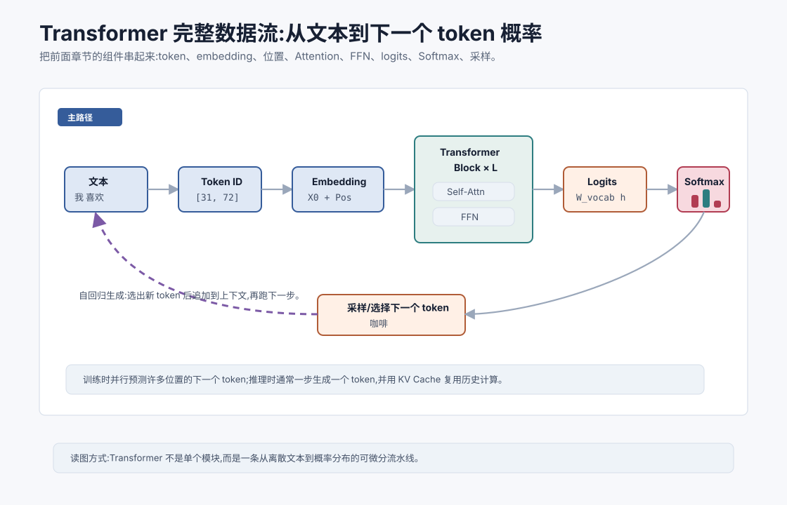
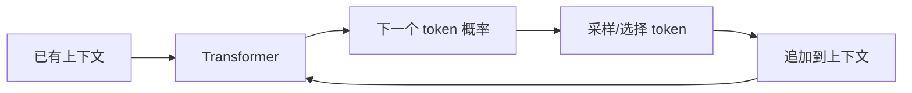

# Transformer 完整架构与数据流 `[主线]` ★

前面几章把 Transformer 的零件拆开讲了:

- Self-Attention 让 token 彼此读取信息。
- Q/K/V 把匹配和读取解耦。
- 多头注意力提供多个信息路由视角。
- 位置编码补上顺序线索。
- 残差、LayerNorm 和 FFN 让模型能稳定堆深。

这一章把它们重新装回一台完整机器。

我们要回答一个朴素但关键的问题:

**一段文本进入 Transformer 后,到底怎样一步步变成下一个 token 的概率分布?**



本章会讲:

- 文本如何变成 token ID 和 embedding。
- Transformer block 内部的数据如何流动。
- Decoder-only 语言模型如何预测下一个 token。
- 训练时和推理时的数据流有什么不同。
- logits、Softmax、采样如何接到生成过程。
- 为什么 KV Cache 能加速自回归推理。

## 从文本到 token ID

模型不能直接读取自然语言字符串。

第一步是 tokenizer 把文本切成 token,再把 token 映射成 ID。

比如:

```text
我 喜欢 咖啡
```

可能变成:

```text
[31, 72, 2047]
```

这些 ID 是离散编号,本身没有语义。它们需要通过 embedding 表变成向量。

如果序列长度是 $T$,输入 ID 是:

$$
[id_1,id_2,\ldots,id_T]
$$

Embedding 表会查出 token 向量:

$$
E[id_1],E[id_2],\ldots,E[id_T]
$$

堆成矩阵:

$$
X_{tok} \in \mathbb{R}^{T \times d_{model}}
$$

## 加入位置编码

仅有 token embedding 不够,模型还需要知道顺序。

位置编码或位置嵌入给每个位置一个向量:

$$
X_{pos} \in \mathbb{R}^{T \times d_{model}}
$$

输入表示通常是:

$$
X^{(0)} = X_{tok} + X_{pos}
$$

这里 $X^{(0)}$ 就是进入第一层 Transformer block 的表示。

它既包含 token 内容,也包含位置信息。

## Transformer block 的数据流

一个 Pre-LN Transformer block 可以简化写成:

$$
U^{(l)} = X^{(l)} + \text{MHA}(\text{LN}(X^{(l)}))
$$

$$
X^{(l+1)} = U^{(l)} + \text{FFN}(\text{LN}(U^{(l)}))
$$

这里:

- $l$ 是层编号。
- MHA 是 Multi-Head Attention。
- FFN 是前馈网络。
- LN 是 LayerNorm。
- 残差连接保留输入并加上子层输出。

如果模型有 $L$ 层,数据会依次经过:

$$
X^{(0)} \rightarrow X^{(1)} \rightarrow \cdots \rightarrow X^{(L)}
$$

最后的 $X^{(L)}$ 是每个 token 的深层上下文表示。

## 每一层到底改变了什么

每一层都会改写 token 表示。

Attention 子层让每个 token 从其他 token 读取信息。

FFN 子层对每个 token 内部做非线性加工。

残差路径保留原信息。

LayerNorm 控制尺度。

经过多层后,一个 token 的表示不再只是它自己的词义,而是融合了上下文、位置、语法、指代、任务目标和格式约束。

比如最后一个 token 的向量可能已经包含:

- 前文主题。
- 当前句法结构。
- 用户问题意图。
- 系统指令约束。
- 工具返回事实。
- 输出格式要求。

这就是为什么最后一个隐藏向量可以用于预测下一个 token。

## 输出投影到词表 logits

Transformer 最后一层输出是:

$$
X^{(L)} \in \mathbb{R}^{T \times d_{model}}
$$

语言模型需要为每个位置预测下一个 token。

所以会把每个位置的隐藏向量投影到词表大小:

$$
Z = X^{(L)}W_{vocab}
$$

其中:

$$
W_{vocab} \in \mathbb{R}^{d_{model} \times V}
$$

$V$ 是词表大小。

于是:

$$
Z \in \mathbb{R}^{T \times V}
$$

$Z$ 的每一行都是一个位置上的 logits。

如果词表有 100,000 个 token,每个位置都会输出 100,000 个分数。

## Softmax 和下一个 token 概率

logits 不是概率。

对某个位置 $t$,模型会用 Softmax 得到下一个 token 的概率分布:

$$
P(x_{t+1}\mid x_{\leq t})=\text{softmax}(z_t)
$$

这里 $z_t$ 是第 $t$ 个位置的 logits。

如果上下文是:

```text
我 喜欢 喝
```

模型可能输出:

| token | 概率 |
| --- | --- |
| 咖啡 | 0.42 |
| 茶 | 0.21 |
| 水 | 0.15 |
| 酒 | 0.04 |
| 其他 | 0.18 |

采样策略再决定实际生成哪个 token。

## 自回归生成

Decoder-only LLM 通常使用自回归生成。

也就是一次生成一个 token,再把新 token 加回上下文,继续生成下一个。

流程是:



如果上下文是:

```text
我 喜欢 喝
```

模型生成“咖啡”后,下一步上下文变成:

```text
我 喜欢 喝 咖啡
```

然后继续预测下一个 token。

这就是为什么生成长文本会慢:输出多少 token,就要进行多少步自回归生成。

## 训练时和推理时的差别

训练和推理的数据流不完全一样。

### 训练时

训练时,模型可以一次输入完整训练序列,并行计算每个位置的 logits。

比如:

```text
我 喜欢 喝 咖啡
```

模型会同时学习:

| 输入位置 | 目标下一个 token |
| --- | --- |
| 我 | 喜欢 |
| 我 喜欢 | 喝 |
| 我 喜欢 喝 | 咖啡 |

虽然所有位置并行计算,但 causal mask 会防止每个位置看到未来 token。

### 推理时

推理时,未来 token 还不存在。模型只能先生成一个,再生成下一个。

所以推理是自回归串行的。

这也是 LLM 推理延迟的重要来源。

## Causal mask 的位置

在 Decoder-only Transformer 中,causal mask 作用在 Attention 分数上。

每个位置只能看自己和之前的位置。

如果序列长度是 4,第 2 个位置不能关注第 3、4 个位置。

这保证训练目标和推理条件一致:

$$
P(x_t \mid x_{<t})
$$

模型不能偷看答案。

## KV Cache 为什么有用

自回归推理时,每一步都会多一个 token。

如果每次都从头计算整个上下文,会非常浪费。

比如已经生成了 1000 个 token,现在要生成第 1001 个 token。

过去 1000 个 token 的 Key 和 Value 在前面步骤已经算过了。

KV Cache 会把它们缓存起来。

下一步只需要:

1. 为新 token 计算 Query、Key、Value。
2. 用新 Query 去关注缓存中的所有 Key。
3. 读取缓存中的 Value。
4. 把新 token 的 Key、Value 追加到缓存。

这样可以避免重复计算历史 token 的 K/V。

注意,KV Cache 主要加速推理。训练时通常仍然用矩阵并行计算整段序列。

## 为什么上下文越长越贵

上下文长度影响两类成本。

第一,Attention 成本。标准 Self-Attention 的注意力矩阵是:

$$
T \times T
$$

训练时,长度越长,注意力计算和显存开销越大。

第二,KV Cache 成本。推理时,每层、每个 head 都要缓存过去 token 的 Key 和 Value。

上下文越长,缓存越大。

这就是为什么长上下文模型不仅需要算法设计,还需要工程优化。后面讲 KV Cache、Flash Attention、PagedAttention 时会展开。

## Decoder-only 为什么成为主流

现代通用 LLM 多采用 Decoder-only Transformer。

它的核心训练目标简单统一:

$$
\text{预测下一个 token}
$$

这个目标可以适配大量文本数据,也天然适合生成。

通过指令微调和对齐,Decoder-only 模型可以完成问答、写作、代码、工具调用、推理和多轮对话等任务。

当然,Encoder-only 和 Encoder-Decoder 仍然有价值。比如 BERT 类模型适合理解任务,T5 类结构适合某些序列到序列任务。

第 13 章会专门讲 Transformer 三大分支。

## 端到端看一次生成

假设用户输入:

```text
法国的首都是
```

模型生成“巴黎”的过程可以简化成:

1. tokenizer 把文本切成 token ID。
2. embedding 表把 ID 变成向量。
3. 加入位置编码。
4. 多层 Transformer block 更新每个 token 表示。
5. 取最后位置的隐藏向量。
6. 输出投影得到词表 logits。
7. Softmax 得到概率分布。
8. 解码策略选择“巴黎”。
9. 把“巴黎”追加到上下文,继续下一步。

这条链路就是 LLM 生成的主路径。

## 和 Agent 有什么关系

Agent 系统最终也依赖这条数据流。

工具描述、历史消息、检索片段、系统约束、用户目标,都会被转成 token,进入 Transformer。

模型不是直接“理解一个工具对象”,而是通过 token 序列里的文本描述和结构来形成隐藏表示。

这带来几个工程判断。

第一,上下文组织会影响隐藏表示。格式清晰、边界明确、重点突出,模型更容易形成正确表示。

第二,输出格式也是 token 生成问题。如果 JSON schema 很复杂,模型需要逐 token 生成合法结构,因此需要约束、校验和重试。

第三,工具调用本质上是模型在某个位置生成特定结构化 token 序列。它仍然受上下文、概率、采样和训练分布影响。

第四,长任务贵,不是因为模型“懒”,而是自回归生成和长上下文计算本来就有成本。

理解完整数据流,能让你更清楚地优化 Agent:减少无关上下文、压缩工具结果、控制输出长度、使用缓存、设计更稳的结构化输出。

## 常见误解

### 误解一:模型一次性生成整段回答

通常不是。自回归语言模型一次生成一个 token,不断追加上下文。

### 误解二:训练时也必须一个 token 一个 token 慢慢算

训练时可以并行计算许多位置的预测,causal mask 保证不看未来。

### 误解三:KV Cache 会让注意力成本消失

不会。KV Cache 避免重复计算历史 K/V,但新 token 仍要关注已有上下文,缓存也会占显存。

### 误解四:Transformer block 只是 Attention

完整 block 还包括 FFN、残差、归一化和输出投影等结构。

### 误解五:上下文越长效果一定越好

不一定。长上下文带来更多信息,也带来噪声、成本和注意力分配难度。关键是放入相关信息。

## 本章小结

Transformer 的完整数据流从文本 tokenization 开始,经过 embedding 和位置编码,进入多层 Transformer block。每层用 Attention 混合 token 信息,用 FFN 加工每个 token 表示,再通过残差和归一化稳定堆叠。最后隐藏向量被投影成词表 logits,Softmax 转成概率,解码策略选择下一个 token。训练时可以并行预测多个位置,推理时通常自回归逐 token 生成,并通过 KV Cache 复用历史计算。

到这里,Transformer 架构主线已经搭起来。下一章会进入 Transformer 发展史与变体,先看 Encoder-only、Encoder-Decoder、Decoder-only 三大分支,以及为什么 Decoder-only 成为通用 LLM 的主流。
