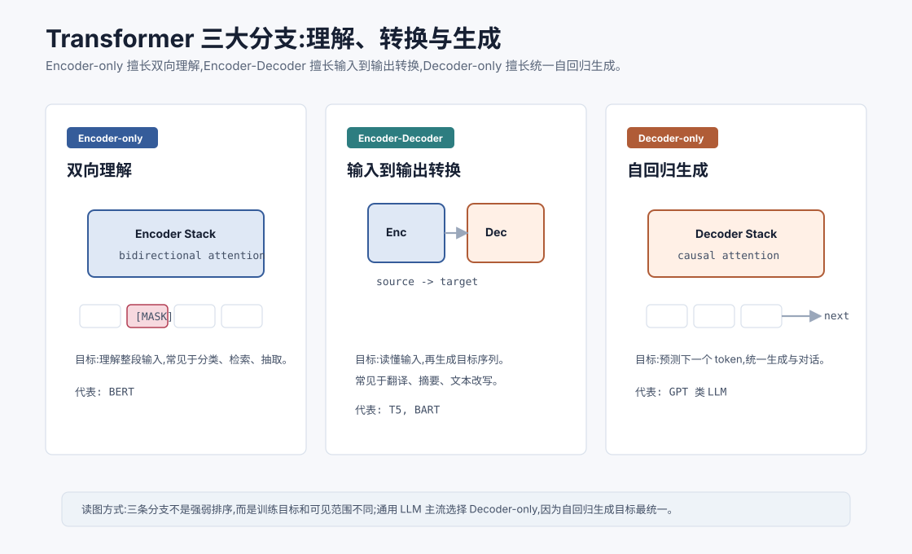
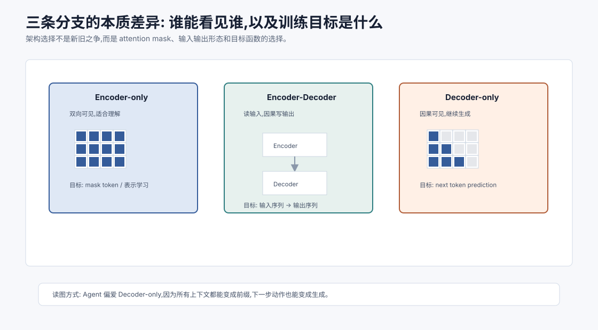
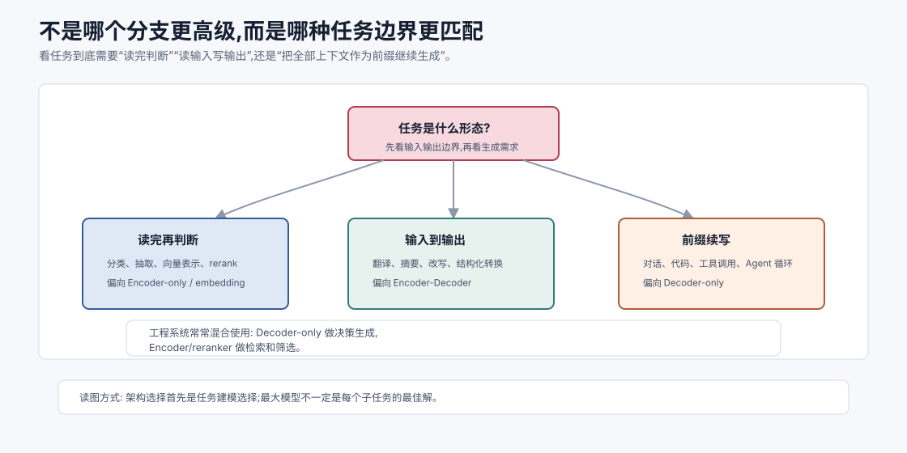

# 三大分支与 Decoder-only 为何主流 `[进阶]` ★

Transformer 不是只有一种形态。

从最初的机器翻译架构发展到今天的大语言模型,Transformer 逐渐形成了三条主要分支:

1. **Encoder-only**:擅长理解输入。
2. **Encoder-Decoder**:擅长把一个序列转换成另一个序列。
3. **Decoder-only**:擅长自回归生成,也是通用 LLM 的主流。

这三类架构不是简单的“谁先进谁落后”,而是训练目标、注意力可见范围和应用场景不同。



本章会讲:

- Encoder-only、Encoder-Decoder、Decoder-only 分别是什么。
- 它们的注意力 mask 和训练目标有何不同。
- 为什么 BERT、T5、GPT 代表了三种范式。
- 为什么通用对话式 LLM 最终偏向 Decoder-only。
- 这些架构选择对 Agent 有什么影响。

## 原始 Transformer 是 Encoder-Decoder

Transformer 最初用于机器翻译。

机器翻译天然是一个序列到序列任务:

```text
源语言句子 -> 目标语言句子
```

所以原始 Transformer 使用 Encoder-Decoder 结构。

Encoder 读取完整源句子,得到一组上下文表示。

Decoder 自回归生成目标句子,并通过 Cross-Attention 读取 Encoder 输出。

这非常适合翻译,因为输入和输出是不同序列。

但后来的研究发现,如果目标任务不同,可以只保留 Encoder 或只保留 Decoder,形成不同范式。

## Encoder-only:双向理解

Encoder-only 模型只使用 Transformer Encoder。

它的 Self-Attention 通常是双向的。也就是说,每个 token 可以看左边和右边所有 token。

这非常适合理解任务。

比如给一句话:

```text
这家店的服务很好,但价格太贵。
```

要做情感分类、关键词抽取、句向量表示时,模型应该看完整句子,不需要假装未来 token 不存在。

Encoder-only 的代表是 BERT。

## BERT 的 Masked Language Modeling

BERT 的经典训练目标是 Masked Language Modeling,简称 MLM。

训练时随机遮住一些 token:

```text
巴黎 是 [MASK] 的 首都
```

模型要根据左右上下文预测被遮住的 token。

因为它可以看左右两边,所以很适合学习双向语义表示。

这和自回归语言模型不同。自回归模型只能看过去,预测下一个 token。

BERT 的优势是理解能力强,适合:

- 文本分类。
- 命名实体识别。
- 语义匹配。
- 检索排序。
- 抽取式问答。
- 句向量或文档表示。

但它不天然适合从左到右长文本生成。

## Encoder-only 的局限

Encoder-only 模型能理解完整输入,但生成不是它的天然主场。

原因是它没有按自回归方式训练。

如果要让 BERT 类模型生成长文本,需要额外设计,例如反复 mask 或使用特殊解码策略,通常不如 Decoder-only 自然。

所以 BERT 很适合“读懂并判断”,但不适合作为通用聊天和写作模型的主体。

## Encoder-Decoder:读输入,写输出

Encoder-Decoder 模型包含两部分。

Encoder 双向读取输入序列。

Decoder 自回归生成输出序列。

Decoder 里通常有两种 Attention:

- Decoder Self-Attention:看已经生成的目标 token,带 causal mask。
- Cross-Attention:用 Decoder 的 Query 去读取 Encoder 的 Key/Value。

这非常适合输入输出都明确的任务。

比如:

```text
英文文章 -> 中文摘要
问题 + 文档 -> 答案
错误句子 -> 修正句子
源语言 -> 目标语言
```

代表模型包括 T5、BART 等。

## T5 的统一文本到文本框架

T5 的一个重要思想是把很多 NLP 任务都改写成 text-to-text。

比如:

```text
translate English to German: The house is wonderful.
```

输出:

```text
Das Haus ist wunderbar.
```

分类任务也可以改写成文本输出:

```text
sentiment: 这部电影很好看
```

输出:

```text
positive
```

这种范式很优雅。Encoder 负责理解输入,Decoder 负责生成输出。

## Encoder-Decoder 的局限

Encoder-Decoder 很适合明确的输入到输出转换,但作为通用开放式对话模型,它有一些复杂性。

第一,架构更复杂。需要维护 Encoder 和 Decoder 两套堆栈,以及 Cross-Attention。

第二,对纯生成任务来说,Encoder 可能不是必须的。把所有上下文作为一个前缀交给 Decoder-only 模型,也可以完成很多任务。

第三,现代对话、工具调用、代码生成和多轮上下文往往都可以统一成“给定前缀,继续生成”。这正好符合 Decoder-only 的目标。

这不是说 Encoder-Decoder 不好,而是通用 LLM 的规模化路径更偏向 Decoder-only。

## Decoder-only:预测下一个 token

Decoder-only 模型只使用 Transformer Decoder 的自注意力部分。

它使用 causal mask,每个位置只能看过去和当前位置。

训练目标非常简单:

$$
P(x_t \mid x_{<t})
$$

也就是预测下一个 token。

给定任意文本序列:

```text
x_1, x_2, ..., x_T
```

训练时模型学习:

```text
x_1 -> x_2
x_1 x_2 -> x_3
...
x_1 ... x_{T-1} -> x_T
```

这个目标简单、稳定、可扩展,而且可以使用海量普通文本。

GPT 类模型就是 Decoder-only 代表。

## 为什么 Decoder-only 适合通用 LLM

Decoder-only 成为通用 LLM 主流,有几个关键原因。

### 1. 训练目标统一

几乎所有文本都可以看成 token 序列。

预测下一个 token 不需要人工标注输入输出边界,可以直接利用海量语料。

这让预训练规模化非常自然。

### 2. 生成是核心能力

聊天、写作、代码、推理过程、工具调用参数,最终都可以表示为生成 token。

Decoder-only 的训练目标和推理方式完全一致:给定前缀,继续生成。

### 3. Prompt 很自然

用户指令、上下文、示例、工具结果都可以拼成前缀。

模型只需要继续生成回答。

这让 in-context learning、few-shot prompting、多轮对话都变得统一。

### 4. 架构更简单

相比 Encoder-Decoder,Decoder-only 不需要单独 Encoder 和 Cross-Attention。

结构简单有利于扩展、优化和部署。

### 5. 与自回归推理优化契合

KV Cache、连续批处理、PagedAttention、投机解码等优化都围绕自回归 Decoder-only 推理发展得很成熟。

## Decoder-only 的代价

Decoder-only 也不是没有缺点。

它只能从左到右看上下文。对于某些纯理解任务,双向 Encoder 可能更高效。

它生成长文本时必须逐 token 自回归,延迟较高。

它把所有任务都转成生成,有时需要额外约束输出格式。

它对上下文组织非常敏感,因为所有信息都放在一个前缀里。

所以 Decoder-only 是通用 LLM 主流,但不是所有任务的唯一最佳选择。

## 三类架构对比

| 架构 | 注意力可见范围 | 典型目标 | 代表 | 擅长 |
| --- | --- | --- | --- | --- |
| Encoder-only | 双向 | Masked LM / 表示学习 | BERT | 理解、分类、抽取、检索 |
| Encoder-Decoder | Encoder 双向,Decoder 因果 | 输入到输出生成 | T5/BART | 翻译、摘要、改写 |
| Decoder-only | 因果 | 下一个 token 预测 | GPT 类 | 对话、写作、代码、工具调用 |

这个表不是优劣排名。它是在说明:架构要和任务目标匹配。



从 mask 的角度看,三条分支的差异更直观:

- Encoder-only 没有因果限制,适合“读完整段再判断”。
- Encoder-Decoder 把“读输入”和“写输出”分开,Decoder 生成时通过 Cross-Attention 读取 Encoder 表示。
- Decoder-only 把所有内容放进同一个前缀里,只用因果注意力继续生成。

这也是为什么 Agent 工程通常围绕 Decoder-only 展开:系统指令、用户目标、工具说明、RAG 证据、历史状态都能被拼成前缀,模型只需要生成下一步动作或回答。但这也把上下文组织压力推给了应用层。



更实用的判断方法不是先问“哪个架构更强”,而是先问任务的输入输出边界。

如果任务是“读完一段文本,给一个标签、分数或向量”,Encoder-only 往往更自然。它可以双向读取完整输入,不需要逐 token 生成一段答案。很多检索、排序、分类和风控任务选择 Encoder 或小模型,并不是落后,而是更贴合目标和成本。

如果任务是“明确输入序列变成明确输出序列”,Encoder-Decoder 仍然非常清晰。Encoder 负责压缩输入,Decoder 负责生成输出,中间 Cross-Attention 提供稳定的信息读取路径。翻译、摘要、纠错、结构化改写都属于这类任务。

如果任务是“把系统指令、用户请求、工具说明、历史轨迹放在一起,继续生成下一步”,Decoder-only 的前缀建模就很有优势。Agent 的下一步动作、函数参数、代码 patch、解释文本都能被统一成生成目标。

真实系统经常是混合的:Decoder-only LLM 做推理和动作生成,embedding 模型做召回,reranker 做排序,分类器做安全或路由。理解三条分支的意义,不是为了选一个模型统治所有任务,而是为了把每个子任务放到合适的位置。

## 指令微调如何改变 Decoder-only

预训练的 Decoder-only 模型只是学会续写文本。

要变成助手,还需要监督微调和偏好对齐。

SFT 会给模型大量指令-回答样本:

```text
用户: 请解释 Self-Attention
助手: ...
```

模型仍然在做下一个 token 预测,但数据格式让它学会在用户指令后生成助手回答。

偏好对齐进一步让输出更有帮助、更安全、更符合人类期待。

所以通用聊天模型的底层仍是 Decoder-only 自回归生成,只是训练数据和对齐目标塑造了“助手行为”。

## Agent 为什么偏爱 Decoder-only LLM

Agent 系统需要模型做很多生成式决策:

- 解释用户目标。
- 生成计划。
- 选择工具。
- 填写工具参数。
- 阅读工具结果后继续推理。
- 生成最终回答。

这些都可以统一成“给定上下文,生成下一段结构化文本或动作”。

Decoder-only 模型非常适合这种循环。

例如:

```text
系统: 你可以使用这些工具...
用户: 帮我查找失败测试并修复
历史: 已运行测试,错误如下...
助手下一步: 调用 read_file(...)
```

模型只需要继续生成下一步动作。

工具调用、ReAct、Function Calling 等机制,本质上都建立在这个自回归生成能力上。

## 什么时候仍会用 Encoder

虽然通用 LLM 多是 Decoder-only,Encoder 并没有消失。

在很多系统里,Encoder 或 embedding 模型仍然很重要:

- 文档向量检索。
- 语义相似度计算。
- reranker 排序。
- 分类和风控模型。
- 低延迟理解任务。

一个 Agent 系统可能同时使用 Decoder-only LLM 做推理和生成,再使用 Encoder 类 embedding/reranker 做检索和排序。

所以实际工程不是“只选一种架构”,而是让不同模型承担合适角色。

## 常见误解

### 误解一:Decoder-only 一定比 Encoder-only 更高级

不是。它们面向不同任务。Encoder-only 在理解和表示任务上仍然很有价值。

### 误解二:Encoder-Decoder 已经过时

不准确。它在翻译、摘要、结构化输入到输出任务中仍然有清晰优势。

### 误解三:Decoder-only 只能续写,不能理解

预训练目标是续写,但为了做好续写,模型会学到大量可迁移表示和推理模式。指令微调后可以表现出很强的理解能力。

### 误解四:所有任务都应该交给同一个大 LLM

不一定。检索、排序、分类、风控等场景可能更适合专门的 Encoder 或小模型。

### 误解五:架构选择和 Agent 无关

架构决定模型如何看上下文、如何生成动作、如何部署优化。Agent 系统设计必须理解这些差异。

## 本章小结

Transformer 发展出 Encoder-only、Encoder-Decoder 和 Decoder-only 三大分支。Encoder-only 擅长双向理解,Encoder-Decoder 擅长输入到输出转换,Decoder-only 用因果注意力做下一个 token 预测,最适合统一大规模预训练、生成、对话和工具调用。通用 LLM 主流选择 Decoder-only,不是因为其他架构无用,而是因为自回归生成目标简单、可扩展、与 Prompt 和 Agent 循环天然契合。

下一章会讲注意力变体:稀疏注意力、线性注意力和滑窗注意力。标准 Self-Attention 很强,但 $T^2$ 成本让长上下文变贵,于是各种变体开始尝试降低复杂度。
