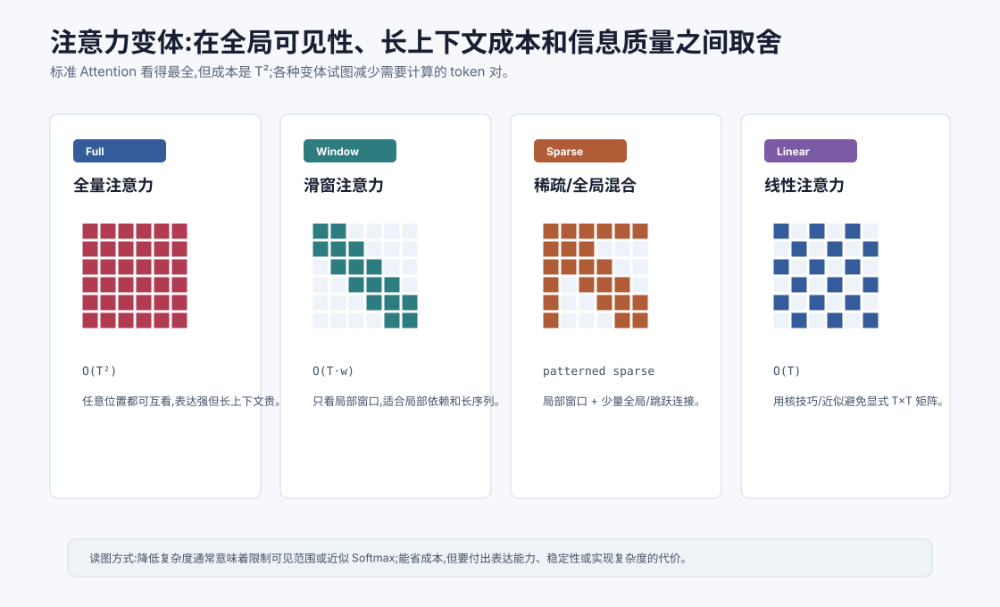
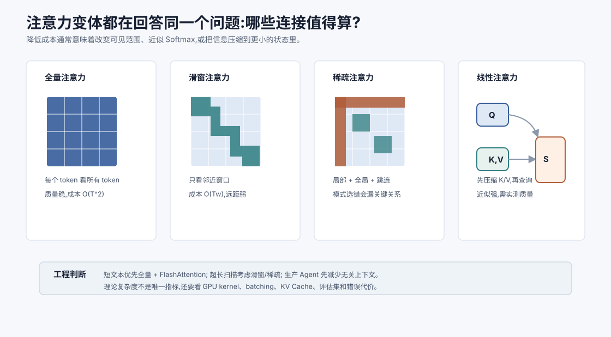

# 注意力变体:稀疏/线性/滑窗 `[进阶]` ★

标准 Self-Attention 很强,因为每个 token 都可以看所有 token。

但这也带来核心成本:

$$
T \times T
$$

如果序列长度是 $T$,注意力分数矩阵有 $T^2$ 个元素。上下文越长,成本增长越快。

当上下文从 4K 扩到 32K、128K,标准全量注意力会变得非常昂贵。

于是出现了很多注意力变体。它们共同尝试回答一个问题:

**能不能不计算所有 token 对之间的注意力,也尽量保留有用的信息交互?**

这句话里有两个目标:减少计算,保留信息路径。注意力变体的难点在于,这两个目标经常冲突。连接少了,成本会降;但如果少掉的是关键连接,质量就会掉。长上下文的真正难点不是“把复杂度写成线性”,而是让模型在更少连接中仍能找到任务需要的证据。





本章会讲:

- 标准注意力的平方复杂度来自哪里。
- 滑窗注意力如何利用局部性。
- 稀疏注意力如何混合局部和全局连接。
- 线性注意力如何尝试绕开 $T^2$。
- 这些方法各自牺牲什么。
- 为什么现代 LLM 不会简单用某个变体“一劳永逸”解决长上下文。

## 标准注意力贵在哪里

Self-Attention 的核心公式是:

$$
\text{Attention}(Q,K,V)=\text{softmax}\left(\frac{QK^T}{\sqrt{d_k}}\right)V
$$

其中:

$$
Q,K \in \mathbb{R}^{T \times d_k}
$$

所以:

$$
QK^T \in \mathbb{R}^{T \times T}
$$

这个 $T \times T$ 矩阵记录了每个位置对每个位置的注意力分数。

如果 $T=4096$,矩阵有约 1677 万个元素。

如果 $T=32768$,矩阵有约 10.7 亿个元素。

这还只是一个 batch、一个层、一个 head 的概念量级。真实训练和推理还要考虑多层、多头、激活保存、显存带宽等问题。

所以长上下文的瓶颈很真实。

## 降低成本的三条思路

注意力变体大致有三类思路。

### 限制可见范围

不让每个 token 看所有 token,只看局部窗口或特定模式。

代表:滑窗注意力、局部注意力。

### 设计稀疏连接

大部分位置只看少量位置,但保留一些全局 token 或跳跃连接,让远距离信息仍能传播。

代表:Longformer、BigBird 等思路。

### 近似 Softmax 注意力

通过核技巧、低秩近似或特征映射,避免显式构造 $T \times T$ 注意力矩阵。

代表:Linear Attention、Performer 等方向。

这些方法都不是免费午餐。省掉计算,通常意味着牺牲全局可见性、精确 Softmax、实现简单性或模型质量。

更工程化地看,每种方法都在回答三个问题:

1. 哪些 token 对必须直接交互?
2. 哪些信息可以通过多层传播、全局 token 或压缩状态间接传递?
3. 这种近似在目标任务上会漏掉什么?

如果只看复杂度公式,很容易误判。真实系统还要看 GPU kernel、batching、KV Cache、显存带宽、训练稳定性和评估集。

## 滑窗注意力

滑窗注意力,Sliding Window Attention,让每个 token 只关注附近窗口内的 token。

比如窗口大小是 $w$,位置 $i$ 只看:

$$
[i-w, i+w]
$$

在因果语言模型中,通常只看过去窗口:

$$
[i-w, i]
$$

这样每个位置只关注 $w$ 个左右的 token,复杂度从:

$$
O(T^2)
$$

变成:

$$
O(Tw)
$$

如果 $w$ 固定,复杂度接近线性增长。

## 滑窗注意力的优势

很多语言和代码依赖是局部的。

比如:

- 当前词和附近词的搭配。
- 局部语法结构。
- 代码中相邻行的缩进和括号。
- 对话中最近几轮的上下文。

滑窗注意力能高效捕捉这些局部关系。

它的实现相对直观,也适合非常长的序列。

## 滑窗注意力的局限

滑窗最大的问题是远距离直接连接变弱。

如果第 10000 个 token 需要看第 100 个 token,窗口注意力不能一步到位。

信息必须通过多层逐步传递:

```text
100 -> 100+w -> 100+2w -> ... -> 10000
```

这会增加建模难度。

所以滑窗适合局部性强的任务,但如果任务需要频繁远距离引用,单纯滑窗可能不够。

滑窗还有一个容易忽略的现象:多层堆叠可以扩大有效感受野,但不等于远距离信息能无损传递。

假设窗口大小是 $w$,第 1 层只能看附近 $w$ 个 token,第 2 层可以通过中间表示间接看到更远一些的信息。层数越多,理论上传播范围越大。但每次传播都会经过压缩和非线性变换,远处细节可能在中途被丢掉。

所以滑窗适合“局部连续性强”的任务,例如长日志扫描、局部代码上下文、长文档粗读;但对于“必须精确引用远处定义”的任务,通常需要全局连接、检索或显式回源。

## 全局 token 和稀疏注意力

为了弥补滑窗的远距离问题,可以加入少量全局连接。

比如设置一些全局 token,它们可以看所有位置,所有位置也可以看它们。

这让信息可以通过全局 token 在远距离之间传递。

Longformer 类思路就结合了:

- 局部滑窗注意力。
- 少量全局注意力。

BigBird 类思路还会加入随机连接或块稀疏连接,让注意力图在稀疏条件下仍具备较好的信息传播能力。

## 稀疏注意力的直觉

标准全量注意力像每个人都和所有人开会。

滑窗注意力像只和邻座交流。

稀疏注意力则像:

- 和邻座交流。
- 和少数主持人交流。
- 偶尔和远处几个人直接交流。

这样可以大幅减少连接数量,同时保留一定全局通信能力。

## 稀疏注意力的取舍

稀疏注意力的关键问题是:稀疏模式怎么选?

如果模式选得好,可以保留任务需要的信息路径。

如果模式选得不好,重要关系可能被切断。

比如法律文档中,某个条款可能引用几十页前的定义。代码中,某个函数可能调用远处定义的工具。聊天中,用户早先的约束可能在很后面才变得关键。

固定稀疏模式不一定总能覆盖这些关系。

因此稀疏注意力通常需要结合任务结构、全局 token、检索机制或多层传播来使用。

稀疏模式可以分成几种。

| 模式 | 直觉 | 适合场景 | 风险 |
| --- | --- | --- | --- |
| 局部块 | 每段内部密集交流 | 文档、代码、日志 | 跨段引用弱 |
| 全局 token | 少数节点汇聚全局信息 | 分类、摘要、问答 | 全局 token 成为瓶颈 |
| 随机连接 | 增加远距离路径 | 超长序列传播 | 解释性和稳定性较弱 |
| 任务结构连接 | 按标题、章节、函数、表格连接 | 结构化长文档 | 依赖解析质量 |

对 Agent 来说,最自然的稀疏结构往往不在模型内部,而在上下文工程里:只把相关文件片段、工具结果和记忆送进去,让无关历史保持在外部存储中。

## 线性注意力

线性注意力尝试从公式上绕开 $T^2$。

标准注意力中,Softmax 让我们必须显式计算每个 Query 和每个 Key 的相关性。

线性注意力的思路是用某种特征映射 $\phi$ 近似注意力核:

$$
\text{sim}(q,k) \approx \phi(q)^T\phi(k)
$$

这样可以改变计算顺序。

标准形式类似:

$$
\text{Attention}(Q,K,V) = \text{softmax}(QK^T)V
$$

线性注意力希望变成先聚合 Key/Value:

$$
\phi(K)^T V
$$

再和 Query 结合:

$$
\phi(Q)(\phi(K)^T V)
$$

这样避免构造完整的 $T \times T$ 矩阵,复杂度可以接近 $O(T)$。

## 线性注意力的难点

线性注意力听起来很美,但难点也明显。

第一,Softmax 注意力的表达能力很强,近似它并不容易。

第二,不同近似方法会影响训练稳定性。

第三,在真实大模型任务上,线性注意力不一定能达到标准注意力的质量。

第四,硬件效率不只看理论复杂度。某些看似低复杂度的方法,实际 GPU 上不一定更快。

所以线性注意力是重要研究方向,但并没有简单取代标准 Attention。

线性注意力还要面对一个核心问题:标准 Softmax 注意力可以为每个 Query 动态选择最相关的 Key,而许多线性化方法会先把历史压缩到某种全局状态里。压缩越强,越容易丢掉罕见但关键的信息。

这对长文档问答尤其敏感。用户可能问的是几万 token 中一个很小的例外条款。如果压缩状态没有保留这个细节,后面再强的生成也找不回来。

因此线性注意力更适合那些信息可以平滑累计或局部模式明显的任务。对于需要精确检索任意远处证据的任务,仍要非常谨慎地评估。

## 低秩和压缩方法

还有一类方法尝试利用注意力矩阵的低秩结构。

直觉是:虽然注意力矩阵是 $T \times T$,但它可能包含冗余,可以用更低维的结构近似。

比如选取少量代表位置、压缩 Key/Value 长度,或用投影降低序列维度。

这些方法可以减少计算,但同样要面对信息损失问题。

如果压缩掉的正好是关键事实,模型就会出错。

## Flash Attention 是不是注意力变体

Flash Attention 经常和长上下文优化一起出现,但它和本章这些变体不同。

Flash Attention 不改变数学结果。它仍然计算标准 Softmax Attention,只是通过更聪明的显存访问和分块计算来提升速度、降低显存占用。

也就是说:

- 滑窗/稀疏/线性注意力:改变注意力计算模式或近似目标。
- Flash Attention:保持结果等价,优化实现方式。

第 27 章会详细讲 Flash Attention。

这一区分很重要。

如果模型质量下降,滑窗、稀疏、线性注意力可能是原因之一,因为它们改变了信息可见范围或近似了计算。

如果使用 Flash Attention,数学结果理论上等价于标准注意力,主要风险在实现兼容性、数值精度、硬件支持和框架配置上。它属于系统优化,不是模型表达能力上的近似。

## 为什么现代 LLM 仍常用标准或局部注意力

很多主流 LLM 仍然以标准注意力为基础,再结合工程优化和局部变体。

原因是标准 Attention 质量强、训练稳定、硬件优化成熟。

当模型规模很大时,一点质量损失都可能很重要。

因此工程上常见策略是:

- 在可承受长度内使用标准 Attention + Flash Attention。
- 长上下文模型引入 RoPE 缩放、滑窗、分块或稀疏设计。
- 推理时使用 KV Cache、PagedAttention、连续批处理。
- 应用层用 RAG 和上下文压缩减少无关 token。

换句话说,长上下文不是只靠一种注意力变体解决,而是一整套模型、训练和系统工程共同解决。

## 如何选择注意力机制

选择注意力机制时,可以问几个问题。

1. 任务是否需要任意远距离直接交互?
2. 序列长度有多长?
3. 信息主要是局部依赖还是全局引用?
4. 质量损失能否接受?
5. 训练和推理硬件是否支持高效实现?
6. 是否可以通过 RAG、摘要或结构化上下文减少长度?

如果任务是短文本高质量生成,标准 Attention 往往更稳。

如果任务是超长日志、基因序列、长文档扫描,稀疏或滑窗方法可能更合适。

如果是生产 Agent,很多时候不应该先改模型架构,而应该先优化上下文:别把无关内容塞进窗口。

可以按下面的诊断顺序判断。

| 症状 | 优先排查 | 可能方案 |
| --- | --- | --- |
| 延迟高、显存高 | 是否在算大量无关 token | RAG、摘要、分块、缓存 |
| 长文档找不到答案 | 证据是否进入上下文,位置是否明显 | 检索、引用定位、重排 |
| 局部代码理解好,跨文件差 | 远距离依赖是否可见 | 文件索引、符号检索、按需读取 |
| 标称长上下文但中段失忆 | 训练和评估是否覆盖长序列 | 长上下文评估、上下文分区 |
| 理论复杂度低但实际不快 | kernel 和硬件是否优化 | 推理框架、batching、Flash Attention |

如果应用层能把上下文从 100K token 减到 8K 高相关 token,通常比更换注意力机制更直接、更可控。

## 和 Agent 有什么关系

Agent 很容易制造长上下文。

它会积累:

- 多轮对话。
- 工具返回。
- 文件内容。
- 搜索结果。
- 日志输出。
- 中间计划。
- 错误重试记录。

如果全部原样塞进上下文,模型会变慢、变贵,还可能被噪声干扰。

注意力变体告诉我们一个底层事实:长上下文不是免费资源。

在应用层,你应该主动管理上下文:

- 工具结果摘要。
- 检索相关片段。
- 丢弃过期观察。
- 保留关键约束。
- 对长文件分块读取。
- 需要时再回源查看原文。

这和模型层的稀疏注意力有相似精神:不要让每一步都看所有东西,而是让系统更聪明地选择需要看的内容。

可以把 Agent 的上下文管理看成“应用层注意力”。

模型内部的注意力决定 token 如何互相看见;Agent 外部的上下文工程决定哪些材料有资格进入窗口。两层都很重要,但应用层更容易被团队控制。

例如一个代码 Agent 不应该每轮都把整个仓库塞进去。更好的方式是先用符号索引、搜索和测试错误定位相关文件,只读取必要片段;当模型需要更多上下文时再回源读取。这相当于把“全量注意力”换成“按需检索 + 局部精读”。

长上下文模型会提高上限,但不会自动替你做信息治理。

## 常见误解

### 误解一:稀疏注意力一定比全量注意力差

不一定。对局部性强或结构明确的任务,稀疏模式可以很有效。但它需要匹配任务特性。

### 误解二:线性注意力已经解决长上下文

没有一劳永逸。线性注意力降低理论复杂度,但质量、稳定性和硬件效率都要实际评估。

### 误解三:Flash Attention 是一种近似注意力

不是。Flash Attention 保持标准 Attention 的数学结果,优化的是计算和显存访问。

### 误解四:上下文越长只需要换注意力机制

长上下文还涉及位置编码、训练数据、KV Cache、显存管理、评估和应用层上下文选择。

### 误解五:Agent 应该尽量把所有历史都给模型

不应该。长上下文成本高且会引入噪声。更好的做法是检索、摘要、结构化和按需读取。

### 误解六:复杂度更低就一定更快

不一定。真实速度取决于硬件利用率、kernel 实现、batch 形状、显存访问和框架优化。

### 误解七:稀疏模式可以完全由模型自己弥补

不一定。重要连接如果被结构性切断,模型可能根本看不到关键证据。应用层仍要帮助选择上下文。

### 误解八:长上下文问题只发生在模型层

不是。Agent 的工具日志、历史对话、检索片段和中间计划同样会制造噪声。上下文治理是系统工程问题。

## 本章小结

标准 Self-Attention 的 $T^2$ 成本限制了长上下文扩展。滑窗注意力通过局部窗口把复杂度降到 $O(Tw)$,稀疏注意力用局部、全局和跳跃连接平衡成本与信息传播,线性注意力尝试用核近似避免显式构造 $T \times T$ 矩阵。这些方法都在成本、质量、可见范围和实现复杂度之间取舍。长上下文能力不是单一注意力变体能解决的,而是架构、位置编码、训练、推理优化和上下文工程共同作用的结果。

下一章会讲位置编码演进:RoPE 与 ALiBi。它们是现代长上下文和 Decoder-only LLM 中非常关键的位置机制。
