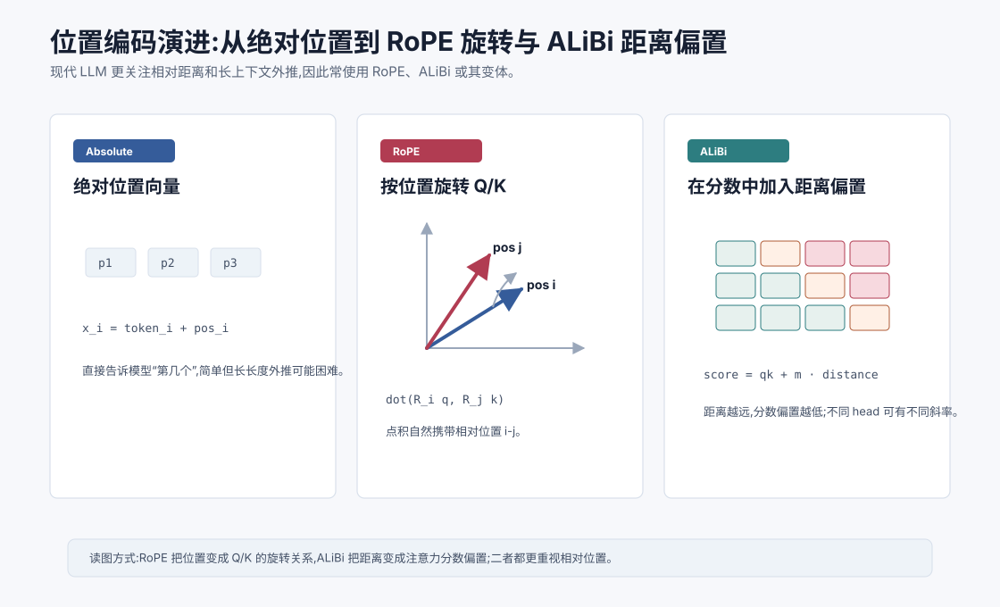
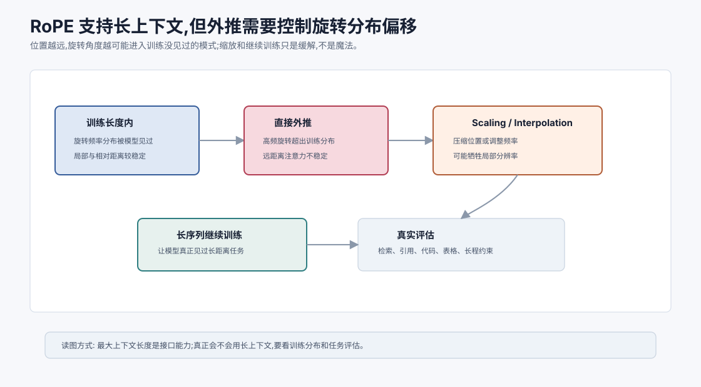
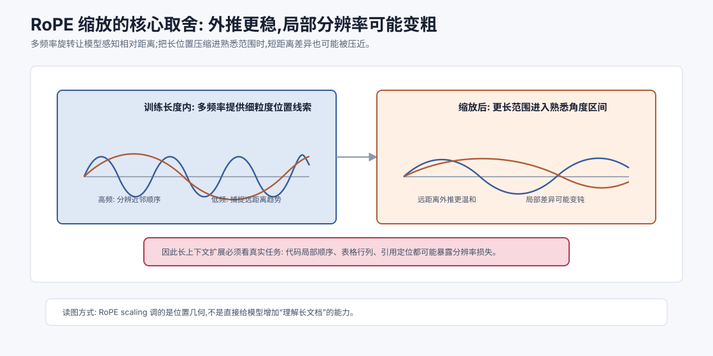
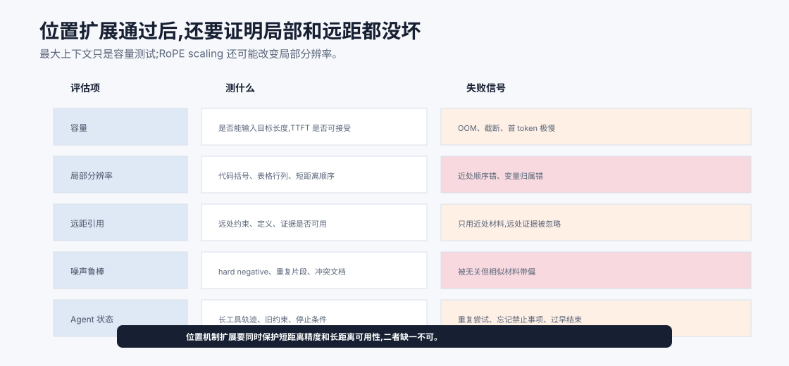

# 位置编码演进:RoPE 与 ALiBi `[进阶]` ★

第 10 章讲了位置编码的基本问题:Self-Attention 本身不天然知道顺序,必须额外注入位置信息。

早期 Transformer 用正弦位置编码或可学习绝对位置嵌入。但随着 Decoder-only LLM 和长上下文需求兴起,研究者越来越关注一个问题:

**模型真正需要的是绝对第几个位置,还是 token 之间相隔多远?**

很多语言和代码关系更依赖相对位置。

比如:

- 当前词前面 1 个 token 是什么。
- 右括号距离匹配左括号多远。
- 变量使用位置距离定义位置多远。
- 当前问题和文档片段相隔多少 token。

于是出现了更强调相对位置的机制,其中最常见的代表是 RoPE 和 ALiBi。



本章会讲:

- 为什么绝对位置编码有局限。
- RoPE 如何通过旋转 Query/Key 注入相对位置。
- ALiBi 如何用距离偏置影响注意力分数。
- 它们为什么常和长上下文联系在一起。
- 长上下文扩展为什么仍然不只是位置编码问题。

## 绝对位置的问题

绝对位置编码告诉模型:

```text
这个 token 在第 1 位、第 2 位、第 1024 位...
```

这很有用,但有两个问题。

第一,很多关系不是由绝对位置决定,而是由相对距离决定。

比如“当前 token 的前一个 token”这个关系,无论发生在第 10 位还是第 10000 位,模式都类似。

第二,绝对位置外推困难。

如果模型训练时只见过 4096 以内的位置,推理时给它 32768 token,超出部分的位置模式可能不稳定。

所以现代 LLM 更偏向使用能更好表达相对位置、并支持长上下文扩展的位置机制。

## RoPE 的核心直觉

RoPE 是 Rotary Position Embedding,旋转位置编码。

它的核心思想是:

**不要把位置向量简单加到 token embedding 上,而是根据位置旋转 Query 和 Key。**

对于每个位置 $i$,RoPE 会对该位置的 Query 和 Key 应用一个旋转变换:

$$
q_i' = R_i q_i
$$

$$
k_i' = R_i k_i
$$

其中 $R_i$ 是和位置 $i$ 有关的旋转矩阵。

然后注意力分数使用旋转后的向量:

$$
s_{ij}=q_i'^T k_j'
$$

也就是:

$$
s_{ij}=(R_i q_i)^T(R_j k_j)
$$

关键效果是:这个点积会自然包含 $i-j$ 的相对位置信息。

## 为什么旋转能表达相对位置

二维空间里,一个向量旋转角度 $\theta$ 后,方向变了,长度不变。

RoPE 把高维向量按二维一组拆开,对每组应用不同频率的旋转。

位置越靠后,旋转角度越大。

当位置 $i$ 的 Query 和位置 $j$ 的 Key 做点积时,它们之间的相对旋转角度和 $i-j$ 有关。

这意味着注意力分数不仅取决于内容匹配,也取决于两个位置之间的相对距离。

你可以把 RoPE 想成给 Q/K 向量装上一个随位置变化的方向表盘。

两个 token 是否匹配,不仅看内容方向,还看它们在位置表盘上的相对角度。

用矩阵性质可以看得更清楚。旋转矩阵满足:

$$
R_i^T R_j = R_{j-i}
$$

所以注意力分数可以写成:

$$
(R_i q_i)^T(R_j k_j)=q_i^T R_i^T R_j k_j=q_i^T R_{j-i}k_j
$$

这说明位置 $i$ 和 $j$ 的影响通过相对位移 $j-i$ 进入点积。模型不只是知道“我在第几个位置”,还知道“我和你相隔多远”。这就是 RoPE 比“把一个绝对位置向量加进去”更贴近注意力机制的原因。

## RoPE 和正弦位置编码的关系

RoPE 也使用类似正弦/余弦的周期结构。

但它不是把位置向量加到输入上,而是把位置作为旋转作用在 Q/K 上。

这有两个重要差别。

第一,RoPE 直接影响注意力分数,因为 Q/K 的点积决定权重。

第二,RoPE 更自然地表达相对位置,因为两个旋转向量的点积与相对位移相关。

这就是为什么 RoPE 在很多 Decoder-only LLM 中很常见。

## RoPE 的优势

RoPE 有几个实际优势。

### 相对位置友好

注意力分数天然携带相对位置信息,适合语言和代码中的距离关系。

### 不增加额外位置表

RoPE 使用公式计算旋转,不需要为每个位置学习一行位置向量。

### 适合自回归模型

Decoder-only LLM 中,每个新 token 的位置可以直接决定 Q/K 旋转,和 KV Cache 搭配也比较自然。

### 长上下文扩展有空间

RoPE 可以通过位置插值、频率缩放等方法扩展上下文长度。

不过这不等于天然无限外推。

## RoPE 的长上下文问题

RoPE 常用于长上下文模型,但它也有挑战。



旋转角度随位置增长。如果位置远超训练范围,高频维度可能出现模型没学过的模式。

这会导致长距离外推不稳定。

为了解决这个问题,实践中常见方法包括:

- RoPE scaling:调整位置频率或缩放位置索引。
- Position interpolation:把更长位置范围压缩到训练过的频率区间。
- YaRN、NTK-aware scaling 等改良策略。
- 在长上下文数据上继续训练或微调。

这些方法的细节很多,但核心思想是:让模型在更长位置上看到的旋转模式不要偏离训练分布太远。

但要注意,缩放并不是免费午餐。把更长位置压缩进模型熟悉的频率范围,可能改善外推,也可能降低局部位置分辨率。对于代码、表格、数学推导这类对局部顺序很敏感的任务,局部分辨率下降会影响细节判断。所以长上下文扩展通常需要配合长序列继续训练和真实任务评估,不能只看“最大可输入 token 数”。



RoPE 的一个关键细节是“多频率”。高维向量会被拆成很多二维平面,不同平面使用不同旋转频率。高频维度对短距离变化更敏感,低频维度能覆盖更长跨度。模型最终通过这些频率组合来判断相对位置。

长上下文缩放的困难就在这里。假设模型训练时主要见过 4K 长度,现在希望推到 32K。直接外推会让部分频率进入训练没见过的角度组合;位置插值或 scaling 会把 32K 压进更熟悉的旋转范围。但压缩以后,原本相邻或接近的位置在某些频率上的差异也会变小。

这就是“外推稳定性”和“局部分辨率”的取舍。对于普通长文问答,轻微分辨率损失可能可以接受;对于代码补全、括号匹配、表格行列、日志时间线,局部位置错一点就可能错很多。因此评估长上下文模型时,不能只测“能不能塞进去”,还要测“能不能准确定位、引用、比较和遵守远处约束”。

## ALiBi 的核心直觉

ALiBi 是 Attention with Linear Biases。

它的做法非常直接:

**不显式加位置 embedding,而是在注意力分数里加入一个和距离有关的线性偏置。**

对位置 $i$ 关注位置 $j$,原始分数是:

$$
s_{ij}=q_i \cdot k_j
$$

ALiBi 加上距离偏置:

$$
s_{ij}=q_i \cdot k_j + m \cdot (i-j)
$$

在因果语言模型中,通常 $j \leq i$,所以 $i-j$ 表示距离。

偏置会让更远的位置分数更低。

不同 head 可以使用不同斜率 $m$,让有些 head 更关注近处,有些 head 更能看远处。

## ALiBi 为什么适合外推

ALiBi 不需要学习固定长度的位置表,也不需要为每个位置生成复杂向量。

它只根据距离给注意力分数加一个线性偏置。

如果推理时序列更长,距离偏置仍然可以继续计算。

这使得 ALiBi 在长度外推上有一定优势。

它的直觉也很符合语言模型:一般来说,近处 token 更可能相关,远处 token 也可能重要,但需要更强内容匹配才能抵消距离惩罚。

在因果模型里,远处 token 的偏置更负,相当于提高了远距离信息被关注的门槛。它没有禁止模型看远处,只是要求远处内容必须在语义匹配上更有说服力。

这和滑窗不同。滑窗是硬限制:窗口外看不见。ALiBi 是软偏置:远处更难被注意,但仍有机会被注意。

## ALiBi 的优势和局限

ALiBi 的优势是简单、参数少、外推友好。

它直接作用在注意力分数上,实现成本相对低。

但它也有局限。

第一,线性距离偏置是一种强假设。它默认距离越远越应该被惩罚,但有些任务中远处信息非常关键。

第二,它表达的位置结构相对简单,不像 RoPE 那样通过多频率旋转提供丰富相对位置模式。

第三,不同模型和任务上效果差异明显。

所以 ALiBi 不是 RoPE 的简单替代,而是另一种取舍。

## RoPE 和 ALiBi 对比

| 维度 | RoPE | ALiBi |
| --- | --- | --- |
| 注入位置 | 旋转 Q/K | 注意力分数加偏置 |
| 核心直觉 | 相对位置体现在旋转后的点积 | 距离越远分数偏置越低 |
| 参数 | 通常无学习位置表 | 通常无学习位置表 |
| 表达能力 | 多频率相对位置结构 | 简单线性距离偏置 |
| 长度外推 | 需要缩放/插值等技巧 | 外推形式较自然 |
| 常见场景 | 许多现代 LLM | 一些长序列/外推友好模型 |

两者都强调相对位置,但机制不同。

## 为什么不是只用绝对位置

绝对位置在短上下文里可以工作得很好。

但通用 LLM 面对的是更复杂的场景:

- 长文档。
- 代码仓库。
- 多轮对话。
- 工具调用轨迹。
- RAG 拼接片段。
- 长系统指令和用户上下文。

这些场景中,“距离当前位置多远”常常比“全局第几个 token”更重要。

因此现代位置机制更强调相对距离、外推能力和与注意力分数的结合。

## 长上下文不只是位置编码

位置编码很重要,但长上下文能力不是只靠它决定。

还需要:

- 训练时见过足够长的序列。
- 数据中包含需要长距离依赖的任务。
- 注意力计算和显存能承受长序列。
- KV Cache 管理足够高效。
- 模型能在长上下文中抵抗噪声。
- 评估能覆盖真实长上下文任务。

如果模型只是在短文本上训练,即使位置编码能生成 100K 位置,也不代表它真的会使用 100K 上下文。

这就像给人一本很厚的书,不等于他能准确记住每一页。



上图把位置扩展后的评估拆成五类。容量测试只确认模型能不能输入目标长度、TTFT 是否可接受;局部分辨率测试看代码括号、表格行列、短距离顺序是否被 scaling 破坏;远距引用测试看远处定义和约束是否仍可用;噪声鲁棒测试看模型会不会被相似但无关的材料带偏;Agent 状态测试看长工具轨迹里旧约束和停止条件是否还能恢复。

这套评估很重要,因为长上下文扩展经常存在取舍。RoPE scaling 可能让远距离外推更稳定,但降低某些局部位置差异;ALiBi 对外推友好,但位置表达更简单。只测 needle 不够,只测最大长度也不够。真正要上线,必须证明模型在短距离精度和长距离利用上都没坏。

## 位置扩展后的回归样本

位置机制变动后,建议准备一组专门的回归样本:

| 样本类型 | 检查点 |
| --- | --- |
| 代码作用域 | 变量定义、括号匹配、导入引用是否错位 |
| 表格和日志 | 行列、时间顺序、局部邻近关系是否稳定 |
| 长文约束 | 开头规则、中段证据、末尾任务是否同时使用 |
| 冲突文档 | 远处正确证据能否压过近处干扰 |
| Agent 轨迹 | 旧工具结果和当前状态是否被正确区分 |

这些样本的价值在于捕捉“位置机制看起来扩展成功,但真实任务细节变差”的情况。位置编码是底层机制,但它的退化往往表现为上层任务错误:引用错段落、漏掉否定、把相邻行混在一起、忘记早期约束。评估要从这些可观察错误反推位置机制是否可靠。

## 对 Agent 的启发

Agent 系统经常追求长上下文,但要注意:

长上下文不是无限记忆。

即使模型支持很长输入,仍然可能出现:

- 早期约束被忽略。
- 中间工具结果被噪声淹没。
- 相似片段互相干扰。
- 模型更偏向最近内容。
- 长距离引用失败。

位置机制能帮助模型处理顺序和距离,但应用层仍要做上下文工程。

好的做法包括:

- 把关键约束放在稳定位置并重复摘要。
- 对长文档做检索和分块。
- 给工具结果加清晰标题和来源。
- 将当前任务状态压缩成短摘要。
- 必要时让模型回源读取具体片段。

模型层的位置编码和应用层的信息组织要配合,不能互相替代。

## 常见误解

### 误解一:RoPE 就是普通正弦位置编码

不一样。RoPE 使用正弦/余弦结构,但它通过旋转 Q/K 注入位置,让注意力点积携带相对位置信息。

### 误解二:ALiBi 只是简单惩罚远距离,所以很弱

它确实简单,但这种简单带来外推友好和实现低成本。是否合适取决于任务和模型。

### 误解三:用了 RoPE 就天然支持无限上下文

不是。RoPE 长度外推仍需缩放、插值、训练和评估支持。

### 误解四:位置编码越复杂越好

不一定。复杂机制可能增加实现难度或训练不稳定。关键是和模型规模、训练数据、任务分布匹配。

### 误解五:长上下文问题主要是位置编码问题

位置编码只是其中一环。长上下文还涉及注意力成本、KV Cache、数据分布、上下文组织和评估。

## 本章小结

位置编码从绝对位置向更强调相对位置的机制演进。RoPE 通过按位置旋转 Query 和 Key,让注意力点积自然包含相对位移信息。ALiBi 则在注意力分数中加入距离相关的线性偏置,用简单方式鼓励近处信息、支持长度外推。二者都服务于现代 LLM 对长上下文和相对关系建模的需求,但都不是长上下文的完整答案。

下一章会讲归一化与激活的改良:RMSNorm、SwiGLU。它们看起来不像 Attention 那样耀眼,但对现代大模型训练稳定性和效率非常关键。
