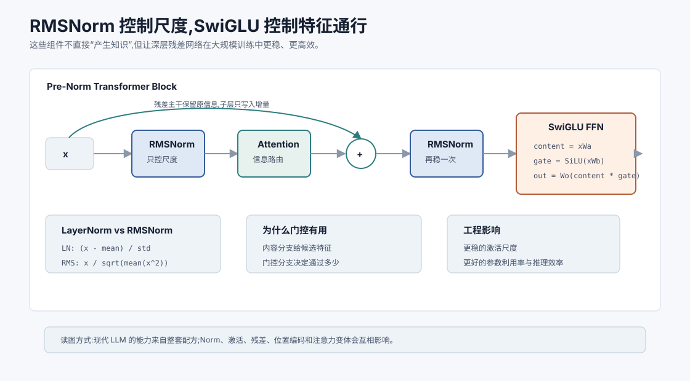
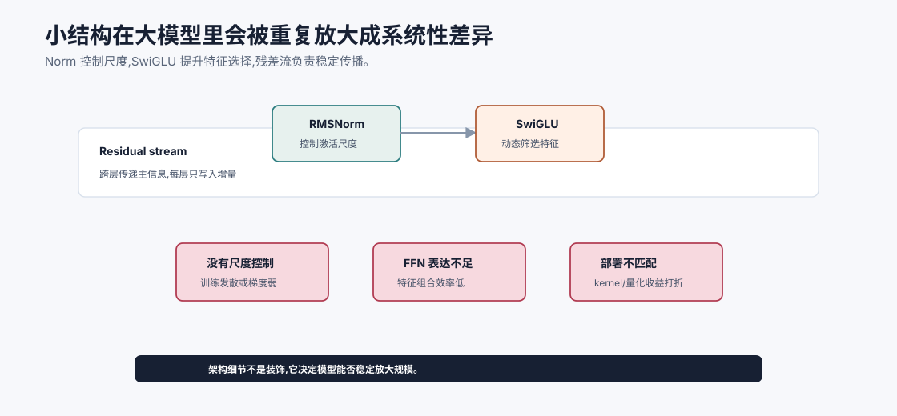

# 归一化与激活的改良:RMSNorm、SwiGLU `[进阶]`

讲 Transformer 时,大家最容易记住 Attention。

但现代 LLM 的能力和稳定性,不只来自 Attention。很多关键提升来自看似不起眼的结构细节:

- 归一化怎么做。
- 激活函数怎么选。
- FFN 是否使用门控。
- 残差路径是否足够稳定。

这些细节不会像“Self-Attention”那样有戏剧性,但它们决定了模型能不能稳定训练到很大规模。

本章讲两个常见改良:RMSNorm 和 SwiGLU。

本章会讲:

- LayerNorm 的作用和成本。
- RMSNorm 为什么常用于现代 LLM。
- GLU/SwiGLU 的门控直觉。
- 为什么 FFN 激活会显著影响模型能力。
- 这些改良如何影响训练稳定性和推理效率。

## 为什么归一化重要

深层模型里,每一层都会改变向量分布。

如果激活尺度逐层变大,训练可能发散。

如果激活尺度逐层变小,梯度可能变弱。

归一化的目标是让每层输入处在较稳定的数值范围内。

Transformer 中常用 LayerNorm 或 RMSNorm。

它们不会让模型“更懂语言”,但能让模型更稳定地学习语言。

归一化在深层网络里的作用可以理解为给残差流设置“数值护栏”。Transformer 每一层都会把 Attention 和 FFN 的输出加回残差主干。如果某些层输出尺度越来越大,后续层会被异常激活支配;如果尺度越来越小,有效信号又会被淹没。归一化让每层看到的输入分布更可控,优化器也更容易在大规模训练中保持稳定。

注意这里说的稳定不是“输出更保守”,而是训练过程中的数值稳定、梯度稳定和激活尺度稳定。很多应用开发者不会直接改 Norm,但模型能不能训练到几十层、上百层,很大程度依赖这些细节。

## 回顾 LayerNorm

LayerNorm 对一个 token 的 hidden 维度做归一化。

给定:

$$
x = [x_1, x_2, \ldots, x_d]
$$

先计算均值:

$$
\mu = \frac{1}{d}\sum_i x_i
$$

再计算方差:

$$
\sigma^2 = \frac{1}{d}\sum_i (x_i-\mu)^2
$$

归一化为:

$$
\hat{x}_i = \frac{x_i-\mu}{\sqrt{\sigma^2+\epsilon}}
$$

最后缩放:

$$
y_i = \gamma_i\hat{x}_i + \beta_i
$$

LayerNorm 同时做了两件事:

- 减去均值,让向量居中。
- 除以标准差,控制尺度。

## RMSNorm 的核心想法

RMSNorm 简化了 LayerNorm。

它不减均值,只用均方根控制尺度。

RMS 是 Root Mean Square:

$$
\text{RMS}(x)=\sqrt{\frac{1}{d}\sum_i x_i^2 + \epsilon}
$$

RMSNorm 写作:

$$
y_i = \gamma_i \frac{x_i}{\text{RMS}(x)}
$$

它保留了尺度归一化,去掉了均值中心化。

直觉上,RMSNorm 关心的是:

> 这个向量整体有多大?

而不是:

> 这个向量的均值是多少?

RMSNorm 的一个重要直觉是:在很多 Transformer 配方里,控制向量长度比强制中心化更关键。模型后续的线性层和残差路径仍然可以处理方向信息,而 RMSNorm 用更少的统计量把激活幅度压在合理范围内。

这并不意味着均值没有意义,而是说在特定架构和训练配方中,去掉均值中心化仍然能保持良好效果,同时减少计算和实现复杂度。

## 为什么 RMSNorm 有用

RMSNorm 的优势包括:

### 计算更简单

它不需要计算均值和方差,只需要计算平方平均。

在大模型里,归一化会被调用非常多次,小的计算节省也有意义。

### 训练稳定

实践中,RMSNorm 在很多 Decoder-only LLM 中表现稳定。

它能控制激活尺度,同时保留一些均值方向的信息。

### 和 Pre-Norm 搭配好

现代 LLM 常使用 Pre-Norm 结构:

$$
x + \text{SubLayer}(\text{Norm}(x))
$$

RMSNorm 在这种结构中很常见。

Pre-Norm 的意义在于先把子层输入归一化,再把子层输出加回残差主干。这样残差路径本身更像一条稳定的信息高速路,每个子层只是在上面写入一个增量。

与之相对,早期一些 Transformer 使用 Post-Norm:

$$
\text{Norm}(x + \text{SubLayer}(x))
$$

Post-Norm 在较浅模型里可以工作,但深层模型训练更容易遇到优化困难。Pre-Norm 牺牲了一些表达位置上的直观性,换来更好的深层训练稳定性。现代 Decoder-only LLM 常见 RMSNorm + Pre-Norm,就是这个方向的工程结果。

## LayerNorm、RMSNorm、BatchNorm 的区别

很多初学者会把各种 Norm 混在一起。可以这样区分:

| 方法 | 归一化维度 | 常见位置 | 对 LLM 的含义 |
| --- | --- | --- | --- |
| BatchNorm | batch 维度统计 | CNN 中常见 | 自回归和变长文本中不方便 |
| LayerNorm | 单个 token 的 hidden 维度 | 传统 Transformer 常见 | 减均值并除标准差 |
| RMSNorm | 单个 token 的 hidden 维度 | 现代 Decoder-only LLM 常见 | 不减均值,只控制 RMS 尺度 |

BatchNorm 依赖 batch 统计,在自回归生成、变长序列、小 batch 推理中不够自然。LayerNorm 和 RMSNorm 都是对单个 token 的隐藏维度做归一化,不依赖 batch 里其他样本,因此更适合语言模型。

## RMSNorm 不是永远更好

RMSNorm 简洁高效,但不代表所有场景都必须用它。

LayerNorm 仍然非常常见,尤其在很多传统 Transformer、BERT 类模型和多种任务模型中。

归一化选择和模型规模、训练数据、优化器、学习率、精度格式、残差结构都有关系。

工程上不要迷信某个组件。要看整体训练稳定性和最终效果。

## FFN 激活为什么重要

Transformer 层里,FFN 通常占大量参数。

它负责每个 token 内部的非线性加工。

如果 Attention 是信息路由,FFN 就是信息加工厂。

激活函数决定这个加工厂如何选择、压制和组合特征。

早期模型常用 ReLU:

$$
\text{ReLU}(x)=\max(0,x)
$$

后来很多 Transformer 使用 GELU:

$$
\text{GELU}(x) \approx x\Phi(x)
$$

GELU 比 ReLU 更平滑。

现代 LLM 中,SwiGLU 等门控激活非常常见。

## GLU 的门控思想

GLU 是 Gated Linear Unit。

它的直觉是:让一条分支产生内容,另一条分支产生门,门决定内容通过多少。

简化写作:

$$
\text{GLU}(x) = (xW_a) \odot \sigma(xW_b)
$$

其中:

- $xW_a$ 是内容分支。
- $\sigma(xW_b)$ 是门控分支。
- $\odot$ 是逐元素相乘。

门控值接近 0 时,对应特征被压制。

门控值接近 1 时,对应特征通过。

这比普通激活更灵活。

## SwiGLU 是什么

SwiGLU 是 GLU 的一种变体,使用 SiLU/Swish 激活。

SiLU 定义为:

$$
\text{SiLU}(x)=x\cdot\sigma(x)
$$

SwiGLU 可以简化写成:

$$
\text{SwiGLU}(x)=(xW_a) \odot \text{SiLU}(xW_b)
$$

再接一个输出投影:

$$
\text{FFN}(x)=W_o\left((xW_a) \odot \text{SiLU}(xW_b)\right)
$$

实际实现可能因为矩阵方向不同写法略有差异,但核心就是门控乘法。

## SwiGLU 为什么有效

SwiGLU 有几个直觉优势。

第一,它能动态选择特征。门控分支决定哪些维度更应该通过。

第二,它提供乘法交互。普通 FFN 主要是线性变换 + 激活,门控引入了两个分支之间的逐元素乘法。

第三,它在许多大模型中经验效果好。相比 ReLU/GELU FFN,SwiGLU 类结构常能在类似计算预算下提升表现。

当然,它也会影响参数量和中间维度设计。为了控制总参数,使用 SwiGLU 时常会调整 FFN hidden size。

更深一层看,SwiGLU 改变了 FFN 的表达方式。普通 FFN 像是“线性投影后过一个非线性函数”,而 SwiGLU 像是“先生成一组候选特征,再生成一组门控权重,最后逐维筛选”。

这让 FFN 不只是把所有特征一视同仁地激活,而是可以根据当前 token 的上下文表示动态决定哪些特征更重要。对于语言模型来说,同一个词在不同上下文里角色可能完全不同,这种动态选择很有价值。

例如“bank”在金融语境和河岸语境下需要激活不同特征。Attention 可以把相关上下文聚合过来,SwiGLU FFN 则可以在 token 内部对聚合后的表示做更细粒度筛选。

## FFN 维度为什么要调整

普通 FFN 是两层矩阵:

$$
d_{model} \rightarrow d_{ff} \rightarrow d_{model}
$$

SwiGLU 需要两个输入投影分支:

$$
xW_a, \quad xW_b
$$

所以如果 $d_{ff}$ 不变,参数量会增加。

很多模型会把 SwiGLU 的中间维度设得比普通 FFN 的 $4d_{model}$ 小一些,以保持参数量和计算量接近。

这体现了架构设计中的常见取舍:更强表达力需要用参数预算来平衡。

因此阅读模型配置时,不要看到 FFN 中间维度不是 $4d_{model}$ 就立刻判断“缩水”。如果模型使用 GLU/SwiGLU,中间维度往往会按参数量重新配平。比较两个模型时,要同时看:

- 是否使用门控 FFN。
- FFN 中间维度是多少。
- Attention head、KV head、层数和 hidden size 如何搭配。
- 总参数量与每 token 激活计算量。

架构组件之间经常是联动调整的,单独看一个数字容易误判。

## Norm 和激活如何影响推理

训练稳定性是第一层影响,推理阶段也会受到这些组件影响。

RMSNorm 计算更简单,在高吞吐推理中能减少一点归一化开销。SwiGLU 虽然多了一条投影分支,但如果在同等参数预算下提升模型质量,它可能让较小模型达到更好效果,间接降低部署成本。

不过推理性能不能只看公式。真实延迟还取决于 kernel 融合、张量并行、量化支持、显存带宽、batch 大小和硬件架构。有些组件理论上更省,但如果推理框架没有良好优化,实际收益会变小。

这也是为什么模型架构和推理系统要一起看。一个开源模型在论文里很漂亮,不代表你的推理栈已经能高效跑它。

## 小改良为什么能影响大模型

在小模型里,一个归一化或激活函数的差异可能不显眼。

但在大模型中,这些结构会重复数十层、数百亿次计算。

微小的稳定性改进会累积成巨大差异。

比如:

- 更稳定的激活尺度允许更大模型训练。
- 更高效的归一化减少推理延迟。
- 更好的门控 FFN 提升参数利用率。
- 更顺畅的梯度传播减少训练失败风险。

大模型不是一个单一技巧的胜利,而是很多工程和算法细节叠加的结果。

可以把这些细节理解成“可扩展性组件”。

小模型上,训练不稳定也许调一调学习率就能过;大模型上,一次不稳定可能意味着巨额计算浪费。小模型上,FFN 激活差一点可能只是分数低一点;大模型上,这个差异会在数十层和海量 token 上反复放大。

所以现代 LLM 的架构演进往往不是寻找某个神奇模块,而是不断减少训练大模型时的摩擦:更稳的残差流、更高效的位置机制、更好的注意力分组、更省显存的推理 kernel、更合适的数据配比。

上图把 Norm、激活函数和残差流放在同一个尺度里看:RMSNorm 主要控制激活尺度,SwiGLU 提升 FFN 的特征筛选效率,残差流让每层在已有表示上写入增量。单独看它们像是小组件,但在几十层、数万亿 token 和高并发推理里,稳定性、表达效率和 kernel 支持都会被反复放大。

这也是为什么读模型报告时不能只盯参数量和 benchmark。一个模型是否容易量化、是否有成熟推理 kernel、是否在长上下文下保持激活稳定、是否能在目标硬件上跑出吞吐,都和这些“底层小改动”有关。Agent 开发者通常不改这些模块,但要会把它们纳入模型选型和部署风险判断。

## 和其他组件的关系

RMSNorm 和 SwiGLU 通常与以下设计一起出现:

- Pre-Norm 残差结构。
- RoPE 位置编码。
- Decoder-only 架构。
- AdamW 或类似优化器。
- 混合精度训练。
- 梯度裁剪和学习率 warmup。

单独看某个组件容易误解。真正的模型表现来自整体配方。

## 对 Agent 有什么意义

Agent 开发者通常不改模型内部 RMSNorm 或 SwiGLU。

但理解这些细节仍有价值。

第一,它帮助你判断模型家族差异。两个模型参数量相近,架构细节不同,效果和速度可能差很多。

第二,它帮助你理解“开源模型不是只有参数量”。Norm、激活、位置编码、训练数据、上下文长度、推理优化都会影响能力。

第三,它提醒你不要把模型失败都归因于 Prompt。底层模型架构和训练配方会决定它能稳定处理哪些任务。

第四,它帮助你阅读模型技术报告。看到 RMSNorm、SwiGLU、RoPE、GQA 等词时,你能知道它们在系统中扮演什么角色。

第五,它帮助你判断量化和部署风险。Norm、激活和 FFN 结构会影响量化误差的传播方式。有些模型在 INT4 量化后简单问答还好,但复杂推理、长上下文或代码任务明显下降。原因不只是“量化损失”,而是底层激活分布和残差流被扰动后,高难任务更容易暴露问题。

第六,它帮助你建立“模型失败不是只有 Prompt 问题”的直觉。当一个模型在长工具轨迹里容易丢状态,或在复杂格式里不稳定,可能和训练数据、上下文机制、架构配方、对齐数据都有关系。Prompt 能修一部分,但不应该背所有锅。

## 常见误解

### 误解一:RMSNorm 只是 LayerNorm 的廉价版

不只是廉价。它是一种不同的尺度归一化选择,在许多现代 LLM 中表现稳定且高效。

### 误解二:激活函数影响很小

在大模型里,FFN 占据大量参数和计算。激活函数会显著影响表达能力和训练效果。

### 误解三:SwiGLU 只是多加一个分支

核心是门控乘法。它让模型动态控制特征通过,不是简单加宽网络。

### 误解四:这些细节和应用开发无关

它们影响模型能力、速度、上下文稳定性和部署成本。选择模型时应该关注架构细节。

### 误解五:现代 LLM 架构已经固定不变

仍在演进。归一化、激活、注意力变体、位置编码和 MoE 等方向都在持续变化。

### 误解六:Pre-Norm、RMSNorm、SwiGLU 只是论文细节

不是。它们影响模型能否稳定训练到大规模,也影响推理效率、量化表现和模型家族差异。

### 误解七:SwiGLU 一定总是优于 GELU

不能绝对化。SwiGLU 在许多现代 LLM 中表现很好,但最终效果取决于中间维度、参数预算、训练数据、优化器和整体架构。

### 误解八:知道公式就等于理解组件

公式只是入口。更重要的是知道组件在残差流、训练稳定性、参数预算和推理系统里解决什么问题。

## 本章小结

RMSNorm 和 SwiGLU 是现代 LLM 中常见的架构改良。RMSNorm 去掉 LayerNorm 的均值中心化,主要通过均方根控制向量尺度,更简单高效。SwiGLU 在 FFN 中引入门控乘法,让模型更灵活地选择和组合特征。这些改良看似细小,但在深层大模型中反复出现,会显著影响训练稳定性、表达能力和推理效率。

下一章会讲长上下文技术。我们已经看到注意力成本、位置编码和归一化都会影响长序列能力,接下来要系统梳理模型如何真正扩展上下文窗口。
