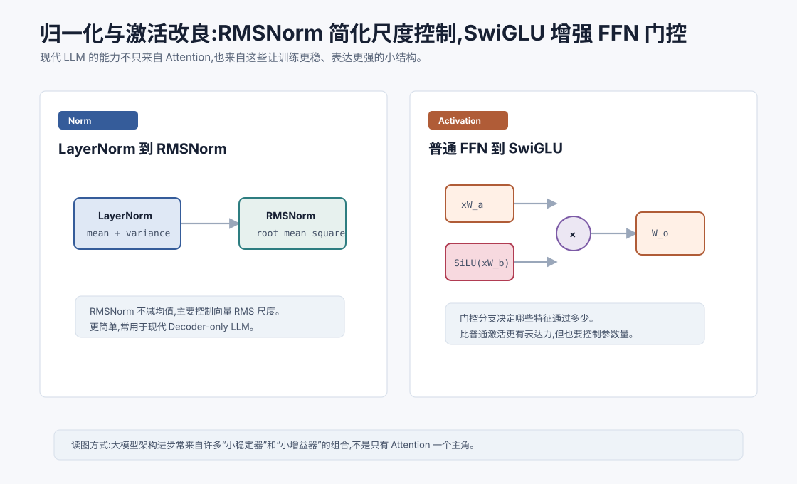

# 归一化与激活的改良:RMSNorm、SwiGLU `[进阶]`

讲 Transformer 时,大家最容易记住 Attention。

但现代 LLM 的能力和稳定性,不只来自 Attention。很多关键提升来自看似不起眼的结构细节:

- 归一化怎么做。
- 激活函数怎么选。
- FFN 是否使用门控。
- 残差路径是否足够稳定。

这些细节不会像“Self-Attention”那样有戏剧性,但它们决定了模型能不能稳定训练到很大规模。

本章讲两个常见改良:RMSNorm 和 SwiGLU。

本章会讲:

- LayerNorm 的作用和成本。
- RMSNorm 为什么常用于现代 LLM。
- GLU/SwiGLU 的门控直觉。
- 为什么 FFN 激活会显著影响模型能力。
- 这些改良如何影响训练稳定性和推理效率。

## 为什么归一化重要

深层模型里,每一层都会改变向量分布。

如果激活尺度逐层变大,训练可能发散。

如果激活尺度逐层变小,梯度可能变弱。

归一化的目标是让每层输入处在较稳定的数值范围内。

Transformer 中常用 LayerNorm 或 RMSNorm。

它们不会让模型“更懂语言”,但能让模型更稳定地学习语言。

## 回顾 LayerNorm

LayerNorm 对一个 token 的 hidden 维度做归一化。

给定:

$$
x = [x_1, x_2, \ldots, x_d]
$$

先计算均值:

$$
\mu = \frac{1}{d}\sum_i x_i
$$

再计算方差:

$$
\sigma^2 = \frac{1}{d}\sum_i (x_i-\mu)^2
$$

归一化为:

$$
\hat{x}_i = \frac{x_i-\mu}{\sqrt{\sigma^2+\epsilon}}
$$

最后缩放:

$$
y_i = \gamma_i\hat{x}_i + \beta_i
$$

LayerNorm 同时做了两件事:

- 减去均值,让向量居中。
- 除以标准差,控制尺度。

## RMSNorm 的核心想法

RMSNorm 简化了 LayerNorm。

它不减均值,只用均方根控制尺度。

RMS 是 Root Mean Square:

$$
\text{RMS}(x)=\sqrt{\frac{1}{d}\sum_i x_i^2 + \epsilon}
$$

RMSNorm 写作:

$$
y_i = \gamma_i \frac{x_i}{\text{RMS}(x)}
$$

它保留了尺度归一化,去掉了均值中心化。

直觉上,RMSNorm 关心的是:

> 这个向量整体有多大?

而不是:

> 这个向量的均值是多少?

## 为什么 RMSNorm 有用

RMSNorm 的优势包括:

### 计算更简单

它不需要计算均值和方差,只需要计算平方平均。

在大模型里,归一化会被调用非常多次,小的计算节省也有意义。

### 训练稳定

实践中,RMSNorm 在很多 Decoder-only LLM 中表现稳定。

它能控制激活尺度,同时保留一些均值方向的信息。

### 和 Pre-Norm 搭配好

现代 LLM 常使用 Pre-Norm 结构:

$$
x + \text{SubLayer}(\text{Norm}(x))
$$

RMSNorm 在这种结构中很常见。

## RMSNorm 不是永远更好

RMSNorm 简洁高效,但不代表所有场景都必须用它。

LayerNorm 仍然非常常见,尤其在很多传统 Transformer、BERT 类模型和多种任务模型中。

归一化选择和模型规模、训练数据、优化器、学习率、精度格式、残差结构都有关系。

工程上不要迷信某个组件。要看整体训练稳定性和最终效果。

## FFN 激活为什么重要

Transformer 层里,FFN 通常占大量参数。

它负责每个 token 内部的非线性加工。

如果 Attention 是信息路由,FFN 就是信息加工厂。

激活函数决定这个加工厂如何选择、压制和组合特征。

早期模型常用 ReLU:

$$
\text{ReLU}(x)=\max(0,x)
$$

后来很多 Transformer 使用 GELU:

$$
\text{GELU}(x) \approx x\Phi(x)
$$

GELU 比 ReLU 更平滑。

现代 LLM 中,SwiGLU 等门控激活非常常见。

## GLU 的门控思想

GLU 是 Gated Linear Unit。

它的直觉是:让一条分支产生内容,另一条分支产生门,门决定内容通过多少。

简化写作:

$$
\text{GLU}(x) = (xW_a) \odot \sigma(xW_b)
$$

其中:

- $xW_a$ 是内容分支。
- $\sigma(xW_b)$ 是门控分支。
- $\odot$ 是逐元素相乘。

门控值接近 0 时,对应特征被压制。

门控值接近 1 时,对应特征通过。

这比普通激活更灵活。

## SwiGLU 是什么

SwiGLU 是 GLU 的一种变体,使用 SiLU/Swish 激活。

SiLU 定义为:

$$
\text{SiLU}(x)=x\cdot\sigma(x)
$$

SwiGLU 可以简化写成:

$$
\text{SwiGLU}(x)=(xW_a) \odot \text{SiLU}(xW_b)
$$

再接一个输出投影:

$$
\text{FFN}(x)=W_o\left((xW_a) \odot \text{SiLU}(xW_b)\right)
$$

实际实现可能因为矩阵方向不同写法略有差异,但核心就是门控乘法。

## SwiGLU 为什么有效

SwiGLU 有几个直觉优势。

第一,它能动态选择特征。门控分支决定哪些维度更应该通过。

第二,它提供乘法交互。普通 FFN 主要是线性变换 + 激活,门控引入了两个分支之间的逐元素乘法。

第三,它在许多大模型中经验效果好。相比 ReLU/GELU FFN,SwiGLU 类结构常能在类似计算预算下提升表现。

当然,它也会影响参数量和中间维度设计。为了控制总参数,使用 SwiGLU 时常会调整 FFN hidden size。

## FFN 维度为什么要调整

普通 FFN 是两层矩阵:

$$
d_{model} \rightarrow d_{ff} \rightarrow d_{model}
$$

SwiGLU 需要两个输入投影分支:

$$
xW_a, \quad xW_b
$$

所以如果 $d_{ff}$ 不变,参数量会增加。

很多模型会把 SwiGLU 的中间维度设得比普通 FFN 的 $4d_{model}$ 小一些,以保持参数量和计算量接近。

这体现了架构设计中的常见取舍:更强表达力需要用参数预算来平衡。

## 小改良为什么能影响大模型

在小模型里,一个归一化或激活函数的差异可能不显眼。

但在大模型中,这些结构会重复数十层、数百亿次计算。

微小的稳定性改进会累积成巨大差异。

比如:

- 更稳定的激活尺度允许更大模型训练。
- 更高效的归一化减少推理延迟。
- 更好的门控 FFN 提升参数利用率。
- 更顺畅的梯度传播减少训练失败风险。

大模型不是一个单一技巧的胜利,而是很多工程和算法细节叠加的结果。

## 和其他组件的关系

RMSNorm 和 SwiGLU 通常与以下设计一起出现:

- Pre-Norm 残差结构。
- RoPE 位置编码。
- Decoder-only 架构。
- AdamW 或类似优化器。
- 混合精度训练。
- 梯度裁剪和学习率 warmup。

单独看某个组件容易误解。真正的模型表现来自整体配方。

## 对 Agent 有什么意义

Agent 开发者通常不改模型内部 RMSNorm 或 SwiGLU。

但理解这些细节仍有价值。

第一,它帮助你判断模型家族差异。两个模型参数量相近,架构细节不同,效果和速度可能差很多。

第二,它帮助你理解“开源模型不是只有参数量”。Norm、激活、位置编码、训练数据、上下文长度、推理优化都会影响能力。

第三,它提醒你不要把模型失败都归因于 Prompt。底层模型架构和训练配方会决定它能稳定处理哪些任务。

第四,它帮助你阅读模型技术报告。看到 RMSNorm、SwiGLU、RoPE、GQA 等词时,你能知道它们在系统中扮演什么角色。

## 常见误解

### 误解一:RMSNorm 只是 LayerNorm 的廉价版

不只是廉价。它是一种不同的尺度归一化选择,在许多现代 LLM 中表现稳定且高效。

### 误解二:激活函数影响很小

在大模型里,FFN 占据大量参数和计算。激活函数会显著影响表达能力和训练效果。

### 误解三:SwiGLU 只是多加一个分支

核心是门控乘法。它让模型动态控制特征通过,不是简单加宽网络。

### 误解四:这些细节和应用开发无关

它们影响模型能力、速度、上下文稳定性和部署成本。选择模型时应该关注架构细节。

### 误解五:现代 LLM 架构已经固定不变

仍在演进。归一化、激活、注意力变体、位置编码和 MoE 等方向都在持续变化。

## 本章小结

RMSNorm 和 SwiGLU 是现代 LLM 中常见的架构改良。RMSNorm 去掉 LayerNorm 的均值中心化,主要通过均方根控制向量尺度,更简单高效。SwiGLU 在 FFN 中引入门控乘法,让模型更灵活地选择和组合特征。这些改良看似细小,但在深层大模型中反复出现,会显著影响训练稳定性、表达能力和推理效率。

下一章会讲长上下文技术。我们已经看到注意力成本、位置编码和归一化都会影响长序列能力,接下来要系统梳理模型如何真正扩展上下文窗口。
