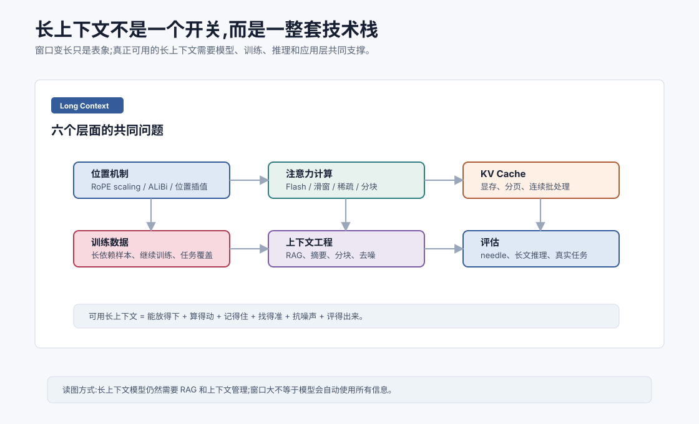

# 长上下文技术 `[进阶]` ★

上下文窗口是 LLM 一次调用能看到的 token 范围。

早期模型可能只有几千 token 窗口。后来 32K、128K、甚至更长上下文逐渐出现。

这看起来像一个简单指标:

```text
窗口越大,模型越强。
```

但真实情况复杂得多。

**长上下文不是把最大 token 数调大,而是模型、训练、推理和应用层共同解决的问题。**



本章会讲:

- 长上下文到底难在哪里。
- 位置编码如何影响长度外推。
- Attention 和 KV Cache 为什么成为成本瓶颈。
- 长上下文训练为什么重要。
- RAG 和长上下文不是替代关系。
- 如何评估模型是否真的会用长上下文。

## 长上下文为什么重要

很多真实任务天然很长。

比如:

- 阅读一整份合同。
- 分析几十页论文。
- 理解一个代码文件甚至多个文件。
- 处理长对话历史。
- 汇总工具调用轨迹。
- 在日志中定位错误。
- 对比多个检索文档。

如果上下文窗口太小,模型无法直接看到完整信息。

它只能依赖摘要、检索或用户重新提供内容。

长上下文让模型有机会在一次调用中看到更多材料,但这只是第一步。

## 能放下不等于能用好

一个模型支持 128K token,不代表它会稳定利用 128K 里的所有关键信息。

长上下文会带来几个问题:

- 信息太多,噪声增加。
- 关键事实可能埋得很深。
- 模型可能偏向最近内容。
- 远距离依赖更难学习。
- 推理成本和显存成本上升。
- 评估更困难。

所以长上下文能力要分开看:

1. **容量**:能不能输入这么多 token。
2. **计算**:算不算得动。
3. **利用**:能不能找到并使用关键信息。
4. **鲁棒**:噪声和干扰下是否稳定。

只看容量会误判。

## 注意力成本

标准 Self-Attention 的注意力矩阵大小是:

$$
T \times T
$$

序列长度 $T$ 增大时,训练成本增长非常快。

这影响:

- 显存。
- 计算时间。
- batch size。
- 训练吞吐。
- 长序列数据比例。

Flash Attention 可以优化显存访问,滑窗/稀疏注意力可以减少连接,但都不是完全免费。

因此长上下文模型往往需要专门的注意力实现和训练策略。

## KV Cache 成本

推理时,自回归模型会缓存每层的 Key 和 Value。

KV Cache 大小大致和以下因素成正比:

$$
\text{layers} \times \text{heads} \times \text{sequence length} \times \text{head dim}
$$

上下文越长,KV Cache 越大。

这会直接限制:

- 单请求最大上下文。
- 并发请求数量。
- GPU 显存占用。
- 服务吞吐。

所以长上下文推理不仅是模型问题,也是系统调度问题。

PagedAttention、连续批处理、KV Cache 量化、GQA/MQA 等技术都在降低这部分成本。

## 位置外推

位置编码决定模型如何理解“第几个”和“相隔多远”。

如果模型训练时只见过 4K token,推理时直接输入 64K,位置模式可能超出训练分布。

RoPE scaling、位置插值、ALiBi 等方法都试图改善长度外推。

但位置外推只是让模型在更长位置上有合理坐标系。

它不保证模型已经学会在 64K 上做推理。

就像给人一张更大的地图,不代表他已经熟悉地图上的每条路。

## 长上下文训练

模型要真正使用长上下文,通常需要见过长上下文任务。

训练数据应该包含:

- 长距离引用。
- 跨段落推理。
- 长文摘要。
- 多文档对比。
- 代码长依赖。
- 长对话状态保持。

如果训练数据大多是短文本,模型可能即使支持长窗口,也更习惯用局部信息。

很多长上下文模型会经历继续训练,把上下文长度逐步扩展,并加入长序列数据。

## Needle-in-a-haystack 评估

长上下文常见评估之一是 needle-in-a-haystack。

做法是把一个关键信息藏在很长文本中,然后问模型相关问题。

比如在 100K token 中间放一句:

```text
秘密编号是 73921。
```

然后问:

```text
秘密编号是多少?
```

这个评估能测试模型是否能从长文本中找回明确信息。

但它也有限。

真实任务往往不只是找一根针,还需要比较、推理、排除干扰、整合多处证据。

所以 needle 只是基础测试,不能代表完整长上下文能力。

## 长上下文的真实评估

更好的评估应该覆盖:

- 多处证据合成。
- 跨章节引用。
- 长文档问答。
- 多文档冲突判断。
- 代码跨文件理解。
- 长对话状态保持。
- 干扰信息下的鲁棒性。
- 真实业务任务成功率。

尤其对 Agent 来说,长上下文评估应该包含工具轨迹、历史约束、错误恢复和最终任务完成度。

否则模型可能在“找针”里表现很好,但在真实任务里仍然丢关键状态。

## 长上下文和 RAG 的关系

长上下文和 RAG 不是互相替代。

长上下文让模型能一次看到更多信息。

RAG 帮助模型从外部知识库中选出相关信息。

即使模型支持 128K,你也不应该把整个知识库塞进去。

原因是:

- 成本高。
- 延迟高。
- 噪声多。
- 更新不方便。
- 相关内容可能被淹没。

更合理的做法是:

1. 用 RAG 找出相关片段。
2. 用长上下文容纳更多证据和更完整上下文。
3. 用结构化提示帮助模型比较和引用。

长上下文扩大了工作台,RAG 决定把哪些材料放上工作台。

## 上下文压缩

长任务中,历史会越来越多。

压缩是必要策略。

常见压缩方式包括:

- 对话摘要。
- 工具结果提取。
- 日志裁剪。
- 文档分块。
- 检索重排。
- 状态对象维护。

压缩的风险是丢信息。

所以好的压缩要保留:

- 用户目标。
- 硬约束。
- 已完成步骤。
- 当前错误。
- 关键证据来源。
- 需要回看原文的索引。

不要把摘要写成“聊了很多关于测试的问题”这种无用概括。

## 长上下文中的位置偏差

模型可能对不同位置的信息利用能力不同。

常见现象包括:

- 更重视开头和结尾。
- 忽略中间内容。
- 偏向最近工具结果。
- 被重复信息影响。

这有时被称为 lost in the middle 问题。

工程上可以通过结构化上下文缓解:

- 开头放全局约束。
- 结尾放当前任务状态。
- 中间资料加标题和编号。
- 关键证据在回答前重新摘出。
- 对长文档先生成索引再读取细节。

## 长上下文和安全

上下文越长,不可信内容越多。

比如网页、文档、邮件、工具返回都可能包含 prompt injection。

长上下文模型更容易遇到恶意指令埋在资料中。

所以长上下文 Agent 必须区分:

- 系统指令。
- 用户目标。
- 工具输出。
- 外部文档内容。
- 模型自己的计划。

外部文档内容只能当资料,不能当高优先级指令。

上下文越大,越需要清晰的权限边界和工具调用校验。

## 实用设计原则

设计长上下文 Agent 时,可以遵循这些原则。

1. 不把长上下文当垃圾桶。
2. 先检索,再放入上下文。
3. 工具结果先提取关键信息。
4. 长文档保留引用和定位信息。
5. 当前任务状态放在靠近末尾的位置。
6. 高风险约束保持短而明确。
7. 定期压缩历史,但保留可回源索引。
8. 用真实长任务评估,不只做找针测试。

这些原则比盲目追求更大窗口更有用。

## 常见误解

### 误解一:上下文越长,模型一定越准

不一定。更多信息也意味着更多噪声、成本和干扰。关键是相关信息是否被正确组织。

### 误解二:长上下文可以替代 RAG

不能完全替代。RAG 负责选择相关资料,长上下文负责容纳和整合更多资料。

### 误解三:位置编码扩展后模型就会用长文本

不一定。还需要长上下文训练、注意力成本支持和真实任务评估。

### 误解四:Needle 测试好就代表长上下文强

Needle 测试只覆盖找明确信息。真实任务还需要多证据推理、抗干扰和状态保持。

### 误解五:长上下文主要是模型厂商的问题

应用层也要负责上下文工程。Agent 系统是否可靠,很大程度取决于如何选择、压缩和组织上下文。

## 本章小结

长上下文能力不是单个开关,而是位置机制、注意力计算、KV Cache、训练数据、上下文工程和评估共同构成的技术栈。模型能输入更多 token,不等于能稳定使用所有信息。真正可用的长上下文系统需要算得动、找得准、抗噪声、能推理、可评估。对 Agent 来说,长上下文应与 RAG、摘要、工具结果整理和安全边界配合使用。

下一章会进入主流大模型全景,从闭源与开源模型生态看这些架构技术如何落到真实产品和工程选择中。
