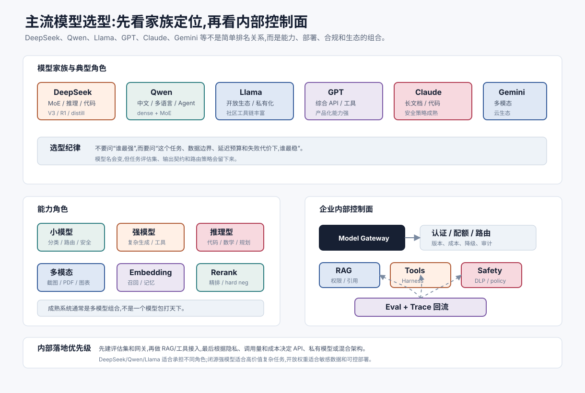
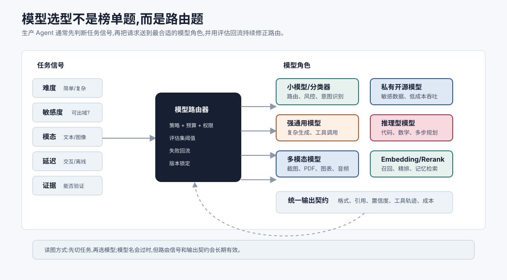
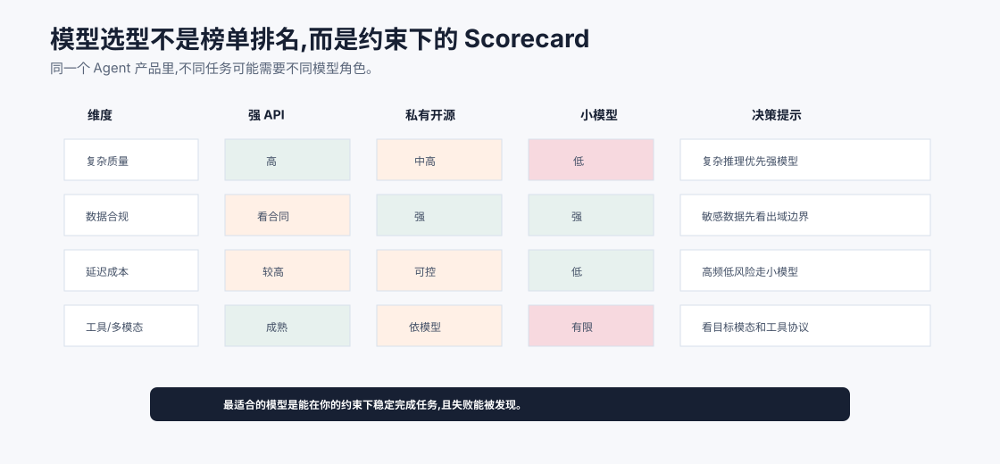

# 主流大模型全景:闭源与开源 `[参考]`

前面几章讲的是模型内部结构。现在换个视角:真实世界里有哪些模型,工程上该怎么选?

大模型生态变化很快。如果只记住某个排行榜,很快就会过时。

更稳定的理解方式是按几个维度看模型:

- 闭源 API 还是开源权重。
- 通用模型还是专用模型。
- 文本模型还是多模态模型。
- 普通生成模型还是推理型模型。
- 云端调用还是本地/私有化部署。
- 质量、成本、延迟、上下文和合规如何取舍。

本章不是模型榜单,而是一张选型地图。读完后,你应该能更清楚地判断:某个 Agent 系统应该用什么模型组合,而不是盲目追“最强模型”。

更准确地说,模型选型不是一次性决定,而是一套持续运行的路由机制。因为同一个产品里的任务差异很大:一句意图分类、一次合同审阅、一次代码修复、一次截图定位、一次敏感数据问答,对模型的要求完全不同。如果所有请求都送到同一个最强模型,系统会昂贵、缓慢,还可能把敏感数据送到不该去的地方。如果所有请求都压给本地小模型,复杂任务又会明显掉质量。

所以本章建议把模型看成 Agent 系统里的不同“执行器”,而不是一个抽象的聊天接口。

## 闭源 API 模型

闭源 API 模型由模型厂商托管,开发者通过 API 调用。

它的典型优势是:

- 能力强,更新快。
- 不需要自己部署 GPU。
- 工具调用、结构化输出、多模态等能力通常集成较好。
- 稳定性、吞吐、监控和安全策略由平台承担一部分。

典型限制是:

- 成本随 token 和调用量增长。
- 数据需要发送到服务端,有合规和隐私考量。
- 模型内部不可控,权重不可修改。
- 版本升级可能带来行为变化。
- 供应商锁定风险。

闭源 API 很适合快速验证产品、构建高能力 Agent、处理复杂推理和多模态任务。

## 开源权重模型

开源权重模型可以下载、部署、微调或量化。

它的优势是:

- 数据可留在本地或私有云。
- 可做领域微调和部署优化。
- 推理成本在高调用量时可能更可控。
- 可按硬件和延迟需求裁剪。
- 生态工具丰富,便于研究和定制。

限制是:

- 部署复杂,需要推理服务和 GPU 资源。
- 模型能力可能落后最强闭源模型。
- 安全、监控、弹性扩缩容要自己处理。
- 微调和评估需要工程能力。

开源模型适合对数据控制、成本控制、私有部署、定制能力有强需求的场景。

## 通用模型和专用模型

通用模型追求广泛能力:问答、写作、代码、推理、工具调用、多轮对话。

专用模型则针对某类任务优化。

常见专用模型包括:

- Embedding 模型:把文本变成向量,用于 RAG 和语义检索。
- Reranker:对候选文档重新排序。
- 代码模型:更擅长代码补全、解释和修复。
- 小型分类模型:低延迟做路由、风控、意图识别。
- 多模态模型:处理图像、音频、视频或文档版面。

生产系统常常不是一个大模型解决所有问题,而是多模型组合。

比如一个 RAG Agent 可能用:

- Embedding 模型召回文档。
- Reranker 精排文档。
- 通用 LLM 生成答案。
- 小模型做安全分类。

## 为什么不是只用最强模型

最强模型通常成本高、延迟高,并且不一定适合所有任务。

如果任务只是把用户问题分成 5 类,用顶级大模型可能浪费。

如果任务需要毫秒级响应,小模型更合适。

如果任务涉及私密数据,本地开源模型可能更合规。

如果任务需要复杂多步推理,强模型或推理型模型可能值得成本。

工程选型不是单看能力峰值,而是看目标任务的约束。

可以用一个更工程化的问题替代“哪个模型最强”:

> 在当前约束下,哪个模型能以最低可接受成本稳定完成这个任务,并且失败后可被发现和修正?

这句话里有四个关键词。

第一是**当前约束**。约束可能来自数据合规、延迟、预算、硬件、上下文长度、格式要求或工具权限。

第二是**最低可接受成本**。不是越便宜越好,而是在质量达到阈值后,继续追求更强模型可能收益很小。

第三是**稳定完成**。一次 demo 成功不等于线上稳定。要看长尾输入、边界案例、工具调用失败、上下文噪声和版本升级后的表现。

第四是**失败可发现**。如果模型错了但系统完全看不出来,这个模型即使平均分很高也可能不适合高风险流程。

这也是为什么 Agent 架构里常常需要模型路由、评估集、输出契约和 trace 记录一起出现。

上图给出一个更接近工程现场的模型选型表。强 API 模型往往在复杂推理、工具调用和多模态能力上更成熟,但成本、延迟和数据出域要仔细算;私有开源模型在合规和可控性上有优势,但需要承担部署、评测和推理优化成本;小模型适合高频、低风险、格式稳定的任务,不适合强行承担复杂判断。

真正成熟的 Agent 系统很少只绑定一个“最强模型”。它会把分类、检索、重排、主推理、多模态感知、安全过滤和最终校验拆成不同角色,再用评估集和 trace 判断每个角色是否达标。模型选型的目标不是证明某个模型最好,而是让每一笔 token、每一次延迟和每一个风险边界都有明确理由。

## 把模型分成系统角色

在 Agent 系统中,不要只按厂商或参数量理解模型,更应该按角色理解。

### 主推理模型

负责复杂任务的任务分解、工具选择、结果综合和最终回答。

它需要强指令遵守、稳健工具调用、较好的长上下文能力和错误恢复能力。成本通常较高,所以不应该承担所有琐碎任务。

### 路由模型

负责判断请求应该走哪条路径。

它可以是小型分类模型、便宜 LLM、规则系统,或规则 + 模型组合。路由模型判断的不是“答案是什么”,而是“应该由谁回答、需要哪些上下文、是否需要人工确认”。

### 检索模型

Embedding 和 reranker 不直接回答用户,但决定主模型能看到什么证据。

很多 RAG 系统的失败并不是生成模型太差,而是召回阶段没有把正确材料送进上下文。此时换更强 LLM 只能缓解,不能根治。

### 多模态感知模型

处理截图、文档版面、图片、图表、音频或视频。

这类模型的关键不是“能不能描述图片”,而是能否输出可追溯的结构化证据,例如坐标、页码、区域、时间戳和置信度。

### 安全与合规模型

负责敏感信息识别、越权请求检测、内容安全分类、Prompt Injection 风险判断等。

它们通常不需要最强推理能力,但需要高召回、低延迟、可审计。

## 一个实用的路由顺序

可以按下面顺序设计模型路由。

| 判断问题 | 典型路由结果 |
| --- | --- |
| 是否涉及敏感数据或合规边界? | 私有模型、本地工具、脱敏流程、人工确认 |
| 是否需要图像、音频、PDF 版面或屏幕理解? | 多模态模型 + OCR/解析工具 |
| 是否只是分类、改写、抽取、格式转换? | 小模型或便宜通用模型 |
| 是否需要复杂推理、代码修复、多步工具调用? | 强通用模型或推理型模型 |
| 是否依赖最新事实或私有知识? | RAG、搜索、数据库查询,再交给生成模型 |
| 是否需要可验证答案? | 选择能结合工具验证和引用输出的链路 |

这个顺序很重要。很多团队一开始按“难度”路由,但忽略敏感数据和模态需求,结果复杂任务被送到了强模型,却越过了合规边界。更稳的做法是先看硬边界,再看能力和成本。

## 选型的关键维度

选择模型时,可以从这些维度评估。

### 质量

模型在目标任务上的正确率、稳定性、事实性、指令遵守和工具调用能力。

不要只看通用 benchmark。要看自己的评估集。

### 延迟

用户能否接受响应时间?首 token 延迟和总生成时间分别是多少?

### 成本

输入 token、输出 token、上下文长度、并发、缓存命中率都会影响成本。

### 上下文长度

窗口是否够用?模型是否真的能利用长上下文?长上下文成本是否可承受?

### 工具调用能力

是否稳定生成合法参数?是否会乱调用工具?是否能根据工具结果修正策略?

### 数据合规

数据能否出域?是否需要私有化部署?日志如何保存?

### 可控性

是否支持微调、系统指令、结构化输出、函数调用、安全策略?

### 生态成熟度

SDK、推理框架、监控、社区、部署工具是否成熟?

## 闭源和开源的混合架构

很多团队会采用混合策略。

比如:

- 默认用开源小模型处理简单任务。
- 复杂任务路由到强闭源模型。
- 敏感数据只走私有模型。
- 高价值任务用推理型模型。
- Embedding 和 rerank 使用本地模型。

这种架构的关键是路由。

系统需要判断:

- 当前任务难度如何?
- 是否涉及敏感数据?
- 是否需要多模态能力?
- 是否需要长上下文?
- 用户是否愿意等待更慢但更强的结果?

模型路由是 Agent 工程中非常实用的能力。

混合架构里最容易被低估的是**一致的输出契约**。

不同模型的自然语言风格、工具调用格式、引用习惯、拒答方式和置信度表达都不同。如果路由层只替换模型名,下游系统很容易崩在细节上。

一个生产级模型契约通常至少包含:

- 输出格式:JSON schema、Markdown 结构、字段必填项。
- 证据要求:引用来源、页码、片段 ID、工具 trace。
- 不确定性表达:哪些结论必须标注置信度或要求人工确认。
- 安全边界:哪些内容必须拒绝、脱敏或升级审批。
- 成本记录:输入 token、输出 token、缓存命中、模型版本。
- 回滚信息:模型、Prompt、工具 schema 和评估版本。

契约越清晰,模型替换越容易;契约越模糊,系统越依赖某个模型的隐含行为。

## 模型大小和能力

参数量通常和能力相关,但不是唯一因素。

影响模型能力的因素包括:

- 参数量。
- 训练 token 数。
- 数据质量。
- 架构细节。
- 上下文长度。
- 指令微调质量。
- 对齐策略。
- 工具调用数据。
- 推理时的解码和系统提示。

一个小而高质量、领域适配好的模型,可能在特定任务上超过更大的通用模型。

看模型大小时还要注意几个陷阱。

第一,同样参数量的模型,训练 token 数和数据质量可能差很多。一个 7B 模型如果训练充分、数据干净、指令微调好,可能在某些任务上超过训练不足的更大模型。

第二,MoE 模型的总参数量和每 token 激活参数量不同。一个模型可能有很大的总参数,但每次推理只激活部分专家。比较成本和延迟时,不能只看总参数。

第三,上下文长度标称值不等于有效利用能力。模型可能支持很长输入,但对中间位置证据、跨段引用、长链路一致性并不稳定。长上下文模型必须用自己的长文档、长工具轨迹和长对话评估。

第四,推理型模型的“强”常常来自更多推理时计算。它不一定在简单任务上更划算,也不一定适合低延迟交互。

## 量化和部署

开源模型部署时常会用量化降低显存和成本。

比如把权重从 FP16 压到 INT8、INT4。

量化优势是:

- 降低显存占用。
- 提升吞吐或降低硬件门槛。
- 支持本地部署。

风险是:

- 质量下降。
- 长上下文或复杂推理更容易受影响。
- 不同量化方法效果差异大。

部署模型时,必须用目标任务评估量化后的质量。

## Agent 系统中的模型组合

一个成熟 Agent 系统可能包含多种模型角色。

| 角色 | 可能使用的模型 |
| --- | --- |
| 主推理模型 | 强通用 LLM 或推理型模型 |
| 简单任务路由 | 小型分类模型或便宜 LLM |
| 文档召回 | Embedding 模型 |
| 检索精排 | Reranker |
| 代码修改 | 代码强模型 |
| 图像理解 | 多模态模型 |
| 安全检测 | 分类模型或规则 + 模型 |

这种组合比“一个模型包打天下”更灵活。

## 如何建立自己的模型评估集

选型不能只靠公开榜单。

你应该建立自己的评估集。

评估集应包含:

- 真实用户问题。
- 常见任务。
- 边界案例。
- 高风险场景。
- 工具调用任务。
- 长上下文任务。
- 失败样本回流。

评估指标可以包括:

- 正确率。
- 工具调用成功率。
- 引用准确率。
- 格式合法率。
- 延迟。
- 成本。
- 人工偏好评分。
- 安全违规率。

没有自己的评估集,模型选型很容易变成凭感觉。

评估集还应该覆盖**路由决策**本身。也就是说,不只评估某个模型答得好不好,还要评估系统有没有把请求送到正确链路。

可以增加这些样本:

- 简单任务是否被错误送到昂贵模型。
- 敏感数据是否被错误送到外部 API。
- 需要多模态的任务是否错误走了纯文本模型。
- 需要检索的事实问题是否跳过了 RAG。
- 需要推理型模型的复杂任务是否被便宜模型草率回答。
- 需要人工确认的高风险操作是否被自动执行。

模型路由评估通常比单模型评估更接近线上收益,因为它直接影响成本、延迟、安全和质量。

## 模型版本管理

模型会更新。

API 模型可能升级版本,开源模型可能换 checkpoint,微调模型可能迭代数据。

每次模型变化都可能带来行为变化。

生产系统应该记录:

- 使用的模型版本。
- Prompt 版本。
- 工具 schema 版本。
- 评估结果。
- 上线时间。
- 回滚方案。

Agent 系统尤其需要版本管理,因为模型变化可能影响工具调用和安全边界。

## 常见误解

### 误解一:榜单第一就是业务最佳

不一定。业务最佳取决于质量、成本、延迟、合规、上下文和工具能力等约束。

### 误解二:开源模型一定更便宜

不一定。部署、GPU、运维、扩缩容和工程人力都要算成本。

### 误解三:闭源模型一定不能用于企业

取决于数据政策、合规要求和供应商能力。很多企业会混合使用闭源和私有模型。

### 误解四:模型越大越好

大模型能力强,但延迟和成本更高。特定任务中小模型可能更合适。

### 误解五:选定模型后就不用再评估

模型、数据、用户行为和业务需求都会变化。评估应该持续运行。

### 误解六:模型路由只是为了省钱

不只是省钱。路由同时服务于质量、延迟、合规、可验证性和故障隔离。省钱只是其中一个结果。

### 误解七:开源和闭源只能二选一

很多成熟系统会混合使用。敏感数据走私有模型,复杂开放问题走强 API,检索和安全分类走专用小模型,这比单一路线更符合真实约束。

### 误解八:只要模型足够强,就不需要 RAG 和工具

模型参数知识会过时,也无法直接访问私有数据库和实时状态。事实任务、企业知识和可验证流程仍需要 RAG、搜索、数据库和执行工具。

## 本章小结

主流大模型生态可以按闭源 API、开源权重、通用模型、专用模型、多模态模型和推理型模型来理解。工程选型不是追逐单一最强模型,而是在质量、成本、延迟、上下文、数据合规、部署控制和工具能力之间做取舍。成熟 Agent 系统往往是多模型组合,并依赖自己的评估集和版本管理来持续迭代。

下一章会继续看多模态与推理型模型,它们代表了近几年 LLM 能力扩展的两个重要方向:从文本走向多种输入输出,从快速生成走向更深的复杂问题求解。
