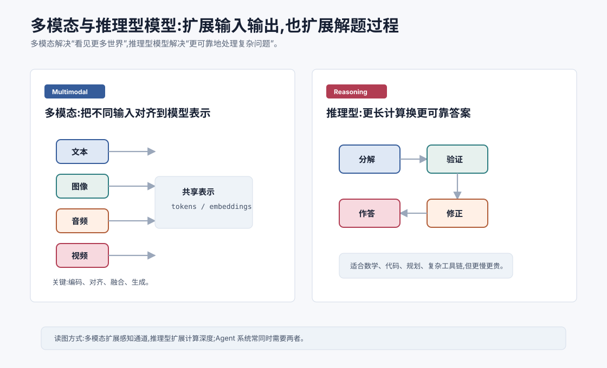
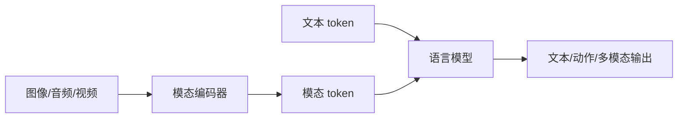

# 多模态与推理型模型 `[进阶]`

大语言模型最初主要处理文本。

但真实世界不只有文本。用户会上传图片、截图、PDF、语音、视频、表格和网页。Agent 也不只是回答问题,还要读屏幕、看图表、理解文档版面、操作软件、分析代码和规划多步任务。

因此近几年模型能力沿两个方向明显扩展:

1. **多模态模型**:让模型能处理文本以外的输入输出。
2. **推理型模型**:让模型在复杂任务上投入更多计算,提高可靠性。



这两类模型解决的问题不同。

多模态回答的是:

> 模型能看见和生成哪些类型的信息?

推理型回答的是:

> 模型能否更稳地解决复杂问题?

## 多模态模型是什么

多模态模型能处理多种数据模态。

常见模态包括:

- 文本。
- 图像。
- 音频。
- 视频。
- 文档版面。
- 屏幕截图。
- 表格和图表。

多模态模型的核心目标是把不同模态转成模型能统一处理的表示。

比如一张图片会先经过视觉编码器,变成一组视觉 token 或 embedding,再和文本 token 一起进入语言模型或融合模块。

## 多模态的基本架构

多模态模型常见数据流是:



关键组件包括:

- 模态编码器:把图像、音频等转成向量。
- 对齐层:把模态向量映射到语言模型能理解的空间。
- 融合机制:让文本和非文本 token 交互。
- 生成头:输出文本、动作或其他模态。

有些模型是“先编码再喂给 LLM”,有些模型从训练上更深度地融合多模态。

## 图像理解

图像理解是多模态最常见能力之一。

模型可以:

- 描述图片内容。
- 读取截图文字。
- 理解图表。
- 对 UI 截图做定位。
- 检查图片中的异常。
- 结合文字问题回答。

这对 Agent 很重要。GUI Agent 需要看屏幕,文档 Agent 需要理解 PDF 版面,数据分析 Agent 需要看图表。

但图像理解也有风险。模型可能误读小字、坐标、颜色、遮挡物或复杂图表。高风险场景仍需要工具校验和人工确认。

## 音频和视频

音频模型可以做:

- 语音识别。
- 语音对话。
- 情绪和说话人线索分析。
- 音频事件识别。

视频模型更复杂,因为视频包含时间维度。

它需要理解:

- 场景变化。
- 动作顺序。
- 物体轨迹。
- 语音和画面同步。
- 长时间事件。

视频理解对机器人、教育、会议、监控分析和 GUI 操作都有价值,但计算成本和评估难度也更高。

## 多模态对齐

多模态模型最难的问题之一是对齐。

模型需要知道图像区域、文字描述和用户问题之间如何对应。

比如用户问:

```text
图中右上角的按钮是什么意思?
```

模型必须把“右上角”定位到图像区域,识别按钮上的图标或文字,再结合上下文回答。

这不是简单 OCR。它需要空间理解、视觉识别和语言推理。

多模态对齐训练通常依赖大量图文对、视觉问答、OCR 数据、文档理解数据和人工标注任务。

## 多模态 Agent 的挑战

多模态 Agent 比文本 Agent 更复杂。

挑战包括:

- 输入体积更大,成本更高。
- 图像和视频需要预处理。
- OCR 和视觉定位可能出错。
- 屏幕坐标和 UI 状态需要精确。
- 多模态工具返回更难结构化。
- 安全风险更复杂,例如图像中隐藏指令。

因此多模态 Agent 通常需要结合:

- 视觉模型。
- OCR 工具。
- DOM/UI 自动化工具。
- 截图定位。
- 状态校验。
- 人类确认。

不要把视觉模型当作完美眼睛。它是一个概率性解释器。

## 推理型模型是什么

推理型模型不是只追求更快生成,而是倾向于在复杂任务上投入更多计算。

它们更适合:

- 数学题。
- 代码修复。
- 复杂规划。
- 多步工具调用。
- 长文档分析。
- 逻辑约束任务。
- 需要验证和回溯的问题。

普通生成模型可能快速给出答案,但容易跳步或自信错误。

推理型模型更强调分解、检查和修正。

## 推理型模型如何变强

不同模型实现方式不同,但常见方向包括:

### 训练数据

使用包含复杂推理过程、解题轨迹、代码调试轨迹、工具使用轨迹的数据。

### 强化学习或偏好优化

奖励正确答案、有效推理、可验证步骤和更好的问题分解。

### 推理时计算

允许模型在回答前进行更多内部计算,比如生成中间分析、验证候选答案、尝试多条路径。

### 工具结合

对数学、代码、搜索、执行等任务,工具可以提供外部验证。

推理型能力不是单靠“多说几句思考过程”,而是训练目标、数据、推理预算和验证机制共同作用。

## 推理预算

推理型模型常常有更高延迟和成本。

原因是它可能需要生成更多中间 token,或者内部执行更多计算。

工程上要决定:

- 哪些任务值得用推理型模型?
- 是否需要先用小模型路由任务难度?
- 用户能接受多长等待?
- 是否需要可验证答案而不是快速答案?

不是所有问题都需要推理型模型。

比如简单改写、分类、模板生成,普通模型可能更便宜更快。

## 推理型模型和工具

Agent 中,推理型模型常与工具结合。

比如代码修复任务:

1. 读取错误日志。
2. 定位相关文件。
3. 推断失败原因。
4. 修改代码。
5. 运行测试。
6. 如果失败,根据新错误继续修正。

这不是一次回答能解决的任务。它需要规划、执行、观察和迭代。

推理型模型更适合这种长链路任务,但系统仍要提供工具权限、状态管理和失败恢复。

## 推理型不等于永远正确

推理型模型仍然会错。

它可能:

- 分解方向错。
- 验证不充分。
- 过度思考简单问题。
- 在错误前提上做复杂推理。
- 工具调用参数错误。
- 被上下文噪声误导。

所以高风险任务仍需要外部验证。

数学题可以用计算器或符号工具验证。代码可以跑测试。事实问答可以检索和引用。业务决策可以请求人类确认。

## 多模态 + 推理型的组合

很多前沿任务同时需要多模态和推理。

比如:

- 看一张复杂图表并推断趋势原因。
- 读 UI 截图并决定下一步操作。
- 分析医学影像并生成报告草稿。
- 看电路图并排查故障。
- 读取 PDF 合同版面并做风险总结。

这类任务不仅要“看见”,还要“想明白”。

多模态提供输入通道,推理型能力提供多步分析。

## 对 Agent 架构的影响

多模态和推理型模型会改变 Agent 架构。

### 输入层更复杂

Agent 可能需要处理文本、文件、截图、音频、网页 DOM、表格。

### 工具更多

OCR、图像裁剪、浏览器控制、代码执行、搜索、数据库查询都会进入工具集合。

### 状态更难管理

多模态观察结果需要结构化保存,否则上下文很快混乱。

### 成本路由更重要

复杂任务才用强推理模型,简单任务用便宜模型。

### 安全边界更重要

图像、网页、PDF 都可能包含诱导指令。系统必须区分内容和指令。

## 选型建议

选择多模态或推理型模型时,可以问:

1. 输入是否真的需要图像、音频或视频?
2. 模型是否能可靠处理目标格式,比如截图、表格、PDF?
3. 任务是否需要复杂多步推理?
4. 是否有工具可以验证结果?
5. 延迟和成本是否可接受?
6. 是否需要把简单任务路由给小模型?
7. 是否有针对真实任务的评估集?

不要因为模型支持多模态就把所有文件都丢给它。能用结构化解析工具解决的问题,往往更可靠、更便宜。

## 常见误解

### 误解一:多模态模型就是 OCR 加聊天

不只是 OCR。它还涉及视觉理解、空间关系、图文对齐和跨模态推理。

### 误解二:推理型模型一定适合所有任务

不一定。简单任务用推理型模型可能慢且贵。需要按任务难度路由。

### 误解三:模型会看图就能可靠操作 GUI

不够。GUI 操作还需要坐标、状态校验、交互工具和失败恢复。

### 误解四:推理型模型不需要工具验证

仍然需要。复杂推理更应该结合外部验证,尤其是代码、数学和事实任务。

### 误解五:多模态输入天然安全

不安全。图片、网页截图、PDF 都可能包含恶意或误导性指令。

## 本章小结

多模态模型扩展了 LLM 的输入输出通道,让模型能处理图像、音频、视频、截图和文档等信息。推理型模型扩展了复杂问题求解能力,更擅长分解、验证和多步任务,但通常成本和延迟更高。未来 Agent 往往会同时使用多模态感知、推理型决策和工具验证,但这也要求更强的上下文管理、模型路由和安全边界。

下一章会进入训练流程,从预训练与 Scaling Law 开始。前面我们看到了模型结构和生态,接下来要看这些能力是如何通过大规模数据和计算训练出来的。
