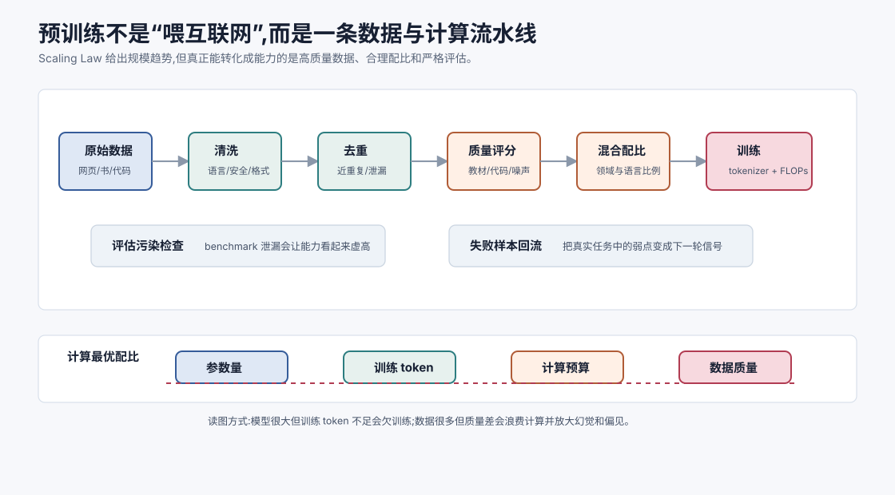

# 预训练与 Scaling Law `[进阶]` ★

前面我们看了 Transformer 架构和模型生态。现在进入训练流程。

大语言模型的能力不是人工一条条规则写出来的,而是通过预训练从海量数据中学出来的。

预训练的目标看起来朴素到有点反直觉:

**给定前文,预测下一个 token。**

但当模型足够大、数据足够多、训练足够久时,为了做好这个目标,模型必须学习语言、知识、代码、推理模式、格式结构和世界规律。

这就是现代 LLM 的起点。

本章会讲:

- 预训练到底在训练什么。
- 下一个 token 预测为什么能学出通用能力。
- 数据、参数和计算之间是什么关系。
- Scaling Law 的核心直觉。
- Chinchilla 观点为什么强调数据和参数配比。
- 预训练能力和 Agent 能力之间有什么关系。

## 预训练是什么

预训练是模型在大规模通用数据上进行的基础训练阶段。

它通常发生在监督微调和对齐之前。

预训练数据可能包括:

- 网页文本。
- 书籍。
- 论文。
- 代码。
- 问答数据。
- 论坛和百科。
- 数学和推理文本。
- 多语言语料。

模型在这些数据上学习预测下一个 token。

它不是专门学习“如何当助手”,而是学习语言和世界的统计结构。

## 自回归预训练目标

对于 Decoder-only 模型,训练目标是最大化训练文本序列的概率。

给定 token 序列:

$$
x_1,x_2,\ldots,x_T
$$

模型把联合概率分解成:

$$
P(x_1,\ldots,x_T)=\prod_{t=1}^{T}P(x_t \mid x_{<t})
$$

训练时最小化负对数似然:

$$
L=-\sum_{t=1}^{T}\log P(x_t \mid x_{<t})
$$

这就是语言模型交叉熵损失。

直觉上,真实下一个 token 概率越高,损失越低。

## 为什么下一个 token 预测能学出能力

下一个 token 预测看起来只是补全文本,但要做好它并不简单。

预测代码下一个 token,模型需要学习语法、类型、变量作用域、API 模式。

预测数学证明,模型需要学习符号关系和推导结构。

预测对话,模型需要学习问题、回答、语气和意图。

预测百科文本,模型需要学习事实和实体关系。

预测教程,模型需要学习解释结构和步骤组织。

也就是说,为了降低海量文本上的损失,模型会被迫学习许多可迁移结构。

这就是预训练能力的来源。

## 预训练不是记忆全部数据

模型确实可能记住部分训练样本,尤其是重复出现或罕见格式的内容。

但把 LLM 理解成“压缩数据库”是不够的。

预训练模型更像学到一个巨大函数:

$$
f_\theta(context) \rightarrow P(next\ token)
$$

它通过参数表示大量模式和规律。

记忆是其中一部分,泛化才是关键能力。

好的预训练模型能处理没见过的新组合,不是只复述训练文本。

## 数据质量的重要性

预训练数据决定模型能学到什么。

高质量数据带来:

- 更准确事实。
- 更好语言风格。
- 更强代码能力。
- 更稳推理模式。
- 更少噪声和偏见。

低质量数据会带来:

- 重复和灌水。
- 错误事实。
- 有害内容。
- 格式污染。
- 过时信息。
- 数据泄漏。

所以预训练不是“把互联网都倒进去”那么简单。

数据清洗、去重、质量过滤、配比、领域覆盖和安全处理都极其关键。

可以把预训练数据工程看成一条流水线。

第一步是**收集**。来源可能包括网页、书籍、代码、论文、百科、问答、多语言语料和授权数据。

第二步是**解析**。网页要去导航栏、广告、脚本和模板噪声;PDF 要处理版面;代码要保留文件结构;论坛要区分引用、回复和签名。

第三步是**过滤**。包括语言识别、低质量文本过滤、恶意内容过滤、重复内容过滤、PII 和安全风险处理。

第四步是**去重**。近重复内容会浪费计算,还会提高记忆和泄漏风险。

第五步是**质量评分**。不同数据源的教育价值不同。严谨教材、高质量代码、真实问题解答和专业文档,通常比模板化垃圾页更有训练价值。

第六步是**混合配比**。代码、数学、多语言、对话、百科、专业领域数据的比例会塑造模型能力分布。

第七步是**污染检查**。如果评估题泄漏进训练集,模型 benchmark 分数会虚高。

这些步骤里任何一环做得粗糙,都会让 Scaling Law 的趋势打折。规模越大,数据质量问题越贵。

## 参数、数据和计算

预训练规模主要由三种资源决定。

### 参数量

参数越多,模型容量越大,能表达更复杂模式。

但参数多也更难训练、更贵。

### 数据量

训练 token 越多,模型能见到的模式越丰富。

但低质量数据越多不一定越好。

### 计算量

训练计算通常用 FLOPs 衡量。

大模型训练需要巨量 GPU/TPU 计算。

三者必须平衡。模型很大但数据不足,会欠训练。数据很多但模型太小,容量不足。计算不够,训练无法充分收敛。

可以把它想成一个预算分配问题。给定一笔训练计算预算,你要决定:

- 模型做多大。
- 训练多少 token。
- 数据过滤做到多严格。
- 训练多少轮或多少 step。

如果模型太大而训练 token 太少,参数没有充分吸收数据,看起来“很大”但不一定强。如果模型太小而数据极多,额外数据无法被充分表达。Scaling Law 的工程价值就在于帮助团队在训练前估算这种配比,而不是完全靠试错。

这里有一个常见误解:计算预算不是只由参数量决定。

粗略地说,训练计算量和模型参数量、训练 token 数都强相关。模型越大,每个 token 训练更贵;训练 token 越多,总步数越多。给定固定计算预算时,把参数做大通常意味着训练 token 要减少;把数据喂多通常意味着模型不能无限做大。

所以训练大模型不是“参数越大越好”,而是一个约束优化问题:

$$
\text{在固定计算预算下,选择合适的参数量、训练 token 数和数据配比。}
$$

这也是 Chinchilla 观点带来的重要转变:很多模型不是不够大,而是相对参数量来说训练 token 不够。

## Scaling Law 的核心直觉

Scaling Law 指的是:在一定范围内,模型损失会随着参数量、数据量和计算量按可预测规律下降。

直觉上:

$$
\text{更多参数} + \text{更多数据} + \text{更多计算} \Rightarrow \text{更低损失}
$$

而更低预训练损失通常和更强能力相关。

这给大模型发展提供了工程信心:如果投入更多规模,模型表现大概率会按趋势提升。

Scaling Law 的重要意义不是说“无限变大就行”,而是让训练大模型从玄学变成更可预测的工程问题。

Scaling Law 通常讨论的是损失随规模变化的趋势,而不是直接保证某个具体能力一定出现。预训练损失下降通常会带来更强语言建模能力,但用户关心的能力还要经过任务分布、提示方式、对齐训练和评估指标的转换。

例如,损失下降可能提升代码补全概率,但“能否修复一个真实仓库里的 flaky test”还取决于上下文窗口、工具调用、测试执行、错误恢复和代码评估数据。Scaling Law 给你地基趋势,不自动给你产品级 Agent。

## 为什么损失下降不等于所有能力线性提升

预训练损失是 token 级平均指标,而很多能力是任务级指标。

例如数学题要求多个步骤全对。每一步 token 概率稍微提升,整体正确率可能在某个规模后明显跃升。反过来,某些需要外部事实的任务,即使预训练损失下降,如果事实过时或上下文缺证据,仍然会错。

因此看模型能力时,至少要区分三层:

| 层级 | 衡量什么 | 风险 |
| --- | --- | --- |
| 预训练损失 | 下一个 token 预测质量 | 不能直接代表业务成功 |
| 通用 benchmark | 数学、代码、知识、推理等能力 | 可能污染或不贴近业务 |
| 业务评估集 | 真实任务质量、成本、延迟、安全 | 建设成本高,但最可信 |

Scaling Law 能帮助预测第一层,公开榜单能粗略观察第二层,真正上线必须建设第三层。

## Chinchilla 直觉:别只加参数

早期很多模型偏向增加参数量。

后来 Chinchilla 相关研究强调:在给定计算预算下,模型参数量和训练 token 数需要更合理配比。

简单说,很多大模型其实训练 token 不够。

与其把模型做得更大但训练不充分,不如用稍小模型训练更多高质量 token,可能更划算。

这给我们的直觉是:

> 能力不是只靠参数量,还靠模型是否被充分训练。

所以看模型时,不要只看 “多少 B 参数”,还要看训练 token、数据质量和训练配方。

## 预训练中的数据配比

不同数据会塑造不同能力。

代码数据多,代码能力可能更强。

数学推导多,数学能力可能更好。

多语言数据多,跨语言能力更好。

高质量对话和教程多,解释能力可能更强。

但配比不是越多越好。

某类数据过多可能影响其他能力或风格。

训练配比是一门复杂工程:既要覆盖广,也要保证质量和目标能力。

还有两个容易被忽略的问题。

第一是**数据污染**。如果评估集或测试题泄漏进训练数据,模型表现会虚高,但真实泛化能力没有那么强。做模型评估时,必须尽量检查 benchmark contamination。

第二是**重复数据**。重复样本会让模型过度记忆某些文本,浪费训练计算,也可能增加隐私泄漏和版权风险。大规模预训练通常会做去重、质量过滤、语言识别、内容安全过滤和配比控制。

所以“训练 token 数”不是唯一指标。一个 token 来自高质量代码、严谨教材、真实工具轨迹,还是来自重复垃圾网页,价值完全不同。

数据配比还会影响模型的“默认行为”。

如果代码和错误日志数据多,模型可能更熟悉编程任务。数学和证明数据多,模型更容易学到符号推导模式。多轮对话和教程数据多,模型可能更擅长解释。网页噪声和论坛争论过多,模型可能学到更松散的表达习惯。

但配比存在张力。提升某一类能力可能挤压另一类数据预算。多语言数据增加能改善覆盖,也可能改变主语言能力分布。安全过滤更严格能减少有害输出,但过度过滤也可能让模型缺少识别风险内容的能力。

数据配比不是简单的“多放好数据”,而是在目标能力、覆盖范围、安全边界和训练预算之间做取舍。

## 训练数据和版权、隐私、合规

预训练数据还涉及法律和伦理边界。不同团队对公开网页、授权语料、代码许可证、个人信息和敏感内容的处理策略不同。

对应用开发者来说,这带来两个实际影响。

第一,不要假设模型参数中的知识一定可追溯或可引用。模型生成的内容可能受到训练数据影响,但无法像数据库记录那样给出可靠来源。

第二,企业内部数据是否能用于微调或继续训练,必须经过授权、脱敏、访问控制和数据保留策略设计。把生产对话或用户文件直接拿去训练,很容易触发隐私和合规风险。

这也是为什么很多企业更偏向 RAG:知识留在可控数据源里,模型只在推理时读取必要片段,更容易做权限、审计和删除。

## 预训练和知识时效

预训练模型的参数知识通常停留在训练数据截止时。

如果某件事发生在训练之后,模型不会从参数里知道。

这就是为什么需要:

- RAG。
- 搜索工具。
- 数据库查询。
- 在线工具。
- 持续微调或更新。

预训练提供通用能力和大量背景知识,但不能替代实时知识源。

更准确地说,预训练给模型的是**参数化知识**和**通用模式能力**。参数化知识适合回答稳定、常见、分布内的问题;实时知识、私有知识和长尾细节则更适合交给检索、数据库和工具。

这一区分对 Agent 很关键。Agent 不应该把所有事实压力都压给模型参数,而应该让模型决定“什么时候该查”。一个好的 Agent 不是记住所有东西,而是知道如何调用外部世界。

## 预训练和幻觉

预训练目标是预测高概率文本,不是验证事实。

当上下文缺少信息时,模型仍然会继续生成看起来合理的内容。

这会导致幻觉。

幻觉不是简单的“模型故意说谎”,而是生成目标和事实验证之间的差距。

工程上需要通过检索、引用、工具校验、不确定性表达和评估来控制。

幻觉可以粗略分成几类:

- 事实过时:训练截止后发生的新信息,模型不知道。
- 证据缺失:上下文没有提供答案,模型仍然补全。
- 源混淆:模型把相似实体、版本、库名或时间线混在一起。
- 格式诱导:用户要求输出某种格式,模型为了填满字段而编造。
- 长上下文干扰:相关证据被噪声淹没,模型抓错片段。

不同幻觉需要不同控制手段。事实过时要搜索或数据库;证据缺失要允许“不知道”;源混淆要引用和实体校验;格式诱导要把字段设为可空;长上下文干扰要做检索、摘要和上下文分区。

## 训练基础模型和训练助手模型不同

预训练模型学会续写文本。

但用户想要的是助手:能听指令、遵守格式、拒绝不安全请求、调用工具、解释结果。

这需要后续阶段:

- SFT:监督微调,学习指令到回答。
- 偏好对齐:学习人类偏好和安全边界。
- 工具使用训练:学习函数调用和轨迹。
- 领域适配:学习特定业务风格。

预训练是地基,不是完整产品。

## Emergence 的谨慎理解

人们常说大模型会出现涌现能力。

比如模型规模到一定程度后,突然在某些任务上表现明显变好。

这是真实观察,但不要神秘化。

很多“涌现”可能来自连续能力提升在离散指标上的表现。比如准确率低于某阈值时看起来不会,超过阈值后突然会。

更稳妥的理解是:规模扩大让模型学到更多可组合表示,某些复杂任务需要能力积累到一定程度才显现出来。

## 预训练和 Agent 能力

Agent 能力也建立在预训练之上。

预训练让模型学到:

- 自然语言理解。
- 代码和 API 模式。
- 任务分解文本。
- 工具说明格式。
- 错误信息语义。
- 文档结构。
- 常见问题解决模式。

但 Agent 还需要后续训练和系统设计:

- 工具调用格式。
- 多步计划。
- 状态管理。
- 错误恢复。
- 权限边界。
- 外部验证。

预训练给模型“脑力”,Agent 框架给它“手脚”和“工作流程”。

更具体地说,Agent 能力来自三层叠加。

第一层是**基础模型能力**:语言理解、代码模式、常识、推理先验、格式生成。

第二层是**对齐和工具数据**:模型是否学过按指令回答、是否学过函数调用、是否见过错误恢复轨迹、是否能遵守安全边界。

第三层是**系统工程**:Prompt、Context、Harness、Loop、工具权限、状态存储、评估和回滚。

预训练主要决定第一层的上限,但 Agent 可靠性往往败在第二层和第三层。比如模型会写代码,不代表它会在真实仓库里安全改代码;模型会解释 API,不代表它会正确处理权限、重试和回滚。

## 常见误解

### 误解一:预训练就是背诵互联网

不准确。模型会记住部分内容,但更重要的是学到可泛化模式和表示。

### 误解二:参数越多一定越好

参数量重要,但数据量、数据质量、训练 token、计算预算和配比同样重要。

### 误解三:Scaling Law 说明只要变大就能解决一切

不是。Scaling Law 描述损失趋势,但真实能力还受数据、任务、对齐、安全和工具系统影响。

### 误解四:预训练后模型就能当助手

不能。还需要 SFT、偏好对齐和产品级安全控制。

### 误解五:预训练知识总是可信的

不总是。训练数据可能错误、过时或有偏见。事实任务需要检索和校验。

### 误解六:训练 token 越多一定越好

前提是数据质量、去重和配比合理。低质量重复 token 会浪费计算,还可能增加记忆、偏见和幻觉风险。

### 误解七:Scaling Law 可以替代评估集

不能。Scaling Law 预测训练趋势,业务评估集验证真实任务表现。两者解决的问题不同。

### 误解八:只要预训练足够强,Agent 就会自然可靠

不会。Agent 还需要工具协议、状态管理、权限边界、错误恢复、评估和人工确认机制。

## 本章小结

预训练通过海量数据上的下一个 token 预测,让模型学习语言、知识、代码和推理模式。Scaling Law 表明参数、数据和计算扩大时,损失会按规律下降,这让大模型训练具有可预测性。但能力不只取决于参数量,还取决于数据质量、训练 token、计算最优配比和后续对齐。预训练是 LLM 的地基,而不是完整助手或 Agent。

下一章会讲监督微调 SFT。预训练模型会续写文本,SFT 则让它学会按人类指令回答。
