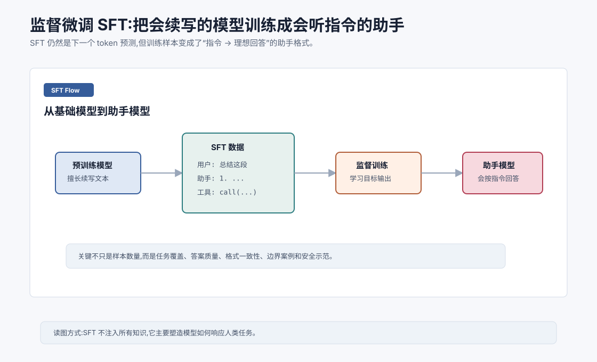
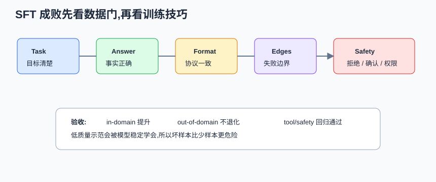

# 监督微调 SFT `[主线]`

预训练模型会预测下一个 token,也因此学到了大量语言、知识和代码模式。

但预训练模型不一定会像助手一样回答。

如果你给基础模型一句:

```text
请总结下面这段话:
```

它可能继续写一段类似训练语料的文本,也可能补全一个示例,不一定稳定地按你的要求给出总结。

SFT,Supervised Fine-Tuning,监督微调,就是把基础模型训练成更会听指令的助手。





本章会讲:

- SFT 和预训练有什么不同。
- 指令数据长什么样。
- SFT 如何改变模型行为。
- SFT 数据质量为什么比数量更关键。
- SFT 在 Agent 工具调用中有什么作用。
- SFT 的局限和风险。

## SFT 仍然是下一个 token 预测

SFT 没有改变语言模型的基本训练方式。

模型仍然在做下一个 token 预测。

区别在于训练数据变了。

预训练数据通常是普通文本序列。

SFT 数据是人工或模型辅助构造的任务样本:

```text
用户: 请把下面段落总结成 3 条要点。
助手: 1. ...
      2. ...
      3. ...
```

训练时,模型学习在“用户指令”之后生成“理想助手回答”。

所以 SFT 的本质是:

> 用高质量示范告诉模型,面对人类任务时应该怎么回应。

## SFT 数据包含什么

SFT 数据可以覆盖很多任务类型。

比如:

- 问答。
- 总结。
- 翻译。
- 改写。
- 代码生成。
- 代码解释。
- 数学解题。
- 信息抽取。
- 分类。
- 结构化输出。
- 多轮对话。
- 工具调用示范。
- 拒绝不安全请求。

一个样本通常包含输入和目标输出。

对于聊天模型,常见格式是 messages:

```text
system: 你是一个有帮助的助手。
user: 帮我写一封请假邮件。
assistant: 当然,下面是一封简洁的请假邮件...
```

模型训练时主要学习 assistant 部分的 token。

## SFT 学到的不是全部知识

SFT 主要塑造行为方式,不是从零注入所有知识。

预训练已经提供了大量语言和知识能力。

SFT 教模型:

- 如何理解指令。
- 如何组织回答。
- 如何遵守格式。
- 如何在不知道时表达不确定。
- 如何拒绝不安全请求。
- 如何进行多轮对话。
- 如何输出工具调用。

如果把预训练比作读了很多书,SFT 更像礼仪、任务格式和工作流程训练。

## 数据质量比数量更重要

SFT 数据不是越多越好。

低质量 SFT 数据会把模型教坏。

常见问题包括:

- 答案啰嗦。
- 格式不一致。
- 错误事实。
- 过度拒绝。
- 对边界条件处理差。
- 工具调用参数不规范。
- 多轮对话状态混乱。

高质量 SFT 数据应该:

- 指令清晰。
- 答案正确。
- 风格一致。
- 覆盖常见任务。
- 包含困难和边界案例。
- 对安全边界有示范。
- 对结构化输出有严格格式。

小而高质量的数据集,常常比大而脏的数据集更有价值。

可以把 SFT 数据看成一条质量管线:

| 关卡 | 要检查什么 | 不通过的后果 |
| --- | --- | --- |
| 任务定义 | 指令是否清楚,输出是否可验收 | 模型学到模糊行为 |
| 答案正确性 | 事实、代码、推理是否正确 | 模型学习错误答案 |
| 格式一致性 | JSON、表格、引用等是否稳定 | 结构化输出仍不稳 |
| 边界样本 | 证据不足、拒答、工具失败是否覆盖 | 真实系统一遇异常就乱 |
| 安全策略 | 拒绝、确认、最小权限是否示范 | Agent 容易越权或过度拒绝 |
| 去重和污染 | 是否有重复、模板化、泄露数据 | 过拟合、隐私和风格退化 |

很多 SFT 失败不是训练技巧问题,而是数据集把“坏示范”稳定地教给了模型。

## SFT 和格式遵守

SFT 对格式遵守非常重要。

比如你希望模型输出 JSON:

```json
{
  "intent": "refund",
  "confidence": 0.92
}
```

如果 SFT 数据中有大量严格格式样本,模型更容易学会稳定输出。

但 SFT 不能保证 100% 合法。

生产系统仍应使用:

- JSON schema。
- 结构化输出约束。
- 解析校验。
- 自动重试。
- 工具参数验证。

SFT 提高概率,系统校验提供保障。

## SFT 和工具调用

Agent 工具调用也可以通过 SFT 学习。

样本可能长这样:

```text
用户: 帮我查一下今天香港天气。
助手: {"tool": "weather.search", "arguments": {"city": "Hong Kong"}}
工具: {"temperature": "28C", "condition": "rain"}
助手: 今天香港约 28C,有雨,建议带伞。
```

模型通过这类轨迹学习:

- 什么时候该调用工具。
- 调用哪个工具。
- 参数如何填写。
- 如何阅读工具结果。
- 如何把观察转成最终回答。

但工具调用能力不只靠 SFT。还需要清晰工具 schema、权限控制、错误处理、执行环境和评估。

对 Agent 来说,工具调用 SFT 最好包含完整轨迹,而不是只包含工具名:

```text
用户目标 -> 判断需要工具 -> 结构化参数 -> 工具 observation -> 根据 observation 继续或停止
```

特别要加入失败轨迹。例如工具返回 `permission_denied` 时,好示范不是换个说法继续假装成功,而是向用户说明缺少权限或请求授权。模型只有看过这种边界样本,才更可能在真实 Agent loop 中稳住。

## 多轮对话 SFT

多轮对话样本能教模型保持上下文。

例如:

```text
user: 我想写一个 Python 脚本处理 CSV。
assistant: 可以,你希望做什么处理?
user: 过滤 status=active 的行。
assistant: ...
```

模型需要记住上一轮用户说的是 Python 和 CSV。

多轮 SFT 有助于模型学习对话状态,但上下文窗口仍然有限。长对话还需要摘要、记忆和状态管理。

## SFT 的过拟合风险

如果 SFT 数据太窄,模型可能学到表面格式而损害通用能力。

比如只用一种固定客服话术微调,模型可能变得僵硬。

只用某个工具 schema 微调,换工具后可能泛化差。

只用短问题微调,遇到长上下文任务可能不稳。

所以 SFT 需要验证集和回归评估。

不要只看训练集上的损失下降。

SFT 验收至少要看三类集:

| 数据集 | 用途 |
| --- | --- |
| in-domain validation | 当前任务是否学会 |
| out-of-domain regression | 通用能力是否退化 |
| safety/tool regression | 拒绝、确认、工具错误处理是否保持 |

如果只看领域样本,模型可能在公司客服话术上更像样,但代码、推理或安全拒绝能力下降。微调的成功标准不是“训练损失更低”,而是目标能力提升且关键能力不退化。

## SFT 和对齐的区别

SFT 和 RLHF/DPO 都会影响模型行为,但重点不同。

SFT 是给模型示范正确输出。

偏好对齐是告诉模型多个输出中哪个更好。

SFT 像老师给标准答案。

偏好对齐像评审给偏好排序。

通常流程是:

```text
预训练 -> SFT -> 偏好对齐
```

但实际训练配方会因模型和团队而异。

## 领域 SFT

如果你有特定领域需求,可以做领域 SFT。

比如:

- 医疗问答。
- 法律合同分析。
- 金融研报总结。
- 公司内部客服。
- 特定代码库开发。

领域 SFT 可以让模型更熟悉术语、格式和业务流程。

但高风险领域尤其要谨慎。

模型生成内容需要事实来源、专业审核和安全边界。SFT 不能替代专家验证。

## SFT 什么时候不该用

不是所有问题都要微调。

以下情况可能更适合 Prompt、RAG 或工具:

- 只是需要最新知识。
- 只是需要引用内部文档。
- 只是输出格式小调整。
- 样本很少且质量不稳定。
- 错误可以通过工具校验解决。
- 业务规则频繁变化。

SFT 适合稳定、重复、样本充足、格式明确的行为改造。

一个简单判断是:

| 问题 | 是否适合 SFT |
| --- | --- |
| 模型不知道最新政策 | 不适合,用 RAG/工具 |
| 模型 JSON 字段经常缺失 | 可能适合,先加强 schema 和示例 |
| 模型不熟悉公司固定话术 | 适合,前提是话术稳定且有好样本 |
| 模型工具失败后胡编结果 | 适合加入失败轨迹,但 Harness 仍必须校验 |
| 模型基础推理能力太弱 | 不适合,优先换模型 |

SFT 应该服务于稳定行为分布,不是替代知识库、权限系统或更强基础模型。

## 和 Agent 有什么关系

Agent 需要模型稳定执行任务协议。

SFT 可以帮助模型学会:

- 遵守系统角色。
- 输出工具调用。
- 根据观察继续行动。
- 遇到权限边界请求确认。
- 在工具失败时恢复。
- 最终给出可读总结。

但 Agent 的可靠性不能只靠 SFT。

还需要:

- 工具 schema 设计。
- 执行器校验。
- 状态机或工作流约束。
- 日志和评估。
- 安全策略。

SFT 让模型更懂协议,系统设计保证协议被安全执行。

## 常见误解

### 误解一:SFT 会给模型注入大量新知识

SFT 可以教领域格式和部分知识,但主要作用是行为塑形。大量动态知识更适合 RAG 或工具。

### 误解二:SFT 数据越多越好

低质量数据会损害模型。质量、覆盖和一致性比纯数量更重要。

### 误解三:SFT 后就不需要 Prompt

仍然需要。SFT 提供默认行为,Prompt 提供当前任务、约束和上下文。

### 误解四:SFT 能保证结构化输出永远合法

不能保证。生产系统仍要 schema 校验和重试。

### 误解五:所有问题都应该微调

不一定。很多问题用 Prompt、RAG、工具或工作流约束更便宜、更灵活。

## 本章小结

SFT 用高质量指令-回答样本把预训练模型塑造成助手模型。它仍然是下一个 token 预测,但训练数据变成了人类任务示范。SFT 能提升指令遵守、格式稳定、多轮对话和工具调用能力,但它主要塑造行为,不是万能知识注入。高质量数据、覆盖边界案例、验证集和系统校验是 SFT 成功的关键。

下一章会讲偏好对齐:RLHF 与 DPO。SFT 告诉模型“应该怎么答”,偏好对齐进一步告诉模型“哪些回答更符合人类偏好”。
