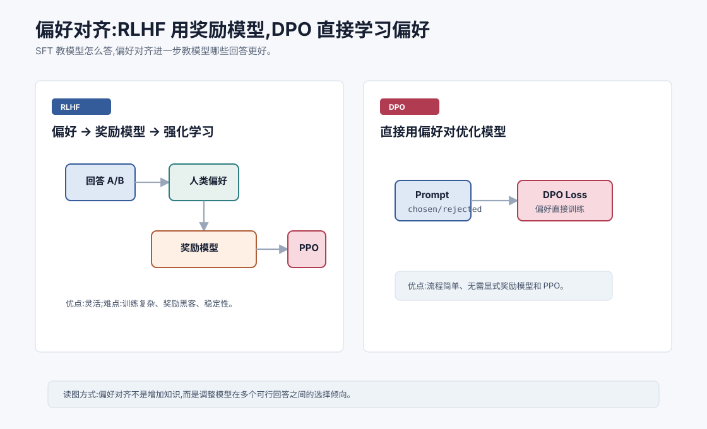
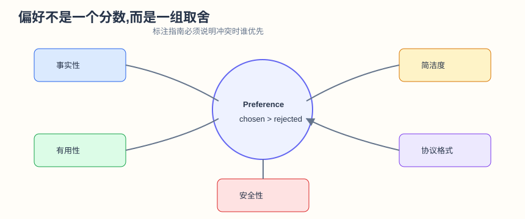
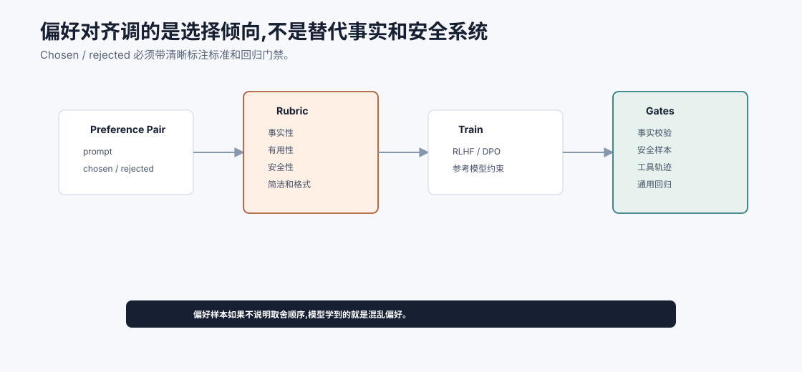
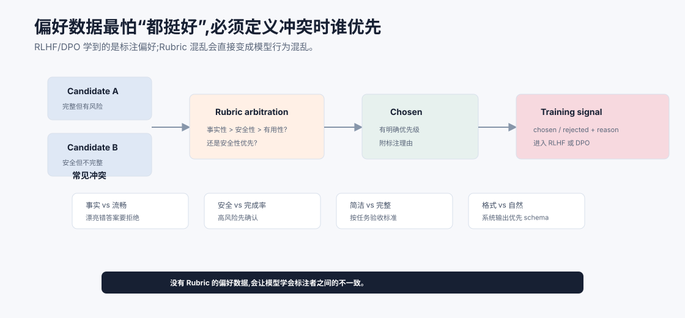

# 偏好对齐:RLHF 与 DPO `[进阶]` ★

SFT 教模型按照指令给出示范回答。

但同一个问题可能有很多看似合理的回答。

哪个更有帮助?哪个更安全?哪个更简洁?哪个更符合用户意图?

这就需要偏好对齐。

偏好对齐的目标不是单纯让模型知道更多事实,而是调整模型在多个可能输出之间的选择倾向。





本章会讲:

- 为什么 SFT 之后还需要偏好对齐。
- RLHF 的三个阶段:偏好数据、奖励模型、强化学习。
- PPO 在 RLHF 中大致做什么。
- DPO 为什么能简化流程。
- 偏好对齐的收益和风险。
- 对 Agent 工具调用有什么影响。

## 为什么需要偏好

看一个问题:

```text
帮我解释一下 Self-Attention。
```

可能有多个回答:

1. 很短,但过于粗略。
2. 很长,但啰嗦。
3. 技术准确,但读者看不懂。
4. 有类比、有公式、有边界,适合当前用户。

SFT 可以教模型生成某种标准回答,但它不一定能区分这些回答的相对好坏。

偏好数据提供了这种信号:

> 在同一个 prompt 下,回答 A 比回答 B 更好。

模型通过偏好对齐学习人类更喜欢什么样的输出。

## RLHF 的基本流程

RLHF 是 Reinforcement Learning from Human Feedback。

经典流程大致分三步。

### 1. 训练 SFT 模型

先用指令数据训练一个基础助手模型。

### 2. 收集偏好数据并训练奖励模型

对同一个 prompt,让模型生成多个回答。

人类标注者选择哪个更好。

形成数据:

```text
prompt: ...
chosen: 更好的回答
rejected: 较差的回答
```

用这些数据训练奖励模型,Reward Model。

奖励模型输入 prompt 和回答,输出一个分数,表示这个回答有多符合偏好。

### 3. 用强化学习优化策略模型

把语言模型看成策略模型。

它生成回答,奖励模型给分。

强化学习算法调整语言模型,让它更倾向于生成高奖励回答。

常见算法是 PPO。

## 奖励模型在学什么

奖励模型不是事实裁判。

它学的是偏好标注中的模式。

比如人类可能更偏好:

- 有帮助。
- 准确。
- 不编造。
- 结构清晰。
- 语气合适。
- 遵守安全边界。
- 不过度冗长。

奖励模型会把这些偏好压缩成一个分数。

这很强大,但也有风险。偏好标注如果有偏差,奖励模型也会学到偏差。

偏好本身不是单一维度。一个“更好”的回答可能同时涉及:

| 维度 | 偏好例子 | 可能冲突 |
| --- | --- | --- |
| 事实性 | 不编造、不乱引用 | 可能比流畅回答更保守 |
| 有用性 | 直接解决用户问题 | 可能诱导模型过度承诺 |
| 安全性 | 拒绝越权或危险动作 | 可能降低正常任务完成率 |
| 简洁度 | 不啰嗦 | 可能遗漏关键限制 |
| 语气 | 礼貌、稳定 | 可能掩盖不确定性 |
| 协议遵守 | JSON、工具 schema 合法 | 可能牺牲自然表达 |

如果标注指南不说明这些维度如何排序,模型会学到混乱偏好。比如 chosen 更安全但没回答完整,rejected 更完整但有轻微风险,标注者到底该选谁?这个问题必须在数据规范里提前回答。

## PPO 在做什么

PPO 是一种强化学习算法。

在 RLHF 中,它大致做两件事:

1. 提高高奖励回答的生成概率。
2. 限制模型不要偏离原来的 SFT 模型太远。

第二点很重要。

如果只追求奖励模型高分,模型可能钻奖励模型漏洞,生成奇怪但高分的文本。这叫 reward hacking。

所以 RLHF 通常会加 KL 惩罚,让新模型不要离参考模型太远。

直觉上是在说:

> 变得更符合偏好,但不要把原本语言能力和稳定性弄坏。

## RLHF 的难点

RLHF 效果强,但训练复杂。

难点包括:

- 偏好数据收集成本高。
- 奖励模型可能学偏。
- PPO 训练不稳定。
- 奖励黑客风险。
- 安全偏好和帮助性偏好可能冲突。
- 模型可能变得过度保守或啰嗦。

所以 RLHF 是一套复杂工程,不是简单“让人类打分然后训练”。

RLHF 还要防止 reward model 变成“漂亮话评分器”。如果奖励模型过度偏好格式完整、语气自信、结构清楚,它可能给事实错误但写得很像样的回答高分。因此高质量 RLHF 往往需要把偏好标注和事实校验、工具结果、引用证据结合起来。

## DPO 的动机

DPO 是 Direct Preference Optimization。

它的动机是:能不能不用显式训练奖励模型和跑 PPO,直接用偏好对训练语言模型?

DPO 的回答是:可以在一定理论推导下,把偏好优化转成一个监督式损失。

训练数据仍然是:

```text
prompt
chosen response
rejected response
```

DPO 直接调整模型,让 chosen 的相对概率高于 rejected。

## DPO 的直觉

对同一个 prompt,如果人类更喜欢 $y_w$ 而不是 $y_l$,我们希望模型更偏向 $y_w$。

DPO 会比较当前模型和参考模型对这两个回答的概率差异。

直觉目标是:

$$
\log \pi(y_w|x) - \log \pi(y_l|x)
$$

应该变大,但不能无限偏离参考模型。

这里:

- $x$ 是 prompt。
- $y_w$ 是 preferred/chosen 回答。
- $y_l$ 是 rejected 回答。
- $\pi$ 是当前策略模型。

DPO 的具体公式比这个更完整,但核心直觉就是直接学习偏好对。

更进一步,DPO 不是简单地把 chosen 当普通监督答案。它关心的是“相对于 rejected,chosen 应该更可能”,并且这个变化要参考原来的参考模型。

这解决了一个关键问题:如果只做 chosen 的 SFT,模型看不到“为什么另一个回答不好”。偏好对给的是比较信号,而比较信号往往比单个标准答案更适合描述人类偏好。

例如两个回答都事实正确,但一个更简洁、结构更清楚、没有多余承诺。SFT 很难表达这种相对差异,DPO/RLHF 更适合。

## DPO 的优势

DPO 相比经典 RLHF 流程有几个优势。

- 不需要单独训练奖励模型。
- 不需要 PPO 这类复杂强化学习过程。
- 训练流程更像监督学习。
- 实现和调参更简单。
- 对许多对齐任务效果很好。

因此 DPO 和它的变体在开源模型对齐中非常流行。

## DPO 的局限

DPO 也不是万能。

它依赖偏好数据质量。

如果 chosen/rejected 标注质量差,模型仍会学坏。

它也可能过拟合偏好格式,或者在某些复杂偏好目标上不如更灵活的 RL 方法。

此外,偏好对齐本身不能保证事实正确。模型可能更会说得像好答案,但事实仍需外部校验。

DPO 也需要注意参考模型选择。DPO 的训练目标会比较当前模型和 reference model 的相对概率,reference 过弱、过强或和当前模型分布差太远,都会影响训练稳定性和效果。工程上通常要把 DPO 当成一次可回归实验,而不是“有偏好数据就直接训”。

## 偏好对齐改变了什么

偏好对齐通常会改善:

- 指令遵守。
- 回答有用性。
- 安全拒绝。
- 语气和风格。
- 避免明显有害输出。
- 减少不必要冒险。

但也可能带来副作用:

- 过度拒绝。
- 回答变模板化。
- 对敏感但合法问题过于保守。
- 更倾向讨好用户。
- 在不确定时仍给出流畅回答。

对齐是取舍,不是纯粹提升。

## 偏好和事实的区别

这是非常重要的一点。

偏好对齐让模型更倾向于人类喜欢的回答。

但人类喜欢的回答不一定事实正确。

一个回答可以很礼貌、结构清晰、听起来可靠,但引用错误。

所以事实性任务仍需要:

- 检索。
- 引用。
- 数据库。
- 工具验证。
- 不确定性表达。
- 评估。

偏好对齐提高“回答风格和选择”,不替代事实来源。

## 对 Agent 工具调用的影响

偏好对齐会影响 Agent 行为。

好的偏好数据可以让模型学会:

- 需要事实时调用工具。
- 高风险动作前请求确认。
- 工具失败时不要编造结果。
- 遵守权限边界。
- 给出简洁可执行总结。

坏的偏好数据可能让模型:

- 为了显得有帮助而跳过确认。
- 过度调用工具。
- 工具失败后继续自信回答。
- 拒绝太多正常请求。

所以 Agent 对齐不仅要评估最终回答,还要评估行动轨迹。

## 偏好数据怎么设计

高质量偏好数据应该覆盖:

- 正常任务。
- 模糊任务。
- 不安全请求。
- 需要澄清的问题。
- 工具调用决策。
- 工具错误处理。
- 长上下文引用。
- 事实不足时的回答。
- 用户偏好冲突。

偏好标准也要清晰。

标注者需要知道什么叫“更好”:更准确、更安全、更简洁、更完整,还是更符合格式?

不同标准混在一起,奖励信号会变乱。

更好的做法是把偏好维度拆清楚:

| 维度 | 标注时看什么 | Agent 中的例子 |
| --- | --- | --- |
| 正确性 | 是否符合事实和工具结果 | 工具返回失败时不编造成功 |
| 有用性 | 是否解决用户问题 | 给出可执行下一步 |
| 安全性 | 是否越权或引导风险操作 | 删除数据前要求确认 |
| 格式 | 是否满足协议 | 工具参数 JSON 合法 |
| 简洁度 | 是否没有不必要展开 | 状态汇报不淹没关键结论 |

如果一个偏好样本里 chosen 更安全但更不完整,rejected 更完整但有轻微风险,标注标准必须明确谁优先。否则模型学到的是混乱信号。



偏好对齐也需要控制面。偏好样本进入训练前,要先有 rubric 定义:事实性、安全性、完整性、简洁度和格式冲突时谁优先。训练后,还要用事实校验、安全样本、工具轨迹和通用能力回归做门禁。否则 RLHF 或 DPO 可能让模型更会写“看起来好”的答案,但事实、引用或工具行为反而变差。

这也是为什么偏好对齐不能替代评估系统。偏好数据告诉模型人类更喜欢哪种输出,但上线系统仍要证明这些偏好没有破坏关键能力。尤其 Agent 场景中,你评估的不是最后一句话,而是整条行动轨迹是否更安全、更有效、更可恢复。



上图强调一个偏好数据的核心问题:很多 chosen/rejected 对并不是一眼就能决定。一个回答可能更完整但有风险,另一个更安全但不完整;一个更流畅但事实错,另一个更保守但证据足。没有 rubric,标注者会按个人习惯选择,模型最后学到的是这种不一致。

偏好标注应该给出冲突优先级。例如事实性是否永远高于流畅度,安全性在什么场景高于完成率,结构化输出是否优先于自然表达,不确定时是否应选择澄清而不是猜测。对 Agent 轨迹偏好,还要规定工具失败、高风险动作、证据不足和权限缺失时的 preferred 行为。

## 偏好数据的仲裁流程

一个成熟流程通常不是“标注者点 A 或 B 就结束”,而是包含理由和仲裁。

| 阶段 | 产物 | 目的 |
| --- | --- | --- |
| 初标 | chosen/rejected + 简短理由 | 捕捉直接偏好 |
| 规则检查 | 是否违反事实、安全、格式硬规则 | 避免漂亮但错误的 chosen |
| 冲突仲裁 | 多维度冲突时按 rubric 决策 | 减少标注者差异 |
| 抽样复核 | 复查边界样本和低一致性样本 | 提高训练信号质量 |
| 回归沉淀 | 将争议样本加入评估集 | 防止后续版本反复犯错 |

偏好对齐的数据质量不只取决于标注数量,还取决于标注一致性。与其收集大量模糊偏好,不如先把高风险、高冲突、高频任务的 rubric 写清楚。对 Agent 来说,这会直接影响模型是更愿意验证事实,还是更愿意快速给出看似有帮助的动作。

对 Agent,偏好样本最好不仅比较最终回答,还比较轨迹:

| 轨迹行为 | 好偏好 | 坏偏好 |
| --- | --- | --- |
| 工具选择 | 需要外部事实时先检索 | 凭记忆回答最新事实 |
| 参数来源 | 关键参数来自用户或可信工具 | 关键参数由模型猜测 |
| 工具失败 | 明确失败并恢复 | 忽略失败继续说成功 |
| 高风险动作 | preview/confirm 后执行 | 为了有帮助直接执行 |
| 证据不足 | 说明缺口 | 编一个看似完整答案 |

这类轨迹偏好比单纯“哪个答案更好”更能塑造 Agent 行为。

## 常见误解

### 误解一:RLHF 会让模型获得新知识

通常不是。RLHF 主要改变输出偏好和行为风格,事实知识仍主要来自预训练、检索和工具。

### 误解二:奖励模型就是事实评估器

不是。奖励模型学习人类偏好,可能偏好看起来好的错误答案。

### 误解三:DPO 一定优于 RLHF

不一定。DPO 更简单有效,但不同任务和数据下方法选择不同。

### 误解四:对齐越强越好

过强对齐可能导致过度拒绝、回答模板化或能力退化。

### 误解五:偏好对齐能保证 Agent 安全

不能单独保证。Agent 还需要权限控制、工具校验、审计和人类确认。

## 本章小结

偏好对齐让模型在多个可能回答之间更倾向于人类偏好的输出。RLHF 通过偏好数据训练奖励模型,再用强化学习优化语言模型;DPO 则直接用 chosen/rejected 偏好对训练模型,简化了流程。偏好对齐能提升有用性、安全性和指令遵守,但不能替代事实校验,也不能单独保证 Agent 安全。它塑造的是模型选择什么样的回答和行动,而不是让模型自动拥有可靠事实来源。

下一章会讲参数高效微调 PEFT 与 LoRA。预训练和对齐通常成本很高,而 LoRA 等方法让我们能用较低成本适配模型行为。
