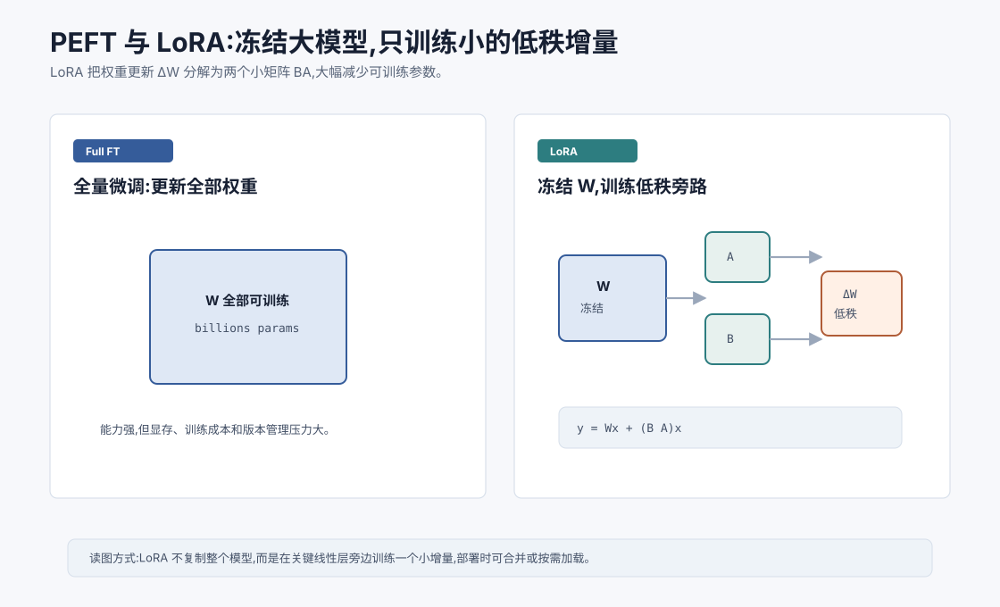
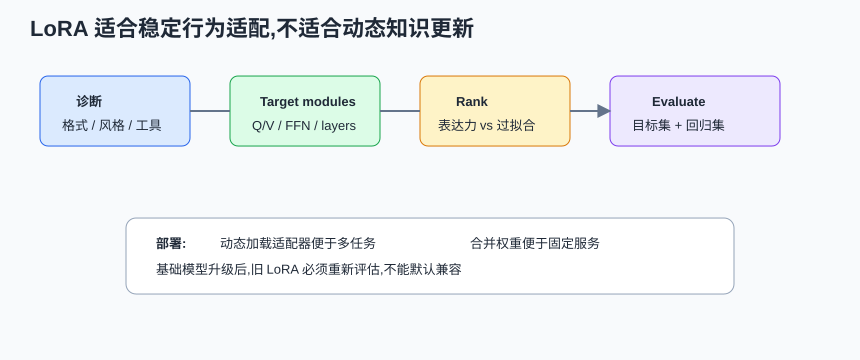

# 参数高效微调:PEFT 与 LoRA `[进阶]` ★

微调大模型很贵。

如果一个模型有几十亿、几百亿参数,全量微调意味着要更新并保存所有参数。训练显存、计算成本、数据需求和版本管理都会变得沉重。

但很多业务场景并不需要重写整个模型。

我们只是想让模型更适应某个领域、某种格式、某类工具调用或某种回答风格。

这就引出了 PEFT,Parameter-Efficient Fine-Tuning,参数高效微调。

LoRA 是最常用的 PEFT 方法之一。





本章会讲:

- 为什么全量微调成本高。
- PEFT 的核心思想。
- LoRA 如何用低秩矩阵表示权重增量。
- LoRA 适合哪些场景,不适合哪些场景。
- LoRA 和 RAG、Prompt、SFT 的关系。
- Agent 系统如何使用 LoRA。

## 全量微调的问题

全量微调会更新模型所有参数。

假设模型参数为 $W$,微调后变成:

$$
W' = W + \Delta W
$$

全量微调直接学习完整的 $\Delta W$。

问题是:

- 可训练参数太多。
- 训练显存需求高。
- 容易过拟合小数据。
- 每个任务都要保存一份完整模型。
- 多个版本切换成本高。
- 可能损害原模型通用能力。

如果你只是想让模型更会输出某种 JSON,全量微调可能太重。

## PEFT 的核心思想

PEFT 的目标是只训练少量额外参数,尽量保持基础模型不变。

常见思路包括:

- Adapter:在层中插入小模块。
- Prompt tuning:学习一组软提示向量。
- Prefix tuning:学习可注入 Attention 的前缀表示。
- LoRA:在线性层旁边训练低秩增量。

这些方法的共同点是:

> 冻结大部分原始参数,只训练小的可插拔参数。

这样可以降低训练成本,也方便为不同任务保存不同适配器。

## LoRA 的核心公式

LoRA 的全称是 Low-Rank Adaptation。

它的想法是:不要直接训练完整的 $\Delta W$,而是用两个低秩矩阵近似它。

原线性层是:

$$
y = Wx
$$

LoRA 加一个旁路:

$$
y = Wx + \Delta W x
$$

其中:

$$
\Delta W = BA
$$

$A$ 和 $B$ 是小矩阵。

如果 $W$ 的形状是:

$$
d_{out} \times d_{in}
$$

LoRA 设一个很小的 rank $r$:

$$
A \in \mathbb{R}^{r \times d_{in}}
$$

$$
B \in \mathbb{R}^{d_{out} \times r}
$$

当 $r$ 远小于 $d_{in}$ 和 $d_{out}$ 时,可训练参数大幅减少。

参数量差异可以直接算出来。

完整微调一个线性层需要更新:

$$
d_{out} \times d_{in}
$$

个参数。LoRA 只训练:

$$
r \times d_{in} + d_{out} \times r = r(d_{in}+d_{out})
$$

个参数。

如果 $d_{in}=d_{out}=4096$,rank $r=8$,完整矩阵有约 $1677$ 万参数,LoRA 只有约 $6.6$ 万参数。这个数量级差异就是 LoRA 能低成本适配大模型的直接原因。

## 为什么低秩可行

LoRA 背后的直觉是:很多任务适配不需要在所有方向上大幅修改模型。

微调需要的变化可能集中在较低维的子空间里。

也就是说,完整的 $\Delta W$ 虽然很大,但有效变化可能可以用低秩结构表示。

这不是永远成立,但在很多语言模型适配任务中效果很好。

## LoRA 训练时发生什么

训练 LoRA 时:

- 原始模型权重 $W$ 冻结。
- 只训练 $A$ 和 $B$。
- 前向计算使用 $Wx + BAx$。

这样训练显存和可训练参数都更少。

训练完成后,LoRA 参数可以单独保存。

部署时有两种方式:

1. 动态加载 LoRA 适配器。
2. 把 $BA$ 合并进原权重 $W$。

合并后推理不需要额外旁路,但动态加载更方便多任务切换。

动态加载适合多租户或多任务场景:同一个基础模型常驻显存,不同用户或业务切换不同 LoRA。合并权重适合单一固定任务部署:推理路径更简单,也更容易和某些推理引擎优化配合。

但要注意,多个 LoRA 不是随便相加就一定稳定。不同适配器可能改动相互冲突,组合前需要评估。

## LoRA 通常加在哪里

LoRA 常加在 Transformer 的线性层上。

比如:

- Attention 的 $W_Q$、$W_K$、$W_V$、$W_O$。
- FFN 的投影矩阵。
- 输出层或其他线性层。

实际选择会影响效果和参数量。

只加 Q/V 可能参数少,但表达受限。

加更多层和矩阵效果可能更好,但训练和存储成本更高。

这是一个任务相关的取舍。

可以粗略按目标选择 target modules:

| 目标 | 常见选择 | 取舍 |
| --- | --- | --- |
| 轻量格式适配 | Q/V 或部分 attention 层 | 参数少,但表达有限 |
| 领域风格和术语 | Attention + 部分 FFN | 效果更强,成本更高 |
| 代码/复杂指令 | 更多层和 FFN | 更能改变行为,也更易过拟合 |
| 输出词表偏向 | 输出层附近 | 需谨慎,可能影响通用表达 |

这不是固定公式。真正选择要靠验证集和回归集,尤其要看目标能力提升是否伴随通用能力下降。

## LoRA 的超参数

常见 LoRA 超参数包括:

- rank $r$:低秩维度。
- alpha:缩放系数。
- dropout:LoRA 路径上的 dropout。
- target modules:加在哪些层。
- learning rate:学习率。

rank 越大,可表达变化越丰富,但参数越多。

rank 太小可能学不动。

rank 太大可能过拟合或失去参数高效优势。

LoRA 调参时要避免只看训练 loss。建议记录:

| 参数 | 观察指标 |
| --- | --- |
| rank | 目标任务分数、过拟合、适配器大小 |
| alpha | 输出稳定性、是否过度改变基础模型风格 |
| dropout | 小数据下泛化能力 |
| target modules | 能力提升位置和推理开销 |
| learning rate | 收敛速度、灾难性行为变化 |

如果 rank 提升后目标集只小幅改善,但安全或格式回归变差,就不值得继续加 rank。

## LoRA 适合什么

LoRA 适合:

- 领域风格适配。
- 固定格式输出。
- 特定工具调用格式。
- 中小规模指令数据微调。
- 多租户模型适配。
- 资源有限的训练场景。
- 快速实验不同任务版本。

比如一个企业可以用同一个基础模型,为客服、法务、代码助手分别训练不同 LoRA 适配器。

LoRA 的一个工程优势是版本管理。你可以把基础模型和适配器分开:

```text
base-model:v1 + customer-support-lora:v3
base-model:v1 + legal-review-lora:v2
base-model:v2 + code-agent-lora:v1
```

这样做方便回滚和 A/B 测试。但前提是每个组合都经过评估。基础模型升级后,旧 LoRA 不一定仍然稳定。

## LoRA 不适合什么

LoRA 不是万能。

它不适合把模型从根本上训练成另一个能力层级。

如果基础模型不会某种语言、某种复杂推理或某类视觉能力,LoRA 很难凭少量数据补出来。

如果任务需要大量新事实,更适合 RAG 或数据库。

如果数据质量差,LoRA 会快速学坏。

如果安全边界需要严格保障,不能只靠 LoRA。

## QLoRA

QLoRA 是 LoRA 的常见扩展。

它把基础模型量化,比如 4-bit,以降低显存占用,同时训练 LoRA 参数。

这样可以在更小硬件上微调较大模型。

核心思想是:

- 基础模型低精度冻结。
- LoRA 参数正常训练。
- 通过技巧保持训练稳定。

QLoRA 让个人或小团队微调大模型更现实。

但量化和训练配置仍需仔细评估。

## LoRA 与 RAG 的区别

LoRA 和 RAG 经常被混淆。

LoRA 改变模型参数,让模型行为或领域适配发生变化。

RAG 不改变模型参数,而是在回答时检索外部知识放入上下文。

如果问题是“模型不知道最新政策”,优先考虑 RAG。

如果问题是“模型总是不按公司格式回答”,LoRA 可能有用。

如果问题是“模型需要稳定调用内部工具”,LoRA 和 SFT 数据可能有用,但仍要配合工具校验。

## LoRA 与 Prompt 的关系

Prompt 是调用时提供指令和上下文。

LoRA 是训练时改变模型行为倾向。

Prompt 更灵活,适合频繁变化的规则。

LoRA 更适合稳定重复的模式。

很多场景应先尝试 Prompt 和评估,再决定是否 LoRA 微调。

## 对 Agent 的价值

Agent 系统可以用 LoRA 适配:

- 固定工具调用格式。
- 特定领域术语。
- 企业内部回答风格。
- 代码仓库规范。
- 错误处理策略示范。
- 多轮任务轨迹。

但 Agent 的关键可靠性仍来自系统层:

- 工具 schema。
- 权限控制。
- 执行反馈。
- 评估。
- 回滚。
- 审计。

LoRA 能让模型更配合系统,不能替代系统。

Agent 使用 LoRA 时尤其要评估轨迹指标:

| 指标 | 为什么 |
| --- | --- |
| tool_call_validity | 是否稳定输出合法工具参数 |
| tool_choice_accuracy | 是否在正确时机调用正确工具 |
| recovery_behavior | 工具失败后是否能恢复 |
| confirmation_rate | 高风险动作是否请求确认 |
| no_tool_when_not_needed | 是否避免过度调用工具 |

如果 LoRA 只让最终回答更像公司风格,却让工具调用更激进,对 Agent 反而可能是退步。

## 常见误解

### 误解一:LoRA 等于完整微调效果

不一定。LoRA 参数高效,但表达能力受 rank 和目标层限制。复杂任务可能仍需要全量微调或更强基础模型。

### 误解二:LoRA 可以注入大量动态知识

不适合。动态知识更适合 RAG、数据库或工具。

### 误解三:rank 越大越好

rank 越大参数越多,也更容易过拟合。要用验证集选择。

### 误解四:LoRA 训练很便宜,所以不需要评估

仍然需要评估。小参数也能把模型行为调坏。

### 误解五:LoRA 能替代安全机制

不能。安全仍需要权限、校验、监控和人类确认。

## 本章小结

PEFT 通过只训练少量参数来降低大模型适配成本。LoRA 冻结原始权重,用两个低秩矩阵 $A$ 和 $B$ 表示权重增量 $\Delta W=BA$,在许多任务中以较低成本实现有效微调。LoRA 适合稳定格式、领域风格和工具调用适配,但不适合替代 RAG、事实更新或系统安全控制。选择 LoRA 前,应先明确问题是知识不足、格式不稳、行为偏差还是基础能力不够。

下一章会讲蒸馏与量化。LoRA 解决训练适配成本,蒸馏和量化则更多面向模型压缩、推理成本和部署效率。
