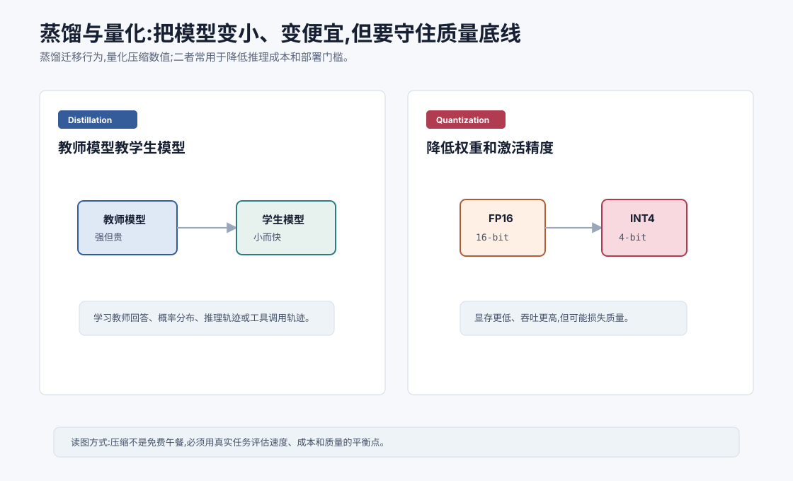
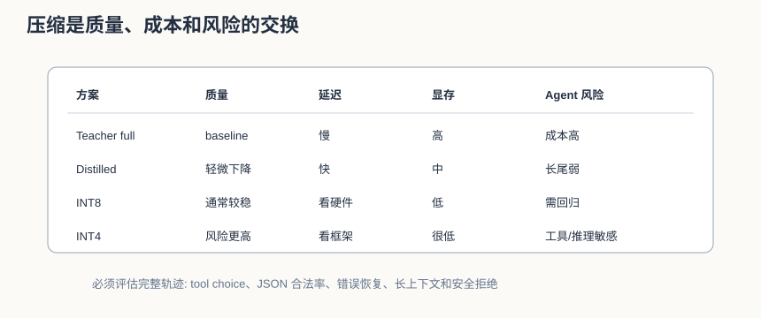

# 蒸馏与量化 `[进阶]`

大模型能力强,但部署成本高。

生产系统常常需要在质量、延迟、显存、吞吐和成本之间权衡。

蒸馏和量化是两类常见压缩技术。

- **蒸馏**:让小模型学习大模型的行为。
- **量化**:用更低精度表示模型权重或激活。

它们的目标不是让模型凭空更强,而是在尽量少损失能力的前提下,让模型更便宜、更快、更容易部署。





本章会讲:

- 蒸馏的教师-学生框架。
- 硬标签、软标签和轨迹蒸馏。
- 量化为什么能省显存。
- INT8、INT4 等低精度的取舍。
- 压缩后的模型如何评估。
- Agent 系统如何使用小模型和量化模型。

## 为什么需要压缩

大模型的问题很现实:

- GPU 显存贵。
- 推理延迟高。
- 并发成本高。
- 边缘部署困难。
- 私有化部署门槛高。

很多任务不需要最强模型。

比如分类、路由、简单摘要、固定格式抽取、低风险问答,用小模型可能足够。

压缩技术帮助我们把强模型的部分能力迁移到更小、更便宜的模型上。

## 蒸馏是什么

蒸馏是 teacher-student 框架。

教师模型通常更大、更强。

学生模型更小、更快。

训练时,学生模型学习教师模型的输出。

最简单形式是:

```text
输入 prompt -> 教师生成回答 -> 学生学习这个回答
```

这样可以构造大量高质量训练数据,让小模型模仿大模型。

## 硬标签蒸馏

硬标签蒸馏把教师输出当作标准答案。

例如教师回答:

```text
这段话的核心观点有三点:...
```

学生模型用普通交叉熵学习生成这段回答。

这种方法简单,也常见。

缺点是只学习最终文本,丢掉了教师对其他候选 token 的相对偏好。

## 软标签蒸馏

软标签蒸馏让学生学习教师的概率分布。

教师不仅告诉学生正确答案,还告诉它哪些候选也比较合理。

比如分类任务中,教师可能认为:

```text
billing: 0.70
account: 0.25
technical: 0.05
```

这比只告诉学生 `billing` 包含更多信息。

语言模型中,学习完整 token 分布成本较高,但软标签思想仍然重要。

## 轨迹蒸馏

对于 Agent,最终答案不够。

更重要的是行动轨迹。

教师模型可以生成:

- 任务分解。
- 工具调用。
- 参数选择。
- 错误恢复。
- 中间观察总结。
- 最终回答。

学生模型学习这些轨迹,可以获得更好的 Agent 行为。

但轨迹蒸馏要小心。教师轨迹如果有错误,学生会复制错误。最好结合执行验证和过滤。

轨迹蒸馏的数据最好经过三道过滤:

| 过滤 | 检查什么 |
| --- | --- |
| 执行过滤 | 工具调用是否真实成功,最终产物是否通过验证 |
| 证据过滤 | 关键结论是否有来源或工具 observation 支持 |
| 行为过滤 | 是否遵守权限、确认、预算和停止条件 |

不要把“教师模型自信地完成了任务”当作蒸馏样本合格。Agent 蒸馏要蒸馏的是可验证的好轨迹,不是漂亮的故事。

## 蒸馏的风险

蒸馏有几个风险。

第一,学生上限受限。小模型容量有限,不可能完整复制大模型所有能力。

第二,教师错误会被放大。如果教师生成幻觉,学生会学习幻觉。

第三,数据分布可能太窄。学生只在蒸馏任务上好,换场景就弱。

第四,学生可能模仿风格而不是能力。看起来像会推理,实际遇到新问题失败。

所以蒸馏数据需要过滤、验证和覆盖真实任务。

## 量化是什么

量化是降低模型数值精度。

模型权重通常用 FP16、BF16 或 FP32 表示。

量化可以把权重表示成 INT8、INT4 等更低精度。

比如同样一个参数:

- FP16 需要 16 bit。
- INT8 需要 8 bit。
- INT4 需要 4 bit。

精度越低,显存占用越少。

## 量化为什么能加速

量化带来几个好处:

- 权重更小,显存占用更低。
- 内存带宽压力更小。
- 某些硬件支持低精度矩阵乘法,吞吐更高。
- 更大的模型可以放进有限显存。

但加速效果取决于硬件、推理框架和量化方法。

不是所有 INT4 模型都一定比 FP16 快。

## 量化的误差

量化会把连续数值映射到有限离散值。

这会引入误差。

如果误差太大,模型质量会下降。

可能表现为:

- 事实性下降。
- 推理变差。
- 长上下文更不稳。
- 代码生成错误增加。
- 格式遵守变差。

因此量化必须评估。

尤其复杂推理、代码和工具调用任务,对量化误差可能更敏感。

量化误差不一定平均地表现出来。常见情况是普通聊天几乎无感,但边界能力下降:

| 能力 | 可能退化 |
| --- | --- |
| 长上下文 | 远处约束利用变差 |
| 代码 | 小语法错误增加 |
| 工具调用 | JSON 格式和参数枚举更不稳 |
| 数学推理 | 多步推理断裂 |
| 安全拒绝 | 边界请求判断波动 |

所以压缩评估集必须包含这些敏感样本。

## PTQ 和 QAT

量化常见两类。

### PTQ

Post-Training Quantization,训练后量化。

模型训练完后,直接把权重量化。

优点是简单便宜。

缺点是质量可能下降较多。

很多 PTQ 方法会使用一小批校准数据,观察权重或激活的数值范围,再决定缩放比例。校准数据要尽量接近真实请求分布。用短文本校准的量化模型,在长上下文代码任务上未必稳。

### QAT

Quantization-Aware Training,量化感知训练。

训练或微调时模拟量化误差,让模型适应低精度。

优点是质量更稳。

缺点是训练成本更高。

## 权重量化和激活量化

量化可以作用在不同对象上。

### 权重量化

只量化模型权重。

这是很多本地部署最常见的方式。

### 激活量化

量化中间激活。

这能进一步降低内存和计算成本,但更容易影响质量,实现也更复杂。

### KV Cache 量化

长上下文推理中,KV Cache 很占显存。

量化 KV Cache 可以降低显存,但可能影响长上下文质量。

这点对 Agent 尤其重要。Agent 往往把系统提示、工具说明、历史轨迹、检索片段都放进上下文,KV Cache 成本会随并发和上下文长度放大。KV Cache 量化能提高并发,但如果导致模型丢失远处关键信息,工具调用和引用准确率可能下降。

## 蒸馏和量化可以结合

常见部署路线可能是:

1. 用强模型生成高质量数据。
2. 蒸馏训练小模型。
3. 对小模型做量化。
4. 用目标任务评估质量。
5. 部署到低成本推理服务。

这条路线适合高频、任务稳定、成本敏感的场景。

例如客服意图识别、固定格式抽取、简单工具路由。

一个常见模式是“强模型教、小模型跑、强模型兜底”:

```text
强模型生成/筛选训练数据 -> 小模型蒸馏 -> 量化部署 -> 低置信或高风险时回退强模型
```

这样既能降低常规流量成本,又不会把所有复杂边界都压给小模型。

## Agent 中的压缩策略

Agent 系统可以使用压缩模型承担部分职责。

比如:

- 小模型做任务路由。
- 小模型判断是否需要检索。
- 小模型做安全初筛。
- 蒸馏模型处理常见客服问题。
- 量化模型本地处理隐私数据。
- 强模型只处理复杂步骤。

这比所有请求都调用最强模型更经济。

关键是要有路由和评估。

## 压缩后的评估

压缩模型必须在目标任务上评估。

评估维度包括:

- 正确率。
- 格式合法率。
- 工具调用成功率。
- 幻觉率。
- 长上下文表现。
- 延迟。
- 吞吐。
- 显存占用。
- 单次请求成本。

不要只看通用 benchmark。压缩误差往往在你的业务边界案例里暴露。

建议至少做三组对比:

| 对比 | 看什么 |
| --- | --- |
| 原模型 vs 蒸馏模型 | 小模型是否保住关键能力 |
| FP16/BF16 vs 量化模型 | 量化是否破坏格式、推理和工具调用 |
| 短上下文 vs 长上下文 | 压缩后是否更容易遗忘远处信息 |

如果模型用于 Agent,还要评估完整轨迹,而不是只评估最终回答。一个压缩模型可能最终话术看起来不错,但中间多调用一次昂贵工具,或在错误恢复时走错分支。

建议用压缩决策矩阵记录结果:

| 方案 | 质量变化 | 延迟变化 | 显存变化 | 风险 |
| --- | --- | --- | --- | --- |
| teacher full | baseline | baseline | 高 | 成本高 |
| distilled student | 轻微下降 | 降低 | 中 | 长尾能力弱 |
| INT8 | 轻微下降或持平 | 取决硬件 | 降低 | 通常较稳 |
| INT4 | 可能下降 | 取决硬件 | 大幅降低 | 工具/推理风险更高 |

压缩不是单向升级,而是换取部署效率。是否值得,取决于任务风险和流量结构。

## 常见误解

### 误解一:蒸馏后小模型能完全复制大模型

不能。学生模型容量有限,只能学习教师能力的一部分。

### 误解二:量化只影响速度不影响质量

量化可能影响质量,尤其是复杂推理、代码、长上下文和工具调用。

### 误解三:INT4 一定比 INT8 更好

INT4 更省显存,但质量风险更高。是否更好取决于任务和硬件。

### 误解四:蒸馏数据越多越好

错误或单一分布的数据会让学生学偏。质量和覆盖更重要。

### 误解五:压缩是上线前最后一步

压缩会改变模型行为,应该纳入完整评估和回归流程。

## 本章小结

蒸馏通过教师模型生成示范、概率分布或行动轨迹,训练更小的学生模型。量化通过降低权重、激活或 KV Cache 的数值精度,减少显存和推理成本。二者都能提高部署效率,但都会带来质量风险。生产系统应根据任务重要性和成本约束,用真实评估集选择合适的压缩策略。

下一章会讲微调、提示和检索如何选择。到这里我们已经有多种适配方式,接下来要建立工程决策框架:什么时候该微调,什么时候该写 Prompt,什么时候该用 RAG。
