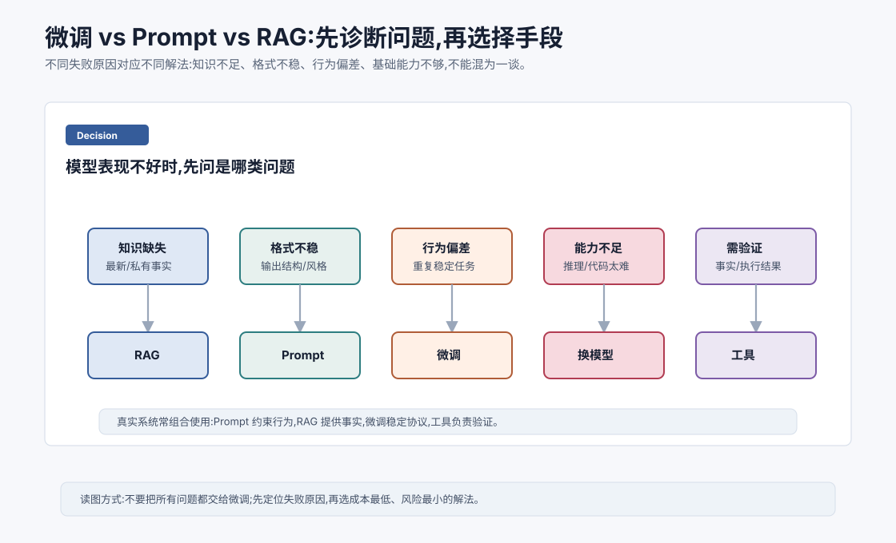

# 微调 vs 提示 vs 检索:如何选 `[主线]`

模型效果不好时,很多人第一反应是:

```text
要不要微调一下?
```

但微调不是万能药。

有些问题应该用 Prompt 解决,有些应该用 RAG,有些应该用工具校验,有些应该换更强模型。

关键是先诊断失败原因。



本章会给一个实用判断框架,帮助你在 Prompt、RAG、微调、换模型和工具之间做选择。

## 先问:问题到底是什么

模型表现不好,可能有很多原因。

常见类型包括:

- 不知道最新或私有知识。
- 输出格式不稳定。
- 回答风格不符合要求。
- 特定任务行为不稳定。
- 基础推理或代码能力不够。
- 缺少外部验证。
- 上下文太乱。
- Prompt 约束不清楚。

不同原因对应不同解法。

如果诊断错了,就会用很贵的方法解决很简单的问题。

一个实用方法是把失败样本逐条贴标签。不要只写“效果不好”,而要标成:

```text
知识缺失 / 检索失败 / 格式错误 / 工具参数错 / 推理失败 / 上下文污染 / 安全边界失败 / 延迟过高
```

当你标注几十个真实失败样本后,技术路线往往会自己浮出来。比如 70% 是检索不到正确文档,那优先修 RAG;如果 70% 是工具参数字段错,那优先修 schema、示例和工具调用数据;如果 70% 是复杂推理失败,那要考虑更强模型或推理型模型。

## Prompt 适合什么

Prompt 适合调用时动态指定任务、约束和格式。

适合用 Prompt 的情况:

- 规则经常变化。
- 任务描述可以清楚写出来。
- 只是需要调整输出结构。
- 需要提供当前上下文。
- 样本很少,不足以微调。
- 想快速试验不同策略。

比如:

```text
请只根据给定资料回答。
输出 JSON,字段包括 answer、sources、confidence。
如果资料不足,answer 写“不足以判断”。
```

这种需求通常先用 Prompt 和结构化输出约束解决。

## Prompt 的局限

Prompt 不适合解决所有问题。

如果模型基础能力不够,Prompt 再精致也有限。

如果需要大量稳定重复行为,Prompt 可能变长、变脆。

如果需要最新事实,Prompt 必须配合检索。

如果涉及高风险执行,Prompt 不能替代权限控制。

Prompt 是上下文设计,不是模型能力升级。

## RAG 适合什么

RAG 适合知识问题。

如果模型不知道某些事实,尤其是:

- 最新信息。
- 私有文档。
- 公司政策。
- 产品手册。
- 代码库内容。
- 数据库记录。
- 用户历史资料。

优先考虑 RAG。

RAG 的核心是把相关资料检索出来,放进上下文,让模型基于资料回答。

这比把事实硬塞进微调数据更灵活。

## RAG 的局限

RAG 也不是万能。

它依赖:

- 文档切块质量。
- 检索召回率。
- 重排质量。
- 上下文组织。
- 引用和事实约束。
- 答案评估。

如果检索不到正确片段,模型仍然会错。

如果召回太多噪声,模型可能被干扰。

如果资料本身冲突,模型需要冲突处理策略。

RAG 解决“给模型资料”,不自动解决“资料质量和使用方式”。

## 微调适合什么

微调适合稳定、重复、可通过样本学习的行为改变。

比如:

- 固定领域术语和风格。
- 固定输出格式。
- 特定工具调用协议。
- 特定任务流程。
- 公司客服话术。
- 特定代码风格。
- 大量相似输入输出样本。

微调能把反复写在 Prompt 里的行为内化到模型参数里。

但前提是你有足够高质量数据和评估集。

## 微调不适合什么

微调不适合频繁变化的知识。

比如今天的库存、最新政策、实时价格、用户当前订单状态。

这些应该用数据库、搜索、RAG 或工具。

微调也不适合弥补基础模型能力差距。

如果基础模型不会复杂代码推理,少量微调很难让它变成顶级代码模型。

微调还不适合在没有评估集时盲目尝试。

它可能改善一个行为,同时破坏另一个行为。

## 工具适合什么

工具适合需要确定性执行或外部状态的问题。

比如:

- 查数据库。
- 搜索网页。
- 运行代码。
- 计算数学。
- 调用业务 API。
- 读取文件。
- 验证格式。
- 执行操作。

模型擅长语言和推理,但不应该凭空猜外部状态。

如果答案可以通过工具查到,就应该查。

## 换模型适合什么

如果失败来自基础能力不足,可能需要换模型。

比如:

- 数学推理太难。
- 代码库理解太复杂。
- 多模态识别不可靠。
- 长上下文利用差。
- 工具调用能力弱。
- 目标语言能力不足。

这时 Prompt、RAG、微调都可能只是局部补救。

换更强模型、专用模型或推理型模型可能更有效。

## 一个诊断表

| 症状 | 优先考虑 |
| --- | --- |
| 不知道内部文档 | RAG |
| 不知道实时信息 | 工具/API |
| 输出 JSON 不稳定 | Prompt + schema,必要时 SFT |
| 风格不符合品牌 | Prompt,稳定后微调 |
| 工具参数经常错 | 工具 schema 优化 + SFT/微调 |
| 回答事实编造 | RAG + 引用 + 校验 |
| 复杂推理失败 | 推理型模型/更强模型 |
| 长历史混乱 | 摘要 + 状态管理 + RAG |
| 高频简单任务成本高 | 小模型/蒸馏/量化 |
| 领域格式长期稳定 | 微调/LoRA |

## 组合使用才是常态

真实系统通常组合使用。

一个企业知识库 Agent 可能是:

- Prompt 定义回答格式和边界。
- RAG 提供文档证据。
- reranker 提升检索质量。
- LLM 生成答案。
- 工具校验引用。
- 微调让模型更稳定遵守公司格式。

不要把这些方法看成互斥选项。

它们解决的是不同层面的问题。

## 成本和风险排序

通常可以按成本从低到高尝试:

1. 改 Prompt。
2. 改上下文组织。
3. 加工具或 RAG。
4. 建评估集。
5. 小规模 SFT/LoRA。
6. 换模型或多模型路由。
7. 全量微调或训练专用模型。

但这不是绝对顺序。

如果问题明显是私有知识缺失,就直接做 RAG。

如果问题明显是基础模型太弱,不要在 Prompt 上耗太久。

更精确地说,选择路线时看两个轴:

| 变化类型 | 更适合的方法 |
| --- | --- |
| 调用时变化 | Prompt、上下文、工具参数 |
| 知识经常变化 | RAG、数据库、搜索工具 |
| 行为长期稳定 | SFT、LoRA、偏好对齐 |
| 需要确定执行 | 工具、工作流、权限系统 |
| 能力上限不足 | 换模型、模型路由、专用模型 |

微调适合“长期稳定的行为分布”,不适合“每天变化的事实”。RAG 适合“外部知识可检索”,不适合“模型根本不会推理”。Prompt 适合“把当前任务说清楚”,不适合“让弱模型突然拥有强能力”。

## Agent 场景的选择

Agent 系统里,常见选择是:

- Prompt:定义角色、工具规则、输出协议。
- RAG:提供任务相关知识和记忆。
- 工具:执行和验证外部动作。
- 微调:稳定工具调用和任务轨迹。
- 强模型:处理复杂规划和异常恢复。
- 小模型:做路由、分类和安全初筛。

Agent 的可靠性来自系统组合,不是单一模型技术。

## 常见误解

### 误解一:模型不知道就微调

如果是动态或私有知识,优先 RAG 或工具。微调不适合频繁更新事实。

### 误解二:Prompt 工程能解决一切

Prompt 不能弥补基础能力不足,也不能替代事实来源和执行校验。

### 误解三:RAG 一定比微调好

不一定。RAG 适合知识注入,微调适合稳定行为和格式。

### 误解四:微调后就不需要 RAG

仍然需要。微调不能可靠保存和更新大量事实。

### 误解五:先做技术,再做评估

应该尽早建立评估集。没有评估,无法判断哪种方法真的有效。

## 本章小结

Prompt、RAG、微调、工具和换模型解决的是不同问题。Prompt 适合动态约束和格式指导,RAG 适合外部知识和最新事实,微调适合稳定行为和任务协议,工具适合执行和验证,换模型适合基础能力不足。工程上应先诊断失败原因,再选择成本最低、风险最小的方案。成熟 Agent 通常组合使用这些方法,并依赖评估集持续迭代。

下一章进入推理优化:自回归瓶颈与 KV Cache。训练和适配解决模型能力,推理优化则决定模型能否高效服务真实用户。
