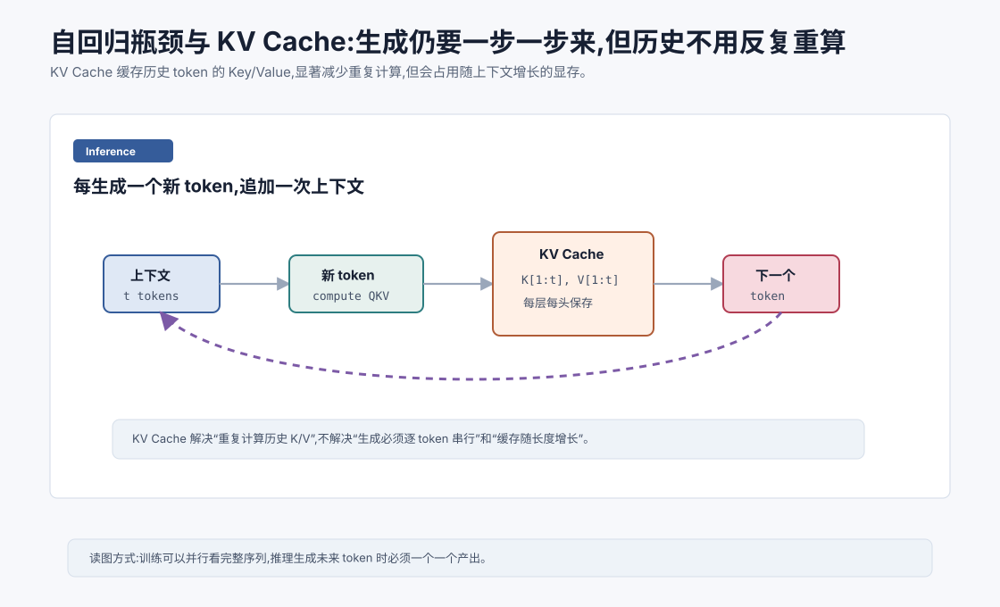
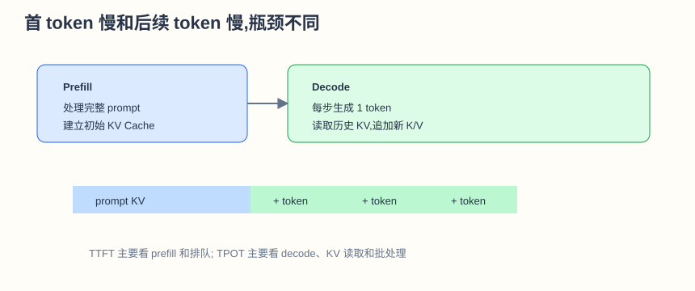
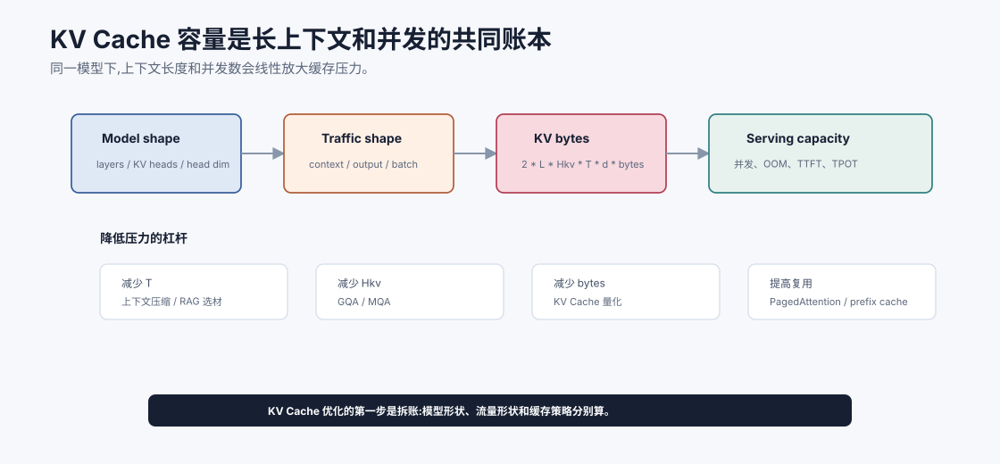
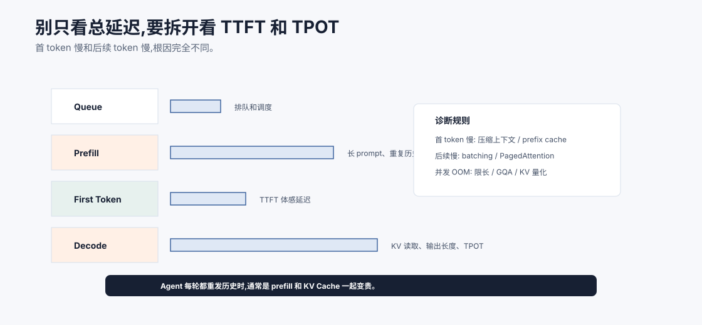

# 自回归瓶颈与 KV Cache `[主线]` ★

训练时,Transformer 可以并行处理一整段序列。

但推理生成时,情况不同。

Decoder-only LLM 通常必须一个 token 一个 token 地生成。

模型生成第 1 个 token 后,才能知道第 2 个 token 的上下文。生成第 2 个后,才能生成第 3 个。

这就是自回归瓶颈。

KV Cache 是自回归推理中最重要的优化之一。它不能改变“一步一步生成”的事实,但能避免反复计算历史 token 的 Key 和 Value。





本章会讲:

- 为什么推理不能像训练那样完全并行。
- 自回归生成的瓶颈在哪里。
- KV Cache 缓存了什么。
- KV Cache 如何减少重复计算。
- KV Cache 的显存成本。
- 它对 Agent 长任务有什么影响。

## 训练可以并行,推理必须等待未来

训练时,我们有完整文本:

```text
我 喜欢 喝 咖啡
```

模型可以一次输入整段,用 causal mask 并行计算每个位置的预测。

但推理时,未来 token 还不存在。

如果当前上下文是:

```text
我 喜欢 喝
```

模型必须先生成下一个 token,比如“咖啡”。

然后上下文变成:

```text
我 喜欢 喝 咖啡
```

才能继续生成。

所以输出长度越长,推理步骤越多。

## 自回归瓶颈是什么

自回归瓶颈有两层含义。

第一,生成步骤串行。

第 $t+1$ 个 token 依赖第 $t$ 个 token,无法完全并行。

第二,每一步都要基于整个历史上下文计算注意力。

如果没有缓存,每生成一个新 token,都要重新计算所有历史 token 在所有层的 K/V。

这会非常浪费。

KV Cache 解决的是第二个问题。

## Attention 推理时需要什么

在一层 Attention 中,新 token 会生成 Query、Key、Value。

它的 Query 需要和所有历史 token 的 Key 做匹配,再读取所有历史 token 的 Value。

对于历史 token,它们的 Key 和 Value 在之前步骤已经算过。

所以可以缓存起来。

下一步只需要为新 token 算新的 K/V,并把它们追加到缓存。

## KV Cache 缓存什么

KV Cache 缓存的是每一层、每个注意力头、每个历史 token 的 Key 和 Value。

注意,不是缓存 Query。

因为 Query 只用于当前新 token 去查询历史。

历史 token 的 Query 不再需要。

但历史 Key/Value 会被后续每个新 token 读取,所以值得缓存。

## 没有 KV Cache 会怎样

假设已经有 1000 个 token,现在要生成第 1001 个。

没有 KV Cache 时,模型可能需要重新处理前 1000 个 token,算出它们在每层的 K/V,再处理新 token。

生成第 1002 个时,又重新处理 1001 个历史 token。

这样大量重复计算。

KV Cache 让历史 token 的 K/V 只算一次。

## 有 KV Cache 的推理步骤

有缓存时,每生成一个新 token:

1. 输入最新 token。
2. 计算它在每层的 Q/K/V。
3. 用 Q 和缓存中的历史 K 计算注意力。
4. 用注意力权重读取缓存中的历史 V。
5. 得到输出 logits,采样下一个 token。
6. 把新 token 的 K/V 追加到缓存。

这样每一步只新增一个 token 的 K/V 计算。

## KV Cache 解决了什么

KV Cache 显著减少重复计算。

它让自回归推理从“每步重算整个前缀”变成“每步只算新 token,读取历史缓存”。

这对长输出非常关键。

没有 KV Cache,现代 LLM 服务会慢得多。

## KV Cache 没解决什么

KV Cache 不是万能。

它没有解决生成步骤串行的问题。

模型仍然一次只能确定一个下一个 token。

它也没有消除注意力读取历史的成本。

新 token 的 Query 仍要和历史所有 Key 做匹配。

历史越长,每步读取的 K/V 越多。

它还带来显存成本。

缓存越长,占用越大。

## KV Cache 显存成本

KV Cache 大小大致与以下因素成正比:

$$
\text{batch} \times \text{layers} \times \text{heads} \times \text{sequence length} \times \text{head dim}
$$

还要乘以 K 和 V 两份。

如果 batch 大、层数多、head 多、上下文长,KV Cache 会非常占显存。

这就是长上下文推理昂贵的重要原因之一。

可以再把它写成一个更工程化的估算:

$$
\text{KV bytes} \approx 2 \times L \times H_{kv} \times T \times d_{head} \times \text{bytes per element}
$$

这里:

- 前面的 $2$ 表示 Key 和 Value 两份缓存。
- $L$ 是层数。
- $H_{kv}$ 是 K/V head 数量。
- $T$ 是上下文长度。
- $d_{head}$ 是每个 head 的维度。

这个公式能解释一个常见现象:同样的模型,上下文从 8K 提到 32K,不是“只是多放一点文本”,而是 KV Cache 也按长度线性增长。并发请求越多,这部分显存越快成为瓶颈。



上图把 KV Cache 看成容量账本。模型形状决定每个 token 要缓存多少 K/V,流量形状决定同时缓存多少 token,服务策略决定这些缓存是否能被复用和回收。上下文长度、输出长度、并发数和精度一起决定显存压力,所以线上 OOM 不能只怪“模型太大”。

容量规划时,可以分别看四个杠杆:减少 $T$,也就是压缩上下文、用 RAG 选材、限制最大输出;减少 $H_{kv}$,也就是采用 GQA/MQA;减少每个元素字节数,也就是 KV Cache 量化;提高复用和回收效率,也就是 PagedAttention、prefix cache 和连续批处理。不同杠杆影响的质量风险不同,必须配合真实 trace 评估。

## KV Cache 容量预算怎么做

一个简单做法是先按请求类型估算缓存压力,而不是只看平均上下文长度。比如普通聊天可能输入短、输出短;RAG 问答可能输入长、输出中等;代码 Agent 可能输入长、轮次多、工具等待长。它们对 KV Cache 的压力完全不同。

可以用下面的容量表做第一轮估算:

| 请求类型 | 上下文长度 | 输出长度 | 并发形态 | 主要风险 |
| --- | --- | --- | --- | --- |
| 短聊天 | 短 | 短 | 高并发 | 排队和首 token 延迟 |
| 长 RAG | 长 | 中 | 中并发 | prefill 慢、KV Cache 大 |
| 长报告 | 中 | 长 | 低到中并发 | decode 时间和缓存增长 |
| 多轮 Agent | 波动大 | 多次短输出 | 生命周期长 | 重复 prefill 和缓存占用 |

容量预算的目标不是算一个完美数字,而是找出哪个变量最值得控制。如果 OOM 主要来自长上下文并发,优先限制证据包和启用分页缓存;如果来自长输出,优先限制输出预算或做流式中断;如果来自多轮 Agent 重复 prefill,优先做状态压缩和稳定前缀缓存。

## MQA 和 GQA 为什么有用

传统多头注意力中,每个 Query head 都有自己的 K/V head。

KV Cache 随 head 数增长。

Multi-Query Attention, MQA,让多个 Query head 共享同一组 K/V。

Grouped-Query Attention, GQA,让一组 Query head 共享一组 K/V。

这样可以减少 KV Cache 大小。

许多现代 LLM 使用 GQA,在质量和推理成本之间折中。

## Prefill 和 Decode

LLM 推理常分两个阶段。

### Prefill

把用户输入的整个 prompt 一次送入模型,计算初始 KV Cache。

这个阶段可以并行处理 prompt 中的所有 token。

### Decode

逐 token 生成输出。

每一步使用缓存,追加新 K/V。

用户感觉到的延迟包括首 token 延迟和后续生成速度。

长 prompt 会让 prefill 变慢,长输出会让 decode 变慢。

工程上常用几个指标区分它们:

| 指标 | 含义 | 主要受什么影响 |
| --- | --- | --- |
| TTFT | Time To First Token,首 token 延迟 | prompt 长度、prefill 吞吐、排队 |
| TPOT | Time Per Output Token,每个输出 token 时间 | decode 批处理、KV Cache 读取、模型大小 |
| Throughput | 单位时间生成 token 数 | batch、调度、硬件利用率 |
| Latency | 单请求总耗时 | 输入长度 + 输出长度 + 工具/网络 |

优化 LLM 服务时,不要只看一个“响应时间”。首 token 慢和输出速度慢,对应的瓶颈可能完全不同。

可以用一个简单诊断表:

| 现象 | 更可能瓶颈 | 优化方向 |
| --- | --- | --- |
| 首 token 很慢 | prefill、排队、长 prompt | 上下文压缩、prompt caching、prefill 调度 |
| 后续 token 慢 | decode、KV 读取、batch 调度 | 连续批处理、PagedAttention、KV 量化 |
| 并发一高就 OOM | KV Cache 显存 | 限制上下文、GQA/MQA、分页缓存 |
| Agent 每轮都慢 | 重复 prefill | 状态摘要、稳定前缀缓存、减少历史重发 |

这能帮助你判断是应用层上下文问题,还是推理服务调度问题。



推理优化首先要把延迟拆账。排队、prefill、首 token、decode、工具等待是不同瓶颈。长 prompt 和重复历史主要拖慢 prefill;长输出和 KV 读取主要拖慢 decode;并发 OOM 往往来自 KV Cache;工具慢则不该用模型解码优化来解决。

Agent 系统尤其容易把所有问题混在一起。一次任务可能每轮都重新发送系统提示、工具 schema、历史轨迹和检索证据,导致 prefill 反复变贵;后面又生成长报告,decode 也慢。只有拆开看 TTFT、TPOT、工具等待和总耗时,才能知道该压缩上下文、缓存前缀、优化批处理,还是减少循环轮次。

## Agent 中的影响

Agent 往往上下文长、轮次多、工具结果多。

这会带来几个成本:

- Prefill 变慢。
- KV Cache 变大。
- 长输出 decode 更慢。
- 并发能力下降。

所以 Agent 系统要管理 token。

不要把完整日志、完整网页、完整历史都塞进上下文。

工具结果应该摘要和结构化。

长文档应该检索相关片段。

状态应该压缩成当前任务摘要。

Agent 系统尤其容易重复 prefill:每一轮都把系统 prompt、工具说明、历史轨迹、检索材料重新发一遍。优化时可以把上下文分成三类:

| 上下文 | 策略 |
| --- | --- |
| 稳定前缀 | 系统规则、工具 schema,尽量缓存 |
| 任务状态 | 用结构化摘要替代完整历史 |
| 临时证据 | 只放本轮需要的 evidence pack |

这样既减少 token,也减少 KV Cache 压力。

## 常见优化方向

KV Cache 相关优化包括:

- GQA/MQA 减少 K/V 头。
- KV Cache 量化降低显存。
- PagedAttention 改善缓存管理。
- 连续批处理提高吞吐。
- Prompt caching 复用相同前缀。
- Speculative decoding 提高生成速度。

后面几章会继续讲 Flash Attention、PagedAttention 和投机解码。

## 常见误解

### 误解一:KV Cache 让生成完全并行

不会。生成仍然逐 token 串行。KV Cache 只是避免重复计算历史 K/V。

### 误解二:KV Cache 不占成本

占显存,而且上下文越长越大。

### 误解三:上下文越长只影响输入阶段

不只影响 prefill,也影响 decode 阶段每步读取历史 K/V 的成本和缓存大小。

### 误解四:训练也主要依赖 KV Cache

KV Cache 主要用于自回归推理。训练通常并行处理整段序列。

### 误解五:Agent 延迟主要是模型不够快

Agent 延迟还来自长上下文、工具调用、重复 prefill、长输出和缓存管理。

## 本章小结

自回归语言模型推理必须逐 token 生成,这是生成延迟的根本瓶颈。KV Cache 缓存历史 token 在每层 Attention 中的 Key 和 Value,避免每一步重复计算历史 K/V,显著提升推理效率。但它不能消除串行生成,也会带来随上下文增长的显存成本。对 Agent 来说,管理上下文长度和输出长度是控制延迟与成本的关键。

下一章会讲 Flash Attention。KV Cache 优化推理中的历史复用,Flash Attention 则优化 Attention 本身的显存访问和计算方式。
