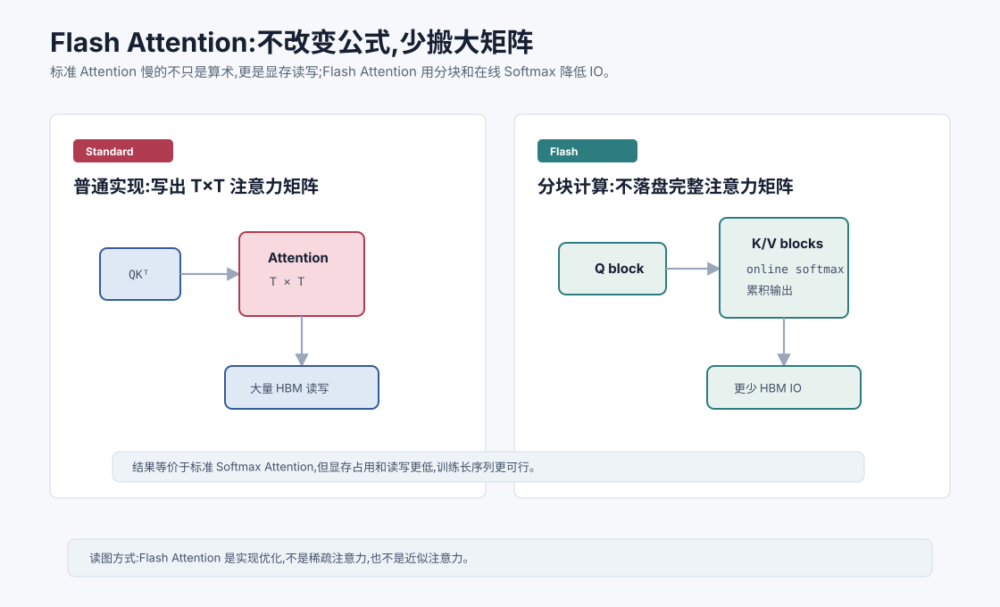
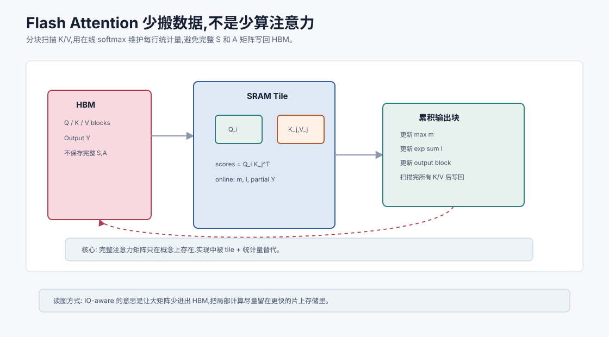
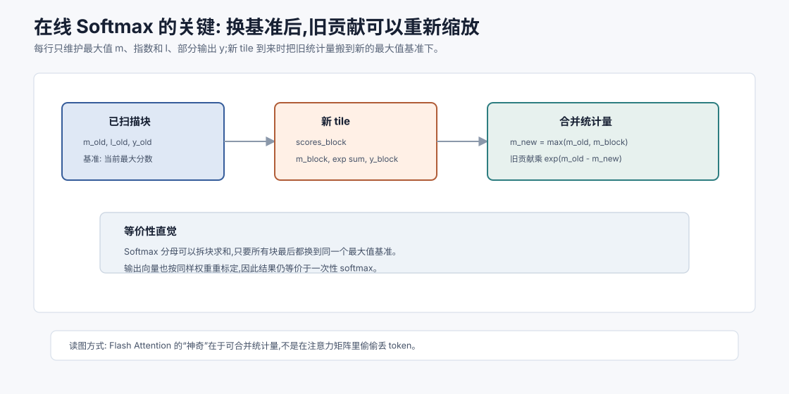

# Flash Attention `[进阶]` ★

标准 Self-Attention 的公式是:

$$
\text{Attention}(Q,K,V)=\text{softmax}\left(\frac{QK^T}{\sqrt{d_k}}\right)V
$$

很多人以为 Attention 慢,主要是因为乘法多。

乘法当然重要,但在 GPU 上,另一个瓶颈同样关键:显存读写。

Flash Attention 的核心贡献是:

**不改变 Attention 数学结果,通过分块计算和在线 Softmax,减少大矩阵在显存中的读写。**



本章会讲:

- 普通 Attention 为什么显存读写昂贵。
- Flash Attention 为什么不是近似方法。
- 分块计算和在线 Softmax 的直觉。
- Flash Attention 对训练和推理的影响。
- 它和稀疏注意力、KV Cache 的区别。

## 普通 Attention 的实现问题

普通实现可能会显式构造注意力分数矩阵:

$$
S = QK^T
$$

然后对 $S$ 做 Softmax,得到:

$$
A = \text{softmax}(S)
$$

最后计算:

$$
Y = AV
$$

问题是 $S$ 和 $A$ 都是 $T \times T$ 大矩阵。

序列越长,这些中间矩阵越大。

把它们写入高带宽显存 HBM,再读回来继续计算,会产生大量 IO。

在现代 GPU 上,很多操作不是纯算力瓶颈,而是内存带宽瓶颈。

更具体地说,标准实现常见的数据路径是:

| 阶段 | 产生什么 | 典型问题 |
| --- | --- | --- |
| $QK^T$ | $T \times T$ 分数矩阵 $S$ | 写入 HBM,占用随 $T^2$ 增长 |
| Softmax | $T \times T$ 概率矩阵 $A$ | 再读 $S$,再写 $A$ |
| $AV$ | 输出 $Y$ | 再读 $A$ 和 $V$ |

如果序列长度是 $T=8192$,单个 head 的注意力矩阵就有约 $6700$ 万个元素。多层、多头、训练反向传播再叠加上去,中间激活会迅速变成显存和带宽压力。

所以 Flash Attention 的问题意识不是“矩阵乘法不会算”,而是:

> 能不能不把完整的 $S$ 和 $A$ 写回 HBM,仍然得到一样的输出?

## Flash Attention 不改变公式

Flash Attention 仍然计算标准 Softmax Attention。

它不是稀疏注意力。

它不是线性注意力。

它不是近似 Attention。

它的输出在数学上等价于标准 Attention,只是计算顺序和内存访问方式更聪明。

这点很重要。

它的目标不是牺牲质量换速度,而是在保持结果的同时减少显存读写。

## SRAM 和 HBM

GPU 有不同层级的存储。

HBM 容量大,但访问相对慢。

片上 SRAM 容量小,但访问快。

普通 Attention 会把大中间矩阵写到 HBM。

Flash Attention 尽量把小块数据放在更快的 SRAM 中处理,避免完整 $T \times T$ 注意力矩阵反复落到 HBM。

这就是所谓 IO-aware。

## 分块计算

Flash Attention 把 Q、K、V 分成块。



它一次处理一块 Query 和一块 Key/Value。

对每个 Query block,逐块扫描 K/V,计算局部注意力贡献,并在线更新输出。

这样不需要一次性保存完整注意力矩阵。

可以粗略理解为:

```text
for Q_block in Q:
    output_block = 0
    for K_block, V_block in K,V:
        scores = Q_block @ K_block.T
        更新 softmax 统计量
        更新 output_block
```

真正实现要处理数值稳定、mask、反向传播等细节。

这个图里最关键的是:完整的 $T \times T$ 注意力矩阵并没有作为中间结果落到 HBM。每个 tile 在片上存储里完成局部计算,只把必要统计量和输出块累积起来。也就是说,Flash Attention 优化的是“数据怎么在硬件里流动”,而不是“注意力公式换了一个近似版本”。

## 在线 Softmax

Softmax 通常需要看到一整行分数:

$$
\text{softmax}(s_i)=\frac{e^{s_i}}{\sum_j e^{s_j}}
$$

如果分块处理,一开始看不到整行所有 $s_j$。

Flash Attention 使用在线 Softmax 技巧,在扫描块时维护每行的最大值和归一化因子。

这样可以逐块更新,最终得到和完整 Softmax 等价的结果。

这个技巧既保证数值稳定,又避免保存完整分数矩阵。

直觉上,每一行 Softmax 需要两个统计量:

- 当前见过的最大分数 $m$。
- 以这个最大值为基准的指数和 $l$。

当新块分数到来时,如果新最大值变了,旧的指数和要按比例缩放到新的基准下。这个过程类似“边读边重新标尺”。



设旧统计量为 $m_{old}, l_{old}$,新块最大值为 $m_{block}$,新全局最大值为:

$$
m_{new}=\max(m_{old},m_{block})
$$

则归一化因子可以更新为:

$$
l_{new}=e^{m_{old}-m_{new}}l_{old}+\sum_{j \in block}e^{s_j-m_{new}}
$$

输出向量也用同样的缩放方式累积。这样最终好像真的看过整行,但过程中只需要保留小块和少量统计量。

如果 $O_{old}$ 表示已经归一化过的旧输出,新块贡献为 $P_{block}V_{block}$,则可以把输出更新理解成:

$$
O_{new}=\frac{e^{m_{old}-m_{new}}l_{old}O_{old}+P_{block}V_{block}}{l_{new}}
$$

这里 $P_{block}=e^{S_{block}-m_{new}}$。这条式子说明了在线 Softmax 为什么能等价:旧输出不是简单相加,而是先按新最大值基准重新缩放,再和新块贡献合并。

这就是 Flash Attention 最容易让人“恍然大悟”的地方:它不是少算了注意力,而是把 Softmax 的全局归一化拆成可合并的局部统计。

## 反向传播也要优化

训练时不仅要前向计算,还要反向传播。

普通实现可能需要保存中间注意力矩阵供反向使用。

Flash Attention 在反向传播中会重新计算部分中间量,用额外计算换显存节省。

这是一种常见取舍:

> 少存中间结果,需要时再算一遍。

在显存紧张、IO 昂贵的场景中,这个取舍很划算。

## Flash Attention 的收益

Flash Attention 带来的收益包括:

- 降低显存占用。
- 提高 Attention 计算速度。
- 支持更长序列训练。
- 减少中间矩阵读写。
- 与标准 Attention 结果等价。

它已经成为很多训练和推理框架中的核心优化。

但收益大小取决于瓶颈在哪里:

| 场景 | 通常收益 | 原因 |
| --- | --- | --- |
| 长序列训练 | 很明显 | 中间注意力矩阵和反向激活巨大 |
| 长 prompt prefill | 很明显 | 一次处理大量 Query,注意力计算密集 |
| 单 token decode | 可能有限 | Query 很少,瓶颈常在读取 KV Cache |
| 小序列、小 batch | 可能不明显 | kernel 启动、调度开销占比更高 |

工程上不要只问“开没开 Flash Attention”,还要看它是否真的命中高效 kernel。head dimension、mask 类型、精度、GPU 架构都可能让框架回退到其他实现。

## Flash Attention 和长上下文

Flash Attention 不改变标准 Attention 的 $T^2$ 计算复杂度。

但它显著降低显存 IO 和中间激活占用,让较长序列训练更可行。

所以它不是从理论复杂度上把 $T^2$ 变成 $T$,而是让实际硬件上跑得更快、更省显存。

对长上下文模型来说,这非常重要。

## Flash Attention 和 KV Cache 的区别

KV Cache 优化自回归推理中的历史复用。

Flash Attention 优化 Attention 计算本身的内存访问。

二者解决不同问题。

在推理中,decode 阶段每次只有一个或少量 Query,主要瓶颈可能是 KV Cache 读取和显存带宽。

在 prefill 或训练中,序列较长,Flash Attention 的收益通常更明显。

两者可以同时存在。

## Flash Attention 和稀疏注意力的区别

稀疏注意力会改变哪些 token 对被计算。

Flash Attention 仍然计算所有应计算的 token 对。

稀疏注意力改变数学结构。

Flash Attention 优化实现。

所以不要把 Flash Attention 当成一种长上下文近似机制。

它是标准 Attention 的高效实现。

## 工程视角

使用 Flash Attention 通常需要硬件和框架支持。

你可能会在推理框架或训练框架中看到选项:

- flash attention。
- memory efficient attention。
- scaled dot-product attention backend。

不同 GPU、不同精度、不同 mask 类型、不同 head dimension 都会影响是否能使用高效 kernel。

实际部署时,要通过 benchmark 测量。

还要确认用到的是哪个 kernel。很多框架会根据 dtype、head dimension、mask、dropout、GPU 架构选择不同 backend。如果某个条件不满足,代码仍然能跑,但可能回退到普通或 memory efficient kernel。生产环境里最好记录 attention backend,把它纳入性能 trace,否则一次依赖升级可能悄悄改变延迟和显存曲线。

## 对 Agent 的意义

Agent 常有长 prompt 和多轮上下文。

Flash Attention 可以帮助降低 prefill 成本。

但它不解决所有 Agent 延迟问题。

如果 Agent 每轮都塞入巨大上下文,仍然会慢。

如果输出很长,decode 串行仍然慢。

如果工具调用耗时,模型优化也无能为力。

所以应用层仍要做上下文压缩、检索、缓存和工具并行。

## 常见误解

### 误解一:Flash Attention 是近似注意力

不是。它计算标准 Attention 的等价结果。

### 误解二:Flash Attention 把复杂度从 $T^2$ 变成 $T$

没有。它优化显存 IO 和实现效率,不改变全量 Attention 的理论 token 对数量。

### 误解三:有 Flash Attention 就不用管理上下文

不对。长上下文仍然有计算、KV Cache、噪声和评估问题。

### 误解四:Flash Attention 只对训练有用

训练和 prefill 阶段收益明显,推理中也可能有帮助,但具体取决于阶段和实现。

### 误解五:所有硬件都自动支持 Flash Attention

不一定。需要框架、GPU、精度和维度满足条件。

## 本章小结

Flash Attention 是标准 Attention 的 IO-aware 高效实现。它通过分块计算和在线 Softmax,避免显式保存完整注意力矩阵,减少 HBM 读写和显存占用。它不改变 Attention 数学结果,也不把复杂度从 $T^2$ 变成 $T$。对长序列训练和 prefill 阶段非常重要,但仍需与 KV Cache、上下文管理和系统优化配合。

下一章会讲 PagedAttention 与连续批处理。Flash Attention 优化单次 Attention 计算,而 PagedAttention 更关注服务端如何高效管理大量请求的 KV Cache。
