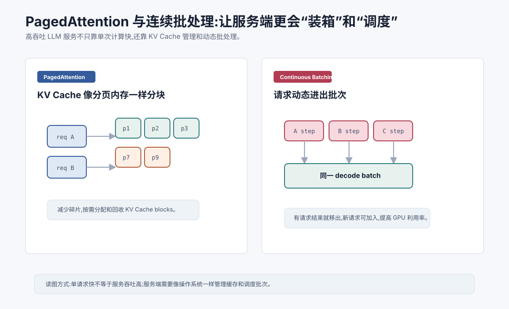
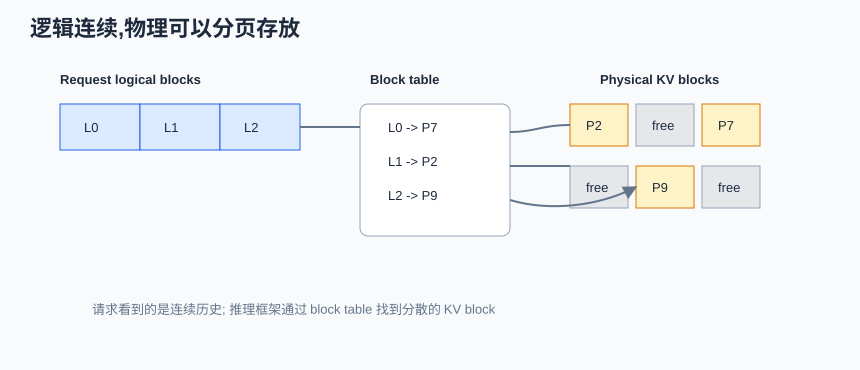
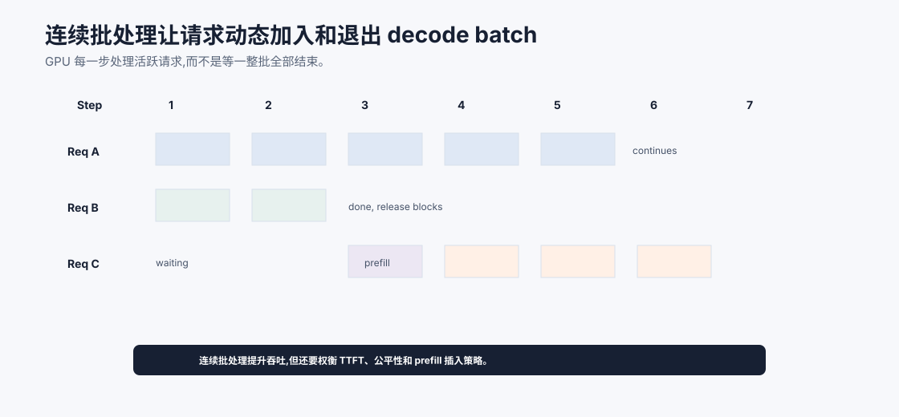
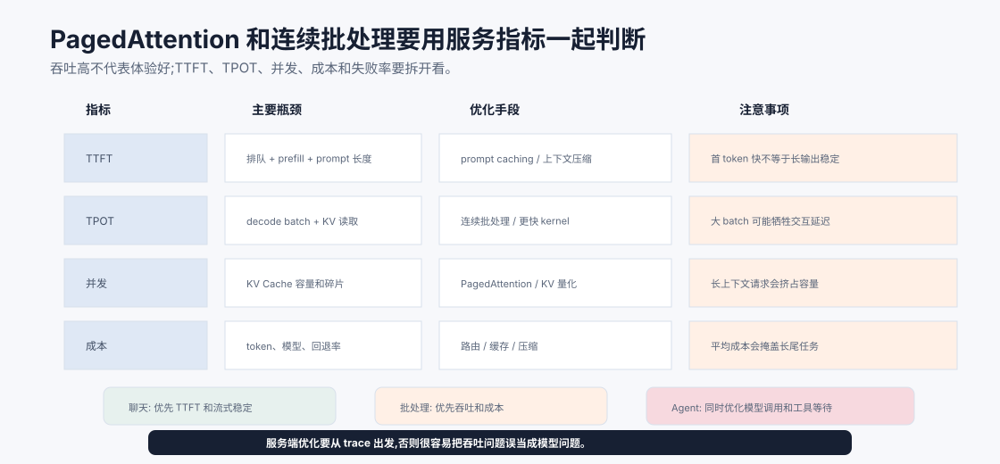

# PagedAttention 与连续批处理 `[进阶]` ★

LLM 服务端的难点不只是“单个请求算得快”。

真实系统要同时处理很多请求。每个请求 prompt 长度不同,输出长度不同,开始和结束时间也不同。

如果调度不好,GPU 会空转,KV Cache 会碎片化,吞吐会很差。

PagedAttention 和连续批处理就是为了解决这些服务端效率问题。





本章会讲:

- 为什么 KV Cache 管理是服务端瓶颈。
- PagedAttention 如何像操作系统分页一样管理缓存。
- 连续批处理为什么比静态批处理更适合生成。
- 这些技术如何提高吞吐和并发。
- 对 Agent 服务有什么影响。

## 服务端推理的真实问题

一个 LLM 服务可能同时处理很多用户请求。

请求 A 输入 500 token,输出 50 token。

请求 B 输入 8000 token,输出 300 token。

请求 C 输入 1200 token,输出 10 token。

这些请求长度不同,生成速度不同,结束时间不同。

如果简单把它们组成固定 batch,短请求会等待长请求,新请求也不能及时加入。

GPU 利用率会下降。

## KV Cache 碎片问题

每个请求都需要 KV Cache。

随着请求生成 token,缓存不断增长。

请求结束后,缓存释放。

如果直接为每个请求分配连续大块显存,会出现碎片问题。

有些显存空着,但不连续,无法满足新请求。

这类似操作系统内存管理中的外部碎片。

PagedAttention 的思想就是把 KV Cache 分成固定大小的 block,像分页内存一样管理。

一个常见误区是只看“总剩余显存”。实际调度中还要看显存是否能被当前请求使用。

假设每个请求都预留一段连续 KV Cache:

```text
[请求 A 的大块][请求 B 的大块][请求 C 的大块][空闲][请求 D 的大块]
```

当 B 和 C 结束后,中间会出现空洞。总空闲显存也许够,但如果新请求需要一段更长的连续空间,仍然可能分配失败。更糟的是,很多请求并不会用完预留空间,因为输出长度事先并不知道。

这就是 PagedAttention 要解决的两个浪费:

- **内部浪费**:为请求预留了最大长度,但实际没生成那么多。
- **外部碎片**:释放后的空闲空间不连续,难以复用。

## PagedAttention 的核心思想

PagedAttention 把每个请求的 KV Cache 拆成多个块。

逻辑上,请求的 token 是连续的。

物理显存中,这些块可以不连续。

系统维护一张映射表,记录某个请求的第几个 block 对应显存中的哪个物理 block。

这样可以:

- 按需分配缓存。
- 请求结束后回收 block。
- 减少显存碎片。
- 支持更多并发请求。

这和操作系统虚拟内存分页很像。

可以把它理解成三层视图:

| 层次 | 看见什么 | 作用 |
| --- | --- | --- |
| 模型逻辑视图 | 第 1 到第 $T$ 个历史 token | Attention 仍然按连续序列计算 |
| Block 映射表 | 逻辑 block 到物理 block 的映射 | 让逻辑连续和物理连续解耦 |
| GPU 显存视图 | 一堆可复用固定大小 block | 便于分配、回收和复用 |

因此 PagedAttention 的“Paged”不是把 Attention 变成只看某几页,而是把 KV Cache 的存储管理做成分页。

注意力在逻辑上仍能访问完整历史,只是 kernel 需要通过 block table 找到对应的 K/V 数据。

这带来一个重要工程结果:调度器可以按需给请求追加 block,而不是一开始猜一个最大输出长度并预留整段显存。对于输出长度不可预知的聊天和 Agent 请求,这能显著减少浪费。

## PagedAttention 为什么重要

长上下文请求会占用大量 KV Cache。

如果缓存管理低效,显存会浪费很多。

PagedAttention 提高了显存利用率,让同一块 GPU 可以服务更多请求。

它对高吞吐推理框架非常关键。

尤其在多用户、多轮 Agent、长上下文 RAG 场景中,KV Cache 管理会直接影响成本。

## 静态批处理的问题

静态批处理是把一批请求放在一起处理,直到它们都完成。

这适合长度差不多的任务。

但自回归生成中,不同请求输出长度差异很大。

如果 batch 里有一个请求要生成 500 token,另一个只生成 10 token,短请求很快结束,但 batch 资源仍被长请求拖住。

新来的请求也不能灵活加入。

这会降低吞吐。

## 连续批处理

Continuous Batching,连续批处理,允许请求动态加入和退出 batch。

每个 decode step,服务端把当前活跃请求的下一步生成合并成一个 batch。

如果某个请求结束,下一步就移出。

如果新请求完成 prefill,可以加入后续 decode batch。

这样 GPU 始终尽量处理一批活跃请求,减少空闲。

对比一下会更清楚:

| 调度方式 | 请求能否中途加入 | 请求能否中途退出 | 主要问题 |
| --- | --- | --- | --- |
| 静态批处理 | 通常不能 | 逻辑上结束但资源可能等待整批 | 被最长输出拖住 |
| 连续批处理 | 可以 | 可以 | 调度更复杂,要平衡 prefill 和 decode |

举个小例子。A 要输出 100 token,B 要输出 5 token,C 在 B 结束后才到达。

静态批处理中,B 很快结束,但这一批仍被 A 拖着走,C 可能要等下一批。连续批处理中,B 结束后可以释放它的 KV block 和 batch 槽位,C 的 prefill 完成后就能加入后续 decode step。这样 GPU 上每一步处理的活跃请求更饱满。



连续批处理的直觉是“每个 decode step 重新组织活跃请求”。短请求结束后释放 batch 槽位和 KV block,新请求 prefill 完成后插入后续 decode step。这样系统不用等最长请求结束才开始下一批,吞吐和显存复用都会更好。

但连续批处理不是只把 batch size 调大。调度器必须决定什么时候插入 prefill、如何避免长请求饿死短请求、如何控制 TTFT、如何分配 KV block。聊天、批量评估、代码 Agent 的最优策略不同,所以服务端指标要同时看吞吐、TTFT、TPOT、并发和失败率。

## Prefill 和 Decode 的调度

Prefill 和 decode 的计算形态不同。

Prefill 处理长 prompt,计算密集,适合并行。

Decode 每次处理一个新 token,更受内存带宽和 KV Cache 读取影响。

服务端调度需要平衡:

- 新请求 prefill。
- 旧请求 decode。
- 首 token 延迟。
- 总吞吐。
- 公平性。

如果一直处理 decode,新请求首 token 可能很慢。

如果频繁插入大 prefill,已有请求生成速度可能受影响。

成熟推理框架会做复杂调度。

这也是为什么线上指标经常要拆开看:

| 指标 | 主要受什么影响 | 优化方向 |
| --- | --- | --- |
| TTFT | 排队、prefill、prompt 长度 | prompt caching、prefill 调度、上下文压缩 |
| TPOT | decode batch、KV 读取、采样 | 连续批处理、PagedAttention、更快 kernel |
| 并发数 | KV Cache 容量和碎片 | 分页管理、量化 KV Cache、限制上下文 |
| 吞吐 | GPU 利用率和 batch 饱和度 | 动态调度、请求合批、离线批处理 |

如果只看平均延迟,很容易误判。一个系统可能吞吐很高,但首 token 很慢;也可能首 token 很快,但长输出阶段速度不稳定。

调度策略通常要在两类目标之间取舍:

| 目标 | 偏向策略 | 代价 |
| --- | --- | --- |
| 低 TTFT | 更快插入 prefill、限制队列等待 | 可能打断 decode 吞吐 |
| 高吞吐 | 让 decode batch 更饱满 | 新请求首 token 可能变慢 |
| 高并发 | 更激进的 KV block 复用和限制上下文 | 单请求可用上下文可能受限 |
| 稳定延迟 | 控制最大输出、超时和优先级 | 可能降低极长任务能力 |

所以服务端优化要结合产品形态。聊天产品、批量评估平台、代码 Agent 的最优调度并不一样。



上图把服务端优化拆成四个必须同时观察的指标。TTFT 主要受排队、prefill 和 prompt 长度影响,适合用 prompt caching、prefill 调度和上下文压缩优化;TPOT 主要受 decode batch、KV 读取和采样影响,更依赖连续批处理、PagedAttention 和 kernel;并发主要受 KV Cache 容量和碎片影响;成本则取决于 token、模型、回退率和缓存命中。

这张图也解释了为什么“吞吐提高”不等于“用户体验提高”。聊天产品可能优先首 token 和流式稳定,离线批评估更关心总吞吐,代码 Agent 还要把模型等待和工具等待一起看。PagedAttention、连续批处理和 prompt caching 都是服务端能力,但是否能改善产品体验,必须回到 trace 中的瓶颈分布。

## 服务容量规划的直觉

容量规划不能只问“一张 GPU 每秒生成多少 token”。对在线 Agent 服务来说,更关键的是同时估计 prompt 长度、输出长度、并发数、KV Cache 占用和工具等待造成的请求生命周期。

可以把请求粗略拆成三类:

| 请求类型 | 主要压力 | 优先优化 |
| --- | --- | --- |
| 短问答 | 排队和 TTFT | 小模型路由、prompt caching |
| 长 RAG | prefill 和 KV Cache | 上下文压缩、证据包、PagedAttention |
| 长输出 | decode 和 TPOT | 连续批处理、投机解码、更快 kernel |
| 多轮 Agent | 多次 prefill + 工具等待 | 状态压缩、工具并行、减少轮次 |

如果一个 Agent 每轮都把完整历史重新发给模型,服务端会反复付 prefill 成本;如果工具等待很长,模型服务吞吐提高也未必改善端到端体验;如果长上下文请求过多,KV Cache 会压低并发。容量规划要把模型服务、上下文策略和 Loop 设计放在一起看。

## Throughput 和 latency

服务端优化经常要权衡吞吐和延迟。

吞吐关注单位时间生成多少 token。

延迟关注单个用户等多久。

大 batch 通常提高吞吐,但可能增加单请求等待。

连续批处理试图在动态请求下提高 GPU 利用率,但仍需要调度策略控制延迟。

不同产品的优化目标不同。

聊天产品更看重首 token 和流式体验。

离线批量处理更看重总吞吐。

## 对 Agent 的影响

Agent 请求比普通聊天更复杂。

它可能包含:

- 长 prompt。
- 多轮工具调用。
- 多次模型调用。
- 长输出。
- 不同请求持续时间差异大。

这让连续批处理和 KV Cache 管理更重要。

如果 Agent 每一步都重新发送全部历史,会反复产生大 prefill。

如果能复用前缀、压缩上下文、减少无关 token,服务成本会显著下降。

Agent 的请求生命周期也更不均匀。一次用户任务可能产生多个短模型调用、几个长工具等待、一次长报告生成。连续批处理能提升模型服务吞吐,但端到端 Agent 延迟还要和工具并行、Loop 设计、上下文压缩一起优化。

## Prompt caching

一些服务支持 prompt caching。

如果多个请求共享相同前缀,比如系统指令或工具说明,可以复用部分计算或缓存。

这对 Agent 很有用。

系统提示、工具列表、固定业务规则常常在请求之间重复。

合理设计稳定前缀,可能降低成本和延迟。

## 常见误解

### 误解一:PagedAttention 改变了模型输出

通常不改变。它是 KV Cache 管理和注意力访问的系统优化。

### 误解二:连续批处理只是在 batch size 上调大

不是。它允许请求动态进入和离开 batch,适应不同输出长度。

### 误解三:吞吐高就一定体验好

不一定。用户体验还取决于首 token 延迟、流式速度和排队时间。

### 误解四:Agent 延迟只能靠换更快模型

还可以通过上下文压缩、prompt caching、批处理、工具并行和减少调用轮次优化。

### 误解五:KV Cache 管理只是推理框架内部细节

它直接影响成本、并发和长上下文能力,产品架构也要考虑。

## 本章小结

PagedAttention 把 KV Cache 分块分页管理,减少显存碎片并提高并发能力。连续批处理让不同长度、不同生命周期的请求动态加入和退出 batch,提高 GPU 利用率。它们解决的是 LLM 服务端吞吐和缓存管理问题,与模型架构本身不同。对 Agent 系统来说,长上下文、多轮调用和工具轨迹会放大这些系统瓶颈,因此上下文管理和推理调度同样重要。

下一章会讲投机解码。它尝试用小模型先猜多个 token,再由大模型验证,以减少自回归生成的等待时间。
