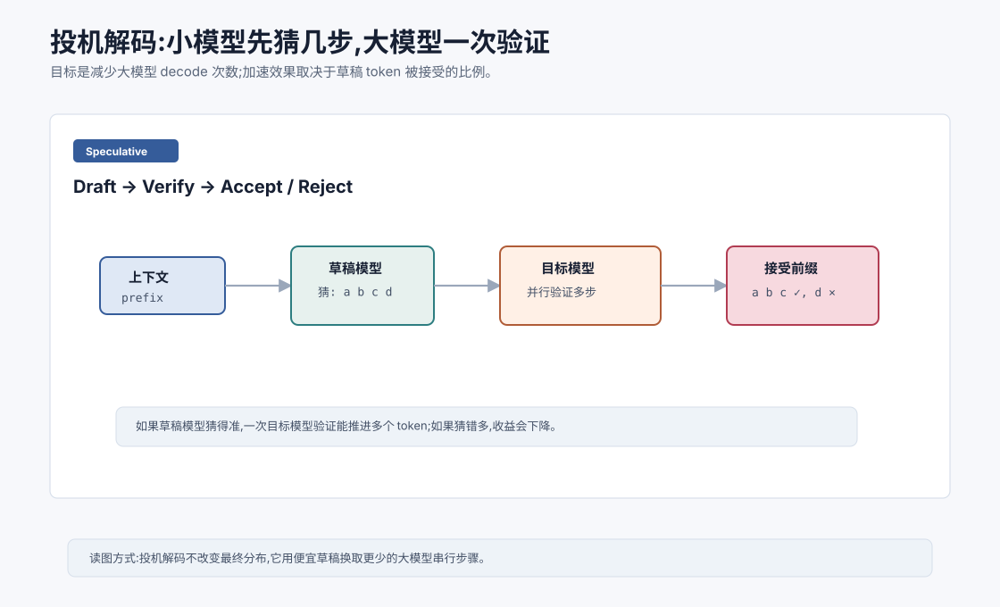
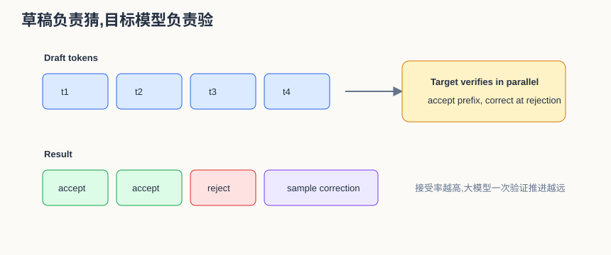
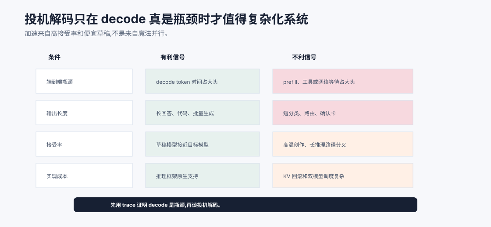

# 投机解码 `[进阶]` ★

自回归生成慢,因为大模型必须一个 token 一个 token 地生成。

KV Cache 减少了重复计算历史,Flash Attention 优化了 Attention 实现,PagedAttention 改善了服务端缓存管理。

但 decode 阶段仍然有一个根本问题:

**每生成一个 token,都要让大模型跑一轮。**

投机解码,Speculative Decoding,尝试减少大模型的串行调用次数。

它的核心想法是:

**用一个便宜的小模型先猜多个 token,再让大模型一次性验证这些猜测。**





本章会讲:

- 投机解码为什么能加速。
- 草稿模型和目标模型分别做什么。
- 接受率为什么关键。
- 投机解码如何保持输出分布正确。
- 它适合哪些场景,不适合哪些场景。
- 对 Agent 延迟有什么意义。

## 从直觉开始

假设大模型生成很慢,小模型生成很快。

很多时候,下一个 token 并不难猜。

比如上下文是:

```text
法国的首都是
```

小模型也很可能猜“巴黎”。

如果小模型能连续猜对几个 token,大模型就不必一步一步生成,而可以一次验证这些候选。

投机解码就是利用这个机会。

## 两个模型

投机解码通常有两个模型。

### 草稿模型

Draft model。

它更小、更快,负责快速生成一段候选 token。

### 目标模型

Target model。

它是原本要使用的大模型,负责验证草稿 token,保证最终输出符合目标模型分布。

目标是让最终结果尽量等价于直接从目标模型采样,但减少目标模型 decode 次数。

## 基本流程

投机解码的一轮大致是:

1. 给定当前上下文。
2. 草稿模型连续生成 $k$ 个候选 token。
3. 目标模型一次性评估这些 token。
4. 按规则接受一段前缀。
5. 如果某个 token 不被接受,从目标模型分布采样替代 token。
6. 把接受的 token 追加到上下文,进入下一轮。

如果草稿模型猜得准,一轮目标模型计算可以推进多个 token。

可以把它想成“把大模型的检查频率降低”。普通 decode 是:

```text
大模型 -> 1 个 token
大模型 -> 1 个 token
大模型 -> 1 个 token
```

投机解码希望变成:

```text
小模型快速猜 4 个 token
大模型一次验证这 4 个 token
如果接受 3 个,本轮就前进 3 个或更多位置
```

注意,大模型仍然参与最终决策。加速来自“大模型一次前向能并行检查多个草稿位置”,不是来自跳过质量控制。

## 为什么目标模型能一次验证多个 token

训练时,Transformer 可以并行计算序列中多个位置的 logits。

投机解码利用类似能力。

把上下文加上草稿 token 一起送入目标模型,目标模型可以并行给出这些位置的概率。

这样它能判断草稿 token 是否符合自己的分布。

如果接受多个 token,就等于减少了多次目标模型串行 decode。

## 接受率是关键

投机解码是否加速,取决于草稿 token 被接受的比例。

如果草稿模型和目标模型很接近,接受率高,加速明显。

如果草稿模型太弱,经常猜错,目标模型只能接受很少 token,收益下降。

所以草稿模型要足够快,也要足够像目标模型。

这是一种平衡。

草稿模型太大,自己就慢。

草稿模型太小,接受率低。

粗略说,一轮草稿长度为 $k$,平均接受 token 数越接近 $k$,目标模型每次调用推进的距离越长。若平均只接受 $1$ 个 token,就接近普通 decode,还额外多跑了草稿模型。

可以用一个非常简化的判断式理解收益:

$$
\text{有效推进} \approx 1 + \text{平均接受草稿数}
$$

这里的 $1$ 来自拒绝时目标模型仍能给出一个校正 token。实际速度还要扣除草稿模型成本、验证成本、batch 形状、KV Cache 管理和通信开销。

所以投机解码最适合“草稿模型明显便宜,又经常猜得像目标模型”的区域。

接受率可以按任务分布看,不能只在少量样例上估计。

| 任务 | 接受率倾向 | 原因 |
| --- | --- | --- |
| 固定格式、常见短语 | 较高 | 草稿模型容易预测 |
| 代码补全 | 可能较高 | 局部模式强,但长依赖会降低 |
| 高温创意写作 | 较低 | 分布发散,草稿难猜 |
| 工具调用 JSON | 取决于 schema | 格式固定但参数可能难猜 |
| 长推理解释 | 不稳定 | 语义路径差异会放大 |

因此上线前要按真实流量分类测 acceptance rate,不要只报告一个平均值。

## 保持分布正确

好的投机解码算法不是简单“草稿对了就用”。

它需要保证最终采样分布和目标模型一致或非常接近。

经典投机采样会比较草稿模型和目标模型对候选 token 的概率,用接受-拒绝规则决定是否接受。

如果拒绝,会从校正后的目标分布采样。

这样可以在理论上保持目标模型分布。

这点很重要。否则投机解码可能只是让小模型偷偷改变大模型输出质量。

更直白地说,如果目标模型认为某个 token 概率是 $p(x)$,草稿模型认为它的概率是 $q(x)$,接受规则不能只看“是不是 top-1 一样”。经典做法会用类似 $\min(1, p(x)/q(x))$ 的概率接受草稿 token。

如果草稿模型过度高估了某个 token,它会被更严格地拒绝;如果被拒绝,算法从校正后的剩余分布中采样。这个接受-拒绝结构保证最终不会把草稿模型的偏好硬塞进目标模型。

工程框架中也存在更近似的变体,例如 n-gram 草稿、Medusa/多头预测、EAGLE 一类方法。它们共同目标都是“提前提出多个候选,再用目标模型或目标模型相关机制验证”,但严格分布等价性和适用条件会不同。

## 投机解码适合什么

投机解码适合:

- 大模型 decode 慢。
- 草稿模型便宜且接受率高。
- 输出较长。
- 服务端能并行运行草稿和目标验证。
- 对最终质量要求高,不能直接换小模型。

比如长文本生成、代码生成、批量响应等场景可能受益。

## 投机解码不适合什么

如果输出很短,加速收益有限。

如果草稿模型接受率低,收益有限。

如果系统瓶颈在工具调用、网络延迟或 prefill,投机解码对整体延迟帮助有限。

如果任务采样温度很高、输出分布很发散,草稿模型更难猜中。

所以投机解码需要实际 benchmark。

还有一个容易忽略的限制:投机解码通常更偏向优化 decode 阶段的 token 生成速度。如果请求的主要时间花在超长 prompt 的 prefill,或者 Agent 正在等待浏览器、数据库、代码执行、搜索 API,投机解码即使让模型输出快了,端到端体验也未必明显改善。

因此判断是否值得引入它,可以先问三件事:

- 输出 token 是否足够多?
- decode 是否真是端到端瓶颈?
- 草稿机制是否能在当前任务分布上保持高接受率?

如果答案不是,优先考虑上下文压缩、prompt caching、工具并行、模型路由或减少循环轮次。投机解码是 decode 优化,不是 Agent 总体架构优化。



投机解码值得引入的前提很明确:decode token 时间确实占端到端大头,输出足够长,草稿模型又便宜且接受率高。如果主要耗时在 prefill、工具调用、网络等待或短输出上,投机解码会增加系统复杂度,但用户体感可能变化不大。

上线前应该按任务类型统计 acceptance rate,而不是只报告平均值。固定格式、常见短语、局部代码补全可能接受率高;高温创作、长推理解释、参数依赖强的工具 JSON 可能不稳定。投机解码是模型服务优化,要用 trace 证明它解决的是当前真实瓶颈。

## 草稿模型从哪里来

草稿模型可以是:

- 同系列小模型。
- 蒸馏模型。
- 目标模型的浅层早退版本。
- 专门训练的 draft model。

理想草稿模型要和目标模型分布接近。

这也是蒸馏可以和投机解码结合的原因。

## 与 KV Cache 的关系

投机解码仍然需要 KV Cache。

草稿模型和目标模型各自可能维护缓存。

接受 token 后,目标模型的 KV Cache 需要保持一致。

实现上要小心处理接受、拒绝和回退。

这比普通 decode 更复杂。

## 与 Agent 的关系

Agent 延迟来自多方面:

- 模型生成。
- 工具调用。
- 网络请求。
- 长上下文 prefill。
- 多轮循环。

投机解码主要优化模型 decode。

如果 Agent 的瓶颈是长输出,它有帮助。

如果瓶颈是工具运行或长 prompt prefill,帮助有限。

所以 Agent 优化要先测量瓶颈。

不要看到投机解码就以为所有延迟都会下降。

一个 Agent 是否值得引入投机解码,可以看 trace:

| Trace 现象 | 判断 |
| --- | --- |
| decode token 时间占端到端大头 | 值得评估 |
| prefill 占大头 | 先压缩上下文或缓存前缀 |
| 工具等待占大头 | 先做工具并行和超时策略 |
| 输出很短 | 收益通常有限 |
| 强模型成本高但小模型可预测 | 可能适合 |

这能避免把一个模型服务优化误当成系统优化。

## 常见误解

### 误解一:投机解码就是用小模型替代大模型

不是。小模型只生成草稿,大模型负责验证,目标是保持大模型输出分布。

### 误解二:投机解码一定加速

不一定。加速取决于接受率、草稿模型速度、输出长度和系统实现。

### 误解三:投机解码会降低质量

正确实现可以保持目标模型分布。工程实现不当或近似策略可能影响质量。

### 误解四:它解决了所有自回归问题

没有。它减少目标模型串行步数,但仍依赖草稿和验证,也不能解决工具或 prefill 瓶颈。

### 误解五:只要找个很小模型当草稿就好

太小会接受率低。草稿模型要足够快,也要足够接近目标模型。

## 本章小结

投机解码用小草稿模型先生成多个候选 token,再由大目标模型一次性验证,从而减少大模型逐 token decode 的串行次数。它的加速效果取决于草稿模型速度、接受率、输出长度和系统实现。正确的投机采样可以保持目标模型分布,但实现复杂,也不能解决所有延迟瓶颈。对 Agent 来说,它是模型 decode 优化的一部分,需要和上下文管理、工具并行、缓存和调度一起考虑。

到这里,Part 1 已经完整覆盖了从数学直觉、神经网络、Transformer、架构演进、模型生态、训练流程到推理优化的主线。接下来进入 Agent 核心原理篇,把模型能力放进目标、状态、工具和反馈组成的任务循环中。
