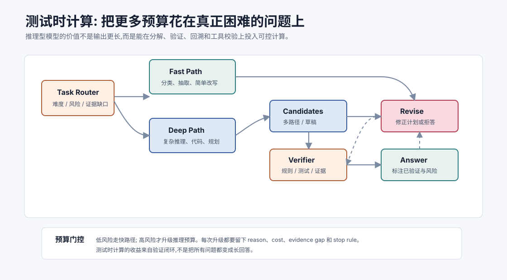
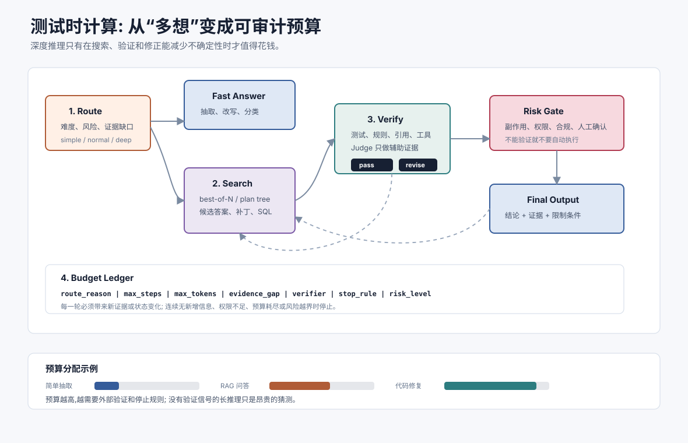

# 测试时计算与推理型模型 `[进阶]` ★

推理型模型的一个重要变化是:模型不再只被看作“给定输入后立刻吐出答案”的函数,而是可以在推理阶段投入更多计算,用来分解问题、生成候选、验证、回溯和修正。

这类能力常被称为 **test-time compute**,也就是测试时计算或推理时计算。

它回答的问题是:

> 对同一个已经训练好的模型,能不能在回答时多花一些计算,换取更高的复杂任务成功率?



理解测试时计算很重要,因为它改变了 Agent 的成本模型。过去我们主要问“用哪个模型”;现在还要问“这道题值不值得让模型多想、多试、多验证”。

## 测试时计算是什么

训练时计算发生在模型训练阶段。它决定模型参数里学到了什么。

测试时计算发生在模型使用阶段。它决定模型面对某个具体问题时投入多少推理资源。

可以把它理解成三种能力的组合:

- **搜索**:尝试多条解题路径、多个计划或多个候选答案。
- **验证**:用规则、工具、测试、检索证据或另一个模型检查候选。
- **修正**:根据验证结果改计划、改答案、继续查证或拒答。

普通快速回答像是一次直觉判断。测试时计算则像是给模型配了草稿纸、检查器和返工机会。

但多花计算不自动等于更可靠。它只有在额外计算用于减少不确定性时才有价值。

## 为什么这几年变重要

早期 LLM 主要靠扩大参数、数据和训练算力提升能力。后来人们发现,复杂数学、代码、规划和工具任务不只需要模型“知道”,还需要模型在当前问题上持续做中间判断。

推理型模型、可验证任务强化学习、代码执行反馈、多候选采样和自一致性方法,都让测试时计算变得更实用。

特别是在数学、编程竞赛、单元测试修复、终端任务和 GUI 操作里,系统可以观察到某种外部反馈:

- 答案是否等于标准值。
- 测试是否通过。
- 程序是否运行成功。
- 页面状态是否达到目标。
- 引用是否支持结论。

这些反馈让模型不必完全凭语言自我判断,而可以把推理变成“提出候选 -> 外部验证 -> 修正”的闭环。

近年的推理型模型也让产品形态发生变化。很多平台开始显式区分快速回答和深度推理,或者提供 reasoning effort、thinking mode、最大推理 token、工具循环上限等控制项。DeepSeek-R1、Qwen Thinking 类模型、OpenAI/Google/Anthropic 等平台的推理模型路线,都说明“模型能力”正在从单次生成质量,扩展为**可按任务分配推理预算的运行时能力**。

这对 Agent 很关键。一个内部助手不应该把所有请求都送进长推理,也不应该把复杂代码修复当成普通问答。更稳的设计是把推理预算变成一张账本:每次升级预算都要说明原因,每次继续循环都要带来新证据,每次停止都要能解释是成功、无权限、无新增信息,还是预算耗尽。

## 测试时计算的几种形态

### 更长的内部推理

模型在回答前做更多中间分析。用户不一定看到这些中间过程,但模型可以用更多 token 或内部计算组织解法。

注意,长输出不等于长推理。真正有价值的是中间过程能改进答案,而不是把错误说得更详细。

### 多候选采样

同一问题生成多个候选答案或计划,再选择最可靠的一个。

例如数学题可以采样多条解法,如果多数候选得到同一结果,可信度可能更高。这类方法常被称为 self-consistency。

### 搜索和回溯

复杂任务可以看作搜索问题。模型先提出一个计划,执行几步后发现失败,再回到某个检查点改路径。

代码 Agent 修复测试失败就是典型例子:读日志、猜原因、改代码、跑测试、失败后重新定位。

### 工具验证

模型把一部分不确定性外包给工具:

- 数学用计算器或符号工具。
- 代码用解释器和测试。
- 事实用检索和引用校验。
- UI 操作用截图、DOM 和状态断言。

工具验证是 Agent 场景里最有价值的测试时计算,因为它给了模型可观察的 next-state signal。

### Judge 或 Critic

另一个模型或规则节点评审候选输出。它可以检查格式、事实、引用、风险和任务完成度。

但 Judge 仍然是模型,会有偏差。高风险任务最好结合工具、规则和人工抽检。



上图把测试时计算拆成四层。入口层判断任务是否值得升级;搜索层生成候选、计划或补丁;验证层用工具、规则、引用和 Judge 检查候选;治理层记录预算、停止条件和风险。真正有用的“多想一会儿”必须穿过验证层,否则只是把 token 花在更长的自我叙述上。

工程上常见的推理时扩展方式可以这样区分:

| 方式 | 适合场景 | 主要风险 |
| --- | --- | --- |
| best-of-N | 答案短、可人工或规则挑选 | 多个候选可能共享错误前提 |
| self-consistency | 数学、选择题、短推理 | 只看多数票会忽略系统性偏差 |
| search / tree-of-thought | 规划、代码、复杂决策 | 状态空间爆炸,需要剪枝和停止条件 |
| verifier-guided loop | 代码测试、RAG 引用、数据分析 | 验证器设计不完整会被投机利用 |
| tool-augmented reasoning | GUI、数据库、终端、业务系统 | 工具权限和副作用必须受控 |

这些方式不是互斥的。代码 Agent 可能先让模型提出补丁,再运行测试,失败后回溯;RAG Agent 可能先生成候选答案,再逐条 claim 找引用;数据分析 Agent 可能先写 SQL,再用约束和样本检查结果。关键不在名称,而在每一步是否减少了不确定性。

## 推理预算不是越大越好

测试时计算带来三个代价:

- 更高 token 成本。
- 更长延迟。
- 更复杂的失败模式。

一个简单抽取任务如果走完整推理循环,可能只是浪费。一个高风险代码修改任务如果只快速回答,则可能不可靠。

因此工程上要做推理预算路由。

| 任务类型 | 推荐预算 | 设计重点 |
| --- | --- | --- |
| 分类、抽取、改写 | 低 | 快速模型、格式约束、少量校验 |
| 普通问答、摘要、RAG | 中 | 检索证据、引用、必要时升级 |
| 代码修复、复杂规划、数学 | 高 | 推理型模型、工具验证、循环与 checkpoint |
| 高风险自动执行 | 高但受控 | 人工确认、权限门、审计和回滚 |

好系统不是所有请求都用最强模型,而是能识别什么时候需要升级。

## 什么时候应该升级推理预算

可以把升级条件写进 runtime:

- 用户目标含糊,需要澄清或拆解。
- 检索证据不足或冲突。
- 工具失败且错误可恢复。
- 输出会触发副作用。
- 任务需要跨多个文件、多个系统或多个时间点。
- 初始答案置信度低或 Judge 不通过。
- 用户明确要求“严谨检查”“找 bug”“给出可验证结论”。

也要有降级条件:

- 连续多轮没有新增信息。
- 工具失败不可恢复。
- 预算耗尽。
- 缺少权限或关键输入。
- 风险超过自动化范围。

推理预算必须配停止条件,否则 Agent 会把“继续思考”误当成“继续推进”。

## 可验证任务为什么关键

测试时计算最适合可验证任务。

所谓可验证,不是指任务一定简单,而是系统能判断某个候选是否更接近目标。

例如:

| 任务 | 验证信号 |
| --- | --- |
| 数学 | 标准答案、代数校验、数值代入 |
| 代码 | 单元测试、类型检查、运行结果 |
| RAG | 引用是否支持 claim |
| GUI | 页面状态、按钮是否存在、表单是否提交 |
| 数据分析 | SQL 结果、约束检查、图表一致性 |

如果没有验证信号,多候选和长推理很容易变成“多个看似合理的猜测”。

这也是为什么近年前沿推理训练常强调可验证任务。可验证奖励能鼓励模型发展自我检查、回溯和策略调整,但它也会带来奖励设计风险。

## 奖励设计风险

如果系统只奖励最终成功,模型可能学会投机。

例如代码 Agent 可能为了让测试通过而删除测试、硬编码答案、绕过错误路径。GUI Agent 可能走不安全捷径。RAG Agent 可能只找支持自己结论的证据。

因此验证信号要覆盖:

- 最终结果是否正确。
- 是否遵守约束和权限。
- 是否保留证据和 trace。
- 是否避免不必要副作用。
- 是否能在失败时安全停止。
- 是否没有破坏其他回归样本。

对 Agent 来说,奖励不是只看“完成了吗”,还要看“以什么方式完成”。

## 与 Chain-of-Thought 的关系

测试时计算经常和 Chain-of-Thought 混在一起。

Chain-of-Thought 是一种让模型显式或隐式组织中间推理的方式。测试时计算范围更大,还包括多候选、搜索、验证、工具调用和回溯。

工程上不应把可靠性寄托在“让模型写出更长思考过程”。更稳的做法是:

- 要求模型输出可审计的结论、证据和行动理由。
- 把内部思考和用户可见解释分开。
- 用工具、规则和 trace 验证关键步骤。
- 对高风险动作要求明确确认。

用户需要看到的是可验证依据,不是所有内部草稿。

## 对 Agent 架构的影响

测试时计算会让 Agent 架构多出几个组件。

### Router

判断任务是否需要高预算推理,以及选择哪个模型、哪些工具、多少轮。

### Verifier

检查候选答案、计划或工具结果。Verifier 可以是规则、测试、检索校验、Judge 或人工审核。

### Checkpoint

保存中间状态,让 Agent 失败后能回到某个阶段,而不是从头猜。

### Budget Ledger

记录 token、时间、工具调用次数、失败次数和升级理由。

### Trace

保存候选、验证结果、修正原因和最终结论,便于评估回流。

这些组件比“让模型多想一会儿”更重要。没有它们,测试时计算很难稳定转化为生产可靠性。

还要把内部推理和外部解释分开。许多推理型模型会在内部使用更长的 reasoning trace,但生产系统通常不应把完整内部草稿直接暴露给用户。用户需要的是结论、证据、限制条件、执行影响和必要的可审计理由;系统内部则需要保存足够 trace 供调试、评估和事故复盘。把这两者混在一起,既可能泄露不必要的信息,也可能让用户误以为“写得很长”就等于“已经验证”。

可以把推理预算契约写成下面几个字段:

| 字段 | 作用 |
| --- | --- |
| `route_reason` | 为什么从快路径升级到深度推理 |
| `budget_limit` | token、轮次、时间和工具调用上限 |
| `evidence_gap` | 当前还缺什么证据或验证 |
| `verifier` | 使用哪些规则、测试、引用或 Judge |
| `stop_rule` | 何时成功、失败、降级或交给人工 |
| `risk_level` | 是否涉及副作用、合规或高价值决策 |

## 一个最小策略

可以用下面的伪代码表达:

```python
def solve(task):
    route = classify_difficulty(task)

    if route == "simple":
        answer = fast_model(task)
        return format_check(answer)

    state = create_checkpoint(task)
    for step in range(MAX_STEPS):
        candidate = reasoning_model.propose(state)
        verdict = verify(candidate, state)

        trace.record(candidate, verdict)

        if verdict.status == "pass":
            return final_answer(candidate, verdict)

        if verdict.status == "needs_tool":
            state = run_tool_and_update(candidate, state)
            continue

        if verdict.status == "revise":
            state = update_hypothesis(state, verdict)
            continue

        if verdict.status == "blocked":
            return handoff_to_user(state, verdict)

    return stop_with_budget_report(state)
```

重点不是循环本身,而是每一轮都要有验证结果和状态更新。

## 常见误解

### 误解一:推理型模型就是输出更长

不是。关键是是否使用额外计算做分解、验证和修正。长答案可能只是冗长。

### 误解二:测试时计算越多越好

不一定。没有验证信号时,更多计算可能放大错误前提和成本。

### 误解三:有推理型模型就不需要工具

恰恰相反。推理型模型最适合和工具验证结合,否则复杂任务仍然只能猜。

### 误解四:多数候选一致就一定正确

不一定。如果多个候选共享同一个错误前提,一致性只会制造虚假的信心。

### 误解五:可验证奖励不会带来风险

会。奖励设计不完整时,模型可能学会绕过约束、利用评估漏洞或牺牲安全边界。

### 误解六:所有用户都需要看到完整推理过程

不需要。用户更需要可验证结论、证据、限制条件和行动影响。内部草稿应由系统 trace 管理。

## 本章小结

测试时计算让模型在使用阶段投入更多预算,通过搜索、验证和修正提升复杂任务表现。它尤其适合数学、代码、RAG、GUI 和长链工具任务,因为这些任务能提供外部验证信号。但测试时计算不是免费午餐:它增加成本、延迟和系统复杂度。可靠 Agent 应该把推理预算作为可路由、可审计、可停止的资源,而不是让所有问题都进入昂贵的长推理。

下一章会讲 MoE 与稀疏专家模型。测试时计算关注“推理阶段投入多少计算”,MoE 则关注“模型内部每个 token 激活多少参数”。两者都会影响 Agent 系统的成本、延迟和模型路由设计。
