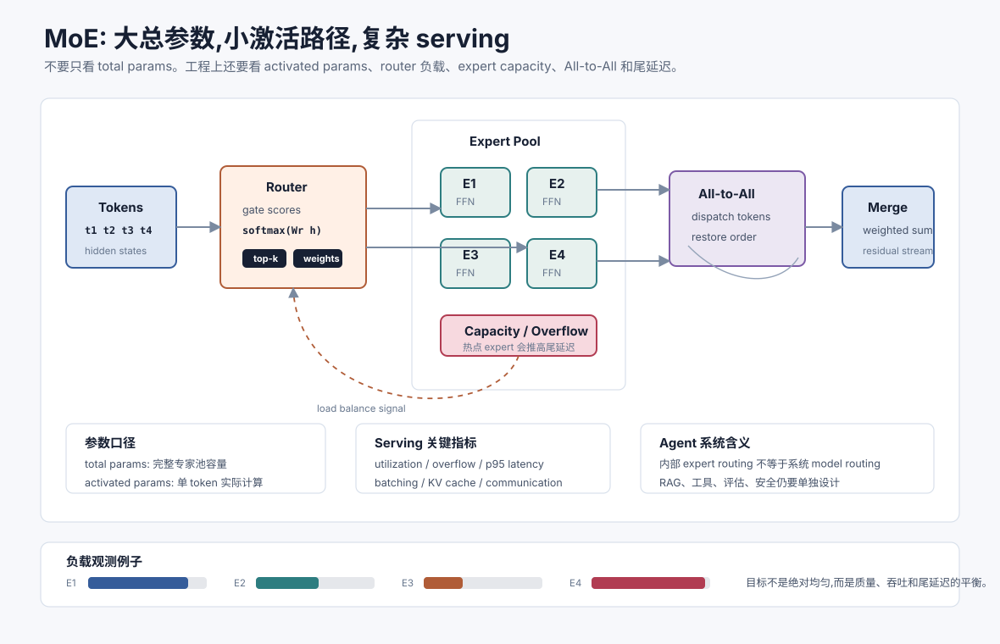

# MoE 与稀疏专家模型 `[进阶]` ★

MoE,Mixture of Experts,混合专家模型,是近几年大模型扩展中非常重要的一条路线。

它解决的问题可以用一句话概括:

> 能不能让模型拥有更大的总参数容量,但每个 token 只激活其中一小部分参数,从而在能力、成本和吞吐之间取得更好的平衡?

传统 Dense 模型每一层的参数基本都会参与每个 token 的计算。MoE 模型则在某些层中放入多个 expert,再用 router 为每个 token 选择少数几个 expert。这样模型的**总参数量**可以很大,但**每 token 激活参数量**相对较小。



理解 MoE 很重要,因为很多主流开源权重和前沿模型都开始采用稀疏专家结构。工程选型时,如果只看“总参数量”,很容易误判推理成本、显存需求、通信瓶颈和部署复杂度。

## Dense 模型和 MoE 模型的区别

Dense 模型像一个完整团队。每个 token 进来,所有层都按固定路径处理。

MoE 模型像一个专家池。每个 token 先被 router 判断,再送到少数几个最相关的 expert。

| 对比维度 | Dense 模型 | MoE 模型 |
| --- | --- | --- |
| 参数使用 | 每个 token 基本使用同一套参数 | 每个 token 只激活部分专家 |
| 总参数量 | 通常等于主要计算规模 | 可能远大于激活参数量 |
| 训练/推理路径 | 相对规则 | token 会被动态路由 |
| 服务复杂度 | 较低 | 更依赖并行、通信和负载均衡 |
| 常见收益 | 稳定、易部署 | 更大容量、更高参数效率 |
| 常见风险 | 扩大模型时成本线性上升 | 路由偏斜、专家闲置、通信开销 |

MoE 不是“免费把模型变大”。它把一部分计算压力转化成了路由、容量和分布式通信问题。

## MoE 层长什么样

一个典型 Transformer block 里通常包含 Attention 和 FFN 两个主要子层。

许多 MoE 模型会把 FFN 替换成 MoE FFN:

```text
token hidden state
    -> router / gate
    -> 选择 top-k experts
    -> experts 并行处理
    -> 按 router 权重合并输出
```

其中 expert 通常是一个前馈网络,例如原来 Dense Transformer 里的 FFN。MoE 的关键不是每个 expert 多神秘,而是 token 如何被分配到不同 expert,以及系统如何避免某些 expert 过载、某些 expert 闲置。

## Router 做什么

Router 也叫 gate。它为每个 token 计算一个分配分数。

如果有 $E$ 个 expert,router 会输出一个长度为 $E$ 的分数向量:

$$
p = \operatorname{softmax}(W_r h)
$$

其中 $h$ 是当前 token 的隐藏状态,$W_r$ 是 router 参数,$p_i$ 表示这个 token 选择第 $i$ 个 expert 的倾向。

工程上常见的是 top-1 或 top-2 routing:

- top-1:每个 token 只进一个 expert,计算更省,但表达能力和稳定性可能受限。
- top-2:每个 token 进两个 expert,结果加权合并,通常更稳,但计算和通信更高。

一个简化公式可以写成:

$$
y = \sum_{i \in \operatorname{TopK}(p)} p_i \cdot E_i(h)
$$

这里 $E_i$ 是第 $i$ 个 expert。注意,没有被选中的 expert 不参与这个 token 的前向计算。

## 总参数量和激活参数量

理解 MoE 时最容易混淆两个数字。

**总参数量**表示模型完整权重有多大。它影响模型文件大小、权重加载、集群部署和潜在容量。

**激活参数量**表示每个 token 实际参与计算的参数规模。它更接近单 token 的计算成本,但不是完整服务成本。

例如一个模型可能有数百 B 总参数,但每个 token 只激活几十 B 参数。对用户来说,这意味着它可能具备很大的知识和能力容量;对部署者来说,这意味着不能只按激活参数估算显存,因为完整 expert 权重仍要被放在某些设备上。

因此比较模型时要同时问:

- 总参数量是多少?
- 每 token 激活参数量是多少?
- 每层有多少 expert?
- top-k routing 是多少?
- 是否有共享 expert?
- KV Cache 和 Attention 部分是否仍是 dense 计算?
- 服务时 expert 如何切分到多张卡或多台机器?

## 负载均衡为什么难

如果 router 总把 token 发给少数几个 expert,系统会出现两个问题。

第一,热门 expert 过载,导致排队、延迟上升或 token 被丢弃。

第二,冷门 expert 训练不足,容量浪费,甚至学不到有用能力。

所以 MoE 训练通常需要负载均衡机制。常见思路包括:

- 辅助负载均衡损失:鼓励 token 分布更均匀。
- expert capacity:限制每个 expert 每批最多接收多少 token。
- token dropping 或 overflow routing:超出容量时丢弃或转发到备选 expert。
- router 正则化:避免路由过早塌缩。
- auxiliary-loss-free balancing:减少负载均衡目标对主任务性能的副作用。

这里的取舍很微妙。路由太自由,会过载和塌缩;路由太均匀,又可能把 token 分给不合适的 expert,损害模型质量。

## Expert capacity 和 token dropping

MoE 系统常会给每个 expert 设置容量上限。

如果一个 batch 里太多 token 选择同一个 expert,超过容量的 token 可能被丢弃、跳过、走残差路径,或被送到后备 expert。

这会带来两个工程后果。

第一,训练时 batch 组成会影响路由负载。某些数据分布可能让专家负载长期不均。

第二,推理时线上请求分布也会影响延迟。即使平均吞吐很好,某些输入也可能触发热点 expert,造成尾延迟上升。

所以 MoE 的 serving 评估不能只看平均 tokens/s,还要看 p95/p99 延迟、expert utilization、overflow rate 和跨节点通信时间。

## All-to-All 通信瓶颈

Dense 模型的张量并行已经需要通信,但 MoE 会额外引入 token dispatch:

```text
本卡 token -> router -> 发给对应 expert 所在设备 -> expert 计算 -> 结果发回 -> 合并
```

如果 expert 分布在不同 GPU 或不同节点,就会出现 All-to-All 通信。训练和推理系统必须把 token 按 expert 分组、跨设备发送、计算后再还原顺序。

这就是为什么 MoE 不只是模型结构创新,也是系统工程问题。网络带宽、拓扑、并行策略、batching、kernel 优化、FP8/INT8 精度和调度器都会影响最终成本。

一个 MoE 模型在论文里“每 token 激活参数少”,不代表你能在普通单卡上轻松跑起来。完整权重、expert 切分和通信路径同样重要。

## 为什么 MoE 对 Agent 有意义

Agent 系统通常有多种任务:

- 简单分类和路由。
- 长文档理解。
- 代码修改。
- 数学和逻辑推理。
- 工具调用。
- 多语言对话。
- 企业知识问答。

MoE 的直觉很适合这种多样性:不同 token、不同任务可能激活不同专家,模型容量更容易覆盖多种能力。

但在 Agent 工程里,MoE 不是替代系统路由。即使底层模型是 MoE,上层仍然需要判断:

- 哪些请求走强模型,哪些走小模型。
- 哪些任务需要 RAG 或工具验证。
- 哪些输出需要引用校验和安全门控。
- 哪些复杂任务值得启用更多测试时计算。

模型内部的 expert routing 解决的是参数激活问题;系统外部的 model routing 解决的是任务、成本、风险和合规问题。两者不是一回事。

## DeepSeek、Qwen、Llama 中的 MoE 线索

主流模型家族已经让 MoE 进入工程视野。

- DeepSeek-V3 / R1 使用 MoE 架构,公开资料中常见数字是总参数 671B、每 token 激活 37B,并结合 MLA、FP8、负载均衡和 multi-token prediction 等系统设计。
- Qwen3 同时提供 dense 和 MoE 权重,例如 A3B/A22B 这类命名通常表示激活参数规模,适合读者区分总容量和激活成本。
- Llama 4 系列也引入 Scout、Maverick 等 MoE 形态,并把长上下文、开放生态和部署工具链一起推向开发者。

这些例子说明 MoE 已经不是孤立论文概念,而是影响模型选型、部署预算和内部 AI 平台设计的基础技术。

## 企业内部部署时看什么

如果企业要部署或选用 MoE 模型,建议至少评估这些指标。

| 维度 | 关键问题 |
| --- | --- |
| 权重规模 | 完整权重能否放入现有 GPU/节点? |
| 激活规模 | 单 token 计算成本和吞吐是否达标? |
| 并行策略 | tensor parallel、expert parallel、pipeline parallel 如何组合? |
| 通信 | All-to-All 是否成为瓶颈?跨节点带宽是否足够? |
| 精度 | FP8、BF16、INT8/INT4 对质量和吞吐影响如何? |
| KV Cache | 长上下文下 KV Cache 显存是否成为主瓶颈? |
| 批处理 | continuous batching 能否处理动态路由带来的不均衡? |
| 观测 | 是否能看到 expert utilization、overflow、尾延迟和错误率? |
| 评估 | 目标任务是否真的比 dense 模型更好? |

对很多内部应用来说,最现实的路线不是一开始自训 MoE,而是:

1. 先用 API 或成熟开源权重验证任务收益。
2. 用 RAG、工具和评估集解决业务正确性。
3. 再根据调用量、隐私和成本决定是否私有化部署。
4. 私有化时优先选择推理框架已经支持良好的模型。

## 常见误解

### 误解一:MoE 总参数越大,推理一定越贵

不一定。推理计算更接近激活参数量,但完整部署仍受总权重和通信影响。

### 误解二:MoE 每个 expert 都学成了清晰领域专家

不一定。Expert 可能形成某些统计分工,但不等于人类可解释的“法律专家”“代码专家”。不要把 router 当作可审计的业务路由器。

### 误解三:MoE 可以替代模型路由

不能。MoE 是模型内部稀疏激活;模型路由是系统层根据任务、成本、合规和风险选择模型或链路。

### 误解四:激活参数小就容易本地部署

不一定。完整 expert 权重仍要存放,跨设备通信也可能很重。部署难度不能只看激活参数。

### 误解五:负载均衡只是训练细节

不是。负载不均会影响训练稳定性、推理尾延迟、吞吐和服务成本。

### 误解六:MoE 一定比 dense 模型适合所有任务

不一定。小规模、低延迟、边缘部署或格式稳定任务,高质量 dense 小模型可能更简单、更可控。

## 本章小结

MoE 通过 router 为每个 token 选择少数 expert,让模型拥有更大的总参数容量,同时控制每 token 激活计算。它的核心收益是参数效率和容量扩展,核心代价是路由、负载均衡、expert capacity、token dispatch、All-to-All 通信和 serving 复杂度。对 Agent 工程来说,MoE 是理解主流模型家族和部署成本的重要概念,但它不能替代 RAG、工具、评估、安全和系统级模型路由。
