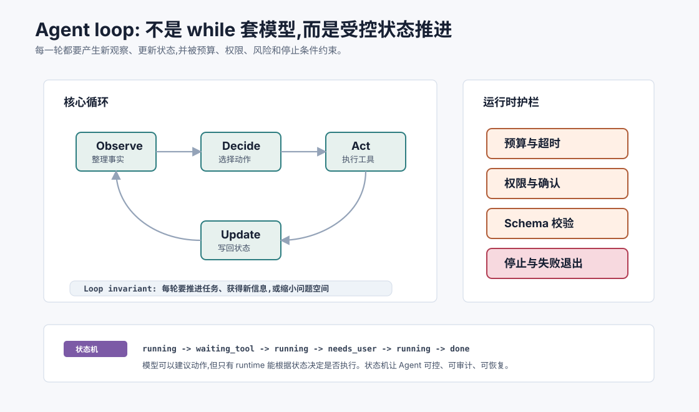
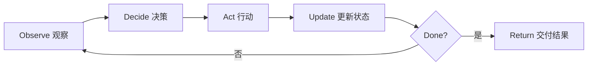
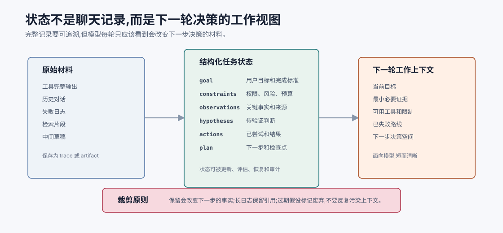
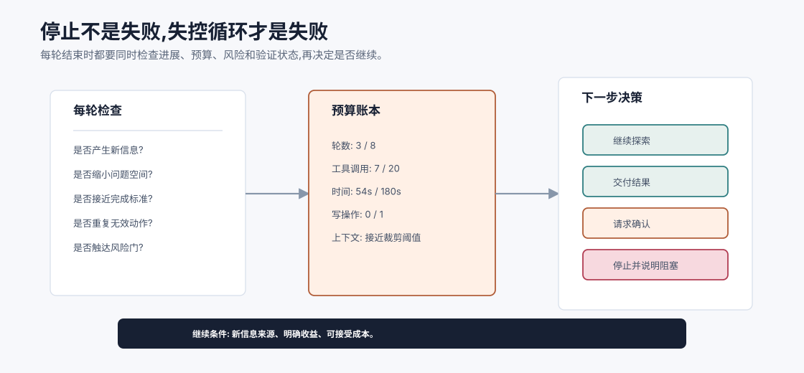
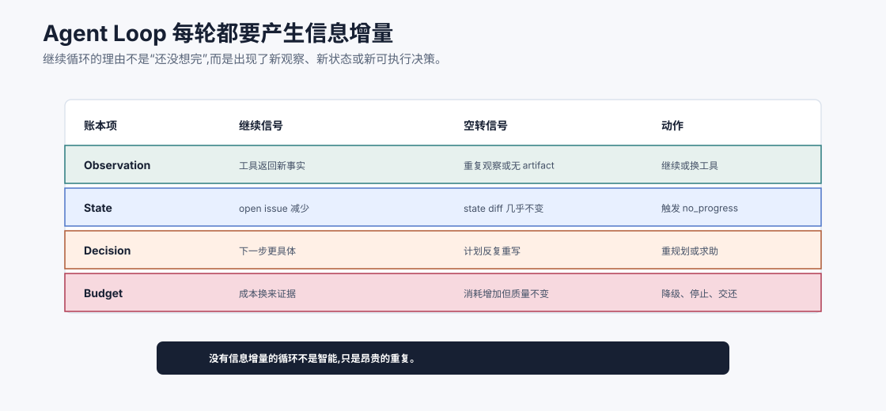
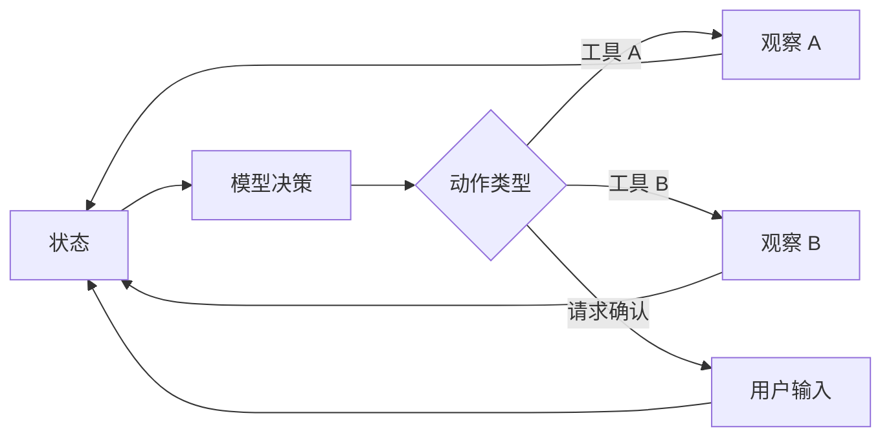

# Agent 循环 `[主线]`

Part 0 已经给过一个定义:

**Agent = 模型 + 工具 + 状态 + 反馈循环。**

现在我们进入 Agent 核心原理篇,第一件事就是把这个“循环”拆开。

很多 Agent 失败,不是因为模型不会回答,而是因为循环设计得不好:目标不清、状态混乱、工具结果没被正确吸收、没有停止条件、错误后只会重复尝试。Agent 工程的第一原则是:不要把模型调用误认为 Agent。真正的 Agent 是一个会在每轮观察后更新状态,再决定下一步的系统。



本章会讲:

- Agent 循环由哪些阶段组成。
- 状态为什么是 Agent 的核心资产。
- 观察、决策、行动和反馈如何闭环。
- 停止条件、预算和错误处理为什么必须显式设计。
- 一个最小 Agent loop 应该如何写。
- Agent 循环和普通 LLM 调用、固定 Workflow 有什么区别。

## 最小循环

一个 Agent 循环可以抽象成四步:



这张图很简单,但它包含 Agent 的关键差别。

普通 LLM 调用通常是:

```text
输入 -> 模型 -> 输出
```

Agent 是:

```text
目标 -> 观察 -> 决策 -> 行动 -> 反馈 -> 新状态 -> 再决策
```

它不是一次生成答案,而是在状态空间里推进任务。

## 一轮 Agent 在做什么

假设用户说:

```text
这个项目测试失败了,帮我定位并修复。
```

一轮 Agent 可能这样运行:

1. 观察:当前目标是修复测试,已有上下文包含项目目录和用户约束。
2. 决策:先运行测试获取真实错误。
3. 行动:调用 `run_tests` 工具。
4. 更新:把测试失败日志写入任务状态。
5. 判断:还没完成,进入下一轮。

第二轮:

1. 观察:状态里已有失败日志。
2. 决策:读取报错指向的源码文件。
3. 行动:调用 `read_file`。
4. 更新:保存相关代码片段。
5. 判断:还没完成,继续。

任务不是靠一次“聪明回答”完成的,而是靠每轮吸收新证据。

## Agent 状态是什么

状态是 Agent 对当前任务的工作记忆。它不只是聊天历史。

一个有用的状态通常包含:

| 状态字段 | 作用 | 例子 |
| --- | --- | --- |
| `goal` | 用户真正要完成什么 | 修复失败测试 |
| `constraints` | 用户、系统和安全约束 | 不改公共 API,高风险操作需确认 |
| `observations` | 工具和环境返回的事实 | 测试日志、搜索结果、数据库记录 |
| `hypotheses` | 当前可能原因或方案 | 失败可能来自空值处理 |
| `actions_taken` | 已经做过什么 | 运行过哪些命令,读过哪些文件 |
| `artifacts` | 任务产物 | 修改文件、生成报告、引用列表 |
| `budget` | 剩余资源 | 最大轮数、token、时间、工具调用次数 |
| `status` | 当前进度 | running、needs_user、done、failed |

状态设计得越清楚,Agent 越不容易迷路。



这张图强调一个常被忽略的点:状态不是“把所有历史都塞进 prompt”。原始材料应该完整保存,比如工具日志、命令输出、网页原文、对话记录和中间产物,但下一轮模型调用只需要一份工作上下文。工作上下文要回答“现在最影响下一步决策的事实是什么”,而不是复述整个过程。

因此,Agent 状态至少要有两层。第一层是可追溯记录,用于调试、审计和回源;第二层是当前工作视图,用于模型决策。很多长任务失败,不是因为模型没有能力,而是这两层混在一起:旧错误、过期假设和冗长日志持续污染上下文,关键约束反而被淹没。

## 两种循环:认知循环和控制循环

很多人讲 Agent loop 时只讲模型的“观察-思考-行动”。这还不够。生产 Agent 至少有两层循环。

第一层是**认知循环**:

```text
模型阅读状态 -> 判断下一步 -> 生成动作请求
```

第二层是**控制循环**:

```text
runtime 校验动作 -> 执行工具 -> 记录结果 -> 更新状态 -> 判断是否继续
```

二者的职责不同:

| 循环 | 谁负责 | 关注点 |
| --- | --- | --- |
| 认知循环 | 模型 | 目标理解、假设、下一步选择 |
| 控制循环 | 系统 runtime | 权限、预算、执行、审计、停止 |

一个常见失败是把控制循环也交给模型。例如模型说“我已经确认风险可接受,继续删除文件”,系统就直接执行。这是不安全的。模型可以给建议,但风险判断、权限和副作用执行必须由系统控制。

这就是 Agent loop 的真正边界:模型负责提出可能的下一步,系统负责决定这一步是否允许发生。

## 为什么不能只把全部历史塞给模型

最简单的做法是把所有对话和工具结果都拼成 prompt。短任务可以这么做,长任务很快会出问题。

问题包括:

- 上下文越来越长,成本和延迟上升。
- 旧错误和过期信息继续干扰模型。
- 关键约束被大量日志淹没。
- 模型重复阅读无关内容。
- 超过上下文窗口后必须裁剪,但不知道裁什么。

所以状态不应该只是“完整流水账”。它应该有结构:

- 原始观察可以保存在日志中。
- 当前决策只放必要摘要和关键证据。
- 可回源的信息要保留引用、文件路径、查询条件或工具调用 ID。
- 已废弃的假设要标记为废弃,而不是让模型反复考虑。

Agent 的上下文工程,本质上就是把任务状态整理成模型下一轮最需要看的工作视图。

## 观察 Observe

观察阶段回答:

> 当前系统知道什么?

观察来源可能包括:

- 用户输入。
- 系统指令。
- 工具返回。
- 外部环境状态。
- 检索结果。
- 上一轮失败信息。
- 预算和权限状态。

观察不是把所有东西原样拼进去。好的观察会把事实整理成清晰输入:

```text
目标: 修复测试失败。
约束: 不改 public API。
已执行: npm test。
关键观察: UserService.test.ts 第 42 行失败,期望 active=true,实际为 undefined。
当前文件: src/user-service.ts 已读取。
剩余预算: 最多 4 轮工具调用。
```

这种上下文比一大段未整理日志更容易让模型做正确决策。

## 决策 Decide

决策阶段回答:

> 下一步最有价值的动作是什么?

动作可以是:

- 直接回答用户。
- 调用工具获取信息。
- 调用工具改变状态。
- 请求用户澄清。
- 请求用户确认高风险操作。
- 放弃并说明阻塞原因。

决策时模型应该看到:

- 当前目标。
- 可用工具。
- 工具 schema 和限制。
- 当前状态摘要。
- 已尝试动作。
- 停止条件和预算。

不要让模型在没有边界的情况下自由决定。它应该在系统定义的动作空间中选择。

## 行动 Act

行动阶段回答:

> 系统实际执行什么?

这里有一个非常重要的边界:

**模型提出动作,系统执行动作。**

模型可以生成:

```json
{
  "tool": "read_file",
  "arguments": {
    "path": "src/user-service.ts"
  }
}
```

但真正读取文件的是 Agent 运行时。运行时可以在执行前做:

- 工具是否存在。
- 参数是否符合 schema。
- 路径是否在允许范围内。
- 当前权限是否允许。
- 是否需要用户确认。
- 是否超过预算。

这层隔离是 Agent 安全的基础。

## 更新 Update

工具返回后,不要把结果随便追加到聊天历史末尾就完事。

更新阶段要做几件事:

1. 保存原始工具结果,便于审计和调试。
2. 提取对当前任务有用的关键信息。
3. 更新已完成动作列表。
4. 更新假设、计划或阻塞状态。
5. 判断是否触发停止条件。

例如测试工具返回 300 行日志,状态里不一定要塞 300 行。可以保存完整日志引用,同时提取:

```text
测试失败摘要:
- 文件: UserService.test.ts
- 用例: creates active user by default
- 期望: user.active === true
- 实际: undefined
- 相关栈: src/user-service.ts:18
```

这就是把观察转成可用状态。

## 停止条件

没有停止条件的 Agent 很容易变成无限循环。

停止条件应该显式设计。常见停止条件包括:

| 停止条件 | 含义 |
| --- | --- |
| 目标达成 | 已生成最终答案或完成动作 |
| 预算耗尽 | 达到最大轮数、时间、token 或成本 |
| 风险升高 | 下一步涉及高风险副作用,需要确认 |
| 信息不足 | 缺少必要权限、文件或用户输入 |
| 重复无进展 | 多轮采取相似动作但没有新信息 |
| 工具失败 | 关键工具不可用或连续失败 |

停止不是失败。成熟 Agent 应该知道什么时候继续,也知道什么时候停下来交还给用户。



一个实用做法是把“是否继续”做成 runtime 的显式判断,而不是让模型自己决定“我还想试试”。每轮结束后都检查四件事:有没有新信息、有没有缩小问题空间、预算是否还够、下一步风险是否升高。如果答案都是否定的,继续循环只是在消耗资源。

这也是为什么 Agent loop 需要预算账本。预算不只包括 token,还包括轮数、工具调用次数、wall-clock 时间、写操作次数和用户等待成本。预算用完时,可靠 Agent 应该把已知事实、已尝试动作、阻塞原因和建议下一步交给用户,而不是编造一个完成状态。

## 状态机视角

Agent loop 看起来是开放循环,但生产系统里最好把它约束成状态机。

例如一个任务可以有这些状态:

```text
running -> needs_user -> running -> done
running -> failed
running -> blocked
running -> waiting_tool -> running
```

每个状态允许的动作不同:

| 状态 | 允许动作 | 不应允许 |
| --- | --- | --- |
| `running` | 读工具、低风险分析、最终回答 | 未确认高风险写入 |
| `waiting_tool` | 等待工具结果、超时处理 | 继续假装已有结果 |
| `needs_user` | 等待用户输入 | 自动推进依赖用户确认的动作 |
| `done` | 返回结果、记录日志 | 继续调用工具 |
| `failed` | 汇报失败原因 | 重复无预算操作 |

状态机的好处是把“模型想做什么”和“系统允许做什么”分开。模型可以建议下一步,但 runtime 根据当前状态决定是否接受。

这会显著减少几类错误:

- 任务完成后继续执行。
- 等待用户确认时偷偷执行。
- 工具还没返回就编造观察。
- 失败后无限重试。

## 预算控制

Agent 每多一轮,就会消耗更多成本:

- 模型调用 token。
- 工具调用时间。
- 外部 API 费用。
- 用户等待时间。
- 安全风险暴露面。

所以 Agent loop 应该带预算。预算可以是:

- 最大轮数。
- 最大工具调用次数。
- 最大 wall-clock 时间。
- 最大模型 token 成本。
- 最大写操作次数。
- 最大检索文档数。

预算不是为了让 Agent 变笨,而是为了让系统可控。

## 错误处理

真实工具经常失败。Agent loop 必须把错误当成一等状态。

错误处理的关键不是“重试”,而是“根据错误类型选择策略”。

| 错误类型 | 合理处理 |
| --- | --- |
| 参数错误 | 修正参数或重新生成工具调用 |
| 权限不足 | 请求用户授权或停止 |
| 网络超时 | 有限次数重试,然后降级 |
| 检索无结果 | 改写查询或换数据源 |
| 测试失败 | 读取失败信息,继续定位 |
| 写操作失败 | 不要假装成功,报告状态 |

一个不可靠的 Agent 常见表现是:工具失败后仍然给出像成功一样的答案。可靠系统必须让工具观察约束后续回答。

## Trace:让循环可复现

Agent loop 必须留下 trace。没有 trace,你只能看到最终答案,却不知道系统为什么走到那里。

一个最小 trace 应该包含:

```json
{
  "turn": 3,
  "state_summary_hash": "...",
  "model": "model-version",
  "prompt_version": "agent-loop-v4",
  "decision": {
    "type": "tool_call",
    "tool": "run_tests",
    "arguments": {"command": "npm test -- UserService"}
  },
  "validation": {
    "schema_ok": true,
    "permission_ok": true,
    "budget_ok": true
  },
  "observation": {
    "ok": false,
    "summary": "1 test failed: active expected true but got undefined"
  }
}
```

trace 的价值有三点。

第一,调试。你能看到是哪一轮选错工具、哪一个观察被误读。

第二,评估。你能统计无效调用、重复循环、错误恢复率。

第三,审计。高风险任务需要说明系统做过什么、谁确认过、影响范围是什么。

没有 trace 的 Agent,很难从 demo 走向生产。

## 最小伪代码

下面是一个框架无关的 Agent loop:

```python
def run_agent(user_goal, tools, limits):
    state = {
        "goal": user_goal,
        "observations": [],
        "actions_taken": [],
        "status": "running",
        "turn": 0,
    }

    while state["status"] == "running":
        if state["turn"] >= limits.max_turns:
            state["status"] = "failed"
            return final_report(state, reason="turn budget exhausted")

        context = build_working_context(state, tools, limits)
        decision = model_decide(context)

        if decision.type == "final_answer":
            state["status"] = "done"
            return decision.content

        if decision.type == "ask_user":
            state["status"] = "needs_user"
            return decision.question

        if decision.type == "tool_call":
            checked = validate_tool_call(decision, tools, state)
            if not checked.ok:
                state["observations"].append(checked.error)
                state["turn"] += 1
                continue

            observation = execute_tool(checked.tool, checked.arguments)
            update_state(state, decision, observation)
            state["turn"] += 1
            continue

        state["status"] = "failed"
        return final_report(state, reason="unknown decision type")
```

这段伪代码有几个要点:

- 决策和执行分离。
- 工具调用必须验证。
- 每轮都更新状态。
- 预算是循环的一部分。
- 最终结果可以是完成、失败或需要用户。

## Loop invariant:每轮必须带来新信息

判断 Agent loop 是否健康,有一个很实用的原则:

> 每一轮要么推进任务,要么获得新信息,要么明确缩小问题空间。

如果一轮之后状态没有任何变化,下一轮很可能重复。

常见坏循环是:

```text
搜索 A -> 结果不相关 -> 再搜索 A -> 结果不相关 -> 再搜索 A
```

好的循环会改变策略:

```text
搜索 A 无结果 -> 改写查询 B -> 仍无结果 -> 换数据源 C -> 仍无结果 -> 告知用户缺少资料
```

Agent 的智能不只是“继续努力”,而是知道如何根据反馈改变策略。



可以把每轮循环当成一次信息增量审计。`Observe` 是否带来新事实、artifact 或错误类型;`Update` 是否让 state diff 发生有意义变化;`Decide` 是否让下一步更具体;预算消耗是否换来了证据或收敛。只要这些问题连续给不出正答案,Loop 就已经从“自主”变成了“空转”。

这个账本能帮你区分两类多轮任务。第一类是有效探索:每轮都缩小不确定性,哪怕最终结论是证据不足。第二类是无效循环:模型反复改写同一个计划,调用相似工具,读到相似观察,但 state 没有推进。工程上应该允许第一类继续,让第二类停止、降级或请求用户。

所以停止条件不只是 `max_steps`。更好的停止条件是:没有新 observation、没有 state delta、没有更具体 decision、预算消耗不再带来质量提升。Loop 的成熟标志,是它会用证据证明自己值得继续运行。

## Agent loop 和 Workflow 的区别

Workflow 的路径通常由代码固定:


Agent loop 的路径由状态和观察动态决定:



Workflow 更可控,Agent 更灵活。真正的生产系统经常混合两者:外层是 Workflow,某些复杂节点交给 Agent loop。

## Agent loop 的质量指标

评估 Agent 不能只看最终回答。还要看循环质量。

常见指标包括:

- 任务完成率。
- 平均轮数。
- 工具调用成功率。
- 无效工具调用比例。
- 重复动作比例。
- 成本和延迟。
- 需要人工介入的比例。
- 高风险动作确认率。
- 错误恢复成功率。

这些指标能帮助你判断 Agent 是真的在推进任务,还是只是在热闹地消耗资源。

## 常见误解

### 误解一:Agent loop 就是 while 循环套 LLM

不是。关键在状态更新、动作验证、反馈吸收、预算和停止条件。没有这些,只是循环调用模型。

### 误解二:上下文越完整越好

不一定。Agent 需要的是当前决策所需的工作视图。完整日志应可追溯,但不一定全塞进模型。

### 误解三:模型决定了动作,系统就应该执行

不对。模型提出动作,运行时验证并执行。权限和安全边界必须由系统控制。

### 误解四:Agent 不需要固定流程

Agent 仍需要框架。动作空间、预算、状态结构和停止条件都是流程的一部分。

### 误解五:失败就是模型能力差

很多失败来自循环设计:状态丢失、工具错误不可见、没有重试策略、停止条件不清、上下文噪声过多。

## 本章小结

Agent 循环是 Agent 系统的骨架。每一轮都要观察当前状态,由模型在受控动作空间中做决策,由系统验证并执行动作,再把反馈写回状态。可靠 Agent 不只是会调用工具,还要有清晰状态、预算、停止条件、错误处理和可审计轨迹。理解 Agent loop 后,后面的 ReAct、Function Calling、工具设计、规划和工作流编排都会更容易看懂。

下一章会讲 ReAct。它把推理和行动交织起来,让模型在“想下一步”和“看工具反馈”之间形成更自然的任务推进方式。
