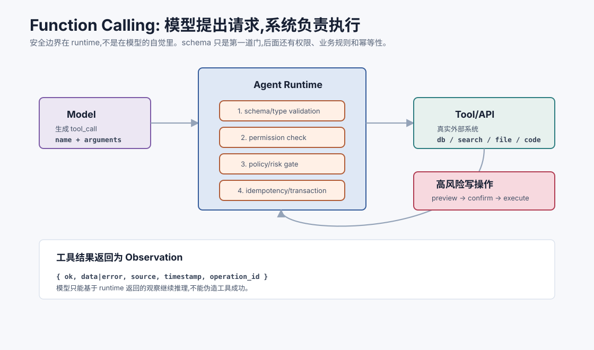
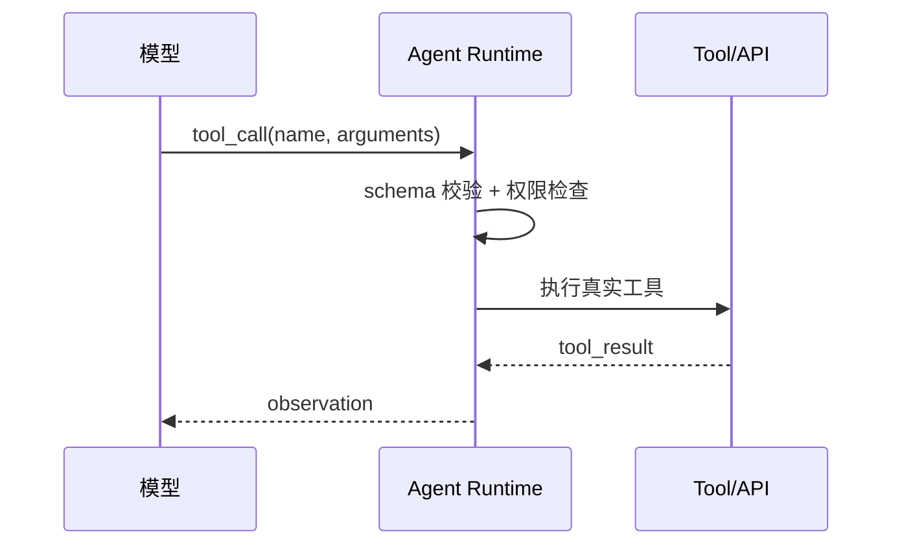
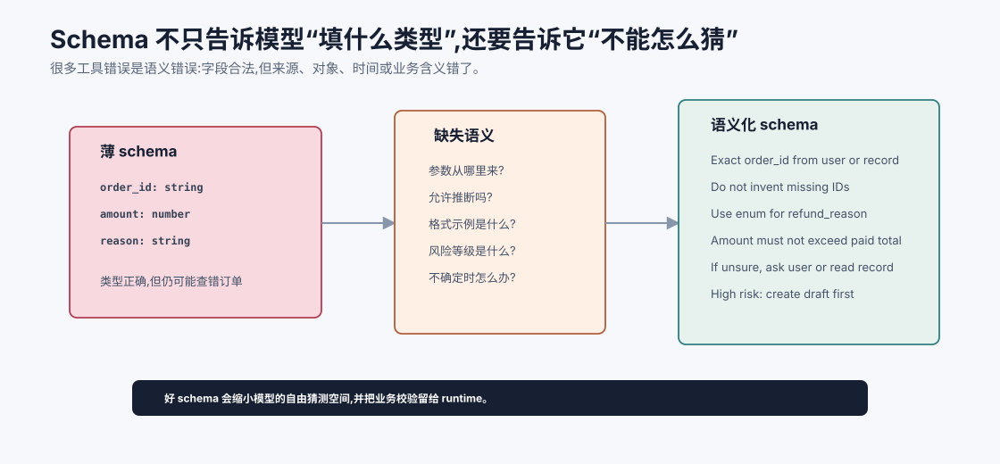
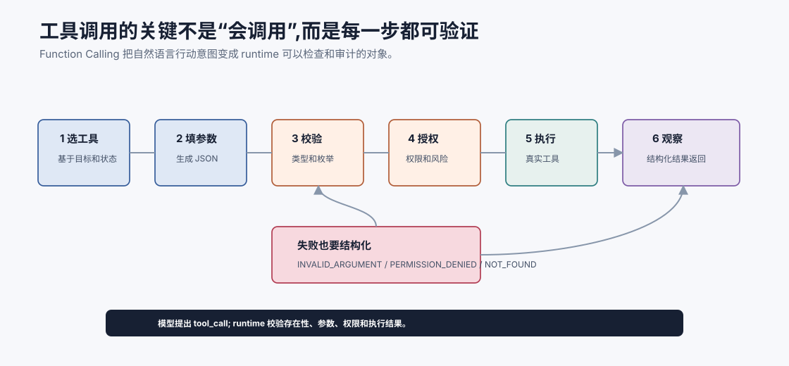

# Function Calling 工具调用 `[主线]` ★

前两章讲了 Agent loop 和 ReAct。它们解决的是“为什么要循环”和“如何边推理边行动”。

但还有一个关键问题没有解决:

**模型怎么把一个行动请求表达得足够结构化,让系统可以安全、准确地执行?**

如果模型只是输出一句自然语言:

```text
我需要查一下香港今天的天气。
```

系统很难可靠执行。它要猜工具名、猜参数、猜城市、猜单位、猜是否真的要调用。

Function Calling 的目标就是把这件事变清楚:

**模型不直接执行工具,而是生成一个符合 schema 的函数调用请求;系统验证后执行,再把结果作为观察返回给模型。**



本章会讲:

- Function Calling 解决了什么问题。
- 工具 schema 为什么是模型和系统之间的契约。
- 一次工具调用的完整生命周期。
- 参数校验、权限控制和错误反馈如何设计。
- Tool calling 和传统 API 调用有什么区别。
- 如何评估工具调用质量。

## 从自然语言动作到结构化动作

没有 Function Calling 时,模型可能输出:

```text
调用天气工具查询 Hong Kong。
```

这个输出对人可读,但对系统不够可靠。系统需要解析自然语言,容易出错。

Function Calling 让模型输出结构化对象:

```json
{
  "name": "get_weather",
  "arguments": {
    "city": "Hong Kong",
    "date": "today",
    "unit": "celsius"
  }
}
```

这样系统可以直接检查:

- 工具名是否存在。
- 参数字段是否完整。
- 类型是否正确。
- 当前用户是否有权限。
- 这个调用是否有副作用。

结构化不是形式主义。它是可靠执行的前提。

## 工具调用不是模型执行代码

必须反复强调:

**模型不会也不应该直接执行函数。**

模型做的是生成调用意图。真正执行的是 Agent runtime。

流程是:



这个分层带来几个好处:

- 模型无法绕过权限直接操作系统。
- 工具参数可以被严格校验。
- 执行日志可以审计。
- 工具失败可以变成结构化观察。
- 高风险动作可以要求用户确认。

## Tool schema 是契约

Function Calling 的核心是 tool schema。它告诉模型:

- 有哪些工具可用。
- 每个工具做什么。
- 需要哪些参数。
- 参数类型、枚举和约束是什么。
- 什么时候应该使用这个工具。
- 返回结果大概长什么样。

一个工具定义可以长这样:

```json
{
  "name": "search_docs",
  "description": "Search internal documentation for passages relevant to a query.",
  "parameters": {
    "type": "object",
    "properties": {
      "query": {
        "type": "string",
        "description": "The search query. Include product names and error codes when available."
      },
      "top_k": {
        "type": "integer",
        "minimum": 1,
        "maximum": 10,
        "default": 5
      }
    },
    "required": ["query"]
  }
}
```

这个 schema 同时服务模型和系统。

对模型来说,它是行动说明书。对系统来说,它是验证规则。

## Schema 里最重要的是语义,不只是类型

很多 schema 只写类型:

```json
{
  "order_id": {"type": "string"}
}
```

这只能告诉模型“这里要字符串”,不能告诉它字符串从哪里来、格式是什么、是否允许猜。

更好的 schema 会写语义约束:

```json
{
  "order_id": {
    "type": "string",
    "description": "Exact order identifier from the user message or customer record. Do not invent an order_id."
  }
}
```

对 Agent 来说,很多错误不是类型错,而是语义错。比如模型生成了一个格式看似合法但不存在的订单号。Schema 要尽量减少这种自由猜测空间。



这张图说明了 schema 的关键价值:不是只让 JSON 长得合法,而是让模型知道参数的来源、边界和不确定时的处理方式。`order_id: string` 只能阻止类型错误,不能阻止模型编造订单号;`Exact order identifier from user message or retrieved customer record. Do not invent.` 才能把自由猜测空间压小。

语义化 schema 还应该告诉 runtime 哪些规则不能交给模型判断。例如金额是否超过已支付总额、当前用户是否能访问订单、写操作是否需要确认,这些都应该由业务校验执行。模型负责提出候选调用,系统负责判断候选调用能不能进入真实世界。

可以在 description 中明确:

- 参数来源。
- 是否允许推断。
- 格式示例。
- 不确定时该怎么做。
- 和其他字段的关系。

## 一次工具调用生命周期

一次可靠工具调用通常经历这些阶段。



这个生命周期里最容易被低估的是中间三步:校验、授权和错误反馈。模型生成的 tool call 只是一个提案,即使 JSON 完全符合 schema,也不代表它有权限执行,更不代表业务上正确。runtime 必须检查工具是否存在、参数是否合法、当前用户是否有权、风险是否需要确认,再决定是否执行。

失败路径也要设计成一等公民。如果参数错了,返回 `INVALID_ARGUMENT` 和具体字段;如果权限不足,返回 `PERMISSION_DENIED`;如果对象不存在,返回 `NOT_FOUND`。结构化错误会变成下一轮 ReAct 的 observation,让模型有机会修正、询问用户或停止,而不是把失败当作成功继续编故事。

### 1. 工具选择

模型根据目标和当前状态选择工具。

例如:

```text
用户问内部政策 -> search_docs
用户问订单状态 -> get_order
用户要求删除记录 -> request_confirmation + delete_record
```

### 2. 参数生成

模型填充结构化参数。

比如订单查询需要:

```json
{
  "order_id": "HK-2026-00018"
}
```

### 3. Schema 校验

系统检查参数是否符合类型和约束。

如果 `order_id` 缺失,不能执行。

### 4. 权限和风险检查

系统判断用户是否允许调用此工具,以及是否需要确认。

查询订单可能低风险,退款或删除数据是高风险。

### 5. 执行工具

系统调用真实 API、数据库、搜索引擎、文件系统或代码执行器。

### 6. 返回观察

工具结果被结构化返回给模型。

### 7. 后续决策

模型根据观察继续回答、再调用工具或请求用户。

## 工具调用的两类失败

工具调用失败可以分成两类。

### 结构失败

调用请求不符合接口要求。

例子:

- 工具名不存在。
- 缺少必填字段。
- 类型错误。
- 枚举值不合法。

这类失败通常可以用 schema 校验、重试和更清晰工具描述解决。

### 语义失败

调用结构合法,但业务上错了。

例子:

- 查了错误订单。
- 把用户提到的“上个月”理解成当前月。
- 在不该退款时创建退款草稿。
- 把搜索 query 写得太宽,召回一堆噪声。

语义失败更难,需要:

- 更好的工具描述。
- 状态中提供必要上下文。
- 业务校验。
- 评估集覆盖真实案例。
- 必要时请求用户确认。

很多系统只统计“参数合法率”,会高估工具调用质量。真正应该关心的是“这个调用是否推进了任务”。

## 工具返回也要结构化

很多系统只重视调用参数,忽略返回格式。结果模型拿到一大段混乱文本,仍然容易误判。

更好的工具返回应该包含:

```json
{
  "ok": true,
  "data": {
    "order_id": "HK-2026-00018",
    "status": "delayed",
    "expected_ship_date": "2026-07-08"
  },
  "source": "orders_api",
  "timestamp": "2026-07-05T10:30:00+08:00"
}
```

失败时也要结构化:

```json
{
  "ok": false,
  "error": {
    "code": "PERMISSION_DENIED",
    "message": "Current user cannot access this order."
  }
}
```

结构化错误能帮助模型选择下一步:请求权限、换工具、报告阻塞,而不是编造结果。

## Tool calling 和传统 API 调用的区别

传统程序调用 API 时,开发者在代码里决定调用哪个函数。Function Calling 中,模型参与选择工具和生成参数。

| 维度 | 传统 API 调用 | Function Calling |
| --- | --- | --- |
| 调用决策 | 代码固定 | 模型根据上下文决定 |
| 参数来源 | 程序变量 | 模型从自然语言和状态中抽取 |
| 错误风险 | 程序 bug | 模型误选工具、误填参数 |
| 控制方式 | 类型系统、测试 | schema、权限、评估、审计 |
| 适用场景 | 路径清晰 | 用户输入开放、任务动态 |

Function Calling 不是替代普通 API,而是把自然语言决策层接到 API 之上。

## 工具选择的难点

工具越多,选择越难。

如果你给模型 80 个工具,每个工具描述又很像,模型会更容易选错。

常见问题包括:

- 工具名相似。
- description 太含糊。
- 参数字段过多。
- 多个工具功能重叠。
- 工具返回不稳定。
- 模型不知道何时不该调用工具。

工具设计不是“把所有 API 都丢给模型”。需要面向模型重新设计行动界面。

## 参数设计的难点

参数应该既表达业务需求,又容易由模型填写。

坏参数设计:

```json
{
  "x": "...",
  "mode": 3,
  "flag": true
}
```

模型不知道 `mode=3` 是什么,也不知道 `flag` 控制什么。

更好的设计:

```json
{
  "customer_id": "C12345",
  "include_closed_tickets": false,
  "sort_by": "last_updated_desc"
}
```

参数名和枚举值应该语义清楚,避免让模型猜业务黑话。

## Side effect:副作用分级

工具可以分成不同风险等级。

| 等级 | 例子 | 执行策略 |
| --- | --- | --- |
| 只读 | 搜索、读取文件、查询订单 | 可自动执行,但仍记录日志 |
| 可恢复写入 | 创建草稿、生成文件、开临时分支 | 可执行或轻确认 |
| 高风险写入 | 删除、退款、发邮件、改权限 | 必须确认和审计 |
| 不允许 | 泄露密钥、越权访问、破坏性操作 | 拒绝 |

模型不应该独自决定高风险动作。它可以准备操作计划,但最终执行要经过系统和用户确认。

## 幂等性和事务边界

写工具还要考虑幂等性。幂等的意思是:同一个请求重复执行多次,最终效果和执行一次相同。

这对 Agent 很重要,因为模型或 runtime 可能因为超时、网络错误、重试策略而重复发起调用。

例如 `submit_refund` 如果不做幂等控制,重复调用可能导致重复退款。更好的工具设计是要求 `idempotency_key`:

```json
{
  "order_id": "HK-2026-00018",
  "amount": 120.0,
  "idempotency_key": "refund-HK-2026-00018-20260705-a1"
}
```

系统用这个 key 保证同一动作不会重复生效。

事务边界也要明确。一个工具如果内部做多步写入,要么全部成功,要么返回明确的部分失败状态和恢复方式。不要让模型猜“到底写到哪一步了”。

高风险工具最好返回:

- 操作 ID。
- 最终状态。
- 是否可回滚。
- 回滚工具或人工处理路径。

## 参数校验不等于业务校验

Schema 只能检查基本形状:

- 是否是字符串。
- 是否在枚举内。
- 是否包含必填字段。

业务校验还要检查:

- 用户是否有权访问该订单。
- 金额是否超过审批阈值。
- 文件路径是否在工作区内。
- 邮件收件人是否属于允许域。
- 删除动作是否可回滚。

不要把 JSON schema 当成完整安全机制。它只是第一道门。

## 工具结果如何进入上下文

工具返回后,系统通常会把结果加入下一轮模型上下文。

这里要注意三点。

第一,结果要标记来源:

```text
Tool result from get_order, timestamp=...
```

第二,外部内容不能覆盖系统指令。网页、文档、邮件里的文字只是资料。

第三,长结果要摘要或分页。不要把 10 万行日志直接塞给模型。

工具结果是观察,不是新的最高优先级命令。

## Tool result summarization

工具返回很长时,需要摘要。但摘要不能丢掉可验证性。

一个好的工具结果摘要应包含:

- 原始结果引用或 ID。
- 成功/失败状态。
- 与当前任务相关的关键字段。
- 可能影响下一步的错误或警告。
- 时间戳和来源。

例如读取日志时,不要只总结“测试失败了”,而要保留定位线索:

```text
Observation #12 summary:
- source: test output, command `npm test -- UserService`
- status: failed
- key failure: expected user.active to equal true, received undefined
- location: test/UserService.test.ts:42, src/user-service.ts:18
- full log: artifact://tool-results/12
```

这样模型下一轮既有短上下文,也能在需要时回源。

## 多工具调用

有些任务需要多个工具组合。

例如研究助手:

1. `search_web` 找资料。
2. `fetch_page` 读取网页。
3. `extract_claims` 提取主张。
4. `rank_sources` 排序来源。
5. `write_report` 生成报告。

多工具调用要解决两个问题:

- 顺序依赖:后一个工具需要前一个工具结果。
- 状态追踪:哪些资料已经查过,哪些还缺。

这就是 Function Calling 和 Agent loop 结合的地方。单次工具调用只是动作,多轮工具使用才构成任务推进。

## 工具调用的评估

评估工具调用不能只看最终答案。要拆开看:

| 指标 | 含义 |
| --- | --- |
| 工具选择准确率 | 该用工具时是否用了正确工具 |
| 参数合法率 | 输出是否符合 schema |
| 参数语义正确率 | 字段值是否符合用户意图 |
| 无效调用率 | 是否调用了无帮助工具 |
| 错误恢复率 | 工具失败后能否合理处理 |
| 副作用合规率 | 高风险动作是否确认和审计 |
| 最终任务成功率 | 工具链是否真正完成目标 |

很多 Agent 看似回答不错,其实工具调用很糟:查错数据、漏掉权限、重复搜索、失败后编造。过程评估能暴露这些问题。

## 常见失败模式

### 1. 工具名幻觉

模型调用不存在的工具。

解决:

- 工具列表明确。
- 结构化输出限制枚举。
- runtime 拒绝未知工具并返回错误。

### 2. 参数缺失或类型错误

模型漏填 `order_id`,或把数字写成自然语言。

解决:

- schema 校验。
- 自动要求模型修正参数。
- 工具描述给出正反例。

### 3. 过度调用工具

明明上下文已有答案,模型还继续搜索。

解决:

- 成本提示。
- 最大调用次数。
- 要求调用前说明缺少的信息。

### 4. 不调用必要工具

涉及实时事实却凭记忆回答。

解决:

- 在系统规则中说明哪些问题必须查工具。
- 评估集中加入事实不足案例。

### 5. 工具结果误读

工具返回 `ok=false`,模型却当作成功。

解决:

- 返回格式显式区分成功/失败。
- 最终回答必须引用成功观察。
- 对错误状态做专门训练或提示。

## 一个工具调用模板

设计工具时,可以用这个模板检查:

```text
工具名: 动词_对象,语义清晰。
用途: 一句话说明什么时候用。
不要用于: 明确边界。
参数: 字段名可读,类型明确,枚举有限。
返回: 成功和失败结构稳定。
风险: 只读/写入/高风险。
权限: 谁能调用,是否需要确认。
示例: 1-2 个典型调用。
```

一个好工具不是暴露底层 API 的所有能力,而是给模型一个清晰、窄而可靠的动作。

## 和 Agent 的关系

Agent 的行动能力几乎都通过工具实现。

Function Calling 是 Agent 和外部世界之间的接口层。

它决定了:

- 模型能做哪些动作。
- 动作是否可验证。
- 参数是否可控。
- 错误能否被反馈。
- 权限能否被执行。
- 轨迹能否被审计。

如果工具接口设计得差,再强的模型也会不稳定。如果工具接口设计得好,中等模型也可能完成很多实用任务。

## 常见误解

### 误解一:Function Calling 会自动保证正确

不会。它保证结构更清晰,但不能保证模型选对工具、填对参数或理解业务语义。

### 误解二:有 schema 就安全了

schema 只做形状校验。权限、风险、副作用和业务规则必须由系统控制。

### 误解三:工具越多 Agent 越强

不一定。工具过多会增加选择难度。更好的做法是给模型少量高质量、语义清晰的工具。

### 误解四:工具返回自然语言就够了

不够。结构化返回更利于模型判断成功、失败、来源和下一步。

### 误解五:模型调用工具后就可以相信结果

工具可能失败、返回过期数据或受污染。关键任务仍需校验、引用和审计。

## 本章小结

Function Calling 把模型的行动意图变成结构化工具调用请求。模型选择工具并生成参数,Agent runtime 负责 schema 校验、权限检查、真实执行和结果回传。可靠工具调用依赖清晰 tool schema、稳定返回格式、风险分级、业务校验和过程评估。对 Agent 来说,工具接口就是连接外部世界的行动边界,设计得越清楚,系统越可控。

下一章会讲工具设计与 ACI。Function Calling 解决“如何调用”,ACI 进一步追问“应该给 Agent 设计什么样的工具界面”。
