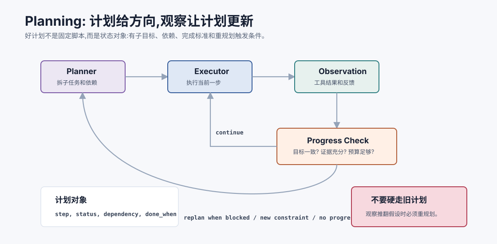
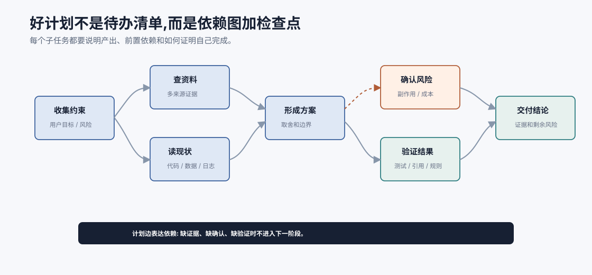
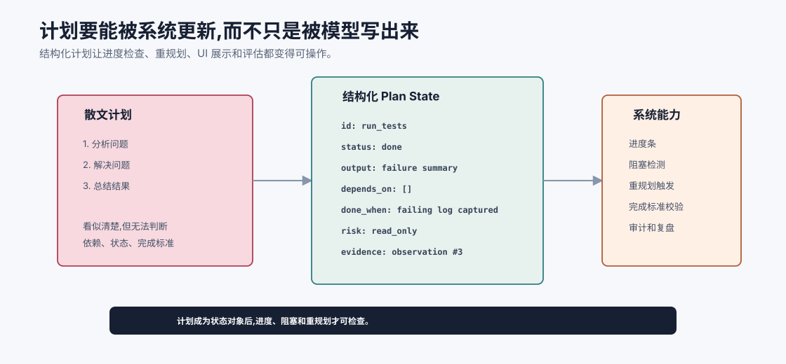
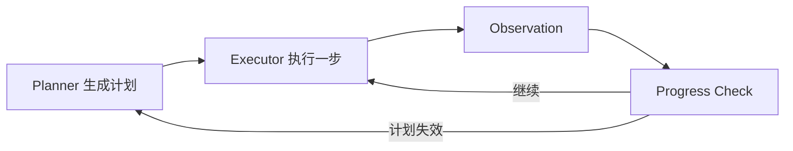

# Planning 任务规划 `[进阶]`

有了 Agent loop、ReAct 和工具调用,Agent 已经能边观察边行动。

但复杂任务还有一个问题:

**如果只看眼前下一步,Agent 容易局部最优、重复探索或漏掉关键子任务。**

Planning,任务规划,就是让 Agent 在行动前或行动中形成一个可执行的路线图。



规划不是让模型写一篇漂亮计划,而是帮助系统回答:

- 目标可以拆成哪些子目标?
- 哪些步骤有依赖关系?
- 哪些信息缺失?
- 哪些动作风险高?
- 什么时候检查进度?
- 计划失效时如何重规划?

本章会讲:

- Agent 为什么需要规划。
- Plan-and-execute 和 ReAct 有什么区别。
- 任务分解、依赖、里程碑和检查点如何设计。
- 规划为什么容易过时。
- 如何做动态重规划。
- 规划在工程中如何落到状态和评估。

## 为什么需要规划

看一个任务:

```text
帮我比较三种向量数据库,结合我们的约束给出选型建议。
```

如果 Agent 只做下一步,可能会这样:

```text
搜索 A -> 总结 A -> 搜索 B -> 总结 B -> 搜索 C -> 总结 C -> 写建议
```

这不一定错,但它可能漏掉关键维度:

- 数据规模。
- 延迟要求。
- 部署方式。
- 成本。
- 过滤查询能力。
- 运维复杂度。
- 团队已有技术栈。

规划能让 Agent 先建立评价框架,再收集资料。否则它容易被第一个搜索结果牵着走。

## 规划真正防的是什么

规划不是为了让 Agent 看起来有条理,而是为了防三类失败。

### 1. 目标漂移

Agent 原本要“比较向量数据库并给出选型”,搜索过程中看到某篇性能评测,最后变成只讨论 benchmark 分数,忘了用户约束是“私有化部署 + 小团队运维”。

计划中的评价维度能把它拉回目标。

### 2. 证据偏置

Agent 先读到某产品文档,就把该产品描述得最好。计划要求多来源、多对象对比,能降低先入为主。

### 3. 验证缺失

Agent 写完代码补丁就报告完成,但没跑测试。计划中的完成标准能强制“修改后验证”。

所以好计划不是“下一步列表”,而是对目标、证据和验证的约束。

## 规划解决的核心问题

规划主要解决四类问题。

### 1. 分解

把大目标拆成可执行子任务。

```text
研究数据库 -> 收集约束 -> 定义评估维度 -> 查资料 -> 对比 -> 给建议
```

### 2. 排序

确定哪些步骤必须先做。

例如先了解用户约束,再做选型;先运行测试,再修改代码。

### 3. 覆盖

避免漏掉关键分支。

例如排查故障时同时考虑代码、配置、依赖、环境。

### 4. 检查

设置何时验证结果。

例如修改代码后必须跑测试,生成报告前必须核对引用。

## ReAct 和 Planning 的区别

ReAct 更像边走边看。Planning 更像先画地图。

| 模式 | 优势 | 风险 |
| --- | --- | --- |
| ReAct | 灵活,能快速响应观察 | 容易短视或循环 |
| Planning | 全局结构更清晰 | 计划可能过时或太空泛 |

真实 Agent 往往结合两者:

```text
先生成计划 -> 按计划执行一步 -> 观察结果 -> 更新计划 -> 继续执行
```

这叫 plan-and-execute 或 plan-act-reflect 的变体。

## 计划不等于固定脚本

一个常见误解是:有了计划,Agent 就应该严格照做。

但真实任务中,计划经常失效。

例如原计划:

```text
1. 运行测试。
2. 根据失败日志读取对应文件。
3. 修改代码。
4. 重新测试。
```

实际第一步发现测试命令本身不存在。此时继续执行第 2 步没有意义。Agent 应该重规划:

```text
1. 查找项目测试脚本。
2. 确定正确测试命令。
3. 再运行测试。
```

计划是当前假设下的路线,不是不可改的合同。

## 一个好计划长什么样

坏计划:

```text
1. 分析问题。
2. 解决问题。
3. 总结结果。
```

它看起来有条理,但没有执行价值。

好计划应该包含:

- 可执行动作。
- 明确产出。
- 依赖关系。
- 验证方式。
- 风险点。

例如:

```text
目标: 修复测试失败。

计划:
1. 运行最小测试命令,获取失败日志。产出: 失败用例和栈信息。
2. 读取失败用例和相关源码。产出: 期望行为和当前实现差异。
3. 判断根因并做最小修改。约束: 不改 public API。
4. 重新运行相关测试。产出: 验证结果。
5. 总结改动、验证和剩余风险。
```

这个计划能指导行动,也能用于检查进度。

## 任务分解

任务分解是规划的第一步。

常见分解方式有几种。

### 按阶段分解

适合线性任务:

```text
理解需求 -> 收集信息 -> 执行修改 -> 验证 -> 汇报
```

### 按对象分解

适合对比和分析:

```text
数据库 A -> 数据库 B -> 数据库 C -> 横向比较
```

### 按风险分解

适合高风险操作:

```text
只读检查 -> 生成草稿 -> 用户确认 -> 执行写入 -> 验证结果
```

### 按假设分解

适合故障排查:

```text
可能是配置 -> 可能是依赖 -> 可能是代码 -> 可能是环境
```

不同任务需要不同分解方式。规划能力不是把所有任务都变成同一种清单。

## 探索任务和执行任务的计划不同

不是所有计划都长一样。

### 探索型计划

目标是减少不确定性。

例子:

```text
1. 明确用户约束。
2. 收集候选方案。
3. 按维度比较证据。
4. 标记缺口和不确定项。
5. 给出建议和取舍。
```

探索型计划要允许发现新分支。

### 执行型计划

目标是把系统从状态 A 推到状态 B。

例子:

```text
1. 读取当前配置。
2. 生成修改草稿。
3. 运行校验。
4. 用户确认。
5. 应用修改。
6. 验证结果。
```

执行型计划要强调顺序、权限和回滚。

把探索任务写得太死,会错过重要线索。把执行任务写得太开放,会带来风险。

## 依赖关系

很多子任务不能随便排序。

例如:

```text
查订单状态 -> 判断是否可退款 -> 创建退款草稿 -> 用户确认 -> 提交退款
```

不能在不知道订单状态时直接提交退款。

规划时要明确依赖:


依赖关系越清楚,Agent 越不容易乱跳步骤。



这张图把计划从“顺序清单”变成“依赖图”。真正有用的计划不只是写下一步,还要写清楚哪些事实必须先获得,哪些风险必须先确认,哪些验证必须先通过。比如还没有订单状态,就不该判断退款资格;还没有用户确认,就不该提交高风险写操作;还没有测试结果,就不该声称修复完成。

依赖图也能帮助 Agent 在观察变化时重规划。当某个前置节点失败,后续依赖它的步骤就应该暂停或替换,而不是继续沿着旧计划执行。计划的价值不在于永远不变,而在于让“为什么要改路线”变得清楚。

## 检查点

长任务需要检查点。

检查点回答:

> 到这里时,我们如何知道进展是对的?

例子:

- 研究任务:每个结论至少有来源。
- 代码任务:修改后相关测试通过。
- 数据任务:行数、字段、异常值检查通过。
- 业务任务:写操作前用户确认。

没有检查点,Agent 可能执行很多步骤后才发现方向错了。

## 规划的粒度

计划太粗没用,太细会脆。

### 太粗

```text
调查问题并修复。
```

无法指导下一步。

### 太细

```text
第 1 步打开文件 A 第 1 行,第 2 步读取第 2 行...
```

一旦观察变化,计划就失效。

### 合适

```text
读取失败用例和相关实现,定位期望行为与实际行为差异。
```

计划粒度应该对应“有意义的子目标”,而不是每个低层动作。

## 动态重规划

重规划是 Agent 可靠性的关键。

触发重规划的信号包括:

- 工具返回和预期不符。
- 子任务完成但目标仍未达成。
- 发现新约束。
- 预算不足。
- 高风险动作出现。
- 连续失败或无进展。

重规划时,Agent 应该更新:

- 当前已知事实。
- 已完成步骤。
- 被否定的假设。
- 新的下一步。
- 是否需要用户确认。

不要每次重规划都从零开始。好的重规划是基于已有状态修正路线。

## 计划作为状态对象

计划最好不是一段散文,而是状态对象。

例如:

```json
{
  "goal": "Fix failing user service test",
  "steps": [
    {
      "id": "run_tests",
      "status": "done",
      "result": "UserService active default test failed"
    },
    {
      "id": "inspect_code",
      "status": "in_progress",
      "expected_output": "Identify implementation mismatch"
    },
    {
      "id": "patch_and_verify",
      "status": "pending",
      "expected_output": "Tests pass"
    }
  ]
}
```

结构化计划能被系统检查、展示、更新和评估。



把计划做成状态对象后,系统可以做很多散文计划做不到的事:显示当前进度,发现哪个步骤阻塞,检查完成标准是否满足,统计计划失败原因,甚至在工具观察回来后自动标记某个假设已废弃。计划不再是开头给用户看的仪式感,而是 Agent loop 的一部分。

一个实用字段是 `done_when`。它迫使每个步骤说清“什么证据出现才算完成”。例如“读取相关文件”不够好,更好的完成标准是“找到失败用例和被测实现之间的行为差异”。这种完成标准会直接提高执行质量,因为模型和 runtime 都知道该检查什么。

## 计划者和执行者可以分离

复杂系统里,规划和执行可以由不同组件承担。



这种分离有几个好处:

- Planner 关注全局目标和子任务覆盖。
- Executor 关注当前一步的工具调用和错误处理。
- Progress checker 判断是否偏离计划。
- Runtime 可以限制执行者不能越过确认点。

例如计划中写着“创建退款草稿,等待用户确认”,执行者就不能直接提交退款。计划不是权限,只是路线。真正的权限仍由系统控制。

## 进度检查

规划系统需要周期性检查:

| 检查项 | 问题 |
| --- | --- |
| 目标一致性 | 当前动作还在服务原目标吗? |
| 子任务状态 | 哪些完成、哪些阻塞、哪些废弃? |
| 证据充分性 | 结论是否有观察支撑? |
| 预算 | 剩余轮数和成本是否够? |
| 风险 | 是否接近需要确认的动作? |
| 重复 | 是否在做类似无效尝试? |

没有进度检查,计划很容易成为开头写过、后面没人看的装饰。

## Planning prompt 的基本结构

让模型规划时,输入应包含:

- 用户目标。
- 当前已知事实。
- 可用工具。
- 约束和风险。
- 预算。
- 要求计划包含验证方式。

示例:

```text
请把目标拆成 3-6 个可执行子任务。
每个子任务写明:
- 目的
- 依赖
- 可能使用的工具
- 完成标准
- 风险或确认点
不要编造尚未观察到的事实。
```

关键是让计划贴近可执行动作和验证,而不是泛泛而谈。

## 规划和工具选择

规划不只是列步骤,还要预估工具需求。

例如:

| 子任务 | 可能工具 | 完成标准 |
| --- | --- | --- |
| 获取失败日志 | `run_tests` | 得到失败用例和栈 |
| 定位相关代码 | `read_file`, `search_code` | 找到实现和测试 |
| 修改实现 | `edit_file` | 代码符合期望 |
| 验证修复 | `run_tests` | 相关测试通过 |

这能让 Agent 的下一步选择更稳定。

## 规划和并行

有些子任务可以并行。

例如研究任务:

```text
同时收集数据库 A/B/C 的定价、部署、性能资料。
```

并行可以降低延迟,但也会增加协调复杂度。

适合并行的任务通常满足:

- 子任务相互独立。
- 工具调用无副作用。
- 结果可以合并。

不适合并行的任务:

- 后一步依赖前一步结果。
- 多个写操作可能冲突。
- 需要严格顺序审批。

后面讲工作流模式时会展开并行、路由和编排。

## 规划的评估

评估规划可以看:

- 是否覆盖关键子任务。
- 步骤是否可执行。
- 依赖是否合理。
- 是否包含验证。
- 是否识别风险和确认点。
- 计划执行后是否减少无效工具调用。
- 重规划是否基于新观察。

不要只看计划写得是否漂亮。计划的价值在执行中体现。

## 计划失败后的复盘

每次计划失败,都应该归类原因:

| 失败原因 | 表现 | 改进方向 |
| --- | --- | --- |
| 目标理解错 | 子任务服务了错误目标 | 加需求澄清和目标重述 |
| 漏关键依赖 | 跳过必要前置步骤 | 增加依赖检查 |
| 工具不可用 | 计划依赖不存在工具 | 规划时注入真实工具列表 |
| 验证不足 | 看似完成但结果错误 | 每步增加完成标准 |
| 预算不现实 | 计划太大做不完 | 先做最小可交付版本 |
| 风险低估 | 直接执行高风险动作 | 加确认点和权限门 |

这类复盘会让规划能力持续变好。没有复盘,Agent 会在不同任务里反复犯同类错误。

## 常见失败模式

### 1. 空泛计划

模型输出“分析、执行、总结”。

解决:要求每步包含工具、产出和完成标准。

### 2. 编造事实

计划假设某文件或 API 存在,但没有观察依据。

解决:区分已知事实和待验证假设。

### 3. 不重规划

原计划失败后仍然硬走。

解决:设置重规划触发条件。

### 4. 计划过细

每个微动作都写死,观察一变就崩。

解决:按子目标规划,低层动作交给执行阶段。

### 5. 没有验证

完成步骤后不检查结果。

解决:每个关键子任务写明完成标准。

## 和 Agent 的关系

Planning 给 Agent 一个全局方向,ReAct 给 Agent 一个局部反馈循环。

可以这样理解:

- Planning:现在大概要走哪条路?
- ReAct:下一步具体做什么,做完看到了什么?
- State:我们已经走到哪里,哪些路走不通?
- Evaluation:结果是否真的达标?

成熟 Agent 通常不会只依赖一种机制,而是在任务复杂度、风险和预算之间选择合适的规划强度。

## 常见误解

### 误解一:计划越长越好

不一定。计划越长,越容易过时。好计划应该足够指导行动,但允许根据观察更新。

### 误解二:有计划就不需要 ReAct

不对。计划提供方向,ReAct 用观察修正下一步。二者互补。

### 误解三:规划就是让模型先想清楚所有步骤

很多任务无法提前想清楚。规划应包含未知项和验证点,而不是假装全知。

### 误解四:计划失败说明模型差

也可能是任务信息不足、工具不可用、状态更新不充分或计划粒度不合适。

### 误解五:生产系统应该让模型自由规划所有事

高风险业务中,外层流程、权限和确认仍应由系统控制。模型规划应在边界内进行。

## 本章小结

Planning 让 Agent 在复杂任务中形成可执行路线图。好计划会拆分子任务、明确依赖、标出验证方式和风险确认点,并能根据观察动态更新。规划不是固定脚本,也不是漂亮清单,而是 Agent 状态的一部分。它和 ReAct、工具调用、预算控制、评估共同工作,帮助 Agent 从局部行动走向可靠任务完成。

下一章会讲五大工作流模式。规划关注一个 Agent 如何组织任务,工作流模式则关注系统如何编排一个或多个模型调用、工具和判断节点。
