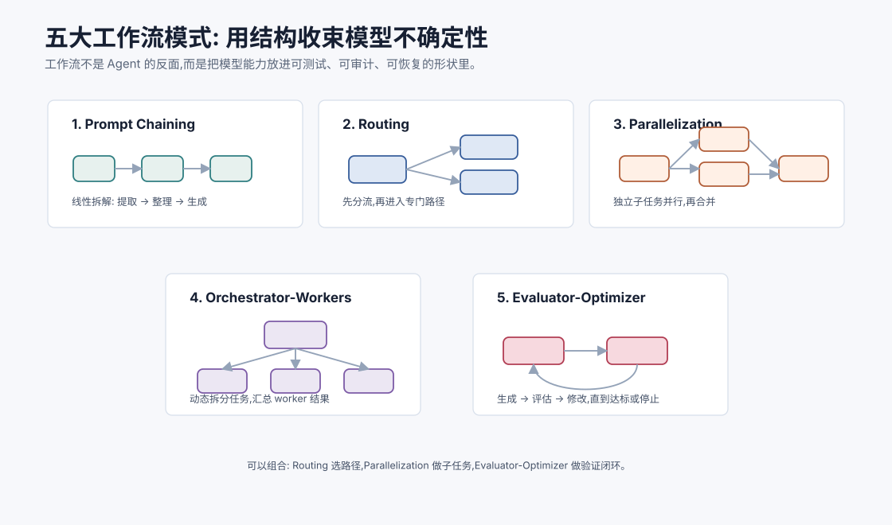
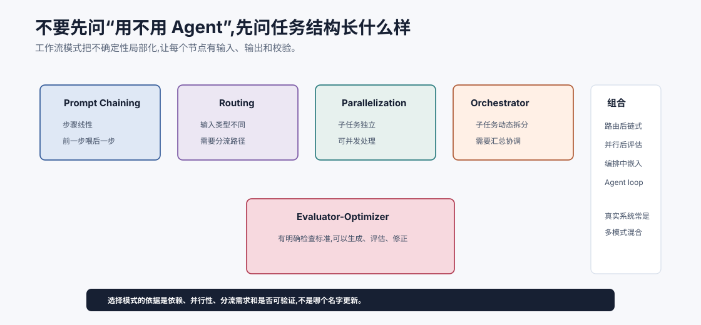
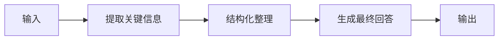
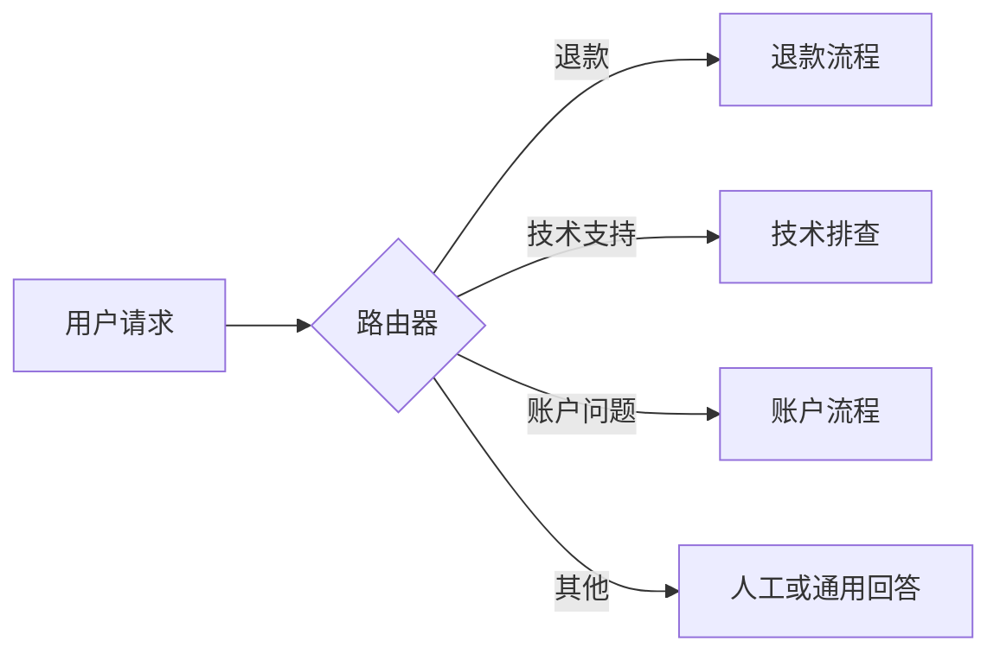
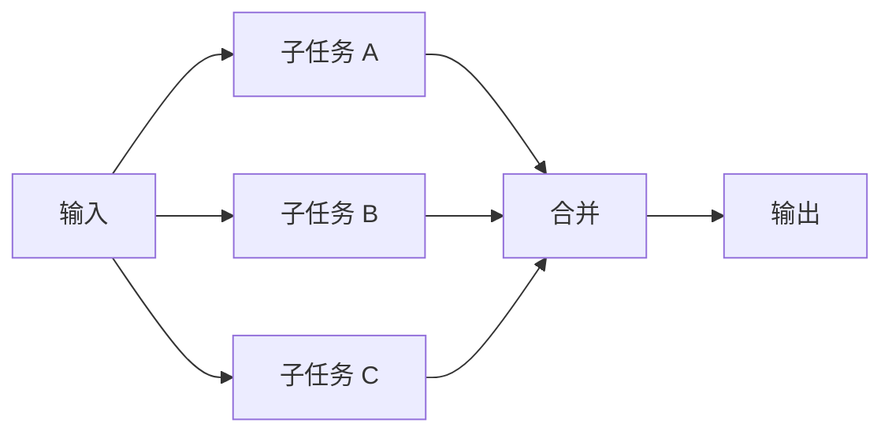
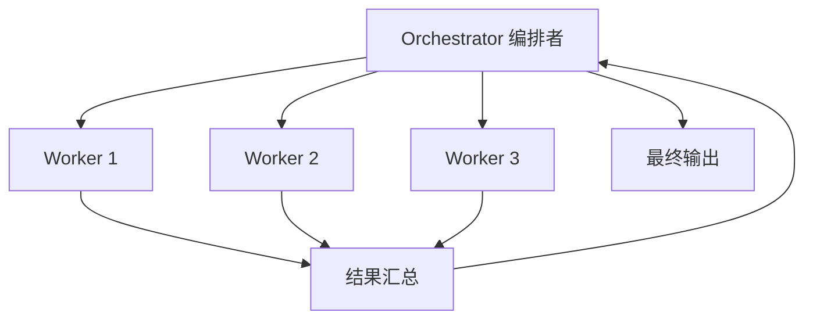
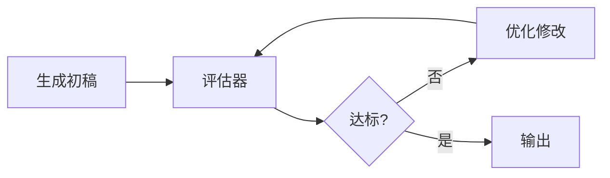
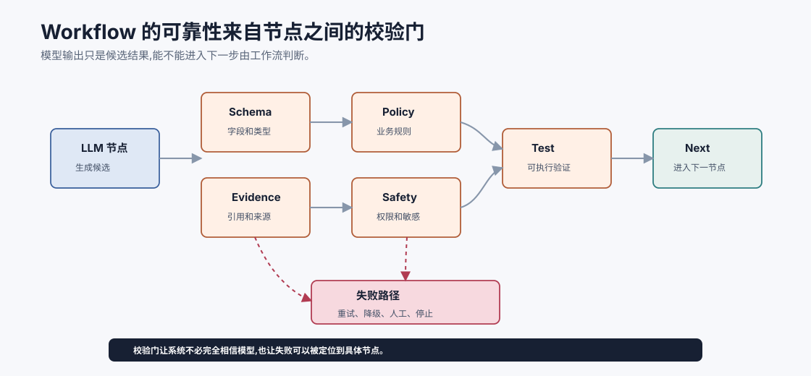

# 五大工作流模式 `[进阶]`

到目前为止,我们一直在讲 Agent:循环、ReAct、工具、规划。

但生产系统里,并不是所有智能流程都应该做成开放式 Agent。很多场景更适合 Workflow:路径由系统编排,模型只在某些节点做判断或生成。

Workflow 的优势是可控、可测试、可审计。Agent 的优势是灵活、能处理动态分支。成熟系统经常把二者混合。

本章讲五种常见 LLM 工作流模式:

1. Prompt Chaining:链式处理。
2. Routing:路由分发。
3. Parallelization:并行处理。
4. Orchestrator-Workers:编排者-工作者。
5. Evaluator-Optimizer:评估-优化。



这些模式不是抽象设计图,而是构建可靠 Agent 系统的基础积木。



这张图提供一个更快的选择方式:先看任务结构,再选模式。步骤线性时用 Prompt Chaining;输入类型多时先 Routing;子任务互不依赖时 Parallelization;子任务需要动态拆分和汇总时 Orchestrator-Workers;有明确检查标准时 Evaluator-Optimizer。

现实系统通常不是五选一。比如代码 Agent 可以先 Routing 判断是解释问题还是修改问题,再由 Orchestrator 拆分文件分析,并行读取证据,最后用测试做 Evaluator-Optimizer。工作流模式的意义不是让系统显得复杂,而是把复杂任务拆成可观察、可评估的节点。

## 为什么需要工作流模式

直接让一个模型从头到尾处理复杂任务,常见问题是:

- 上下文太长。
- 任务边界不清。
- 输出不稳定。
- 难以插入校验。
- 难以定位失败节点。
- 高风险动作不可控。

Workflow 把任务拆成明确节点,每个节点只做一件事。

例如:

```text
输入文档 -> 提取事实 -> 校验格式 -> 生成摘要 -> 人工确认 -> 发布
```

这比让模型“一口气读完并发布”更安全。

## 工作流的深层价值:把不确定性局部化

LLM 的不确定性不可完全消除,但可以被局部化。

如果整个系统只有一个大模型调用,一旦输出错了,你很难知道错在:

- 输入理解。
- 检索。
- 推理。
- 格式。
- 安全判断。
- 最终表达。

工作流把这些能力拆成节点。每个节点有输入、输出和校验。这样错误能被定位,也能被局部修复。

例如 RAG 问答可以拆成:

```text
query rewrite -> retrieval -> rerank -> evidence pack -> answer -> citation check
```

如果答案错了,你可以分别检查召回是否错、重排是否错、证据包是否噪声太多、生成是否没遵守证据。

这就是工作流的工程价值:不是让模型更聪明,而是让系统更可诊断。

## 模式一:Prompt Chaining

Prompt Chaining 是把多个模型调用串起来。前一步输出作为后一步输入。



适合任务:

- 文档摘要。
- 信息抽取后生成报告。
- 先分类再回答。
- 先改写再翻译。

例子:

```text
客户邮件 -> 提取诉求和订单号 -> 查询订单 -> 生成客服回复草稿
```

### 优点

- 每一步更简单。
- 中间结果可检查。
- 失败更容易定位。
- 可在节点间加入规则校验。

### 风险

- 错误会传递到后续步骤。
- 链太长会增加延迟。
- 中间格式不稳定会影响后续。

### 关键设计

每个节点要有清晰输入输出 schema。不要让上一节点输出一大段随意文本,下一节点再猜。

## 模式二:Routing

Routing 是先判断任务类型,再送到不同处理路径。



适合任务:

- 客服意图分流。
- 模型路由。
- 工具组选择。
- 安全风险分级。
- 简单问题和复杂问题分离。

### 路由器可以是什么

- 规则。
- 分类模型。
- 小 LLM。
- embedding 相似度。
- 多信号组合。

不一定要用最强模型做路由。高频简单路由可以用便宜小模型或规则。

### 好路由的关键

路由输出应该结构化:

```json
{
  "route": "refund",
  "confidence": 0.86,
  "reason": "User asks for refund status of an order."
}
```

低置信度时可以走澄清或人工。

### 风险

路由错了,后续路径再强也可能错。需要评估混淆矩阵,特别关注高风险类别。

## 模式三:Parallelization

Parallelization 是把可独立处理的子任务并行执行,再合并结果。



适合任务:

- 多文档分别摘要。
- 多来源事实核查。
- 多候选方案生成。
- 多个检查器同时审查输出。
- 批量处理独立记录。

### 例子

研究助手可以并行读取三篇资料:

```text
资料 A 摘要
资料 B 摘要
资料 C 摘要
-> 合并对比表
```

代码审查可以并行检查:

```text
安全风险 / 性能风险 / API 兼容性 / 测试覆盖
```

### 优点

- 降低 wall-clock 延迟。
- 子任务上下文更短。
- 可以从多个视角审查。

### 风险

- 合并阶段可能丢信息。
- 并行结果可能冲突。
- 成本可能上升。
- 不适合有强依赖的任务。

### 关键设计

合并器必须知道如何处理冲突和来源。不要简单拼接多个模型输出。

## 模式四:Orchestrator-Workers

Orchestrator-Workers 是一个编排者拆分任务,多个工作者执行子任务,编排者再整合。



适合任务:

- 开放式研究。
- 复杂代码修改。
- 多文件分析。
- 大型文档处理。
- 多角色协作。

### 和 Parallelization 的区别

Parallelization 通常子任务预先明确。Orchestrator-Workers 中,子任务可能由编排者动态生成。

例如:

```text
编排者: 需要分别分析认证模块、支付模块、通知模块。
Worker A: 分析认证。
Worker B: 分析支付。
Worker C: 分析通知。
编排者: 汇总并决定下一轮。
```

### 优点

- 适合复杂开放任务。
- 可以分配上下文和专门角色。
- 编排者保持全局目标。

### 风险

- 协调成本高。
- 子任务可能重复或冲突。
- 汇总质量决定最终质量。
- 多模型调用成本高。

### 关键设计

Worker 输出应结构化,包括:

- 发现。
- 证据。
- 不确定点。
- 建议下一步。

编排者不应盲信 Worker,要能比较、去重和检查冲突。

## 模式五:Evaluator-Optimizer

Evaluator-Optimizer 是生成一个结果,评估它,再根据反馈改进。



适合任务:

- 写作润色。
- 代码生成和测试修复。
- 结构化输出校验。
- 策略优化。
- 答案事实性检查。

### 评估器可以是什么

- 规则校验。
- JSON schema。
- 单元测试。
- 静态分析。
- 检索核查。
- LLM-as-a-Judge。
- 人类审核。

最可靠的评估器通常不是另一个“感觉不错”的模型,而是可执行、可验证的检查。

评估器的强度决定优化循环的上限。

| 评估器 | 可靠性 | 例子 |
| --- | --- | --- |
| 格式/schema | 高 | JSON 字段是否存在 |
| 单元测试 | 高 | 代码行为是否正确 |
| 规则/策略 | 中高 | 是否超过退款阈值 |
| 检索证据检查 | 中 | 回答是否引用资料 |
| LLM judge | 中 | 文风、完整性、相关性 |
| 用户主观反馈 | 变化大 | 是否满意 |

当评估器弱时,不要让优化循环无限跑。模型可能只是在迎合评估器,而不是变得更正确。

### 例子:代码修复

```text
生成补丁 -> 运行测试 -> 如果失败,读取错误 -> 修改补丁 -> 再测试
```

这是 Agent 中最有价值的模式之一,因为测试提供了外部真值。

### 风险

- 评估器本身可能错。
- 循环可能过长。
- 模型可能优化评估器漏洞。
- 只优化可测指标,忽略不可测质量。

### 关键设计

要设置最大迭代次数,并记录每轮变化。评估失败时要保留错误信息,不要只说“不合格”。

## 五种模式对比

| 模式 | 核心用途 | 适合场景 | 主要风险 |
| --- | --- | --- | --- |
| Prompt Chaining | 拆成线性步骤 | 提取、整理、生成 | 错误传递 |
| Routing | 分流到不同路径 | 客服、模型路由、安全分级 | 路由错误 |
| Parallelization | 独立子任务并行 | 多文档、多视角审查 | 合并冲突 |
| Orchestrator-Workers | 动态拆分和汇总 | 开放式复杂任务 | 协调成本 |
| Evaluator-Optimizer | 生成-检查-改进 | 代码、格式、质量优化 | 循环和评估漏洞 |

这些模式可以组合。比如一个代码 Agent 可能先路由任务类型,再由编排者拆分文件分析,并行读取,最后用测试做评估-优化。

## Workflow 和 Agent 的混合

生产系统常见结构是:

```text
Workflow 管大边界,Agent 处理不确定节点。
```

例如客服退款:

1. Workflow 固定读取订单。
2. Workflow 固定检查基本资格。
3. Agent 分析用户补充说明和异常情况。
4. Workflow 生成退款草稿。
5. 用户确认。
6. Workflow 提交并审计。

这样既保留业务可控性,又让模型处理非结构化和异常情况。

## 如何选择模式

可以按任务特征选择。

| 任务特征 | 优先模式 |
| --- | --- |
| 步骤固定 | Prompt Chaining / Workflow |
| 输入类型多 | Routing |
| 子任务独立 | Parallelization |
| 子任务需要动态拆分 | Orchestrator-Workers |
| 有明确检查标准 | Evaluator-Optimizer |
| 开放式探索 | Agent loop + Planning |

不要一上来就做最复杂的多 Agent 编排。先用最简单、最可控的模式覆盖主要路径。

## 工作流节点设计

每个节点都应该有明确契约:

- 输入 schema。
- 输出 schema。
- 失败条件。
- 超时和重试。
- 是否可缓存。
- 是否有副作用。
- 如何观测和评估。

LLM 节点也应该像普通服务一样被工程化。不要把“调用模型”当成一个不可检查的黑盒。

## 校验门

Workflow 的一个优势是可以插入校验门。校验门决定输出能不能进入下一步。

常见校验门包括:

| 校验门 | 检查什么 | 失败后 |
| --- | --- | --- |
| Schema validation | JSON、字段、类型是否合法 | 要求重试或进入人工 |
| Policy check | 是否违反业务规则 | 阻断或请求审批 |
| Evidence check | 结论是否有来源 | 重新检索或标记不确定 |
| Safety check | 是否涉及敏感或高风险内容 | 降级、拒绝或确认 |
| Test check | 代码或数据是否通过测试 | 进入优化循环 |
| Budget check | 成本和轮数是否超限 | 停止或请求用户 |

校验门让系统不必完全相信模型输出。模型负责生成候选,工作流负责决定候选是否能继续流动。

这也是 Workflow 比开放 Agent 更适合高风险业务的原因之一。



校验门的关键是把失败拦在局部。模型抽取字段后先过 schema,回答生成后先查引用,写操作前先过 policy 和 safety,代码补丁后先跑测试。每个门都让错误停在当前位置,而不是带着错误进入下游流程。

失败路径也要提前设计。校验失败后是重试、降级、转人工、请求澄清,还是停止汇报,应该由工作流定义。否则校验门只会变成“发现错了但不知道怎么办”的日志。成熟 workflow 的价值就在于:它不仅知道怎样通过,也知道怎样失败。

## 状态在工作流中的作用

工作流也需要状态。

状态记录:

- 当前节点。
- 中间输出。
- 已通过的校验。
- 错误和重试次数。
- 用户确认。
- 最终产物。

如果状态清晰,失败后可以从某个节点恢复,而不是整条链重跑。

## 可观测性

工作流模式特别适合做可观测性。

你可以记录每个节点:

- 输入大小。
- 输出摘要。
- 模型版本。
- prompt 版本。
- latency。
- cost。
- validation result。
- error code。

这些数据会在后面的工程实践篇继续展开。

## 常见误解

### 误解一:Workflow 不如 Agent 智能

不对。Workflow 更可控,很多生产任务更适合 Workflow。智能系统不等于越自主越好。

### 误解二:所有任务都应该 Orchestrator-Workers

这种模式强但贵,协调复杂。简单任务用链式或路由更稳。

### 误解三:Evaluator 用 LLM 就够了

LLM 评估有用,但可执行检查、规则、测试和人工审核通常更可靠。能用确定性评估时优先用。

### 误解四:并行一定更快更省

并行可能降低等待时间,但总成本会上升,合并也更复杂。

### 误解五:工作流一旦固定就不能处理异常

可以在异常节点引入 Agent 或人工确认。好的工作流允许受控弹性。

## 本章小结

LLM 工作流模式是构建可靠智能系统的基础。Prompt Chaining 适合线性拆解,Routing 适合分流,Parallelization 适合独立子任务,Orchestrator-Workers 适合动态拆分,Evaluator-Optimizer 适合可检查的迭代优化。生产系统常常让 Workflow 管边界和审计,让 Agent 处理不确定和开放部分。选择模式时,应优先考虑任务结构、风险、延迟、成本和可评估性。

下一章会把这一切收束成一个关键判断:工作流 vs 自主 Agent,到底怎么选。
