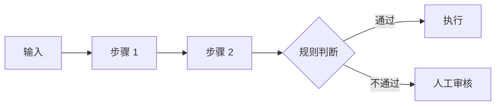
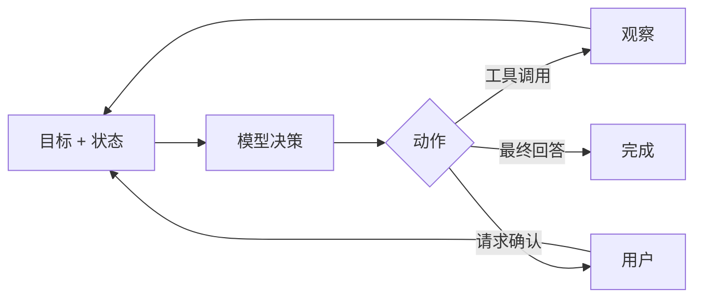
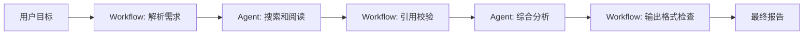

# 工作流 vs 自主 Agent:如何选 `[主线]`

前面几章讲了 Agent loop、ReAct、Function Calling、ACI、Planning 和工作流模式。

现在要回答一个工程上最常见的问题:

**一个任务到底应该做成固定 Workflow,还是做成更自主的 Agent?**

这个问题没有单一答案。可靠系统的关键不是追求“最 Agent”,而是选择合适的自主性。

很多失败项目的问题不是模型不够强,而是把本来应该固定的流程交给模型自由决定,或者把本来需要动态探索的任务硬写成死流程。

本章会给出一个判断框架:

- Workflow 和 Agent 的本质差异是什么。
- 哪些任务适合 Workflow。
- 哪些任务适合 Agent。
- 自主性如何分级。
- 如何从 Workflow 渐进演化到 Agent。
- 生产系统中如何混合二者。

## 先给结论

一句话版本:

> 路径清晰、风险高、规则稳定时优先 Workflow;路径不确定、需要探索、下一步依赖观察时引入 Agent。

更具体地说:

| 任务特征 | 更适合 |
| --- | --- |
| 步骤固定 | Workflow |
| 业务规则明确 | Workflow |
| 高风险写操作 | Workflow + 确认 |
| 需要严格审计 | Workflow |
| 用户输入开放 | Agent 或混合 |
| 下一步依赖工具结果 | Agent |
| 需要多轮探索 | Agent |
| 信息分散且不确定 | Agent |
| 有可执行验证 | Agent + Evaluator |

不要把 Workflow 和 Agent 看成敌人。它们是两种控制方式。

## Workflow 的本质

Workflow 是由系统预先定义路径。



模型可以出现在某些节点,但下一步通常由代码、规则或流程引擎决定。

Workflow 的核心是:

- 可预测。
- 可测试。
- 可审计。
- 易于权限控制。
- 易于复现失败。

它非常适合业务流程。

## Agent 的本质

Agent 是由模型在边界内动态选择下一步。



Agent 的核心是:

- 能处理开放目标。
- 能根据观察改变策略。
- 能探索信息空间。
- 能从错误中恢复。
- 能跨工具推进任务。

它非常适合不确定任务。

## 决定因素一:路径是否清晰

如果任务路径清晰,用 Workflow。

例如发票处理:

```text
上传 -> OCR -> 提取字段 -> 校验 -> 入账或人工审核
```

这里不需要模型自由决定下一步。让模型自由探索只会增加不确定性。

如果任务路径不清晰,Agent 更有价值。

例如代码排查:

```text
测试失败 -> 可能是代码、依赖、环境、配置、数据
```

必须根据中间观察决定下一步。

## 决定因素二:规则是否稳定

规则稳定时,优先写进系统。

例如:

- 金额超过阈值需要审批。
- 删除数据需要管理员权限。
- 发票字段必须满足格式。
- 退款必须检查订单状态。

这些规则不应该让模型临场发挥。

模型可以辅助解释、抽取和建议,但规则执行应由系统控制。

规则不稳定或难以穷举时,Agent 可以处理弹性部分。

例如用户投诉原因千奇百怪,模型可以总结和分类,但真正退款规则仍由系统执行。

## 决定因素三:风险和副作用

任务风险越高,自主性越要低。

| 动作 | 风险 | 推荐控制 |
| --- | --- | --- |
| 总结文档 | 低 | 可直接生成 |
| 查询订单 | 中低 | 权限校验后自动执行 |
| 创建草稿 | 中 | 自动生成,用户确认 |
| 发送邮件 | 中高 | 预览 + 确认 |
| 退款/删除/改权限 | 高 | Workflow 控制 + 审计 + 确认 |

高风险不意味着不能用 Agent。它意味着 Agent 只能准备、分析、建议或创建草稿,最终执行由 Workflow 和用户确认控制。

## 决定因素四:是否需要探索

探索型任务更适合 Agent。

例如:

- 搜索资料并比较观点。
- 调试未知错误。
- 分析复杂日志。
- 在代码库中寻找实现位置。
- 多轮澄清需求。

这些任务有共同点:下一步取决于上一轮发现。

如果你无法在设计时列出完整路径,但可以定义工具、边界和停止条件,Agent 就有价值。

## 决定因素五:是否有可靠验证

Agent 更适合有反馈的任务。

例如代码任务有测试,数据任务有校验,检索任务有引用,格式任务有 schema。

没有验证的开放任务,Agent 可能越走越自信,但不一定越正确。

可以问:

> Agent 每行动一步后,系统如何知道它更接近目标?

如果没有答案,先不要给太高自主性。

## 自主性分级

可以把系统自主性分成五级。

| 等级 | 描述 | 例子 |
| --- | --- | --- |
| L0 | 模型只生成文本 | 总结、改写 |
| L1 | 模型在固定节点做判断 | 分类、抽取字段 |
| L2 | 模型可调用只读工具 | 搜索、查询、读取文件 |
| L3 | 模型可创建草稿或低风险改动 | 草稿邮件、代码补丁 |
| L4 | 模型可执行高风险动作 | 退款、删除、发送、改权限 |

生产系统大多应该长期停在 L1-L3。L4 需要非常强的权限、确认、审计和回滚机制。

## 渐进式路线

构建 Agent 不必一步到位。

一条稳妥路线是:

1. 先做普通 LLM 节点,验证输入输出质量。
2. 加结构化输出和 schema 校验。
3. 加只读工具,让模型基于事实回答。
4. 加固定 Workflow,控制主路径。
5. 在不确定节点加入 Agent loop。
6. 加评估、日志、预算和停止条件。
7. 对低风险写操作开放草稿或可回滚执行。
8. 高风险动作始终保留确认和审计。

这样比一开始做全自主 Agent 更容易成功。

## 混合架构

最常见的生产形态是混合架构。

例如个人研究助手:



Workflow 提供边界,Agent 提供灵活性。

再看客服退款:

```text
Workflow 查询订单 -> Workflow 检查规则 -> Agent 分析用户说明 -> Workflow 生成草稿 -> 用户确认 -> Workflow 提交
```

这比“全靠 Agent 自己处理退款”安全得多。

## 一个决策矩阵

可以用下面矩阵做选型。

| 问题 | 如果答案是“是” | 倾向 |
| --- | --- | --- |
| 步骤能提前写清楚吗? | 是 | Workflow |
| 需要严格合规和审计吗? | 是 | Workflow |
| 下一步取决于观察吗? | 是 | Agent |
| 工具结果可能失败并需要恢复吗? | 是 | Agent |
| 动作有不可逆副作用吗? | 是 | Workflow + 确认 |
| 任务需要探索多个来源吗? | 是 | Agent |
| 有明确自动验证吗? | 是 | Agent 可更自主 |
| 没有可靠验证且风险高吗? | 是 | 降低自主性 |

这个矩阵不是替你做决定,而是逼你把风险和不确定性说清楚。

## 例子一:文档问答

需求:

```text
用户问公司报销政策。
```

如果只是查询政策,可以用 RAG Workflow:

```text
检索政策 -> rerank -> 生成回答 -> 引用校验
```

不一定需要 Agent。

但如果用户问:

```text
我这张票能不能报销?如果可以,帮我准备申请。
```

就可能需要混合:

- Workflow 提取票据信息。
- RAG 查政策。
- Agent 分析例外情况。
- Workflow 生成申请草稿。
- 用户确认后提交。

## 例子二:代码修复

代码修复更适合 Agent,因为路径不确定且有测试反馈。

但也不应该完全自由。

推荐结构:

- Agent 可读取文件、搜索代码、运行测试。
- 修改文件前记录计划。
- 修改后必须运行相关测试。
- 大范围改动需要用户确认。
- 最终报告包含 diff 和验证结果。

这就是高自主探索 + 工程边界。

## 例子三:发送营销邮件

直接让 Agent 自主发送邮件风险很高。

更合理:

- Workflow 选择目标人群。
- LLM 生成邮件草稿。
- 规则检查敏感词和退订链接。
- 用户或审批人确认。
- 系统发送并审计。

这里模型负责生成和辅助判断,不负责最终高风险动作。

## 什么时候不要用 Agent

不要用 Agent 的情况包括:

- 一次模型调用就能稳定解决。
- 规则固定且可编码。
- 低延迟要求极高。
- 工具权限无法安全隔离。
- 没有日志和审计能力。
- 没有评估集,也无法观察失败。
- 高风险动作不能确认或回滚。

“能做 Agent”不等于“应该做 Agent”。

## 成本视角

Agent 通常比 Workflow 更贵。

成本来自:

- 多轮模型调用。
- 更长上下文。
- 工具调用。
- 更复杂日志。
- 更多评估。
- 更高延迟。

如果一个固定流程能稳定解决 95% 请求,不要为了“智能感”把它改成开放 Agent。可以只把剩余 5% 异常路径交给 Agent。

## 可靠性视角

Workflow 的可靠性来自路径固定。

Agent 的可靠性来自边界和反馈:

- 动作空间受限。
- 工具结果可验证。
- 状态清晰。
- 有预算和停止条件。
- 高风险动作确认。
- 过程可审计。

如果这些都没有,Agent 的灵活性会变成不可控性。

## 组织视角

选择 Workflow 或 Agent 也和团队能力有关。

如果团队还没有:

- 评估集。
- 日志和 trace。
- 工具权限系统。
- Prompt/version 管理。
- 回滚机制。
- 线上监控。

就不要过早开放高自主 Agent。

先把 Workflow 和只读工具做好,再逐步提高自主性。

## 一个实用设计原则

设计时可以遵循:

> 让代码控制确定性,让模型处理模糊性;让 Workflow 控制风险边界,让 Agent 处理不确定路径。

这句话能避免两个极端:

- 把所有事情都硬编码,系统无法处理开放输入。
- 把所有事情都交给模型,系统不可控。

## 从评估倒推选型

还有一个很实用的方法:先问你准备如何评估。

如果任务可以用确定性指标评估,例如:

- JSON 是否合法。
- 测试是否通过。
- 数据库字段是否写入。
- 引用是否来自检索结果。

那么可以给 Agent 更多迭代空间,因为系统能检查结果。

如果任务只能靠模糊主观判断,例如“战略建议是否足够好”,就要降低自主性,增加人工审查和中间产物展示。

选型可以倒推:

| 可评估性 | 风险 | 推荐 |
| --- | --- | --- |
| 高 | 低 | 可用 Agent 自动迭代 |
| 高 | 高 | Agent 准备方案,Workflow 执行确认 |
| 低 | 低 | 可用 LLM/Agent 辅助,展示不确定性 |
| 低 | 高 | 不应全自动,需要人工决策 |

很多“Agent 要不要自主”的争论,本质上是“系统能不能判断它做对了”。

## 常见误解

### 误解一:Agent 是 Workflow 的升级版

不是。它们适合不同不确定性和风险水平。Workflow 不是低级形态。

### 误解二:自主性越高越智能

生产系统里,高自主性常常意味着高风险和高成本。合适的自主性才重要。

### 误解三:Workflow 不能处理复杂任务

可以。复杂任务可以通过链式、路由、并行、评估优化等模式处理。只有动态探索部分才需要 Agent。

### 误解四:Agent 能自动处理安全

不能。安全边界必须由系统设计:权限、确认、审计、隔离和回滚。

### 误解五:先做 Agent,以后再补评估

顺序反了。没有评估和日志,你无法知道 Agent 是否真的可靠。

## 本章小结

Workflow 和 Agent 是两种不同的控制方式。Workflow 适合路径清晰、规则稳定、风险较高、需要审计的任务;Agent 适合路径不确定、需要探索、下一步依赖观察、能从反馈中迭代的任务。生产系统通常采用混合架构:用 Workflow 管边界、权限和关键流程,用 Agent 处理模糊输入和动态决策。真正成熟的设计不是最大化自主性,而是把自主性放在最有价值、最可控的位置。

到这里,Part 2 已经完成 Agent 核心机制:循环、ReAct、工具调用、ACI、规划、工作流模式和选型判断。下一篇 Part 3 会进入能力构建:记忆、RAG、工具使用进阶、自我修正和上下文工程。
