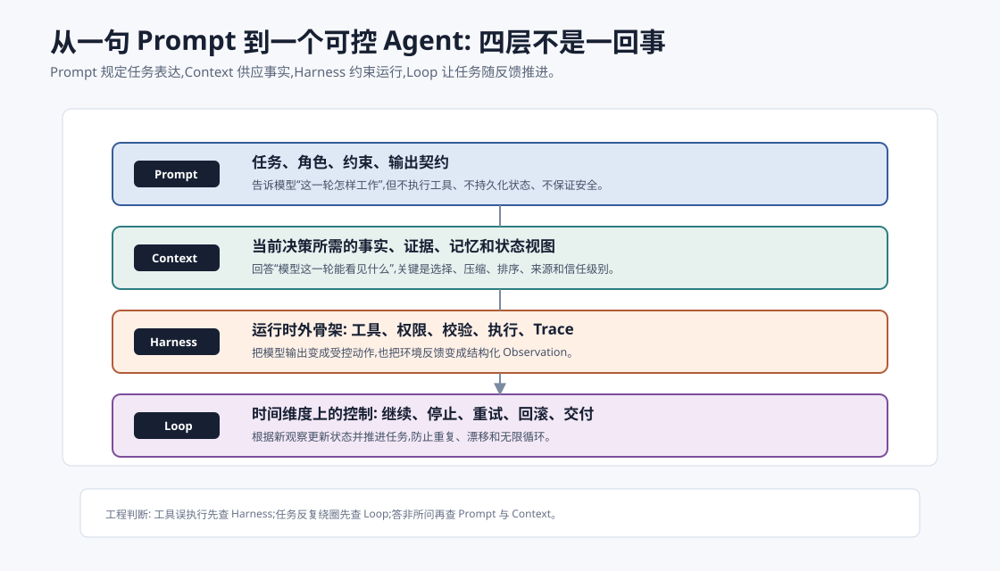
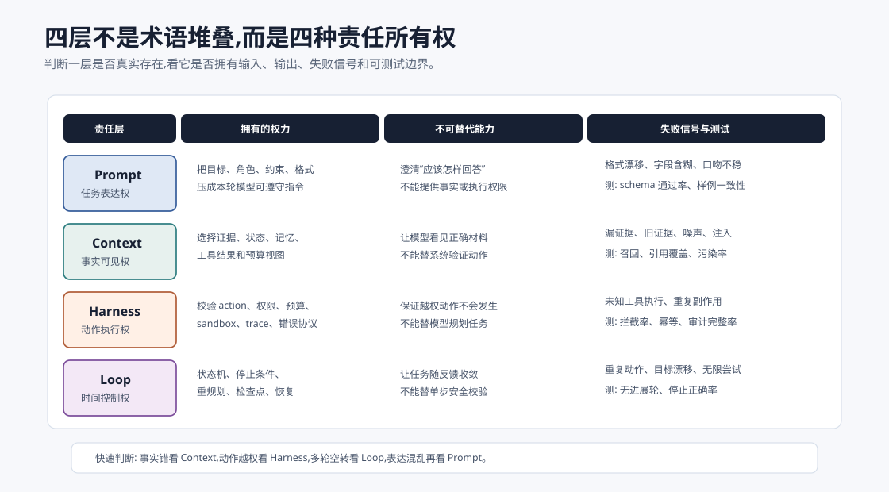
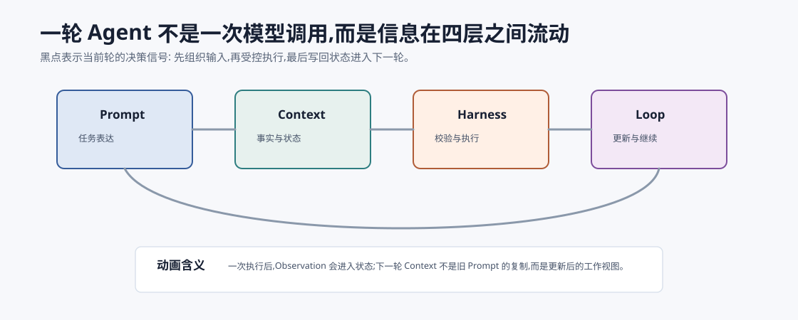
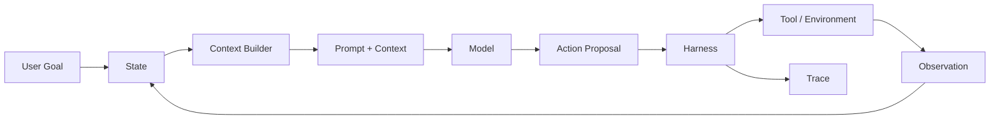
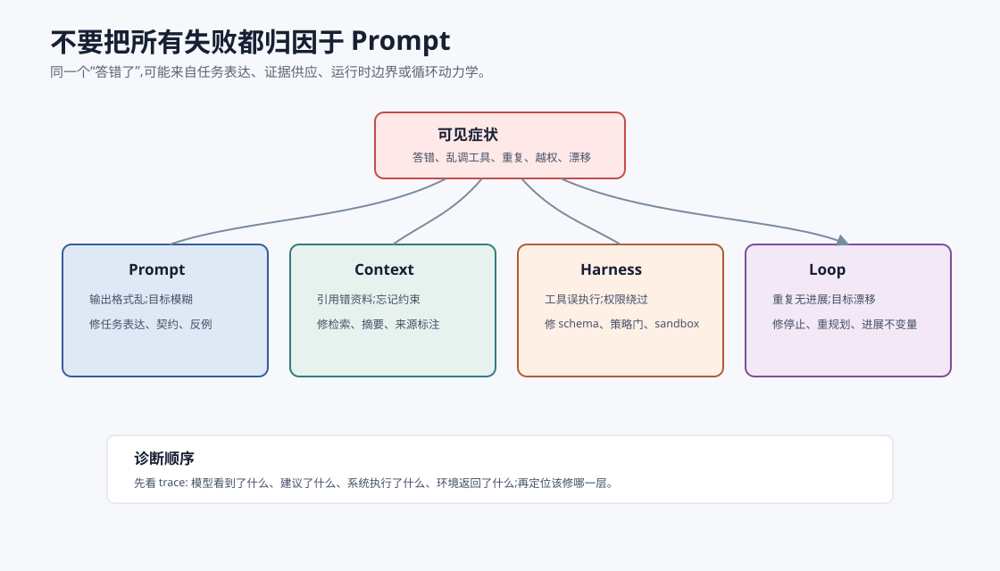
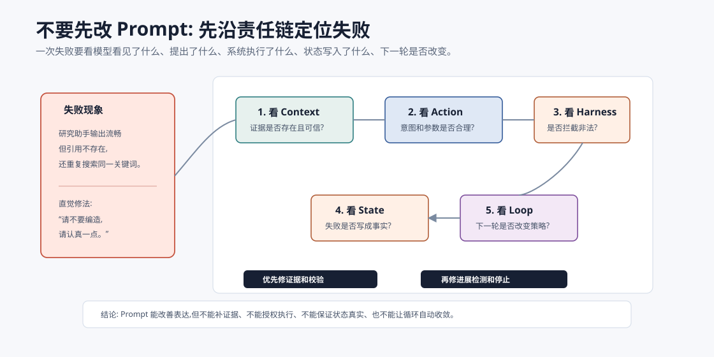

# Prompt、Context、Harness、Loop:四层如何区分 `[主线]` ★

很多 Agent 项目失败时,团队第一反应是“再改改 Prompt”。这很自然,因为 Prompt 最容易改,反馈最快,也最像一个可控旋钮。

但真实系统里,大量失败并不是 Prompt 问题。

模型答错,可能是 Context 没把证据放对位置。工具误执行,可能是 Harness 没有权限门。任务反复绕圈,可能是 Loop 没有进展不变量。高风险动作越权,更不是一句“请谨慎”能解决的。

要真正理解 Agent 工程,必须把四层拆开:

**Prompt -> Context -> Harness -> Loop**

它们不是四个同义词,而是四个不同工程层。



本章会讲:

- Prompt、Context、Harness、Loop 各自负责什么。
- 为什么不能把所有问题都推给 Prompt。
- 四层之间的数据如何流动。
- 常见失败应该归因到哪一层。
- 一个 Agent 系统如何按四层逐步升级。

## 先给一句总判断

可以先记住这句话:

> Prompt 是任务表达,Context 是信息供应,Harness 是运行时边界,Loop 是时间上的控制逻辑。

换成工程语言:

| 层 | 核心问题 | 典型产物 | 改错方向 |
| --- | --- | --- | --- |
| Prompt | 这一轮让模型怎样工作? | 指令、角色、格式、少量示例 | 改表达和输出契约 |
| Context | 这一轮让模型看见什么? | 状态摘要、证据、记忆、工具结果 | 改选择、压缩、排序、来源 |
| Harness | 模型建议怎样变成真实动作? | schema、权限、执行器、sandbox、trace | 改校验、策略、审计、回滚 |
| Loop | 多轮任务怎样推进并收敛? | 状态机、预算、停止条件、重规划 | 改进展检测、重试、终止 |

如果只会改 Prompt,就像只会调方向盘,却不检查地图、刹车、发动机和路况。

更严格地说,四层的区别不是“代码放在哪个目录”,而是**谁拥有不可替代的责任**。



| 层 | 拥有什么 | 不应该代替什么 | 最典型的产出 |
| --- | --- | --- | --- |
| Prompt | 本轮表达权 | 不代替事实、不代替权限 | 指令模板、输出格式、示例和反例 |
| Context | 可见事实权 | 不代替动作执行 | evidence pack、state summary、memory view |
| Harness | 执行动作权 | 不代替任务规划 | tool registry、policy gate、executor、trace |
| Loop | 时间控制权 | 不代替单步工具校验 | state machine、budget、stop/replan rule |

这个划分很实用。只要一个系统把“事实是否可靠”交给 Prompt,把“动作是否可执行”交给模型自觉,把“任务是否该停止”交给一句“完成后停止”,它就还停留在 Demo 级别。

生产级 Agent 的关键变化是:每一层都有自己的输入、输出、失败信号和测试方法。Prompt 可以 A/B 测输出稳定性;Context 可以测召回、重排、引用覆盖和污染率;Harness 可以测越权拦截、幂等和错误协议;Loop 可以测无进展轮、重复动作、停止正确率和恢复率。

## Prompt:任务表达层

Prompt 回答的是:

> 模型这一轮应该以什么身份、遵守什么约束、生成什么形式的输出?

它通常包含:

- 角色:你是研究助手、代码审查员、检索规划器。
- 任务:需要完成什么。
- 约束:不要编造、必须引用、不要改公共 API。
- 输出契约:JSON、表格、Markdown、工具调用参数。
- 少量示例:告诉模型什么是好输出。
- 反例:告诉模型哪些行为不可接受。

Prompt 最擅长解决的是**表达不清**。

比如模型输出结构不稳定:

```text
请输出 JSON,字段包括 answer、citations、confidence。
citations 必须是 evidence pack 中出现过的 id 数组。
如果没有证据,answer 写 null,confidence 写 low。
```

这类问题可以先改 Prompt。

但 Prompt 不擅长解决三类问题。

第一,它不能凭空提供事实。模型没看到正确证据,Prompt 再漂亮也可能答错。

第二,它不能替代执行边界。模型被要求“不要删除文件”,不等于系统可以放心给它删除权限。

第三,它不能保证多轮任务收敛。提示模型“不要重复”,不等于系统已经有重复检测和停止条件。

## Context:信息供应层

Context 回答的是:

> 模型这一轮实际能看见哪些信息?

Prompt 是 Context 的一部分,但 Context 更大。它还包括:

- 用户目标。
- 系统约束。
- 当前任务状态。
- 对话历史摘要。
- RAG 证据。
- 长期记忆。
- 工具返回。
- 计划和已完成步骤。
- 预算和权限状态。
- 来源、时间、置信度、trust level。

Context 工程的核心不是“塞更多”,而是**让模型在正确时间看见正确信息**。

例如一个研究助手回答问题时,不应该把全部搜索结果原样塞给模型。更好的 Context 可能是:

```text
目标: 比较方案 A 和方案 B 在企业 RAG 中的适用性。

约束:
- 必须基于证据包回答。
- 不确定处明确标注。

证据包:
[E1] 方案 A 支持 hybrid search,来源 doc-a,更新时间 2026-05。
[E2] 方案 B 支持 metadata filtering,来源 doc-b,更新时间 2026-04。
[E3] 方案 A 的多租户权限说明缺失,来源 issue-17。

已知缺口:
- 未找到方案 B 的压测数据。
```

这个 Context 比一长串网页摘录更有效,因为它已经为当前决策整理了证据和缺口。

## Harness:运行时边界层

Harness 回答的是:

> 模型提出的动作如何被系统验证、授权、执行、记录和恢复?

在简单聊天里,模型输出就是最终内容。但在 Agent 里,模型输出常常是动作建议:

```json
{
  "tool": "send_email",
  "arguments": {
    "to": "customer@example.com",
    "subject": "更新报价",
    "body": "..."
  }
}
```

这时真正重要的问题不是模型会不会写 JSON,而是系统是否应该执行这个动作。

Harness 至少要做:

- 工具是否存在。
- 参数是否符合 schema。
- 当前用户是否有权限。
- 这个动作是否有副作用。
- 是否需要 preview 或确认。
- 是否超过预算。
- 是否在 sandbox 中执行。
- 是否留下 trace。
- 失败后是否可重试、回滚或补偿。

这就是 Harness 和 Prompt 的分界线:

**Prompt 可以告诉模型不要越权,Harness 必须保证越权动作不会发生。**

## Loop:时间控制层

Loop 回答的是:

> 任务如何在多轮观察、决策、行动和反馈中推进,并最终停止?

一次模型调用没有 Loop。一次工具调用也不一定有 Loop。Loop 出现在系统持续运行时:

1. 根据状态构建 Context。
2. 模型提出下一步。
3. Harness 验证并执行。
4. 工具或环境返回 Observation。
5. 系统更新 State。
6. 判断继续、停止、重试、回滚或请求用户。



Loop 的难点在于**时间上的错误会积累**。

第一轮检索错了,第二轮可能基于错误证据写总结。第二轮工具失败没记录,第三轮可能假装工具成功。第四轮没有停止条件,第五轮可能继续重复同一个无效动作。

所以 Loop 必须有进展不变量:

> 每一轮要么获得新信息,要么缩小问题空间,要么完成交付,否则必须改变策略或停止。

## 四层数据流

一个成熟 Agent 的数据流大致如下:



这张图里最容易被忽视的是 `Context Builder` 和 `Harness`。

很多 Demo 的结构其实是:

```text
用户输入 -> 拼一个长 Prompt -> 模型 -> 工具 -> 把结果追加到 Prompt -> 模型
```

这能跑,但很快会遇到问题:

- 哪些旧信息还有效?
- 工具失败算不算任务失败?
- 高风险动作谁确认?
- 重复动作怎样检测?
- 上一轮模型的猜测和工具事实怎样区分?
- 评估时如何复现整条路径?

这些问题都不是简单 Prompt 能解决的。

## 四层不是单向流水线

`Prompt -> Context -> Harness -> Loop` 是理解顺序,不是运行时只有一条直线。

真实 Agent 是闭环:

- Context Builder 从 State 中选择本轮材料。
- Prompt 把材料组织成模型能遵守的任务表达。
- 模型输出 Action Proposal。
- Harness 校验、授权、执行并生成 Observation。
- Loop 根据 Observation 更新 State,再决定继续、停止、重规划或请求用户。

所以 Context 不只是“塞进模型之前的一堆文本”,它会被上一轮 Observation 影响。Harness 也不只是“模型之后的工具调用”,它返回的结构化错误会改变下一轮 Context。Loop 更不是一个外层 `while`,它决定哪些 Observation 能改变状态,哪些动作算重复,哪些风险必须升级给用户。

四层之间最重要的接口有三个:

| 接口 | 从哪到哪 | 必须结构化的内容 |
| --- | --- | --- |
| `context_pack` | Context -> Prompt/Model | 目标、证据、状态摘要、工具列表、预算、约束 |
| `action_proposal` | Model -> Harness | 动作类型、工具名、参数、风险、理由摘要、幂等键 |
| `observation` | Harness -> Loop/State | 成功/失败、关键事实、错误类型、可重试性、artifact 引用 |

如果这三个接口都是自然语言拼接,系统很难评估、复现和修复。如果它们是结构化契约,很多问题会从“模型怎么又乱来”变成“第 3 轮 observation 缺少 `retryable=false`,所以 Loop 错误重试”。这是工程上真正可修的形状。

## 常见失败归因

下面这张图是实际调试时最有用的心智模型。



把它翻译成诊断表:

| 现象 | 优先怀疑 | 典型修复 |
| --- | --- | --- |
| 输出格式不稳定 | Prompt | 明确 schema、字段含义、非法输出处理 |
| 回答没用到关键证据 | Context | 调整检索、重排、摘要、证据顺序 |
| 引用不存在 | Context + Harness | evidence id 校验、引用白名单 |
| 工具参数乱填 | Prompt + Harness | 改工具描述、参数枚举、schema 校验 |
| 模型想调用不存在的工具 | Harness | 工具注册表、拒绝未知工具、返回可恢复错误 |
| 高风险动作直接执行 | Harness | 权限门、preview、confirm、审计 |
| 多轮重复搜索同一关键词 | Loop | 重复检测、查询改写策略、停止条件 |
| 任务做着做着偏题 | Loop + Context | 状态摘要保留 goal、计划检查点 |
| 工具失败后仍说成功 | Harness + Loop | Observation 标准化、失败状态不可忽略 |

这个表的价值在于减少盲试。



调试时可以按一个顺序走,不要一上来就改 Prompt。

第一步看模型**看见了什么**。如果 Context 里没有关键证据,或者证据顺序把旧资料排在前面,模型答错是合理结果。此时修 Prompt 只是在要求模型用不存在的信息回答。

第二步看模型**提出了什么动作**。如果动作意图本身合理,但参数格式错,可能是 Prompt 和 tool schema 不清。如果动作意图危险或越权,Harness 应该拦截。

第三步看系统**执行了什么**。如果模型只是建议删除文件,但系统真的删除了未授权路径,根因在 Harness,不在模型。

第四步看反馈**怎样写回状态**。工具失败后如果 State 里出现“已完成”,后续模型会沿着错误状态继续推进。根因在 Harness 的 Observation 契约或 Loop 的 state reducer。

第五步看下一轮**是否改变策略**。如果连续两轮搜索同一个关键词、读取同一个文件、重复同一个失败工具调用,根因通常是 Loop 缺少无进展检测和重规划触发器。

## 一个具体例子:研究助手答错了

假设用户问:

```text
帮我总结公司 A 和公司 B 的最新产品差异,要求引用来源。
```

系统输出了一段流畅但错误的总结。

很多人会先改 Prompt:

```text
请认真核对事实,不要编造。
```

这可能有一点帮助,但不一定解决根因。

更好的排查方式是按四层看。

### 查 Prompt

是否明确要求:

- 只能使用证据包。
- 每个结论必须引用 evidence id。
- 证据不足要说不知道。
- 不允许用模型内置知识补全最新事实。

如果没有,Prompt 需要改。

### 查 Context

证据包是否真的包含公司 A 和 B 的最新资料?

是否混入旧版本资料?

是否把公司 A 的资料排在前面,导致模型忽略公司 B?

是否把网页导航、广告、评论等噪声塞进上下文?

如果证据错了或乱了,Context 需要改。

### 查 Harness

引用是否经过校验?

模型输出的 evidence id 是否必须存在于检索结果中?

如果模型引用了不存在的 `E9`,系统是否会拦截?

如果没有,需要补 Harness。

### 查 Loop

如果第一轮检索缺少公司 B 资料,系统是否会自动补搜?

如果连续两轮证据不足,系统是否会停止并说明缺口?

如果模型已经生成草稿,是否有引用校验后的修订轮?

如果没有,需要改 Loop。

## 一个具体例子:代码 Agent 越修越错

用户说:

```text
测试失败了,帮我修。
```

Agent 连续改了三个文件,测试仍然失败,还引入了新错误。

四层诊断如下:

| 层 | 应检查的问题 |
| --- | --- |
| Prompt | 是否明确“不理解失败原因前不要大范围修改”? |
| Context | 是否把最新测试失败日志、已修改 diff、用户约束放入工作视图? |
| Harness | 写文件工具是否有 diff preview? 是否限制修改范围? 是否能回滚? |
| Loop | 每次修改后是否运行相关测试? 失败后是否改变假设? |

如果系统没有 diff preview 和回滚能力,就不是 Prompt 问题,而是 Harness 太弱。

如果每轮都改同一个文件但不运行测试,就是 Loop 没有进展不变量。

## 四层的升级路径

一个 Agent 不需要一开始就做得很复杂。可以按四层逐步升级。

### 阶段一:Prompt 可用

目标是让模型能按基本格式工作。

你需要:

- 清楚任务。
- 清楚输出格式。
- 清楚事实边界。
- 清楚拒答或不确定策略。

适合 Demo 和低风险辅助任务。

### 阶段二:Context 稳定

目标是让模型每轮看到正确材料。

你需要:

- 状态摘要。
- 证据包。
- 来源和时间。
- 记忆选择。
- 上下文预算管理。

适合 RAG、研究助手、客服、企业知识问答。

### 阶段三:Harness 可靠

目标是让模型建议不会绕过系统边界。

你需要:

- 工具 schema。
- 参数校验。
- 权限和策略。
- sandbox。
- 高风险确认。
- trace 和回滚。

适合能读写外部系统的 Agent。

### 阶段四:Loop 收敛

目标是让多轮任务可以被控制。

你需要:

- 状态机。
- 预算。
- 停止条件。
- 重试和重规划。
- 进展检测。
- 评估闭环。

适合长任务、代码修复、调研报告、多工具任务和自动化工作流。

## 一次设计评审应该怎么问

评审 Agent 设计时,可以把一个用户故事沿四层切开。例如:

```text
用户故事: 帮销售经理汇总本周高风险客户,生成邮件草稿,但发送前必须确认。
```

逐层追问:

| 层 | 评审问题 | 不合格信号 |
| --- | --- | --- |
| Prompt | 模型是否知道输出是“草稿”而不是“已发送邮件”? | 文案里混淆 draft/send |
| Context | 高风险客户来自哪些数据源?是否有更新时间和权限范围? | 客户名单无来源、旧数据混入 |
| Harness | `send_email` 是否被分成 preview/confirm/commit? | 模型一次调用即可发送 |
| Loop | 如果证据不足或确认未返回,系统是否停止在 `needs_user`? | 等待确认时仍继续执行 |

同一个用户故事,如果只写 Prompt,大概会变成:

```text
请汇总高风险客户并写邮件。发送前请先确认。
```

这句话没有错,但它不是系统设计。真正的系统设计要能回答:高风险的定义在哪里,客户数据从哪里来,谁有权看哪些客户,草稿和发送是不是两个工具,确认结果如何进入状态,确认超时后 Loop 怎么停止。

读到这里,可以把四层理解成一个“责任追踪器”:每个失败都要落到某一层或某两个相邻层,而不是笼统说“模型不稳定”。

## 如何判断应该修哪层

可以用一个简短流程:

1. 先复现失败样本。
2. 看 trace,确认模型看到的 Context。
3. 看模型输出,确认动作建议是否合理。
4. 看 Harness,确认系统是否正确校验和执行。
5. 看 Observation,确认反馈是否写回 State。
6. 看下一轮,确认策略是否因反馈而改变。

如果模型没有看到关键事实,不要先改 Prompt。

如果模型提出危险动作但系统照做,不要先改 Prompt。

如果系统一直重复同一动作,不要先改 Prompt。

Prompt 是最容易改的一层,但不一定是最该改的一层。

## 和前后章节的关系

本章是一个桥。

前面你已经学过 Agent Loop、ReAct、Function Calling、ACI、Planning 和 Workflow。它们分别落在四层中:

| 已学概念 | 更接近哪层 |
| --- | --- |
| Prompt 写法 | Prompt |
| RAG、记忆、上下文工程 | Context |
| Function Calling、ACI、Guardrails | Harness |
| Agent Loop、Planning、Workflow | Loop |

后面单独讲 Harness Engineering 和 Loop Engineering,就是要把这两层展开。因为它们是从 Demo 到生产最容易缺失的部分。

## 常见误解

### 误解一:Prompt 工程就是 Agent 工程

不是。Prompt 只是任务表达层。Agent 工程还包括状态、工具、权限、循环、评估和安全。

### 误解二:Context 就是把更多资料塞进去

不是。Context 的重点是选择和组织。更多资料可能增加噪声、成本和注入风险。

### 误解三:Harness 只是工具调用包装

不是。Harness 是运行时边界,包括 schema、权限、执行、错误、审计、回滚和策略。

### 误解四:Loop 就是 while 循环

不是。Loop 的核心是状态更新、进展判断、停止条件和重规划。

### 误解五:模型足够强后这些层就不重要

不对。模型越强、工具越多、任务越长,越需要清晰边界。能力提升会扩大可做的事,也会扩大错误的影响范围。

## 本章小结

Prompt、Context、Harness、Loop 是 Agent 工程的四个不同层次。Prompt 管任务表达,Context 管信息供应,Harness 管运行时边界,Loop 管多轮收敛。成熟 Agent 的关键不是把 Prompt 写得越来越长,而是知道每类失败应该在哪一层修。理解这四层后,你会更容易判断一个问题该靠提示词、检索、状态管理、工具校验、权限控制,还是循环设计解决。

下一章会专门讲 Harness Engineering。它解释为什么“模型提出动作”和“系统执行动作”之间必须有明确、可测试、可审计的运行时外骨架。
